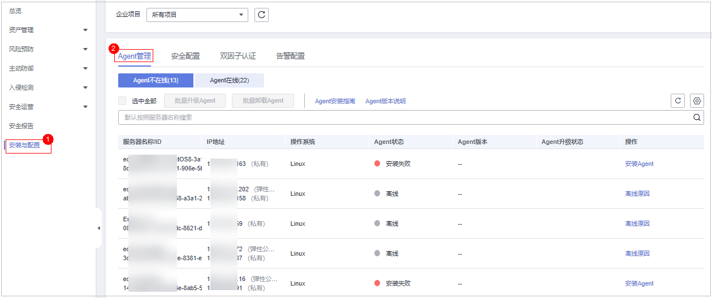
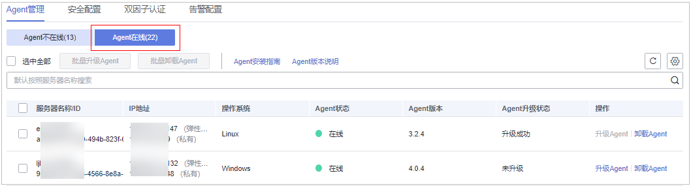

# Agent升级

主机安全服务会持续优化提升服务能力，包括不限于新增功能、优化缺陷，请您及时将服务器的Agent升级为最新版，以便您可以享受到更好的主机安全服务。

## 单服务器Agent升级

1.  [登录管理控制台](https://console.huaweicloud.com/?locale=zh-cn)。
2.  在页面左上角选择“区域“，单击，选择“安全与合规 \> 主机安全服务”，进入主机安全平台界面。

    **图 1**  进入主机安全  
    

3.  在左侧导航树选择“安装与配置  \>  Agent 管理“，进入Agent管理页面。

    > **说明：** 
    >如果您的服务器已通过企业项目的模式进行管理，您可选择目标“企业项目“后查看或操作目标企业项目内的资产和检测信息。

    **图 2**  进入Agent管理  
    

4.  选择“Agent在线（X）“，查看Agent已安装的服务器列表，详情请参见[表1](#hss_01_0376_table1926618704616)。

    **图 3**  查看Agent在线列表  
    

    **表 1**  Agent在线服务器列表参数说明

    
    <table><thead align="left"><tr id="hss_01_0376_row16266127154611"><th class="cellrowborder" valign="top" width="14.66%" id="mcps1.2.3.1.1">
参数名称

    </th>
    <th class="cellrowborder" valign="top" width="85.34%" id="mcps1.2.3.1.2">
参数说明

    </th>
    </tr>
    </thead>
    <tbody><tr id="hss_01_0376_row1226617104612"><td class="cellrowborder" valign="top" width="14.66%" headers="mcps1.2.3.1.1 ">
服务器名称/ID

    </td>
    <td class="cellrowborder" valign="top" width="85.34%" headers="mcps1.2.3.1.2 ">
服务器的名称和ID。

    </td>
    </tr>
    <tr id="hss_01_0376_row12661472469"><td class="cellrowborder" valign="top" width="14.66%" headers="mcps1.2.3.1.1 ">
IP地址

    </td>
    <td class="cellrowborder" valign="top" width="85.34%" headers="mcps1.2.3.1.2 ">
目标服务器所属的公网IP或私网IP。

    </td>
    </tr>
    <tr id="hss_01_0376_row112663754616"><td class="cellrowborder" valign="top" width="14.66%" headers="mcps1.2.3.1.1 ">
操作系统

    </td>
    <td class="cellrowborder" valign="top" width="85.34%" headers="mcps1.2.3.1.2 ">
目标服务器的操作系统。

    <ul id="hss_01_0376_ul7230182265511"><li>linux</li><li>windows</li></ul>
    </td>
    </tr>
    <tr id="hss_01_0376_row5266673467"><td class="cellrowborder" valign="top" width="14.66%" headers="mcps1.2.3.1.1 ">
Agent状态

    </td>
    <td class="cellrowborder" valign="top" width="85.34%" headers="mcps1.2.3.1.2 ">
目标服务器的Agent状态。

    <ul id="hss_01_0376_ul6395135214554"><li>在线</li></ul>
    </td>
    </tr>
    <tr id="hss_01_0376_row629412355911"><td class="cellrowborder" valign="top" width="14.66%" headers="mcps1.2.3.1.1 ">
Agent版本

    </td>
    <td class="cellrowborder" valign="top" width="85.34%" headers="mcps1.2.3.1.2 ">
目标服务器当前安装的Agent版本。

    </td>
    </tr>
    <tr id="hss_01_0376_row3784152535912"><td class="cellrowborder" valign="top" width="14.66%" headers="mcps1.2.3.1.1 ">
Agent升级状态

    </td>
    <td class="cellrowborder" valign="top" width="85.34%" headers="mcps1.2.3.1.2 ">
目标服务器在Agent升级过程中的状态。

    </td>
    </tr>
    </tbody>
    </table>

5.  单击目标服务器“操作“列的“升级Agent“，在弹窗中确认升级信息无误，单击“确认“，开始自动执行升级。
6.  升级完成后，可查看目标服务器的“Agent版本“变更为最新版表示升级完成。

## 批量升级Agent

1.  [登录管理控制台](https://console.huaweicloud.com/?locale=zh-cn)。
2.  在页面左上角选择“区域“，单击，选择“安全与合规 \> 主机安全服务”，进入主机安全平台界面。

    **图 4**  进入主机安全  
    

3.  在左侧导航树选择“安装与配置  \>  Agent 管理“，进入Agent管理页面。

    > **说明：** 
    >如果您的服务器已通过企业项目的模式进行管理，您可选择目标“企业项目“后查看或操作目标企业项目内的资产和检测信息。

    **图 5**  进入Agent管理  
    

4.  选择“Agent在线（X）“，查看Agent已安装的服务器列表，详情请参见[表2](#hss_01_0376_table1926618704616_1)。

    **图 6**  查看Agent在线列表  
    

    **表 2**  Agent在线服务器列表参数说明

    
    <table><thead align="left"><tr id="hss_01_0376_row16266127154611_1"><th class="cellrowborder" valign="top" width="14.66%" id="mcps1.2.3.1.1">
参数名称

    </th>
    <th class="cellrowborder" valign="top" width="85.34%" id="mcps1.2.3.1.2">
参数说明

    </th>
    </tr>
    </thead>
    <tbody><tr id="hss_01_0376_row1226617104612_1"><td class="cellrowborder" valign="top" width="14.66%" headers="mcps1.2.3.1.1 ">
服务器名称/ID

    </td>
    <td class="cellrowborder" valign="top" width="85.34%" headers="mcps1.2.3.1.2 ">
服务器的名称和ID。

    </td>
    </tr>
    <tr id="hss_01_0376_row12661472469_1"><td class="cellrowborder" valign="top" width="14.66%" headers="mcps1.2.3.1.1 ">
IP地址

    </td>
    <td class="cellrowborder" valign="top" width="85.34%" headers="mcps1.2.3.1.2 ">
目标服务器所属的公网IP或私网IP。

    </td>
    </tr>
    <tr id="hss_01_0376_row112663754616_1"><td class="cellrowborder" valign="top" width="14.66%" headers="mcps1.2.3.1.1 ">
操作系统

    </td>
    <td class="cellrowborder" valign="top" width="85.34%" headers="mcps1.2.3.1.2 ">
目标服务器的操作系统。

    <ul id="hss_01_0376_ul7230182265511_1"><li>linux</li><li>windows</li></ul>
    </td>
    </tr>
    <tr id="hss_01_0376_row5266673467_1"><td class="cellrowborder" valign="top" width="14.66%" headers="mcps1.2.3.1.1 ">
Agent状态

    </td>
    <td class="cellrowborder" valign="top" width="85.34%" headers="mcps1.2.3.1.2 ">
目标服务器的Agent状态。

    <ul id="hss_01_0376_ul6395135214554_1"><li>在线</li></ul>
    </td>
    </tr>
    <tr id="hss_01_0376_row629412355911_1"><td class="cellrowborder" valign="top" width="14.66%" headers="mcps1.2.3.1.1 ">
Agent版本

    </td>
    <td class="cellrowborder" valign="top" width="85.34%" headers="mcps1.2.3.1.2 ">
目标服务器当前安装的Agent版本。

    </td>
    </tr>
    <tr id="hss_01_0376_row3784152535912_1"><td class="cellrowborder" valign="top" width="14.66%" headers="mcps1.2.3.1.1 ">
Agent升级状态

    </td>
    <td class="cellrowborder" valign="top" width="85.34%" headers="mcps1.2.3.1.2 ">
目标服务器在Agent升级过程中的状态。

    </td>
    </tr>
    </tbody>
    </table>

5.  勾选需升级Agent的目标服务器。

    > **说明：** 
    >-   勾选“服务器名称/ID“前的选框，则选中当前页全部服务器。
    >-   勾选“选中全部“选框，选中所有待升级Agent的服务器进行Agent升级。

6.  单击上方“批量升级Agent“，在弹窗中确认即将升级Agent的服务器，确认无误，单击“确认“，开始执行自动升级。
7.  升级完成后，可查看目标服务器的“Agent版本“变更为最新版表示升级完成。

