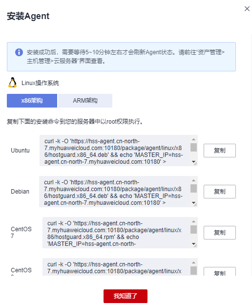
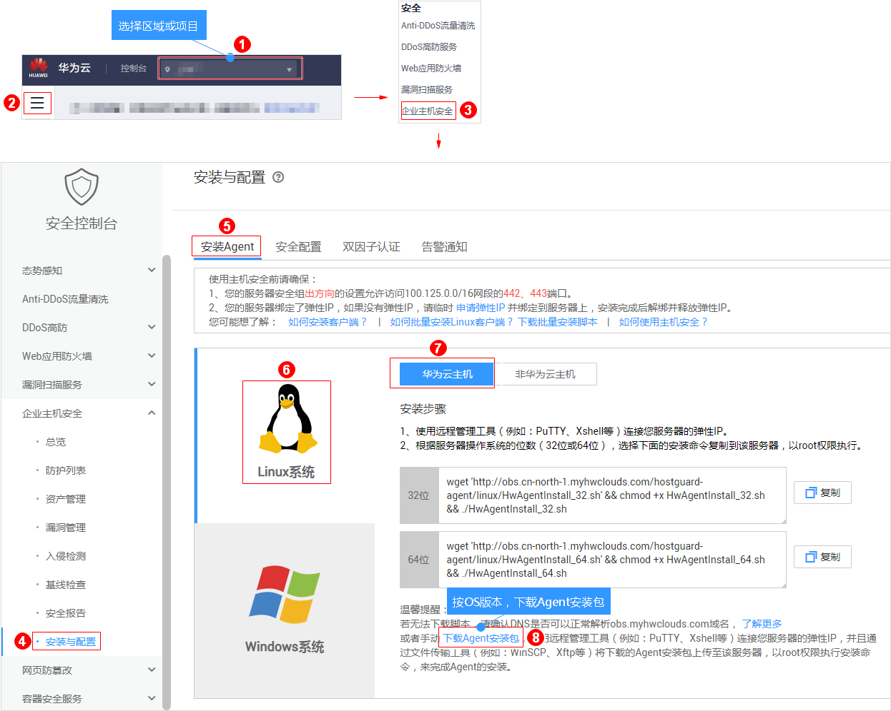

# Linux版本<a name="hss_01_0234"></a>

安装Agent后，您才能开启企业主机安全服务。通过本节介绍，您将了解如何在Linux操作系统的主机中安装Agent。Windows操作系统的Agent安装请参见[Windows版本](Windows版本.md)。

> **说明：** 
>网页防篡改与主机安全共用同一个Agent，您只需在同一主机安装一次。

## 默认安装路径<a name="section7764112663213"></a>

在Linux操作系统的主机中安装Agent时，安装过程中不提供安装路径的选择，默认安装在以下路径中：

“/usr/local/hostguard/“

## 安装场景<a name="section7319455164315"></a>

企业主机安全服务支持**华为云主机**和**非华为云主机**两种安装方式，请按[表1](#table114917164498)进行选择。

**表 1**  安装场景

<a name="table114917164498"></a>
<table><thead align="left"><tr id="row4150816114916"><th class="cellrowborder" valign="top" width="29.69%" id="mcps1.2.3.1.1"><p id="p215031615493"><a name="p215031615493"></a><a name="p215031615493"></a>服务器类型</p>
</th>
<th class="cellrowborder" valign="top" width="70.30999999999999%" id="mcps1.2.3.1.2"><p id="p5150216184918"><a name="p5150216184918"></a><a name="p5150216184918"></a>如何安装Agent</p>
</th>
</tr>
</thead>
<tbody><tr id="row19150151664911"><td class="cellrowborder" rowspan="2" valign="top" width="29.69%" headers="mcps1.2.3.1.1 "><p id="p966513359117"><a name="p966513359117"></a><a name="p966513359117"></a>华为云弹性云服务器ECS</p>
<p id="p135453716115"><a name="p135453716115"></a><a name="p135453716115"></a>华为云裸金属服务器BMS</p>
<p id="p420911712507"><a name="p420911712507"></a><a name="p420911712507"></a>华为云云耀云服务器HECS</p>
</td>
<td class="cellrowborder" valign="top" width="70.30999999999999%" headers="mcps1.2.3.1.2 "><p id="p4150181614499"><a name="p4150181614499"></a><a name="p4150181614499"></a>主机与HSS配额在同一区域，请使用<strong id="b16617201129"><a name="b16617201129"></a><a name="b16617201129"></a>华为云主机</strong>的安装方式。</p>
</td>
</tr>
<tr id="row1715013165495"><td class="cellrowborder" valign="top" headers="mcps1.2.3.1.1 "><p id="p1716714918537"><a name="p1716714918537"></a><a name="p1716714918537"></a>主机与HSS配额不在同一区域：</p>
<a name="ul1677913318110"></a><a name="ul1677913318110"></a><ul id="ul1677913318110"><li>HSS配额所在区域：华北-北京一、华东-上海二、华南-广州、华北-北京四。<p id="p129001851111015"><a name="p129001851111015"></a><a name="p129001851111015"></a>请使用<strong id="b799315366126"><a name="b799315366126"></a><a name="b799315366126"></a>非华为云主机</strong>的安装方式将主机接入HSS配额所在区域。</p>
</li><li>HSS配额所在区域：其他区域。<p id="p68299872112"><a name="p68299872112"></a><a name="p68299872112"></a>请退订配额后重新购买配额。</p>
</li></ul>
<p id="p212169114"><a name="p212169114"></a><a name="p212169114"></a>具体操作请参见<a href="https://support.huaweicloud.com/hss_faq/hss_01_0159.html" target="_blank" rel="noopener noreferrer">如何跨区域使用HSS服务</a>。</p>
</td>
</tr>
<tr id="row1715010162495"><td class="cellrowborder" valign="top" width="29.69%" headers="mcps1.2.3.1.1 "><p id="p4150716174914"><a name="p4150716174914"></a><a name="p4150716174914"></a>第三方云主机</p>
</td>
<td class="cellrowborder" rowspan="2" valign="top" width="70.30999999999999%" headers="mcps1.2.3.1.2 "><p id="p0150616134918"><a name="p0150616134918"></a><a name="p0150616134918"></a><strong id="b17626227101210"><a name="b17626227101210"></a><a name="b17626227101210"></a>非华为云主机</strong>的安装方式。</p>
<a name="ul196058314920"></a><a name="ul196058314920"></a><ul id="ul196058314920"><li>仅在<span class="parmvalue" id="parmvalue1580913141594"><a name="parmvalue1580913141594"></a><a name="parmvalue1580913141594"></a>“华北-北京一”</span>、<span class="parmvalue" id="parmvalue380910148913"><a name="parmvalue380910148913"></a><a name="parmvalue380910148913"></a>“华东-上海二”</span>、<span class="parmvalue" id="parmvalue15813814898"><a name="parmvalue15813814898"></a><a name="parmvalue15813814898"></a>“华南-广州”</span>、<span class="parmvalue" id="parmvalue128132014799"><a name="parmvalue128132014799"></a><a name="parmvalue128132014799"></a>“华北-北京四”</span>可接入非华为云的主机，请在以上区域内购买防护配额，并使用以上区域内的安装包或安装命令为主机安装Agent。</li><li>在非华为云主机中安装Agent后，在防护列表中，您可以根据主机的IP地址查找该主机。</li></ul>
</td>
</tr>
<tr id="row3151181614491"><td class="cellrowborder" valign="top" headers="mcps1.2.3.1.1 "><p id="p115112161495"><a name="p115112161495"></a><a name="p115112161495"></a>线下主机</p>
</td>
</tr>
</tbody>
</table>

> **须知：** 
>-   由于主机的性能差异，非华为云的主机与企业主机安全服务的兼容性可能较差，为使您获得良好的服务体验，建议您使用华为云主机。
>-   安装Agent时，请暂时清理主机中可能干扰主机安装的应用进程和配置信息，防止Agent安装失败。

## 前提条件<a name="section145381446145316"></a>

-   待安装Agent的主机已绑定弹性IP。
-   已在本地安装远程管理工具（如：“Xftp“、“SecureFX“、“WinSCP“）。
-   请关闭Selinux防火墙，防止Agent安装失败，安装成功后再打开。

## 使用安装命令安装<a name="section1831315205214"></a>

登录待安装Agent的云主机，使用安装命令在线安装Agent。

1.  [登录管理控制台](https://console.huaweicloud.com)。
2.  在页面左上角选择“区域“，单击，选择“安全  \>  企业主机安全“，进入企业主机安全页面。

    **图 1**  企业主机安全<a name="hss_01_0229_fig1855613765114"></a>  
    

3.  在左侧导航栏中，选择“安装与配置“，进入“安装Agent“界面，复制安装Agent的命令。

    **图 2**  复制安装Agent的命令<a name="fig2320121019118"></a>  
    

4.  远程登录待安装Agent的主机。
    -   华为云主机
        -   您可以登录弹性云服务器控制台，在“弹性云服务器“列表中，单击“远程登录“登录主机，详细操作请参见[在云服务器控制台上登录主机](https://support.huaweicloud.com/usermanual-ecs/ecs_03_0136.html)。
        -   若您的主机已经绑定了弹性IP，您也可以使用远程管理工具（例如：“Xftp“、“SecureFX“、“WinSCP“）登录主机，并使用root账号在主机中安装Agent。

    -   非华为云主机

        请使用远程管理工具（例如：“Xftp“、“SecureFX“、“WinSCP“）登录主机，并使用root账号在主机中安装Agent。

5.  粘贴复制的安装命令，并按“Enter“，在主机中安装Agent。

    若界面回显信息与如下信息类似，则表示Agent安装成功。

    ```
    Preparing...                  ########################## [100%]
    1:hostguard                   ########################## [100%]
    Hostguard is running.
    Hostguard installed.
    ```

6.  使用**service hostguard** **status**命令，查看Agent的运行状态。

    若界面回显如下信息，则表示Agent服务运行正常。

    ```
    Hostguard is running
    ```


## 使用安装包安装（仅华为云主机支持）<a name="section2429194215320"></a>

下载企业主机安全服务的Agent软件，上传至待安装Agent的云主机后，在云主机中使用安装命令安装Agent。

1.  [登录管理控制台](https://console.huaweicloud.com)。
2.  在左侧导航栏中，选择“安装与配置“，进入“安装Agent“界面，下载Agent安装包。

    **图 3**  下载Agent安装包<a name="fig88946474"></a>  
    

3.  在弹出的对话框中，根据待安装Agent的云服务器操作系统版本，下载所需安装的Agent。
4.  使用文件传输工具（例如：“Xftp“、“SecureFX“、“WinSCP“），将下载的Agent安装包上传至云主机。
5.  远程登录待安装Agent的主机。
    -   您可以登录弹性云服务器控制台，在“弹性云服务器“列表中，单击“远程登录“登录主机，详细操作请参见[在云服务器控制台上登录主机](https://support.huaweicloud.com/usermanual-ecs/ecs_03_0136.html)。
    -   若您的主机已经绑定了弹性IP，您也可以使用远程管理工具（例如：“Xftp“、“SecureFX“、“WinSCP“）登录主机，并使用root账号在主机中安装Agent。

6.  使用**cd** _安装包所在目录_命令，进入安装包所在目录。
7.  使用如下命令，在云主机中安装Agent。
    -   安装“.rpm“格式的安装包，请执行命令：**rpm** **-ivh** _安装包名称_。

        > **说明：** 
        >强制安装请执行命令：**rpm** **-ivh --force** _安装包名称_

    -   安装“.deb“格式的安装包，请执行命令：**dpkg** **-i** _安装包名称_。

        若界面回显信息与如下信息类似，则表示Agent安装成功。

        ```
        Preparing...                  ########################## [100%]
        1:hostguard                   ########################## [100%]
        Hostguard is running.
        Hostguard installed.
        ```

8.  使用**service hostguard** **status**命令，查看Agent的运行状态。

    若界面回显如下信息，则表示Agent服务运行正常。

    ```
    Hostguard is running
    ```


## 相关操作<a name="section982995012508"></a>

-   Agent状态及异常处理的详细操作请参见[客户端状态异常应如何处理？](https://support.huaweicloud.com/hss_faq/hss_01_0036.html)
-   卸载Agent的详细操作请参见[卸载客户端](https://support.huaweicloud.com/hss_faq/hss_01_0119.html)。

