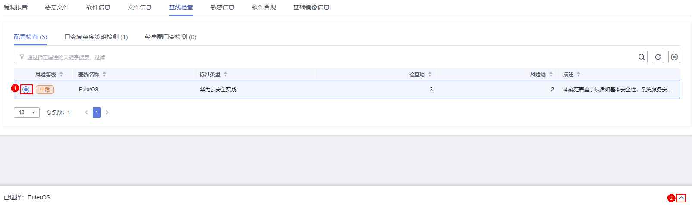

# SWR共享镜像管理

SWR共享镜像源于容器镜像服务\(SWR\)的共享镜像，主机安全服务支持对这些共享镜像手动执行漏洞、恶意文件、软件信息、文件信息、基线检查、敏感信息、软件合规和基础镜像信息的扫描并提供扫描报告。本章节介绍如何对SWR共享镜像进行安全扫描和如何查看安全扫描报告。

## 约束限制

-   仅HSS容器版支持该功能，购买和升级HSS的操作，请参见[购买主机安全防护配额](购买主机安全防护配额.md)和[配额版本升级](配额版本升级.md)。

-   仅支持对Linux镜像执行安全扫描。

## 查看SWR共享镜像

1.  [登录管理控制台](https://console.huaweicloud.com/?locale=zh-cn)。
2.  在页面左上角选择“区域“，单击，选择“安全与合规 \> 主机安全服务”，进入主机安全平台界面。

    **图 1**  进入主机安全  
    

3.  在左侧导航栏选择“资产管理  \>  容器管理“，进入容器管理界面。
4.  选择“容器镜像  \>  SWR共享镜像“，查看共享镜像信息。

    您可以查看共享镜像的版本、大小、所属组织、安全风险、拥有者等相关信息。

    **图 2**  查看共享镜像  
    

    -   更新共享镜像

        单击“从SWR更新共享镜像“，更新共享镜像列表信息。

    -   筛选最新版本的镜像

        勾选“仅关注最新版本的镜像“，可筛选所有不同镜像的最新版本镜像。

## 共享镜像安全扫描

您可以为状态“有效“的SWR共享镜像手动执行安全扫描，支持扫描项如下：

<table><thead align="left"><tr id="hss_01_0299_hss_01_0088_row1345162119020"><th class="cellrowborder" valign="top" width="21.55%" id="mcps1.1.3.1.1">
扫描项

</th>
<th class="cellrowborder" valign="top" width="78.45%" id="mcps1.1.3.1.2">
说明

</th>
</tr>
</thead>
<tbody><tr id="hss_01_0299_hss_01_0088_row143451721100"><td class="cellrowborder" valign="top" width="21.55%" headers="mcps1.1.3.1.1 ">
漏洞

</td>
<td class="cellrowborder" valign="top" width="78.45%" headers="mcps1.1.3.1.2 ">
检测镜像中存在的漏洞。

</td>
</tr>
<tr id="hss_01_0299_hss_01_0088_row103454219015"><td class="cellrowborder" valign="top" width="21.55%" headers="mcps1.1.3.1.1 ">
恶意文件

</td>
<td class="cellrowborder" valign="top" width="78.45%" headers="mcps1.1.3.1.2 ">
检测镜像中存在的恶意文件。

</td>
</tr>
<tr id="hss_01_0299_hss_01_0088_row934515211105"><td class="cellrowborder" valign="top" width="21.55%" headers="mcps1.1.3.1.1 ">
软件信息

</td>
<td class="cellrowborder" valign="top" width="78.45%" headers="mcps1.1.3.1.2 ">
统计镜像中的软件信息。

</td>
</tr>
<tr id="hss_01_0299_hss_01_0088_row1345152118014"><td class="cellrowborder" valign="top" width="21.55%" headers="mcps1.1.3.1.1 ">
文件信息

</td>
<td class="cellrowborder" valign="top" width="78.45%" headers="mcps1.1.3.1.2 ">
统计镜像中的文件信息。

</td>
</tr>
<tr id="hss_01_0299_hss_01_0088_row117037141719"><td class="cellrowborder" valign="top" width="21.55%" headers="mcps1.1.3.1.1 ">
基线检查

</td>
<td class="cellrowborder" valign="top" width="78.45%" headers="mcps1.1.3.1.2 "><ul id="hss_01_0299_hss_01_0088_ul132761935099"><li>配置检查：<ul id="hss_01_0299_hss_01_0088_ul564574917440"><li>检测CentOS 7、Debian 10、EulerOS和Ubuntu16镜像的系统配置项。</li><li>检测SSH应用配置项。</li></ul>
</li><li>弱口令检查：检测镜像中存在的弱口令。</li><li>口令复杂度检查：检测镜像中不安全的口令复杂度策略。</li></ul>
</td>
</tr>
<tr id="hss_01_0299_hss_01_0088_row67275201811"><td class="cellrowborder" valign="top" width="21.55%" headers="mcps1.1.3.1.1 ">
敏感信息

</td>
<td class="cellrowborder" valign="top" width="78.45%" headers="mcps1.1.3.1.2 ">
检测镜像中含有敏感信息的文件。

<ul id="hss_01_0299_hss_01_0088_ul23106439311"><li>默认不检测的路径如下：<ul id="hss_01_0299_hss_01_0088_ul187571441428"><li>/usr/*</li><li>/lib/*</li><li>/lib32/*</li><li>/bin/*</li><li>/sbin/*</li><li>/var/lib/*</li><li>/var/log/*</li><li>*/node_modules/*/*.md</li><li>*/node_modules/*/test/*</li><li>*/service/iam/examples_test.go</li><li>*/grafana/public/build/*.js</li></ul>

 说明： 

可在安全报告 &gt; 敏感信息页面，单击“敏感文件过滤路径管理”，设置不需要检测的Linux路径，最多可添加20个路径。

</li><li>不检测的场景如下：<ul id="hss_01_0299_hss_01_0088_ul1390814283441"><li>文件大于20M。</li><li>文件类型为二进制、常用进程和自动生成类型。</li></ul>
</li></ul>
</td>
</tr>
<tr id="hss_01_0299_hss_01_0088_row14424133115118"><td class="cellrowborder" valign="top" width="21.55%" headers="mcps1.1.3.1.1 ">
软件合规

</td>
<td class="cellrowborder" valign="top" width="78.45%" headers="mcps1.1.3.1.2 ">
检测不允许使用的软件和工具。

</td>
</tr>
<tr id="hss_01_0299_hss_01_0088_row38711441919"><td class="cellrowborder" valign="top" width="21.55%" headers="mcps1.1.3.1.1 ">
基础镜像信息

</td>
<td class="cellrowborder" valign="top" width="78.45%" headers="mcps1.1.3.1.2 ">
检测未使用基础镜像构建的业务镜像。

</td>
</tr>
</tbody>
</table>

1.  登录管理控制台，进入主机安全服务页面。

1.  在左侧导航栏选择“资产管理  \>  容器管理“，进入容器管理界面。
2.  选择“容器镜像  \>  SWR共享镜像“。
3.  为单个镜像或多个镜像执行安全扫描。

    > **说明：** 
    >-   只有镜像状态为“有效“时，可执行安全扫描。
    >-   多架构镜像不支持批量扫描、全量扫描操作。

    -   单个镜像安全扫描

        在目标镜像所在行的“操作”列，单击“安全扫描“，为单个目标镜像执行安全扫描。

    -   批量镜像安全扫描

        勾选所有目标镜像并单击镜像列表上方的“批量扫描“，为多个目标镜像执行安全扫描。

    -   全量镜像安全扫描

        单击镜像列表上方的全量扫描，为所有镜像执行安全扫描。

4.  当镜像“扫描状态“更新为“扫描完成“，且“最近一次扫描完成时间“更新为最近任务执行时间，表示镜像安全扫描完成。

## 查看SWR共享镜像漏洞扫描报告

1.  登录管理控制台，进入主机安全服务页面。

1.  在左侧导航栏选择“资产管理  \>  容器管理“，进入容器管理界面。
2.  选择“容器镜像  \>  SWR共享镜像“。
3.  在目标镜像所在行的“操作”列，单击“安全报告“，进入安全扫描报告界面。
4.  选择“漏洞报告“，查看漏洞报告。
    -   查看漏洞详情

        单击漏洞名称，进入漏洞详情页面，查看漏洞基本信息以及受影响的镜像。

    -   查看漏洞CVEID、CVSS分值以及披露时间

        单击目标漏洞名称前，展开查看漏洞CVEID、CVSS分值以及披露时间。

    -   查看漏洞解决方案

        在目标漏洞所在行的“操作”列，单击解决方案描述，跳转至解决方案详情页面，查看漏洞解决方案详情。

## 查看SWR共享镜像恶意文件报告

1.  登录管理控制台，进入主机安全服务页面。

1.  在左侧导航栏选择“资产管理  \>  容器管理“，进入容器管理界面。
2.  选择“容器镜像  \>  SWR共享镜像“。
3.  在目标镜像所在行的“操作”列，单击“安全报告“，进入安全扫描报告界面。
4.  选择“恶意文件“，查看恶意文件报告。

    您可以查看目标镜像中恶意文件的名称、路径、大小和描述等信息。

## 查看SWR共享镜像软件信息报告

1.  登录管理控制台，进入主机安全服务页面。

1.  在左侧导航栏选择“资产管理  \>  容器管理“，进入容器管理界面。
2.  选择“容器镜像  \>  SWR共享镜像“。
3.  在目标镜像所在行的“操作”列，单击“安全报告“，进入安全扫描报告界面。
4.  选择“软件信息“，查看软件信息报告。

    您可以查看目标镜像中的软件名称、类型、版本、漏洞个数等信息。

## 查看SWR共享镜像文件信息报告

1.  登录管理控制台，进入主机安全服务页面。

1.  在左侧导航栏选择“资产管理  \>  容器管理“，进入容器管理界面。
2.  选择“容器镜像  \>  SWR共享镜像“。
3.  在目标镜像所在行的“操作”列，单击“安全报告“，进入安全扫描报告界面。
4.  选择“文件信息“，查看文件信息报告。

    您可以查看目标镜像中的文件个数，总文件大小以及文件大小排在前五十的文件详情。

## 查看SWR共享镜像基线检查报告

1.  登录管理控制台，进入主机安全服务页面。

1.  在左侧导航栏选择“资产管理  \>  容器管理“，进入容器管理界面。
2.  选择“容器镜像  \>  SWR共享镜像“。
3.  在目标镜像所在行的“操作”列，单击“安全报告“，进入安全扫描报告界面。
4.  选择“基线检查“，查看基线检查报告。

    您可以查看目标镜像的配置检查、口令复杂度策略检查、经典弱口令检查结果。

    -   查看配置检查详情和修改建议
        1.  在基线配置检查页签，勾选目标基线，并单击。

            **图 3**  查看配置检查详情  
            

        2.  在目标检测项所在行的检测项列，单击“检测详情，“右面弹出检测详情页面，可以查看检测项描述以及修改建议。

    -   自定义经典弱口令
        1.  在经典弱口令检测页签，单击“自定义弱口令管理“，进入自定义弱口令详情页面。
        2.  输入弱口令完成后，单击“确认“。

## 查看SWR共享镜像敏感信息报告

1.  登录管理控制台，进入主机安全服务页面。

1.  在左侧导航栏选择“资产管理  \>  容器管理“，进入容器管理界面。
2.  选择“容器镜像  \>  SWR共享镜像“。
3.  在目标镜像所在行的“操作”列，单击“安全报告“，进入安全扫描报告界面。
4.  选择“敏感信息“，查看敏感信息报告。

    您可以查看目标镜像中含有敏感信息的文件的路径、敏感信息内容、危险程度。

    -   忽略敏感信息提示

        在目标敏感信息文件所在行的“操作”列，单击“忽略“，忽略您认为安全的敏感信息提示。

    -   配置敏感文件过滤路径
        1.  单击“敏感文件过滤路径管理“，右面弹出敏感信息过滤路径管理弹窗。
        2.  在弹窗中设置不需要检测的文件路径（Linux路径），并单击“确定“。

            最多可自定义20个路径，多路径配置时不同路径之间用回车符号进行分隔。

## 查看SWR共享镜像软件合规报告

1.  登录管理控制台，进入主机安全服务页面。

1.  在左侧导航栏选择“资产管理  \>  容器管理“，进入容器管理界面。
2.  选择“容器镜像  \>  SWR共享镜像“。
3.  在目标镜像所在行的“操作”列，单击“安全报告“，进入安全扫描报告界面。
4.  选择“软件合规“，查看软件合规报告。

    您可以查看不合规软件的名称、路径、镜像层信息。

## 查看SWR共享镜像基础镜像信息报告

1.  登录管理控制台，进入主机安全服务页面。

1.  在左侧导航栏选择“资产管理  \>  容器管理“，进入容器管理界面。
2.  选择“容器镜像  \>  SWR共享镜像“。
3.  在目标镜像所在行的“操作”列，单击“安全报告“，进入安全扫描报告界面。
4.  选择“基础镜像信息“，查看基础镜像信息报告。

    您可以查看未使用基础镜像构建的业务镜像的名称、版本、镜像层路径信息。

## 导出SWR共享镜像漏洞报告

> **说明：** 
>多架构镜像不支持导出漏洞报告。

1.  登录管理控制台，进入主机安全服务页面。

1.  在左侧导航栏选择“资产管理  \>  容器管理“，进入容器管理界面。
2.  选择“容器镜像  \>  SWR共享镜像“。
3.  单击镜像列表上方“漏洞导出“，导出漏洞报告。

    如果您想要导出指定镜像的漏洞报告，您可以在漏洞列表上方的搜索框中选择指定类型的镜像后，再单击“漏洞导出“。

