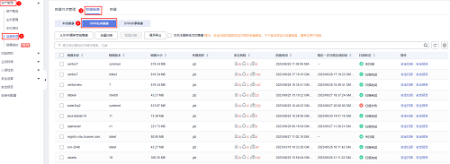
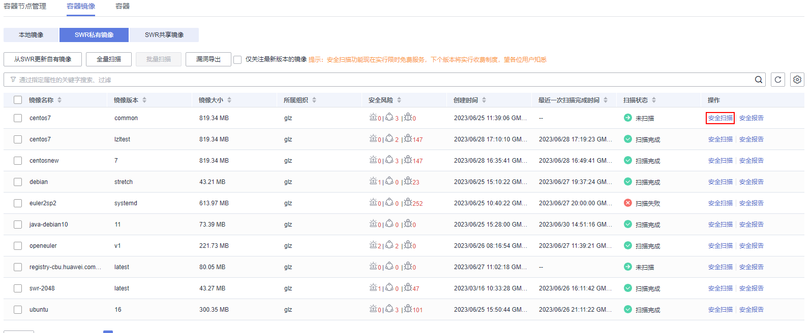
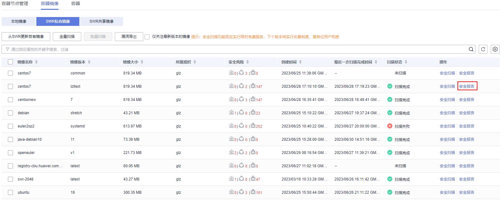
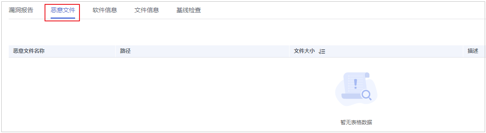
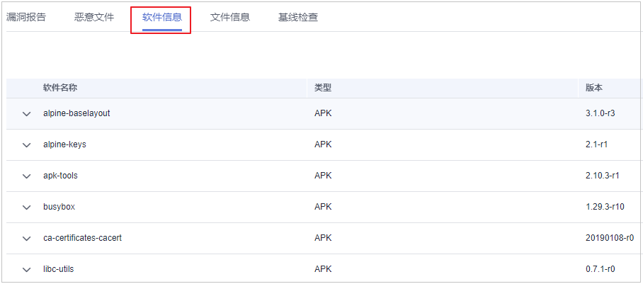
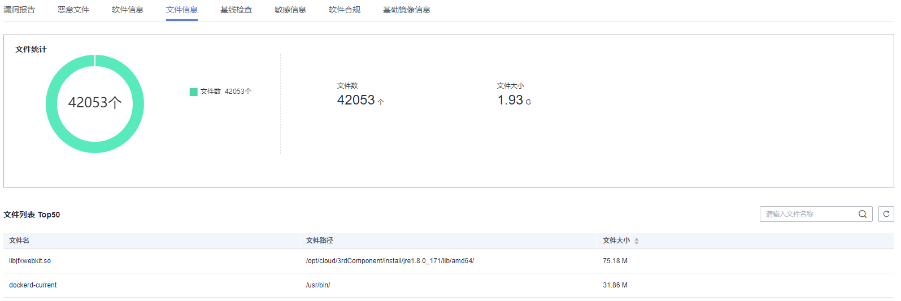
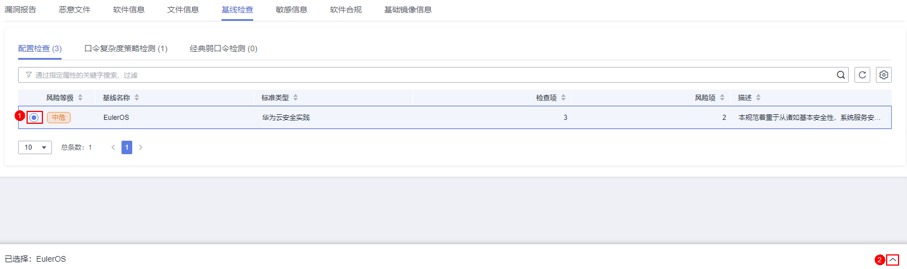
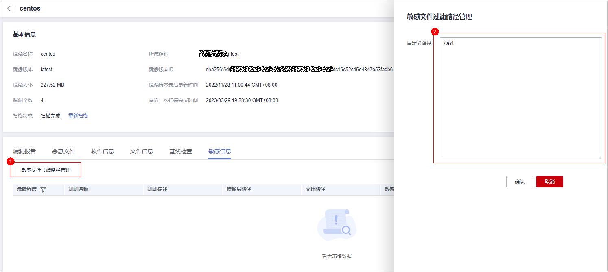

# SWR私有镜像管理

私有镜像仓库中的镜像来源于容器镜像服务\(SWR\)的自有镜像，主机安全服务支持对这些共享镜像手动执行漏洞、恶意文件、软件信息、文件信息、基线检查、敏感信息、软件合规和基础镜像信息的扫描并提供扫描报告。

## 约束限制

-   仅HSS容器版支持该功能，购买和升级HSS的操作，请参见[购买主机安全防护配额](购买主机安全防护配额.md)和[配额版本升级](配额版本升级.md)。

-   仅支持对Linux镜像执行安全扫描。

## 查看私有镜像

1.  [登录管理控制台](https://console.huaweicloud.com/?locale=zh-cn)。
2.  在页面左上角选择“区域“，单击，选择“安全与合规 \> 主机安全服务”，进入主机安全平台界面。

    **图 1**  进入主机安全  
    

3.  在左侧导航栏中，选择“资产管理  \>  容器管理“  ，进入容器管理界面，选择“容器镜像  \>  SWR私有镜像“页签。

    > **说明：** 
    >如果您的服务器已通过企业项目的模式进行管理，您可选择目标“企业项目“后查看或操作目标企业项目内的资产和检测信息。

    **图 2**  进入私有镜像仓库  
    

4.  单击“从SWR更新自有镜像“，可以同步SWR所有自有镜像。

    > **说明：** 
    >在同步镜像时需要在SWR授权才能正常同步，操作详情请参见[SWR授权方法](https://support.huaweicloud.com/usermanual-swr/swr_01_0015.html#section1)。

## 手动扫描私有镜像

您可以手动执行全量、批量或单镜像的安全扫描。安全扫描的时长主要取决于镜像的大小。一般情况下扫描一个镜像可以在三分钟之内完成，扫描完成后，单击“安全报告“查看安全报告。

SWR私有镜像支持的安全扫描项如下：

<table><thead align="left"><tr id="hss_01_0088_row1345162119020"><th class="cellrowborder" valign="top" width="21.55%" id="mcps1.1.3.1.1">
扫描项

</th>
<th class="cellrowborder" valign="top" width="78.45%" id="mcps1.1.3.1.2">
说明

</th>
</tr>
</thead>
<tbody><tr id="hss_01_0088_row143451721100"><td class="cellrowborder" valign="top" width="21.55%" headers="mcps1.1.3.1.1 ">
漏洞

</td>
<td class="cellrowborder" valign="top" width="78.45%" headers="mcps1.1.3.1.2 ">
检测镜像中存在的漏洞。

</td>
</tr>
<tr id="hss_01_0088_row103454219015"><td class="cellrowborder" valign="top" width="21.55%" headers="mcps1.1.3.1.1 ">
恶意文件

</td>
<td class="cellrowborder" valign="top" width="78.45%" headers="mcps1.1.3.1.2 ">
检测镜像中存在的恶意文件。

</td>
</tr>
<tr id="hss_01_0088_row934515211105"><td class="cellrowborder" valign="top" width="21.55%" headers="mcps1.1.3.1.1 ">
软件信息

</td>
<td class="cellrowborder" valign="top" width="78.45%" headers="mcps1.1.3.1.2 ">
统计镜像中的软件信息。

</td>
</tr>
<tr id="hss_01_0088_row1345152118014"><td class="cellrowborder" valign="top" width="21.55%" headers="mcps1.1.3.1.1 ">
文件信息

</td>
<td class="cellrowborder" valign="top" width="78.45%" headers="mcps1.1.3.1.2 ">
统计镜像中的文件信息。

</td>
</tr>
<tr id="hss_01_0088_row117037141719"><td class="cellrowborder" valign="top" width="21.55%" headers="mcps1.1.3.1.1 ">
基线检查

</td>
<td class="cellrowborder" valign="top" width="78.45%" headers="mcps1.1.3.1.2 "><ul id="hss_01_0088_ul132761935099"><li>配置检查：<ul id="hss_01_0088_ul564574917440"><li>检测CentOS 7、Debian 10、EulerOS和Ubuntu16镜像的系统配置项。</li><li>检测SSH应用配置项。</li></ul>
</li><li>弱口令检查：检测镜像中存在的弱口令。</li><li>口令复杂度检查：检测镜像中不安全的口令复杂度策略。</li></ul>
</td>
</tr>
<tr id="hss_01_0088_row67275201811"><td class="cellrowborder" valign="top" width="21.55%" headers="mcps1.1.3.1.1 ">
敏感信息

</td>
<td class="cellrowborder" valign="top" width="78.45%" headers="mcps1.1.3.1.2 ">
检测镜像中含有敏感信息的文件。

<ul id="hss_01_0088_ul23106439311"><li>默认不检测的路径如下：<ul id="hss_01_0088_ul187571441428"><li>/usr/*</li><li>/lib/*</li><li>/lib32/*</li><li>/bin/*</li><li>/sbin/*</li><li>/var/lib/*</li><li>/var/log/*</li><li>*/node_modules/*/*.md</li><li>*/node_modules/*/test/*</li><li>*/service/iam/examples_test.go</li><li>*/grafana/public/build/*.js</li></ul>

 说明： 

可在安全报告 &gt; 敏感信息页面，单击“敏感文件过滤路径管理”，设置不需要检测的Linux路径，最多可添加20个路径。

</li><li>不检测的场景如下：<ul id="hss_01_0088_ul1390814283441"><li>文件大于20M。</li><li>文件类型为二进制、常用进程和自动生成类型。</li></ul>
</li></ul>
</td>
</tr>
<tr id="hss_01_0088_row14424133115118"><td class="cellrowborder" valign="top" width="21.55%" headers="mcps1.1.3.1.1 ">
软件合规

</td>
<td class="cellrowborder" valign="top" width="78.45%" headers="mcps1.1.3.1.2 ">
检测不允许使用的软件和工具。

</td>
</tr>
<tr id="hss_01_0088_row38711441919"><td class="cellrowborder" valign="top" width="21.55%" headers="mcps1.1.3.1.1 ">
基础镜像信息

</td>
<td class="cellrowborder" valign="top" width="78.45%" headers="mcps1.1.3.1.2 ">
检测未使用基础镜像构建的业务镜像。

</td>
</tr>
</tbody>
</table>

1.  登录管理控制台，进入主机安全服务页面。
2.  在左侧导航栏中，选择“资产管理  \>  容器管理“，进入容器管理界面。
3.  选择“容器镜像  \>  SWR私有镜像“，展开镜像名称，单击“操作“列的“安全扫描“，扫描单个镜像。

    > **说明：** 
    >多架构镜像不支持批量扫描、全量扫描操作。

    **图 3**  安全扫描  
    

4.  在弹出的提示框中，单击“确定“，启动扫描任务。
5.  待目标镜像“扫描状态“列显示为“扫描完成“，即扫描结束。

## 查看私有镜像安全报告

扫描完成后，可查看安全报告。

1.  登录管理控制台，进入主机安全服务页面。
2.  在左侧导航栏中选择“资产管理  \>  容器管理“，进入容器管理界面。
3.  选择“容器镜像  \>  SWR私有镜像“，单击“操作“列的“安全报告“，查看该镜像版本的报告详情。

    **图 4**  安全报告  
    

## 查看私有镜像恶意文件报告

扫描完成后，可查看镜像上存在的恶意文件。本节介绍查看镜像版本中存在的恶意文件。

查看全局私有镜像中存在的恶意文件，详细步骤，请参见：[查看恶意文件检测详情](https://support.huaweicloud.com/usermanual-cgs/cgs_01_0048.html)。

1.  登录管理控制台，进入主机安全服务页面。
2.  在左侧导航栏中选择“资产管理  \>  容器管理“，进入容器管理界面。
3.  选择“容器镜像  \>  SWR私有镜像“，单击“操作“列的“安全报告“，查看该镜像版本的报告详情。

    **图 5**  安全报告  
    

4.  选择“恶意文件“页签，查看镜像上存在的恶意文件。

    **图 6**  恶意文件（私有）  
    

## 查看私有镜像软件信息报告

1.  登录管理控制台，进入主机安全服务页面。
2.  在左侧导航栏中选择“资产管理  \>  容器管理“，进入容器管理界面。
3.  选择“容器镜像  \>  SWR私有镜像“，单击“操作“列的“安全报告“，查看该镜像版本的报告详情。

    **图 7**  安全报告  
    

4.  选择“软件信息“页签，查看该镜像版本包含的软件、软件类型和软件中存在的漏洞数。

    **图 8**  软件信息  
    

5.  单击软件名称前的，可查看该软件中漏洞的漏洞名称、修复紧急度和解决方案。

## 查看私有镜像文件信息报告

1.  登录管理控制台，进入主机安全服务页面。
2.  在左侧导航栏中选择“资产管理  \>  容器管理“，进入容器管理界面。
3.  选择“容器镜像  \>  SWR私有镜像“，单击“操作“列的“安全报告“，查看该镜像版本的报告详情。

    **图 9**  安全报告  
    

4.  单击“文件信息“页签，查看镜像上的文件信息。

    包含：文件个数，总文件大小以及文件大小排在前五十的文件详情。

    **图 10**  文件信息  
    

## 查看私有镜像基线检查报告

1.  登录管理控制台，进入主机安全服务页面。
2.  在左侧导航栏中选择“资产管理  \>  容器管理“，进入容器管理界面。
3.  选择“容器镜像  \>  SWR私有镜像“，单击“操作“列的“安全报告“，查看该镜像版本的报告详情。

    **图 11**  安全报告  
    

4.  选择“基线检查“，查看基线检查报告。

    您可以查看目标镜像的配置检查、口令复杂度策略检查、经典弱口令检查结果。

    -   查看配置检查详情和修改建议
        1.  在基线配置检查页签，勾选目标基线，并单击。

            **图 12**  查看配置检查详情  
            

        2.  在目标检测项所在行的检测项列，单击“检测详情，“右面弹出检测详情页面，可以查看检测项描述以及修改建议。

    -   自定义经典弱口令
        1.  在经典弱口令检测页签，单击“自定义弱口令管理“，进入自定义弱口令详情页面。
        2.  输入弱口令完成后，单击“确认“。

## 查看私有镜像敏感信息报告

1.  登录管理控制台，进入主机安全服务页面。
2.  在左侧导航栏中选择“资产管理  \>  容器管理“，进入容器管理界面。
3.  选择“容器镜像  \>  SWR私有镜像“，单击“操作“列的“安全报告“，查看该镜像版本的报告详情。

    **图 13**  安全报告  
    

4.  单击“敏感信息“页签，查看镜像敏感信息详情，并可对风险告警进行忽略处理。
5.  单击“敏感文件过滤路径管理“，查看自定义的白名单路径信息，同时可进行编辑。

    **图 14**  编辑敏感文件路径白名单  
    

    **表 1**  自定义路径配置说明

    
    <table><thead align="left"><tr id="row3957115219371"><th class="cellrowborder" valign="top" width="18.061806180618063%" id="mcps1.2.4.1.1">
路径规格项

    </th>
    <th class="cellrowborder" valign="top" width="42.344234423442344%" id="mcps1.2.4.1.2">
规格描述

    </th>
    <th class="cellrowborder" valign="top" width="39.59395939593959%" id="mcps1.2.4.1.3">
取值样例

    </th>
    </tr>
    </thead>
    <tbody><tr id="row13957552183719"><td class="cellrowborder" valign="top" width="18.061806180618063%" headers="mcps1.2.4.1.1 ">
支持系统

    </td>
    <td class="cellrowborder" valign="top" width="42.344234423442344%" headers="mcps1.2.4.1.2 ">
仅支持Linux。

    </td>
    <td class="cellrowborder" valign="top" width="39.59395939593959%" headers="mcps1.2.4.1.3 ">
-

    </td>
    </tr>
    <tr id="row8957155210372"><td class="cellrowborder" valign="top" width="18.061806180618063%" headers="mcps1.2.4.1.1 ">
填写规范

    </td>
    <td class="cellrowborder" valign="top" width="42.344234423442344%" headers="mcps1.2.4.1.2 ">
最多自定义20个路径，多路径配置时不同路径之间用回车符号进行分隔。

    </td>
    <td class="cellrowborder" valign="top" width="39.59395939593959%" headers="mcps1.2.4.1.3 ">
/usr/

    
/lib/test.txt

    </td>
    </tr>
    <tr id="row12957852203714"><td class="cellrowborder" valign="top" width="18.061806180618063%" headers="mcps1.2.4.1.1 ">
默认白名单路径

    </td>
    <td class="cellrowborder" valign="top" width="42.344234423442344%" headers="mcps1.2.4.1.2 ">
默认支持的白名单目录或文件格式如下，无需配置。

    
/usr/*

    
/lib/*

    
/lib32/*

    
/bin/*

    
/sbin/*

    
/var/lib/*

    
/var/log/*

    
*/node_modules/*/*.md

    
*/node_modules/*/test/*

    
*/service/iam/examples_test.go

    
*/grafana/public/build/*.js

    </td>
    <td class="cellrowborder" valign="top" width="39.59395939593959%" headers="mcps1.2.4.1.3 ">
-

    </td>
    </tr>
    <tr id="row1595814528373"><td class="cellrowborder" valign="top" width="18.061806180618063%" headers="mcps1.2.4.1.1 ">
不扫描场景

    </td>
    <td class="cellrowborder" valign="top" width="42.344234423442344%" headers="mcps1.2.4.1.2 "><ul id="ul11946046134615"><li>文件大于20M。</li><li>以下文件类型中时不进行扫描：<ul id="ul510519495465"><li>常用二进制文件类型</li><li>常用程序文件类型</li><li>自动生成文件类型</li></ul>
    </li></ul>
    </td>
    <td class="cellrowborder" valign="top" width="39.59395939593959%" headers="mcps1.2.4.1.3 "><ul id="ul15692112534713"><li>jpg|png|gif|mov|avi|mpeg|pdf|mp4|mp3|svg|tar|gz|zip</li><li>js|jar|java||md|cpp|cxx|scala|pl</li><li>[0-9a-zA-Z_-]{32,64}</li></ul>
    </td>
    </tr>
    </tbody>
    </table>

## 查看私有镜像软件合规报告

1.  登录管理控制台，进入主机安全服务页面。

1.  在左侧导航栏中选择“资产管理  \>  容器管理“，进入容器管理界面。
2.  选择“容器镜像  \>  SWR私有镜像“。
3.  在目标镜像所在行的“操作”列，单击“安全报告“，进入安全扫描报告界面。
4.  选择“软件合规“，查看软件合规报告。

    您可以查看不合规软件的名称、路径、镜像层信息。

## 查看私有镜像基础镜像信息报告

1.  登录管理控制台，进入主机安全服务页面。

1.  在左侧导航栏中选择“资产管理  \>  容器管理“，进入容器管理界面。
2.  选择“容器镜像  \>  SWR私有镜像“。
3.  在目标镜像所在行的“操作”列，单击“安全报告“，进入安全扫描报告界面。
4.  选择“基础镜像信息“，查看基础镜像信息报告。

    您可以查看未使用基础镜像构建的业务镜像的名称、版本、镜像层路径信息。

## 导出私有镜像漏洞报告

> **说明：** 
>多架构镜像不支持导出漏洞报告。

1.  登录管理控制台，进入主机安全服务页面。

1.  在左侧导航栏中选择“资产管理  \>  容器管理“，进入容器管理界面。
2.  选择“容器镜像  \>  SWR私有镜像“。
3.  单击镜像列表上方“漏洞导出“，导出漏洞报告。

    如果您想要导出指定镜像的漏洞报告，您可以在漏洞列表上方的搜索框中选择指定类型的镜像后，再单击“漏洞导出“。

