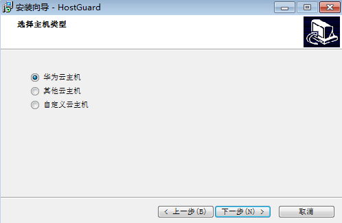
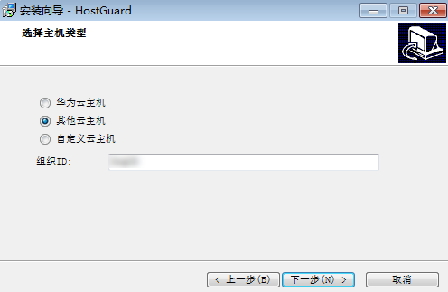
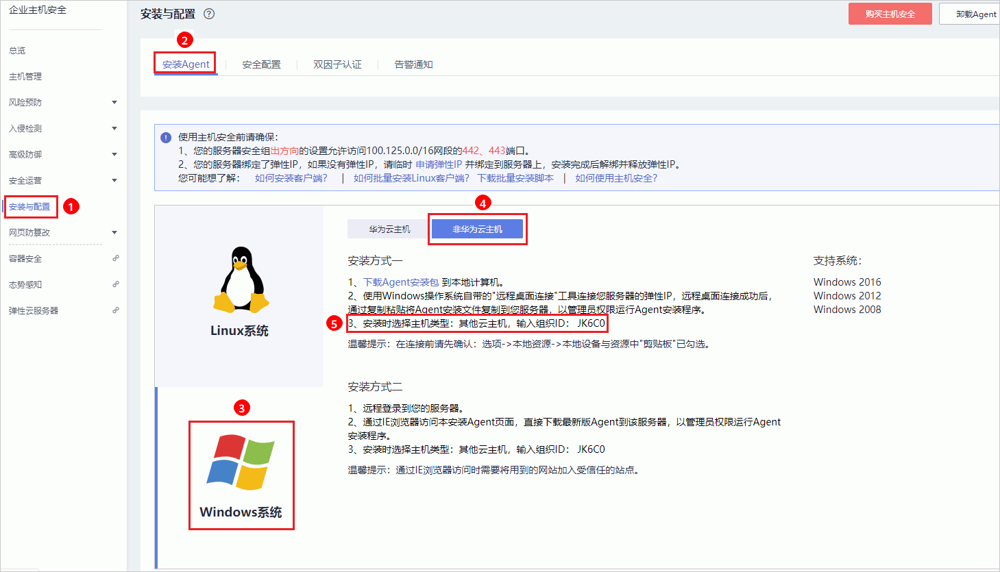
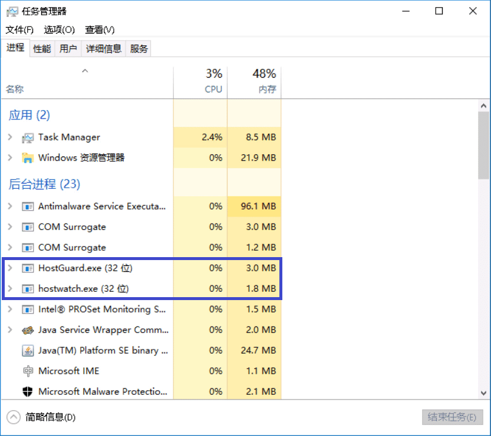

# Windows版本

在主机中安装客户端后，您才能开启企业主机安全服务。通过本节介绍，您将了解如何在Windows操作系统的主机中安装客户端。Linux操作系统的客户端安装请参见[Linux版本](Linux版本.md)。

> **说明：**   
>网页防篡改与主机安全共用同一个客户端，您只需在同一主机安装一次。  

## 安装场景

企业主机安全服务支持**华为云主机**和**非华为云主机**两种安装方式，请按[表1](#hss_01_0234_table114917164498)进行选择。

**表 1**  安装场景

<table><thead align="left"><tr id="hss_01_0234_row4150816114916"><th class="cellrowborder" valign="top" width="21.67%" id="mcps1.2.3.1.1">
服务器类型

</th>
<th class="cellrowborder" valign="top" width="78.33%" id="mcps1.2.3.1.2">
如何安装Agent

</th>
</tr>
</thead>
<tbody><tr id="hss_01_0234_row19150151664911"><td class="cellrowborder" rowspan="2" valign="top" width="21.67%" headers="mcps1.2.3.1.1 ">
华为云弹性云服务器ECS

华为云裸金属服务器BMS

</td>
<td class="cellrowborder" valign="top" width="78.33%" headers="mcps1.2.3.1.2 ">
主机与HSS配额在同一区域，请使用<strong id="hss_01_0234_b16617201129">华为云主机</strong>的安装方式。

</td>
</tr>
<tr id="hss_01_0234_row1715013165495"><td class="cellrowborder" valign="top" headers="mcps1.2.3.1.1 ">
主机与HSS配额不在同一区域：

<ul id="hss_01_0234_ul1677913318110"><li>HSS配额所在区域：华北-北京一、华东-上海二、华南-广州、华北-北京四。
请使用<strong id="hss_01_0234_b799315366126">非华为云主机</strong>的安装方式将主机接入HSS配额所在区域。

</li></ul>
<ul id="hss_01_0234_ul2094613891110"><li>HSS配额所在区域：其他区域。
请退订配额后重新购买配额。

</li></ul>

具体操作请参见<a href="https://support.huaweicloud.com/hss_faq/hss_01_0159.html" target="_blank" rel="noopener noreferrer">如何跨区域使用HSS服务</a>。

</td>
</tr>
<tr id="hss_01_0234_row1715010162495"><td class="cellrowborder" valign="top" width="21.67%" headers="mcps1.2.3.1.1 ">
第三方云主机

</td>
<td class="cellrowborder" rowspan="2" valign="top" width="78.33%" headers="mcps1.2.3.1.2 ">
<strong id="hss_01_0234_b17626227101210">非华为云主机</strong>的安装方式。

<ul id="hss_01_0234_ul196058314920"><li>仅在“华北-北京一”、“华东-上海二”、“华南-广州”、“华北-北京四”可接入非华为云的主机，请在以上区域内购买防护配额，并使用以上区域内的安装包或安装命令为主机安装客户端。</li><li>在非华为云主机中安装客户端后，在防护列表中，您可以根据主机的IP地址查找该主机。</li></ul>
</td>
</tr>
<tr id="hss_01_0234_row3151181614491"><td class="cellrowborder" valign="top" headers="mcps1.2.3.1.1 ">
线下主机

</td>
</tr>
</tbody>
</table>

> **须知：**   
>-   由于主机的性能差异，非华为云的主机与企业主机安全服务的兼容性可能较差，为使您获得良好的服务体验，建议您使用华为云主机。  
>-   安装客户端时，请暂时清理主机中可能干扰主机安装的应用进程和配置信息，防止客户端安装失败。  

## 前提条件

-   待安装客户端的主机已绑定弹性IP。
-   已在本地安装远程管理工具（如：“pcAnywhere“、“UltraVNC“）。

## 操作步骤

有两种安装方式，以下步骤演示方式一。

-   方式一：下载企业主机安全服务的客户端，上传至待安装客户端的云主机后，在云主机中安装客户端。
-   方式二：登录待安装客户端的云主机，在云主机中登录华为云管理控制台，下载并安装客户端。

1.  [登录管理控制台](https://console.huaweicloud.com)。
2.  在页面上方选择区域后，单击，选择“安全  \>  企业主机安全“。

    **图 1**  企业主机安全  
    

3.  在左侧导航栏中，选择“安装与配置“，进入“安装Agent“界面，下载客户端安装包。

    **图 2**  安装Windows客户端  
    

4.  远程登录待安装客户端的主机。
    -   华为云主机
        -   您可以登录弹性云服务器控制台，在“弹性云服务器“列表中，单击“远程登录“登录主机，详细操作请参见[在云服务器控制台上登录主机](https://support.huaweicloud.com/usermanual-ecs/zh-cn_topic_0027290684.html)。
        -   若您的主机已经绑定了弹性IP，您也可以使用Windows系统的“远程桌面连接“工具，或第三方远程管理工具（例如：“pcAnywhere“、“UltraVNC“）登录主机，并使用管理员账号在主机中安装客户端。

    -   非华为云主机

        请使用Windows系统的“远程桌面连接“工具，或第三方远程管理工具（如：“pcAnywhere“、“UltraVNC“）登录主机，并使用管理员账号在主机中安装客户端。

5.  将客户端安装包上传到待安装客户端的主机中。
6.  使用管理员权限运行客户端安装程序。

    安装客户端时，在主机类型界面，选择主机类型。

    -   华为云主机：请选择“华为云主机”。

        **图 3**  选择主机类型（华为云主机）  
        

    -   非华为云主机：请选择“其他云主机”。请从安装Agent界面复制组织ID，如[图5](#zh-cn_topic_0199816002_fig191838428527)所示。

        **图 4**  选择主机类型（非华为云主机）  
        

        **图 5**  获取组织ID（非华为云主机）  
        

7.  安装完成后，在“Windows任务管理器“中查看进程“HostGuard.exe“和“HostWatch.exe“，如[图6](#fig10894450191811)所示。

    若进程不存在，则表示客户端安装失败，请尝试重新安装客户端。

    **图 6**  查看客户端运行状态  
    

## 相关操作

-   客户端状态及异常处理的详细操作请参见[客户端状态异常应如何处理？](https://support.huaweicloud.com/hss_faq/hss_01_0036.html)。
-   卸载客户端的详细操作请参见[卸载客户端](https://support.huaweicloud.com/hss_faq/hss_01_0119.html)。

