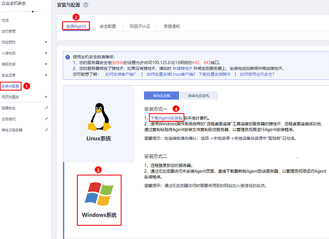
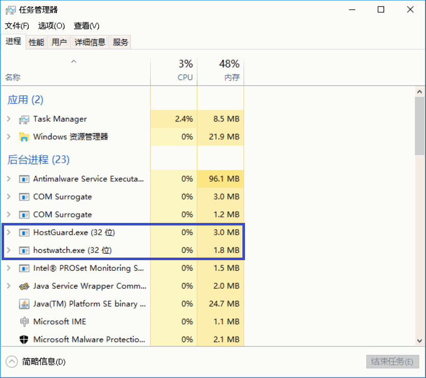

# Windows版本

在主机中安装Agent后，您才能开启企业主机安全服务。通过本节介绍，您将了解如何在Windows操作系统的主机中安装Agent。Linux操作系统的Agent安装请参见[Linux版本](Linux版本.md)。

> **说明：** 
>网页防篡改与主机安全共用同一个Agent，您只需在同一主机安装一次。

## 前提条件

-   待安装Agent所在的线下主机必须绑定弹性IP。
-   待安装Agent所在的线上主机需要与网段相通，要求您的服务器安全组出方向的设置允许访问**100.125.0.0/16**网段的**443**端口。
-   已在本地安装远程管理工具（如：“pcAnywhere“、“UltraVNC“）。

## 约束与限制

-   **华为云主机**

    主机与HSS必须在**同一区域**，并使用配额所在区域的安装命令或安装包为主机安装Agent，否则会导致HSS Agen**安装失败**。若主机与HSS配额不在同一区域，请退订重新购买主机所在区域的配额。

-   **非华为云主机**
    -   当前仅“华北-北京一“、“华东-上海二“、“华南-广州“、“华北-北京四“可接入非华为云的主机，请在以上区域内购买防护配额，并使用以上区域内的安装包或安装命令为主机安装Agent。
    -   非华为云主机需要能通过**公网IP**访问华为云，才能接入HSS。安装Agent后，在防护列表中，您可以根据主机的IP地址查找该主机。

        > **须知：** 
        >-   由于主机的性能差异，非华为云的主机与企业主机安全服务的兼容性可能较差，为使您获得良好的服务体验，建议您使用华为云主机。
        >-   安装Agent时，请暂时清理主机中可能干扰主机安装的应用进程和配置信息（例，McAfee软件、360安全卫士、腾讯管家等第三方安全防护软件），防止Agent安装失败。

## 系统影响

安装HSS Agent 对主机没有任何影响。HSS Agent用于执行检测任务，全量扫描主机；实时监测主机的安全状态，并将收集的主机信息上报给云端防护中心。未安装Agent插件的主机将不受HSS保护，控制台页面也不会显示该主机资产的任何系统漏洞、基线风险、入侵事件和安全报告等数据。

## 默认安装路径

在Windows操作系统的主机中安装Agent时，安装过程中不提供安装路径的选择，默认安装在以下路径中：

“C:\\Program Files \(x86\)\\HostGuard“

## 操作步骤

有两种安装方式，以下步骤演示方式二。

-   方式一：复制Agent下载链接，远程登录服务器通过IE浏览器访问该链接，下载并解压Agent安装包。以管理员权限运行Agent安装程序。
-   方式二：下载企业主机安全服务的Agent，上传至待安装Agent的云主机后，在云主机中安装Agent。

1.  [登录管理控制台](https://console.huaweicloud.com)。
2.  在页面左上角选择“区域“，单击，选择“安全与合规  \>  企业主机安全“，进入企业主机安全页面。

    **图 1**  企业主机安全  
    

3.  在左侧导航栏中，选择“安装与配置“，进入“安装Agent“界面，下载Agent安装包。

    **图 2**  安装Windows Agent  
    

4.  远程登录待安装Agent的主机。
    -   华为云主机
        -   您可以登录弹性云服务器控制台，在“弹性云服务器“列表中，单击“远程登录“登录主机，详细操作请参见[在云服务器控制台上登录主机](https://support.huaweicloud.com/usermanual-ecs/ecs_03_0127.html)。
        -   若您的主机已经绑定了弹性IP，您也可以使用Windows系统的“远程桌面连接“工具，或第三方远程管理工具（例如：“pcAnywhere“、“UltraVNC“）登录主机，并使用管理员帐号在主机中安装Agent。

    -   非华为云主机

        请使用Windows系统的“远程桌面连接“工具，或第三方远程管理工具（如：“pcAnywhere“、“UltraVNC“）登录主机，并使用管理员帐号在主机中安装Agent。

5.  将Agent安装包上传到待安装Agent的主机中。
6.  使用管理员权限运行Agent安装程序。

    安装Agent时，在主机类型界面，选择主机类型。

    -   华为云主机：请选择“华为云主机”。

        **图 3**  选择主机类型（华为云主机）  
        

    -   非华为云主机：请选择“其他云主机”。请从安装Agent界面复制组织ID，如[图5](#hss_01_0235_fig191838428527)所示。

        **图 4**  选择主机类型（非华为云主机）  
        

        **图 5**  获取组织ID（非华为云主机）  
        

7.  安装完成后，在“Windows任务管理器“中查看进程“HostGuard.exe“和“HostWatch.exe“，如[图6](#fig10894450191811)所示。

    若进程不存在，则表示Agent安装失败，请尝试重新安装Agent。

    **图 6**  查看Agent运行状态  
    

## 相关操作

-   Agent状态及异常处理的详细操作请参见[Agent状态异常应如何处理？](https://support.huaweicloud.com/hss_faq/hss_01_0036.html)
-   Agent安装失败，请参见[Agent安装失败应如何处理？](https://support.huaweicloud.com/hss_faq/hss_01_0069.html)
-   卸载Agent的详细操作请参见[如何卸载Agent？](https://support.huaweicloud.com/hss_faq/hss_01_0119.html)

