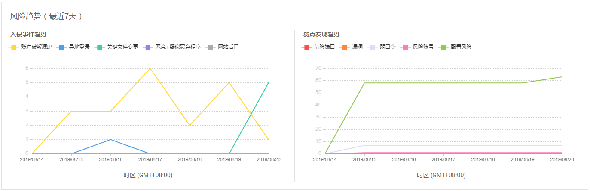
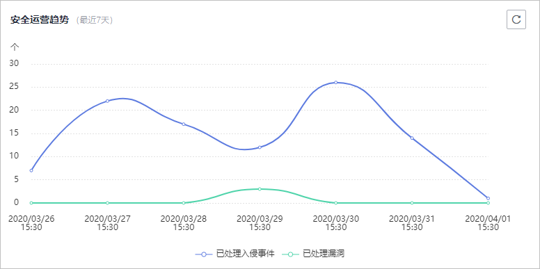
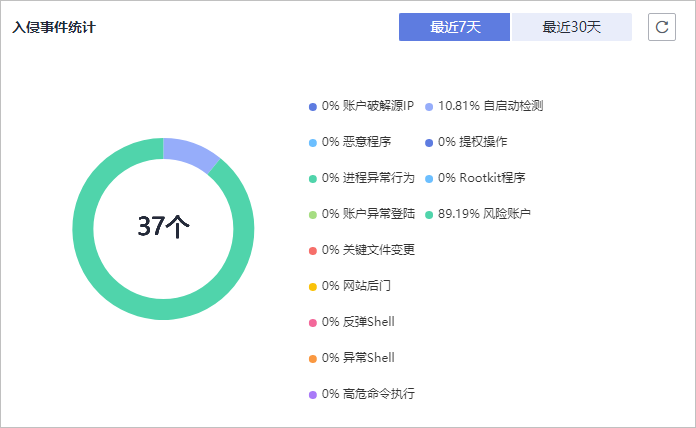
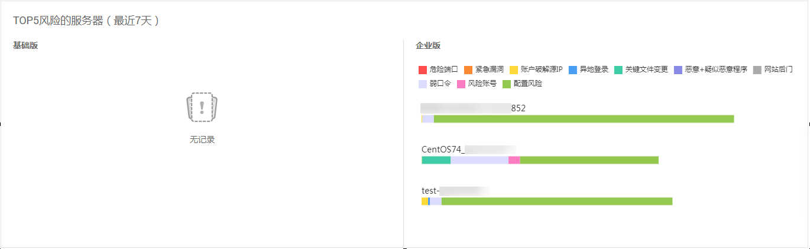

# 主机风险总览

企业主机安全在控制台提供总览页面，包括云主机的防护状态、当前开启防护的云主机最近24小时的风险统计、最近一周风险趋势和最近一周TOP5风险的云服务器，帮助您实时了解云主机的安全状态和存在的安全风险。

## 已开启防护的主机风险统计（最近24小时）

**图 1**  已开启防护的主机风险统计（最近24小时）  

显示最近24小时，企业主机安全服务为开启防护的弹性云服务器发现的各类风险的个数。

单击数字，可查看各类风险详情。

## 主机防护统计（最近24小时）

**图 2**  主机防护状态  

显示用户开启旗舰版防护、企业版防护、基础版防护和未开启防护的服务器的数量。

单击“全部开启“，可跳转到云服务器列表，对未开启防护的服务器开启防护。

## 安全风险趋势

**图 3**  风险趋势（最近7天）  

可显示最近24小时、近3天、近7天的安全风险趋势。

**表 1**  安全风险趋势说明

<table><thead align="left"><tr id="row1786913581726"><th class="cellrowborder" valign="top" width="21.27%" id="mcps1.2.3.1.1">
风险分类

</th>
<th class="cellrowborder" valign="top" width="78.73%" id="mcps1.2.3.1.2">
风险事件

</th>
</tr>
</thead>
<tbody><tr id="row108696581228"><td class="cellrowborder" valign="top" width="21.27%" headers="mcps1.2.3.1.1 ">
资产风险

</td>
<td class="cellrowborder" valign="top" width="78.73%" headers="mcps1.2.3.1.2 "><ul id="ul145214101249"><li>账号信息</li><li>开放端口</li><li>进程信息</li><li>Web目录</li><li>软件信息</li><li>自启动</li></ul>
</td>
</tr>
<tr id="row158697585216"><td class="cellrowborder" valign="top" width="21.27%" headers="mcps1.2.3.1.1 ">
漏洞风险

</td>
<td class="cellrowborder" valign="top" width="78.73%" headers="mcps1.2.3.1.2 "><ul id="ul1065710255415"><li>Linux漏洞</li><li>Windows漏洞</li><li>Web-CMS漏洞</li></ul>
</td>
</tr>
<tr id="row9869058123"><td class="cellrowborder" valign="top" width="21.27%" headers="mcps1.2.3.1.1 ">
基线风险

</td>
<td class="cellrowborder" valign="top" width="78.73%" headers="mcps1.2.3.1.2 "><ul id="ul1277515303412"><li>口令复杂度策略检测</li><li>经典弱口令检测</li><li>配置检测</li></ul>
</td>
</tr>
<tr id="row5203291439"><td class="cellrowborder" valign="top" width="21.27%" headers="mcps1.2.3.1.1 ">
入侵事件

</td>
<td class="cellrowborder" valign="top" width="78.73%" headers="mcps1.2.3.1.2 "><ul id="ul148791338848"><li>账户破解源IP</li><li>异常Shell</li><li>恶意程序</li><li>高危命令执行</li><li>进程异常行为</li><li>异常自启动</li><li>账户异常登录</li><li>提权操作</li><li>关键文件变更</li><li>高危恶意程序</li><li>Rootkit程序</li><li>网站后门</li><li>风险账户</li><li>反弹Shell</li></ul>
</td>
</tr>
</tbody>
</table>

## 安全运营趋势（最近7天）

**图 4**  安全运营趋势  

显示最近7天的已处理入侵事件和已处理漏洞。

## 入侵事件统计

**图 5**  入侵事件统计  

显示入侵事件的总个数，以及各类入侵事件分类占比。

## TOP5风险主机（最近7天）

**图 6**  TOP5风险的云服务器（最近7天）  

基于开启了基础版、企业版或者旗舰版防护功能的弹性云服务器，最近一周企业主机安全服务对其检测出的风险项TOP5的弹性云服务器及各风险项的数量。

