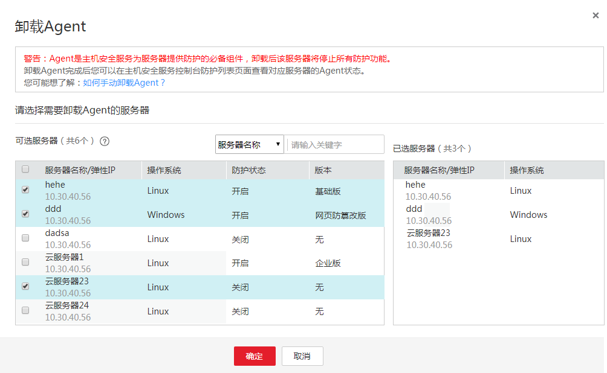

# 从控制台卸载客户端

用户可以通过企业主机安全控制台直接卸载客户端，方便用户操作。

> **说明：**   
>卸载Agent后主机安全服务将无法为该服务器提供任何防护。  

## 前提条件

-   已获取管理控制台的登录账号与密码。
-   云服务器的“Agent状态“为“在线“。

## 操作步骤

1.  登录管理控制台。
2.  在页面上方，单击“服务列表“，选择“安全  \>  企业主机安全“。
3.  在左侧导航树中选择“安装与配置“，进入“安装与配置“界面，单击右上角“卸载Agent“。
4.  在弹出的“卸载Agent“界面中，如[图1](#fig73451514183315)所示，选择需要卸载Agent的云服务器，单击“确定“。

    云服务列表“Agent状态“显示为“离线“，卸载Agent成功。

    **图 1**  卸载Agent  
    

