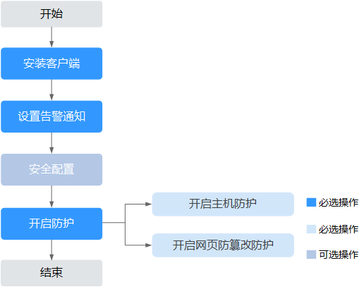

# 企业主机安全使用流程

本章节介绍了如何使用企业主机安全，请参考该流程使用企业主机安全。

企业主机安全使用流程如[图1](#fig172801235531)所示。

**图 1**  企业主机安全使用流程  

**表 1**  企业主机安全使用流程说明

<table><thead align="left"><tr id="row416394117521"><th class="cellrowborder" valign="top" width="21.97%" id="mcps1.2.3.1.1">
子流程

</th>
<th class="cellrowborder" valign="top" width="78.03%" id="mcps1.2.3.1.2">
说明

</th>
</tr>
</thead>
<tbody><tr id="row1516318415523"><td class="cellrowborder" valign="top" width="21.97%" headers="mcps1.2.3.1.1 ">
安装客户端

</td>
<td class="cellrowborder" valign="top" width="78.03%" headers="mcps1.2.3.1.2 ">
企业主机安全需要安装客户端才能使用，具体操作请参见<a href="安装Linux版本客户端（华为云主机）.md">安装Linux版本客户端（华为云主机）</a>。

</td>
</tr>
<tr id="row8163154115521"><td class="cellrowborder" valign="top" width="21.97%" headers="mcps1.2.3.1.1 ">
设置告警通知

</td>
<td class="cellrowborder" valign="top" width="78.03%" headers="mcps1.2.3.1.2 ">
在开启主机防护前，需要设置告警通知。具体操作请参见<a href="设置告警通知.md">设置告警通知</a>。

</td>
</tr>
<tr id="row84216330539"><td class="cellrowborder" valign="top" width="21.97%" headers="mcps1.2.3.1.1 ">
安全配置（可选）

</td>
<td class="cellrowborder" valign="top" width="78.03%" headers="mcps1.2.3.1.2 ">
在开启主机防护前，可以自定义安全配置，包括：配置常用登录地、配置SSH登录IP白名单、配置自定义弱口令和网站后门检测设置。具体操作请参见<a href="配置常用登录地.md">配置常用登录地</a>。

</td>
</tr>
<tr id="row142261237135317"><td class="cellrowborder" valign="top" width="21.97%" headers="mcps1.2.3.1.1 ">
开启防护

</td>
<td class="cellrowborder" valign="top" width="78.03%" headers="mcps1.2.3.1.2 "><ul id="ul16871432192917"><li>开启企业版防护后即可对用户的弹性云服务器进行检测。具体操作请参见<a href="开启主机防护.md">开启主机防护</a>。</li><li>开启网页防篡改版防护后用户可在主机安全服务的“网页防篡改”页面开启网页防篡改功能并添加防护目录，实现对添加的目录进行防护，并获得弹性云服务器的防护记录。具体操作请参见<a href="开启网页防篡改防护.md">开启网页防篡改防护</a>。</li></ul>
</td>
</tr>
</tbody>
</table>

