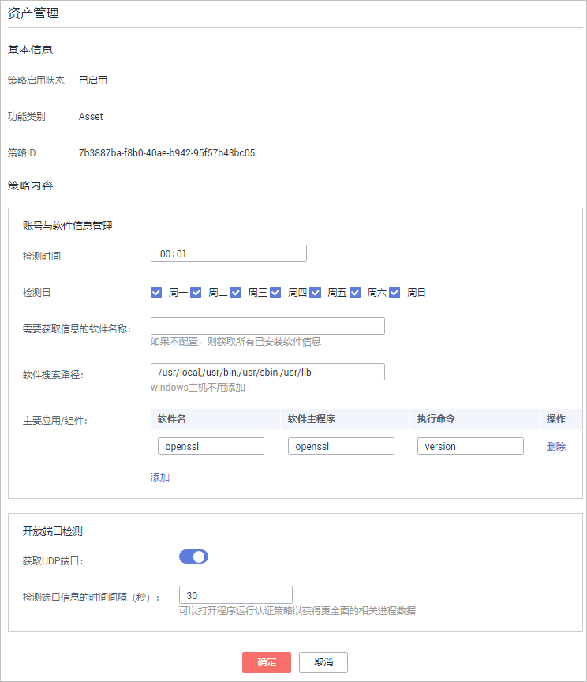
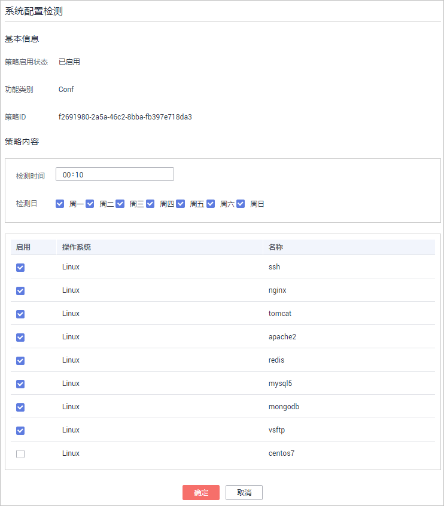
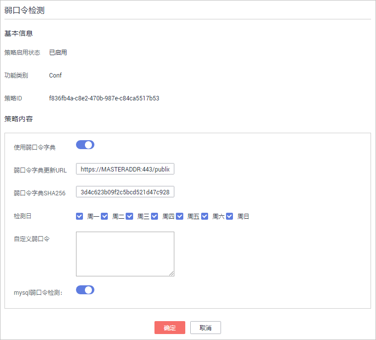
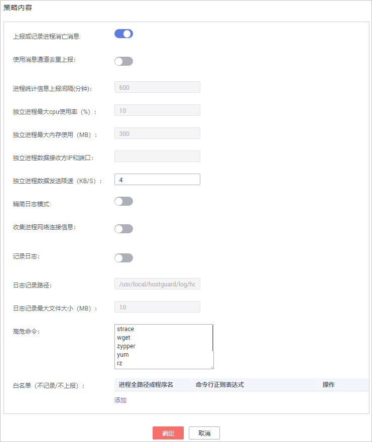
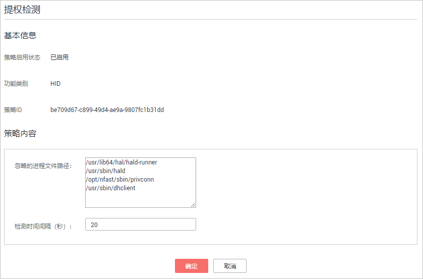
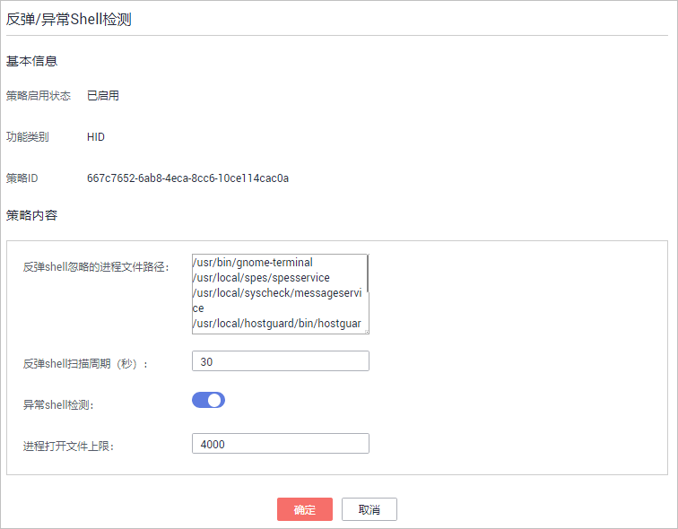
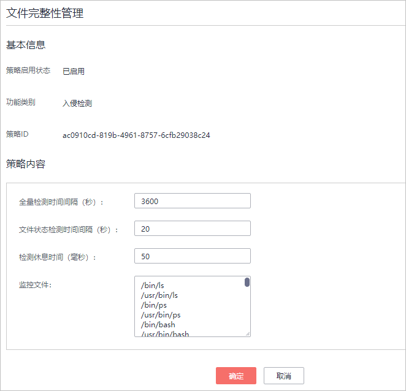
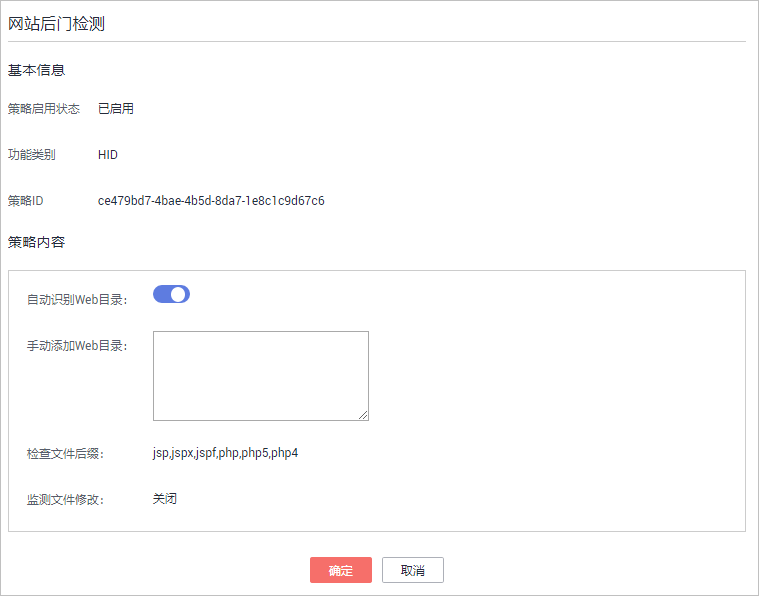

# 修改策略内容

当您创建策略组后，需要修改策略内容时，可按照本文档的指导完成策略内容的修改。

> **须知：** 
>策略内容的修改，只在当前所修改的策略组生效。

## 进入策略管理

1.  [登录管理控制台](https://console.huaweicloud.com)。
2.  在页面上方选择区域后，单击，选择“安全  \>  企业主机安全“。

    **图 1**  企业主机安全  
    

1.  在左侧导航栏，选择“安全运营“，单击“策略管理“，进入“策略管理“界面。

## 资产管理

1.  在策略管理列表中，单击待修改的策略组名称，进入策略组界面。

1.  单击“资产管理“，弹出资产管理界面。
2.  在弹出的资产管理界面中，修改“策略内容“，如[图2](#fig111119150183)所示，参数说明如[表1](#table5229440549)所示。

    **图 2**  资产管理策略  
    

    **表 1**  资产管理策略内容参数说明

    
    <table><thead align="left"><tr id="row22293401149"><th class="cellrowborder" valign="top" width="21.060000000000002%" id="mcps1.2.3.1.1">
参数

    </th>
    <th class="cellrowborder" valign="top" width="78.94%" id="mcps1.2.3.1.2">
说明

    </th>
    </tr>
    </thead>
    <tbody><tr id="row182291040541"><td class="cellrowborder" valign="top" width="21.060000000000002%" headers="mcps1.2.3.1.1 ">
检测时间

    </td>
    <td class="cellrowborder" valign="top" width="78.94%" headers="mcps1.2.3.1.2 ">
检测的时间，可具体到每一天的每一分钟。

    </td>
    </tr>
    <tr id="row192305402418"><td class="cellrowborder" valign="top" width="21.060000000000002%" headers="mcps1.2.3.1.1 ">
检测日

    </td>
    <td class="cellrowborder" valign="top" width="78.94%" headers="mcps1.2.3.1.2 ">
检测日期，勾选周一到周日的任意日期。

    </td>
    </tr>
    <tr id="row2023024011413"><td class="cellrowborder" valign="top" width="21.060000000000002%" headers="mcps1.2.3.1.1 ">
需要获取信息的软件名称

    </td>
    <td class="cellrowborder" valign="top" width="78.94%" headers="mcps1.2.3.1.2 "><ul id="ul20119251513"><li>软件名称中不能包含空格且内容长度不得超过5000字符，多个软件名称用逗号分隔。</li><li>如果不配置，则获取所有已安装软件信息。</li></ul>
    </td>
    </tr>
    <tr id="row1823044019411"><td class="cellrowborder" valign="top" width="21.060000000000002%" headers="mcps1.2.3.1.1 ">
软件搜索路径

    </td>
    <td class="cellrowborder" valign="top" width="78.94%" headers="mcps1.2.3.1.2 ">
软件搜索的路径。Windows主机不需要添加。

    </td>
    </tr>
    <tr id="row1174541144718"><td class="cellrowborder" valign="top" width="21.060000000000002%" headers="mcps1.2.3.1.1 ">
主要应用/组件

    </td>
    <td class="cellrowborder" valign="top" width="78.94%" headers="mcps1.2.3.1.2 "><ul id="ul12721314794"><li>软件名：软件名称。</li></ul>
    <ul id="ul114881812099"><li>软件主程序 ：软件的主程序。</li><li>执行命令 ：执行的命令。</li><li>操作：单击“添加”可以将软件添加到此列表；单击“删除”可以将软件从该列表移除。</li></ul>
    </td>
    </tr>
    <tr id="row813631371010"><td class="cellrowborder" valign="top" width="21.060000000000002%" headers="mcps1.2.3.1.1 ">
获取UDP端口

    </td>
    <td class="cellrowborder" valign="top" width="78.94%" headers="mcps1.2.3.1.2 ">
获取UDP端口信息，检测WEB的目录。

    <ul id="ul1985461420011"><li>：开启。</li><li>：关闭。</li></ul>
    </td>
    </tr>
    <tr id="row12517101812012"><td class="cellrowborder" valign="top" width="21.060000000000002%" headers="mcps1.2.3.1.1 ">
检测端口信息的时间间隔（秒）

    </td>
    <td class="cellrowborder" valign="top" width="78.94%" headers="mcps1.2.3.1.2 ">
进程文件检测端口信息的时间间隔，可配置范围为“30秒~86400秒”。

    </td>
    </tr>
    </tbody>
    </table>

3.  单击“确定“，完成修改。

## 系统配置检测

1.  在策略管理列表中，单击待修改的策略组名称，进入策略组界面。

1.  在策略组列表中，单击“系统配置检测“，弹出系统配置检测界面。
2.  在“系统配置检测“界面，修改“修改策略内容“，如[图3](#fig687494612819)所示，参数说明如[表2](#table150011313513)所示。

    **图 3**  系统配置检测  
    

    **表 2**  系统配置检测策略内容参数说明

    
    <table><thead align="left"><tr id="row1850114313516"><th class="cellrowborder" valign="top" width="21.060000000000002%" id="mcps1.2.3.1.1">
参数

    </th>
    <th class="cellrowborder" valign="top" width="78.94%" id="mcps1.2.3.1.2">
说明

    </th>
    </tr>
    </thead>
    <tbody><tr id="row25011331054"><td class="cellrowborder" valign="top" width="21.060000000000002%" headers="mcps1.2.3.1.1 ">
检测时间

    </td>
    <td class="cellrowborder" valign="top" width="78.94%" headers="mcps1.2.3.1.2 ">
配置系统检测的时间，可具体到每一天的每一分钟。

    </td>
    </tr>
    <tr id="row16501731854"><td class="cellrowborder" valign="top" width="21.060000000000002%" headers="mcps1.2.3.1.1 ">
检测日

    </td>
    <td class="cellrowborder" valign="top" width="78.94%" headers="mcps1.2.3.1.2 ">
系统配置检测日期，勾选周一到周日的检测系统配置的时间。

    </td>
    </tr>
    </tbody>
    </table>

3.  勾选需要检测的操作系统。
4.  单击“确定“，完成修改。

## 弱口令检测

弱口令/密码不归属于某一类漏洞，但其带来的安全隐患却不亚于任何一类漏洞。数据、程序都储存在系统中，若密码被破解，系统中的数据和程序将毫无安全可言。

企业主机安全服务会对使用经典弱口令的用户账号告警，主动检测出主机中使用经典弱口令的账号。您也可以将疑似被泄露的口令添加在自定义弱口令列表中，防止主机中的账户使用该弱口令，给主机带来危险。

1.  在策略管理列表中，单击待修改的策略组名称，进入策略组界面。
2.  在策略组列表中，单击“弱口令检测“，弹出弱口令检测“策略内容“界面。
3.  在弹出的“策略内容“界面中，修改“策略内容“，如[图4](#fig1340439123515)所示，参数说明如[表3](#table68786563367)所示。

    **图 4**  弱口令检测  
    

    **表 3**  弱口令检测策略内容参数说明

    
    <table><thead align="left"><tr id="row987045683618"><th class="cellrowborder" valign="top" width="21.099999999999998%" id="mcps1.2.3.1.1">
参数

    </th>
    <th class="cellrowborder" valign="top" width="78.9%" id="mcps1.2.3.1.2">
说明

    </th>
    </tr>
    </thead>
    <tbody><tr id="row14641173512514"><td class="cellrowborder" valign="top" width="21.099999999999998%" headers="mcps1.2.3.1.1 ">
使用弱口令字典

    </td>
    <td class="cellrowborder" valign="top" width="78.9%" headers="mcps1.2.3.1.2 ">
选择是否开启使用弱口令字典。

    <ul id="ul1849117276276"><li>：开启。</li><li>：关闭。</li></ul>
    </td>
    </tr>
    <tr id="row1387510568363"><td class="cellrowborder" valign="top" width="21.099999999999998%" headers="mcps1.2.3.1.1 ">
弱口令字典更新URL

    </td>
    <td class="cellrowborder" valign="top" width="78.9%" headers="mcps1.2.3.1.2 ">
弱口令字典更新的网页地址。

    </td>
    </tr>
    <tr id="row148771456123612"><td class="cellrowborder" valign="top" width="21.099999999999998%" headers="mcps1.2.3.1.1 ">
弱口令字典SHA256

    </td>
    <td class="cellrowborder" valign="top" width="78.9%" headers="mcps1.2.3.1.2 ">
弱口令字典的SHA256值。

    </td>
    </tr>
    <tr id="row181941325373"><td class="cellrowborder" valign="top" width="21.099999999999998%" headers="mcps1.2.3.1.1 ">
检测日

    </td>
    <td class="cellrowborder" valign="top" width="78.9%" headers="mcps1.2.3.1.2 ">
弱口令检测日期。勾选周一到周日检测弱口令的时间。

    </td>
    </tr>
    <tr id="row419313620102"><td class="cellrowborder" valign="top" width="21.099999999999998%" headers="mcps1.2.3.1.1 ">
自定义弱口令

    </td>
    <td class="cellrowborder" valign="top" width="78.9%" headers="mcps1.2.3.1.2 ">
您可以将疑似被泄露的口令添加在自定义弱口令文本框中，防止主机中的账户使用该弱口令，给主机带来危险。

    </td>
    </tr>
    <tr id="row91261415141220"><td class="cellrowborder" valign="top" width="21.099999999999998%" headers="mcps1.2.3.1.1 ">
mysql弱口令检测

    </td>
    <td class="cellrowborder" valign="top" width="78.9%" headers="mcps1.2.3.1.2 ">
对登录mysql的口令进行弱口令检测，您可以选择开启或者关闭mysql弱口令检测。

    </td>
    </tr>
    </tbody>
    </table>

4.  单击“确定“，完成修改。

## 高危命令检测

1.  在策略管理列表中，单击待修改的策略组名称，进入策略组界面。

1.  单击“高危命令检测“，弹出高危命令检测界面。
2.  在弹出的高危命令检测界面中，修改“策略内容“，如[图5](#fig6072388411506)所示，参数说明如[表4](#table9079559112933)所示。

    **图 5**  高危命令检测内容  
    

    **表 4**  高危命令检测策略内容参数说明

    
    <table><thead align="left"><tr id="row55543219112933"><th class="cellrowborder" valign="top" width="24.52%" id="mcps1.2.3.1.1">
参数

    </th>
    <th class="cellrowborder" valign="top" width="75.48%" id="mcps1.2.3.1.2">
说明

    </th>
    </tr>
    </thead>
    <tbody><tr id="row2327123610015"><td class="cellrowborder" valign="top" width="24.52%" headers="mcps1.2.3.1.1 ">
上报或记录进程消亡消息

    </td>
    <td class="cellrowborder" valign="top" width="75.48%" headers="mcps1.2.3.1.2 ">
是否开启上报或记录进程消亡消息。

    <ul id="ul035713281306"><li>：开启。</li><li>：关闭。</li></ul>
    </td>
    </tr>
    <tr id="row14956142113117"><td class="cellrowborder" valign="top" width="24.52%" headers="mcps1.2.3.1.1 ">
使用消息通道去重上报

    </td>
    <td class="cellrowborder" valign="top" width="75.48%" headers="mcps1.2.3.1.2 ">
是否开启使用消息通道去重上报。

    <ul id="ul983020311607"><li>：开启。</li><li>：关闭。</li></ul>
    </td>
    </tr>
    <tr id="row151427773114"><td class="cellrowborder" valign="top" width="24.52%" headers="mcps1.2.3.1.1 ">
进程统计信息上报间隔（分钟）

    </td>
    <td class="cellrowborder" valign="top" width="75.48%" headers="mcps1.2.3.1.2 ">
开启消息通道去重上报后有效。

    
配置进程统计信息上报间隔，配置为有效数字。

    </td>
    </tr>
    <tr id="row1359828193114"><td class="cellrowborder" valign="top" width="24.52%" headers="mcps1.2.3.1.1 ">
独立进程最大CPU使用率（%）

    </td>
    <td class="cellrowborder" valign="top" width="75.48%" headers="mcps1.2.3.1.2 ">
开启消息通道去重上报后有效。

    
配置独立进程最大CPU使用率，可配置范围为“5~99”。

    </td>
    </tr>
    <tr id="row149164615311"><td class="cellrowborder" valign="top" width="24.52%" headers="mcps1.2.3.1.1 ">
独立进程最大内存使用（MB）

    </td>
    <td class="cellrowborder" valign="top" width="75.48%" headers="mcps1.2.3.1.2 ">
开启消息通道去重上报后有效。

    
配置独立进程最大内存使用，可配置范围为“50~1024”。

    </td>
    </tr>
    <tr id="row97519118325"><td class="cellrowborder" valign="top" width="24.52%" headers="mcps1.2.3.1.1 ">
独立进程数据接收方IP和端口

    </td>
    <td class="cellrowborder" valign="top" width="75.48%" headers="mcps1.2.3.1.2 ">
开启消息通道去重上报后有效。

    
配置独立进程数据接收方IP和端口。

    </td>
    </tr>
    <tr id="row25081721729"><td class="cellrowborder" valign="top" width="24.52%" headers="mcps1.2.3.1.1 ">
独立进程数据发送限速（KB/S）

    </td>
    <td class="cellrowborder" valign="top" width="75.48%" headers="mcps1.2.3.1.2 ">
开启消息通道去重上报后有效。

    
独立进程数据发送限速，可配置范围为“1~100”。

    </td>
    </tr>
    <tr id="row1548817517319"><td class="cellrowborder" valign="top" width="24.52%" headers="mcps1.2.3.1.1 ">
精简日志模式

    </td>
    <td class="cellrowborder" valign="top" width="75.48%" headers="mcps1.2.3.1.2 ">
是否开启使用精简日志模式。

    <ul id="ul14327133620015"><li>：开启。</li><li>：关闭。</li></ul>
    </td>
    </tr>
    <tr id="row1165202116417"><td class="cellrowborder" valign="top" width="24.52%" headers="mcps1.2.3.1.1 ">
收集进程网络连接信息

    </td>
    <td class="cellrowborder" valign="top" width="75.48%" headers="mcps1.2.3.1.2 ">
是否开启收集进程网络连接信息。

    <ul id="ul11539153913016"><li>：开启。</li><li>：关闭。</li></ul>
    </td>
    </tr>
    <tr id="row543016115516"><td class="cellrowborder" valign="top" width="24.52%" headers="mcps1.2.3.1.1 ">
记录日志

    </td>
    <td class="cellrowborder" valign="top" width="75.48%" headers="mcps1.2.3.1.2 ">
是否开启记录日志。

    <ul id="ul142431343607"><li>：开启。</li><li>：关闭。</li></ul>
    </td>
    </tr>
    <tr id="row1574816354517"><td class="cellrowborder" valign="top" width="24.52%" headers="mcps1.2.3.1.1 ">
日志记录路径

    </td>
    <td class="cellrowborder" valign="top" width="75.48%" headers="mcps1.2.3.1.2 ">
日志记录的路径。

    </td>
    </tr>
    <tr id="row453218304615"><td class="cellrowborder" valign="top" width="24.52%" headers="mcps1.2.3.1.1 ">
日志记录最大文件大小（MB）

    </td>
    <td class="cellrowborder" valign="top" width="75.48%" headers="mcps1.2.3.1.2 ">
日志记录最大文件的大小，可配置范围“10~1024”。

    <ul id="ul73391533174312"><li>若日志超过配置的最大文件大小，系统会自动将“.log”文件重命名为“.log.0”，并新建“.log”日志文件，将日志继续写入“.log”文件。</li><li>最多存在2个日志文件，若日志再次超过配置的最大文件大小，系统会删除“.log.0”的日志文件，将“.log”日志文件重命名为“.log.0”，并新建“.log”日志文件，将日志继续写入“.log”文件。</li></ul>
    </td>
    </tr>
    <tr id="row145805131699"><td class="cellrowborder" valign="top" width="24.52%" headers="mcps1.2.3.1.1 ">
高危命令

    </td>
    <td class="cellrowborder" valign="top" width="75.48%" headers="mcps1.2.3.1.2 ">
设置高危命令，一行一个高危命令。

    </td>
    </tr>
    <tr id="row183919303233"><td class="cellrowborder" valign="top" width="24.52%" headers="mcps1.2.3.1.1 ">
白名单（不记录/不上报）

    </td>
    <td class="cellrowborder" valign="top" width="75.48%" headers="mcps1.2.3.1.2 "><ul id="ul5154162021915"><li>进程全路径或程序名：进程的完整路径或者程序的名称。</li></ul>
    <ul id="ul4155220171913"><li>命令行正则表达式 ：命令行的正则表达式。</li><li>操作：单击“添加”可以将进程或者程序添加到此列表；单击“删除”可以将进程或者程序从该列表移除。</li></ul>
    </td>
    </tr>
    </tbody>
    </table>

3.  单击“确定“，完成修改。

## 提权检测

1.  在策略管理列表中，单击待修改的策略组名称，进入策略组界面。

1.  单击“提权检测“，弹出提权检测界面。
2.  在弹出的“提权检测“策略内容中，修改“策略内容“，如[图6](#fig16183825155719)所示，参数说明如[表5](#table105041828556)所示。

    **图 6**  提权检测  
    

    **表 5**  提权检测策略内容参数说明

    
    <table><thead align="left"><tr id="row205050281354"><th class="cellrowborder" valign="top" width="21.060000000000002%" id="mcps1.2.3.1.1">
参数

    </th>
    <th class="cellrowborder" valign="top" width="78.94%" id="mcps1.2.3.1.2">
说明

    </th>
    </tr>
    </thead>
    <tbody><tr id="row165051028555"><td class="cellrowborder" valign="top" width="21.060000000000002%" headers="mcps1.2.3.1.1 ">
忽略的进程文件路径

    </td>
    <td class="cellrowborder" valign="top" width="78.94%" headers="mcps1.2.3.1.2 ">
忽略的进程文件的路径。

    </td>
    </tr>
    <tr id="row95051728956"><td class="cellrowborder" valign="top" width="21.060000000000002%" headers="mcps1.2.3.1.1 ">
检测时间间隔（秒）

    </td>
    <td class="cellrowborder" valign="top" width="78.94%" headers="mcps1.2.3.1.2 ">
进程文件检测时间间隔，可配置范围为“5~3600”。

    </td>
    </tr>
    </tbody>
    </table>

3.  单击“确定“，完成修改。

## 异常/反弹Shell检测

1.  在策略管理列表中，单击待修改的策略组名称，进入策略组界面。

1.  单击“异常/反弹Shell检测“，弹出异常/反弹Shell检测界面。
2.  在弹出的异常/反弹Shell检测界面中，修改“策略内容“，如[图7](#fig20159175124716)所示，参数说明如[图7](#fig20159175124716)所示。

    **图 7**  异常/反弹shell检测  
    

    **表 6**  反弹/异常shell检测策略内容参数说明

    
    <table><thead align="left"><tr id="row1780516344503"><th class="cellrowborder" valign="top" width="32.32%" id="mcps1.2.3.1.1">
参数

    </th>
    <th class="cellrowborder" valign="top" width="67.67999999999999%" id="mcps1.2.3.1.2">
说明

    </th>
    </tr>
    </thead>
    <tbody><tr id="row1080563425019"><td class="cellrowborder" valign="top" width="32.32%" headers="mcps1.2.3.1.1 ">
反弹shell忽略的进程文件路径

    </td>
    <td class="cellrowborder" valign="top" width="67.67999999999999%" headers="mcps1.2.3.1.2 ">
反弹shell忽略的进程文件的路径。

    </td>
    </tr>
    <tr id="row118061534155016"><td class="cellrowborder" valign="top" width="32.32%" headers="mcps1.2.3.1.1 ">
反弹shell扫描周期（秒）

    </td>
    <td class="cellrowborder" valign="top" width="67.67999999999999%" headers="mcps1.2.3.1.2 ">
反弹shell扫描的周期，可配置范围为“30-86400”。

    </td>
    </tr>
    <tr id="row380611349505"><td class="cellrowborder" valign="top" width="32.32%" headers="mcps1.2.3.1.1 ">
异常shell检测

    </td>
    <td class="cellrowborder" valign="top" width="67.67999999999999%" headers="mcps1.2.3.1.2 ">
选择是否开启异常shell检测，建议开启。

    <ul id="ul1880611342507"><li>：开启。</li><li>：关闭。</li></ul>
    </td>
    </tr>
    <tr id="row58061234195019"><td class="cellrowborder" valign="top" width="32.32%" headers="mcps1.2.3.1.1 ">
进程打开文件上限

    </td>
    <td class="cellrowborder" valign="top" width="67.67999999999999%" headers="mcps1.2.3.1.2 ">
进程打开文件的上限数，可配置范围为“10-300000”。

    </td>
    </tr>
    </tbody>
    </table>

3.  单击“确定“，完成修改。

## 文件完整性管理

1.  在策略管理列表中，单击待修改的策略组名称，进入策略组界面。

1.  单击“文件完整性管理“，弹出关键文件完整性管理界面。
2.  在弹出的文件完整性管理界面中，修改“策略内容“，如[图8](#fig0836946533)所示，参数说明如[表7](#table1583614466312)所示。

    **图 8**  文件完整性管理  
    

    **表 7**  文件完整性管理策略内容参数说明

    
    <table><thead align="left"><tr id="row183694616312"><th class="cellrowborder" valign="top" width="26.419999999999998%" id="mcps1.2.3.1.1">
参数

    </th>
    <th class="cellrowborder" valign="top" width="73.58%" id="mcps1.2.3.1.2">
说明

    </th>
    </tr>
    </thead>
    <tbody><tr id="row158361646535"><td class="cellrowborder" valign="top" width="26.419999999999998%" headers="mcps1.2.3.1.1 ">
全量检测时间间隔（秒）

    </td>
    <td class="cellrowborder" valign="top" width="73.58%" headers="mcps1.2.3.1.2 ">
检测配置的“文件路径”下所有文件的时间间隔，可配置范围为“3600-100000”。

    
例如：配置为“3600”，就是一个小时检测一次所有文件。

    </td>
    </tr>
    <tr id="row29964098112933"><td class="cellrowborder" valign="top" width="26.419999999999998%" headers="mcps1.2.3.1.1 ">
文件状态检测时间间隔（秒）

    </td>
    <td class="cellrowborder" valign="top" width="73.58%" headers="mcps1.2.3.1.2 ">
文件状态检测周期。可配置范围为“10-600”。

    </td>
    </tr>
    <tr id="row24881683112933"><td class="cellrowborder" valign="top" width="26.419999999999998%" headers="mcps1.2.3.1.1 ">
检测休息时间（毫秒）

    </td>
    <td class="cellrowborder" valign="top" width="73.58%" headers="mcps1.2.3.1.2 ">
检测配置的“文件路径”下的文件的时间间隔，可配置范围为“0-1000”。

    
例如：配置为“50”，检测“/bin/ls”后，等待“50”毫秒再检测“/usr/bin/ls”。

    </td>
    </tr>
    <tr id="row24180626112933"><td class="cellrowborder" valign="top" width="26.419999999999998%" headers="mcps1.2.3.1.1 ">
文件路径

    </td>
    <td class="cellrowborder" valign="top" width="73.58%" headers="mcps1.2.3.1.2 ">
需要检测的文件的路径。

    
 说明： 
<ul id="ul1279910601911"><li>策略默认添加的文件是非常关键的文件，请谨慎删除！</li><li>若删除默认添加的文件，HSS将不会再对该文件发生的变更进行统计。</li></ul>
    

    </td>
    </tr>
    </tbody>
    </table>

3.  单击“确定“，完成修改。

## 网站后门检测

网站后门检测功能只有在设置Web路径之后才会生效。

1.  在策略管理列表中，单击待修改的策略组名称，进入策略组界面。
2.  单击“网站后门检测“，弹出网站后门检测界面。
3.  在弹出的网站后门检测界面中，修改“策略内容“，如[图9](#fig18946185013528)所示，参数说明如[图9](#fig18946185013528)所示。

    **图 9**  网站后门检测  
    

    > **说明：** 
    >为防止Web目录中的软件影响企业主机安全服务Agent的正常运行，请勿将Web目录配置在“/usr/local“的路径下。

    **表 8**  网站后门检测策略内容参数说明

    
    <table><thead align="left"><tr id="row18881173111219"><th class="cellrowborder" valign="top" width="21%" id="mcps1.2.3.1.1">
参数

    </th>
    <th class="cellrowborder" valign="top" width="79%" id="mcps1.2.3.1.2">
说明

    </th>
    </tr>
    </thead>
    <tbody><tr id="row1288173120219"><td class="cellrowborder" valign="top" width="21%" headers="mcps1.2.3.1.1 ">
自动识别Web目录

    </td>
    <td class="cellrowborder" valign="top" width="79%" headers="mcps1.2.3.1.2 ">
请根据需要开启或关闭自动识别Web路径，若缺少目录请进行手动添加。

    <ul id="ul202300251113"><li>：开启。</li><li>：关闭。</li></ul>
    </td>
    </tr>
    <tr id="row10701111417469"><td class="cellrowborder" valign="top" width="21%" headers="mcps1.2.3.1.1 ">
手动添加Web目录

    </td>
    <td class="cellrowborder" valign="top" width="79%" headers="mcps1.2.3.1.2 ">
手动添加需要检测的Web目录。

    <ul id="ul15725192511482"><li>文件路径以“/”开头，不能以“/”结尾。</li><li>结尾必须有端口号。</li><li>多个路径通过回车换行分隔且名称中不能包含空格。</li></ul>
    </td>
    </tr>
    <tr id="row1688110319216"><td class="cellrowborder" valign="top" width="21%" headers="mcps1.2.3.1.1 ">
检查文件后缀

    </td>
    <td class="cellrowborder" valign="top" width="79%" headers="mcps1.2.3.1.2 ">
检查文件的后缀，可以检测“jsp”、“jspx”、“jspf”、“php”、“php5”和“php4”。

    </td>
    </tr>
    <tr id="row8881163111216"><td class="cellrowborder" valign="top" width="21%" headers="mcps1.2.3.1.1 ">
监测文件修改

    </td>
    <td class="cellrowborder" valign="top" width="79%" headers="mcps1.2.3.1.2 ">
是否开启监测文件修改功能。

    </td>
    </tr>
    </tbody>
    </table>

4.  单击“确定“，完成修改。

