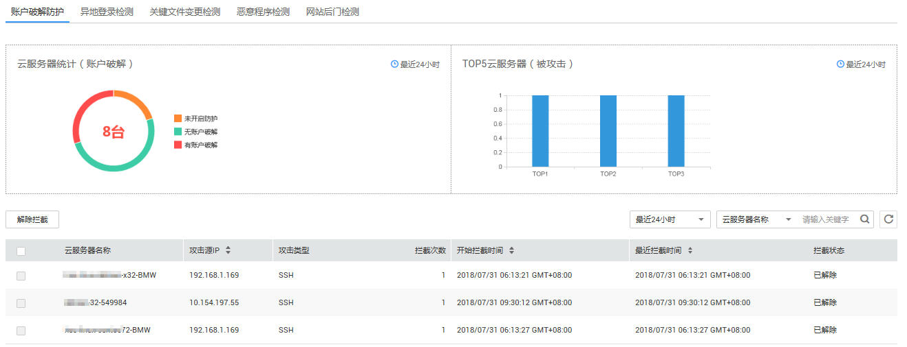
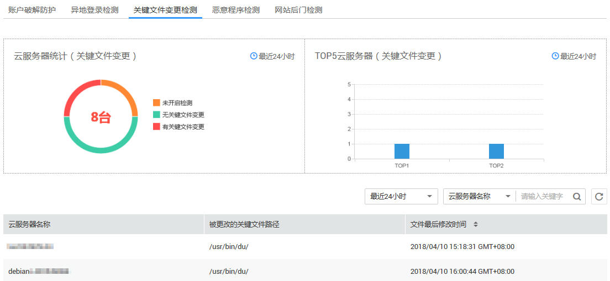
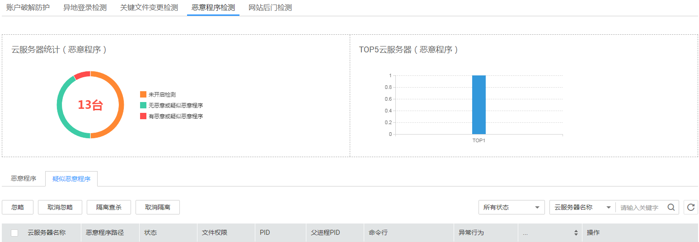
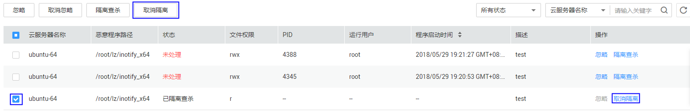
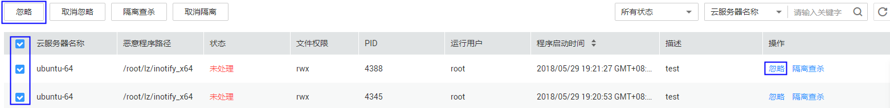
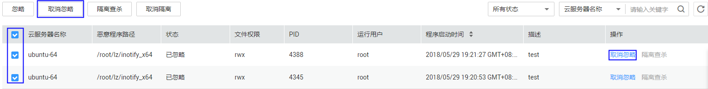
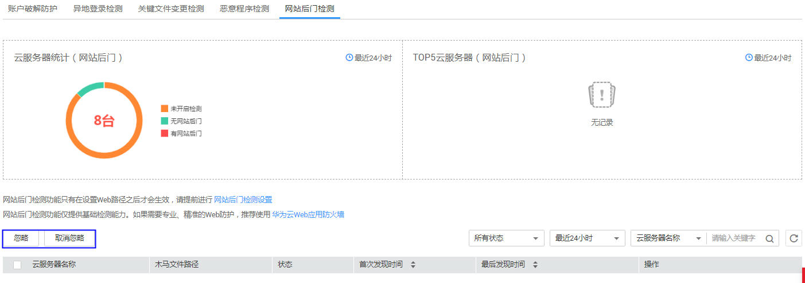

# 入侵检测

本章节指导用户通过企业主机安全服务查看入侵检测的各项检测结果。

## 前提条件

已获取管理控制台的登录帐号与密码。

## 查看账户破解防护记录

1.  登录管理控制台。
2.  在页面上方，单击“服务列表“，选择“安全  \>  企业主机安全“。
3.  在左侧导航树中，选择“入侵检测“，进入入侵检测界面。
4.  默认显示“账户破解防护“，如[图1](#fig2303184992115)所示，各参数说明如[表1](#table173149492215)所示。

    > **说明：**   
    >攻击类型包括这几种类型：mysql、mssql、vsftp、filezilla、serv-u。  

    **图 1**  账户破解防护  
    

    **表 1**  账户破解参数说明

    
    <table><thead align="left"><tr id="row123051749192116"><th class="cellrowborder" valign="top" width="19.64%" id="mcps1.2.4.1.1">
参数名称

    </th>
    <th class="cellrowborder" valign="top" width="45.37%" id="mcps1.2.4.1.2">
说明

    </th>
    <th class="cellrowborder" valign="top" width="34.99%" id="mcps1.2.4.1.3">
界面说明

    </th>
    </tr>
    </thead>
    <tbody><tr id="row1130512492216"><td class="cellrowborder" valign="top" width="19.64%" headers="mcps1.2.4.1.1 ">
云服务器统计（账户破解）

    </td>
    <td class="cellrowborder" valign="top" width="45.37%" headers="mcps1.2.4.1.2 ">
显示最近24小时内是否有账户破解风险的弹性云服务器数量及占比。

    </td>
    <td class="cellrowborder" valign="top" width="34.99%" headers="mcps1.2.4.1.3 ">
鼠标停放在图上不同颜色上时，能显示详细数量。

    </td>
    </tr>
    <tr id="row1231115493213"><td class="cellrowborder" valign="top" width="19.64%" headers="mcps1.2.4.1.1 ">
TOP5云服务器（被攻击）

    </td>
    <td class="cellrowborder" valign="top" width="45.37%" headers="mcps1.2.4.1.2 ">
企业主机安全服务检测出的最近24小时内有账户破解风险的TOP5弹性云服务器。

    </td>
    <td class="cellrowborder" valign="top" width="34.99%" headers="mcps1.2.4.1.3 ">
鼠标停放在图上时，会显示弹性云服务器名称。

    </td>
    </tr>
    <tr id="row7314194962112"><td class="cellrowborder" valign="top" width="19.64%" headers="mcps1.2.4.1.1 ">
云服务器列表

    </td>
    <td class="cellrowborder" valign="top" width="45.37%" headers="mcps1.2.4.1.2 ">
企业主机安全服务检测出的有账户破解风险的弹性云服务器列表。

    </td>
    <td class="cellrowborder" valign="top" width="34.99%" headers="mcps1.2.4.1.3 "><ul id="ul153143495213"><li>勾选需要解除拦截的IP，单击列表左上角“解除拦截”，可以对可信任的IP解除拦截。</li><li>用户可在列表右上角单击，手动刷新当前列表。</li><li>在列表的右上角，可以选择“最近24小时”、“最近3天”、“最近7天”，单击，查询指定时间内有账户破解风险的弹性云服务器。</li><li>用户可在列表右上角的搜索框中输入“云服务器名称”/“攻击源IP”的关键字，单击，查询指定弹性云服务器。</li></ul>
    </td>
    </tr>
    </tbody>
    </table>

## 查看异地登录检测结果

1.  登录管理控制台。
2.  在页面上方，单击“服务列表“，选择“安全  \>  企业主机安全“。
3.  在左侧导航树中，选择“入侵检测“，进入入侵检测界面。
4.  选择“异地登录检测“页签，如[图2](#fig4864925517049)所示，各参数说明如[表2](#table1944624695218)所示。

    **图 2**  异地登录  
    

    **表 2**  查看异地登录检测结果参数说明

    
    <table><thead align="left"><tr id="row1644604685213"><th class="cellrowborder" valign="top" width="19.64%" id="mcps1.2.4.1.1">
参数名称

    </th>
    <th class="cellrowborder" valign="top" width="45.37%" id="mcps1.2.4.1.2">
说明

    </th>
    <th class="cellrowborder" valign="top" width="34.99%" id="mcps1.2.4.1.3">
界面说明

    </th>
    </tr>
    </thead>
    <tbody><tr id="row444619465520"><td class="cellrowborder" valign="top" width="19.64%" headers="mcps1.2.4.1.1 ">
云服务器统计（异地登录）

    </td>
    <td class="cellrowborder" valign="top" width="45.37%" headers="mcps1.2.4.1.2 ">
显示最近24小时内是否有异地登录风险的弹性云服务器数量及占比。

    </td>
    <td class="cellrowborder" valign="top" width="34.99%" headers="mcps1.2.4.1.3 ">
鼠标停放在图上不同颜色上时，能显示详细数量。

    </td>
    </tr>
    <tr id="row1646234618528"><td class="cellrowborder" valign="top" width="19.64%" headers="mcps1.2.4.1.1 ">
TOP5云服务器（异地登录）

    </td>
    <td class="cellrowborder" valign="top" width="45.37%" headers="mcps1.2.4.1.2 ">
企业主机安全服务检测出的最近24小时内有异地登录风险的TOP5弹性云服务器。

    </td>
    <td class="cellrowborder" valign="top" width="34.99%" headers="mcps1.2.4.1.3 ">
鼠标停放在图上时，会显示弹性云服务器名称。

    </td>
    </tr>
    <tr id="row16462144611528"><td class="cellrowborder" valign="top" width="19.64%" headers="mcps1.2.4.1.1 ">
云服务器列表

    </td>
    <td class="cellrowborder" valign="top" width="45.37%" headers="mcps1.2.4.1.2 ">
企业主机安全服务检测出的有异地登录风险的弹性云服务器列表。

    </td>
    <td class="cellrowborder" valign="top" width="34.99%" headers="mcps1.2.4.1.3 "><ul id="ul16462134625215"><li>用户可通过时间选择下拉框选择最近时间段内的云服务器列表，默认最近24小时，可选最近三天或最近七天。</li><li>用户可在列表右上角单击，手动刷新当前列表。</li><li>用户可在列表右上角的搜索框中输入“云服务器名称”的关键字，单击，查询指定弹性云服务器。</li></ul>
    </td>
    </tr>
    </tbody>
    </table>

## 查看关键文件变更检测结果

1.  登录管理控制台。
2.  在页面上方，单击“服务列表“，选择“安全  \>  企业主机安全“。
3.  在左侧导航树中，选择“入侵检测“，进入入侵检测界面。
4.  选择“关键文件变更检测“页签，如[图3](#fig157265882310)所示，各参数说明如[表3](#table62301716185316)所示。

    **图 3**  关键文件变更  
    

    **表 3**  关键文件变更检测结果参数说明

    
    <table><thead align="left"><tr id="row15230111614536"><th class="cellrowborder" valign="top" width="19.64%" id="mcps1.2.4.1.1">
参数名称

    </th>
    <th class="cellrowborder" valign="top" width="45.37%" id="mcps1.2.4.1.2">
说明

    </th>
    <th class="cellrowborder" valign="top" width="34.99%" id="mcps1.2.4.1.3">
界面说明

    </th>
    </tr>
    </thead>
    <tbody><tr id="row1624610162537"><td class="cellrowborder" valign="top" width="19.64%" headers="mcps1.2.4.1.1 ">
云服务器统计（关键文件变更）

    </td>
    <td class="cellrowborder" valign="top" width="45.37%" headers="mcps1.2.4.1.2 ">
显示最近24小时内是否有关键文件被修改的弹性云服务器数量及占比。

    </td>
    <td class="cellrowborder" valign="top" width="34.99%" headers="mcps1.2.4.1.3 ">
鼠标停放在图上不同颜色上时，能显示详细数量。

    </td>
    </tr>
    <tr id="row1324631615532"><td class="cellrowborder" valign="top" width="19.64%" headers="mcps1.2.4.1.1 ">
TOP5云服务器（关键文件变更）

    </td>
    <td class="cellrowborder" valign="top" width="45.37%" headers="mcps1.2.4.1.2 ">
企业主机安全服务检测出的最近24小时内有关键文件被修改的TOP5弹性云服务器。

    </td>
    <td class="cellrowborder" valign="top" width="34.99%" headers="mcps1.2.4.1.3 ">
鼠标停放在图上时，会显示弹性云服务器名称。

    </td>
    </tr>
    <tr id="row1126021611538"><td class="cellrowborder" valign="top" width="19.64%" headers="mcps1.2.4.1.1 ">
云服务器列表

    </td>
    <td class="cellrowborder" valign="top" width="45.37%" headers="mcps1.2.4.1.2 ">
企业主机安全服务检测出的有关键被修改的弹性云服务器列表。

    </td>
    <td class="cellrowborder" valign="top" width="34.99%" headers="mcps1.2.4.1.3 "><ul id="ul82609164536"><li>用户可通过时间选择下拉框选择最近时间段内的云服务器列表，默认最近24小时，可选最近三天或最近七天。</li><li>用户可在列表右上角单击，手动刷新当前列表。</li><li>用户可在列表右上角的搜索框中输入“云服务器名称”的关键字，单击，查询指定弹性云服务器。</li></ul>
    </td>
    </tr>
    </tbody>
    </table>

## 查看恶意程序检测结果

1.  登录管理控制台。
2.  在页面上方，单击“服务列表“，选择“安全  \>  企业主机安全“。
3.  在左侧导航树中，选择“入侵检测“，进入入侵检测界面。
4.  选择“恶意程序检测“页签，如[图4](#fig362413598285)所示，各参数说明如[表4](#table11828592307)所示。

    **图 4**  恶意程序  
    

    **表 4**  恶意程序参数说明

    
    <table><thead align="left"><tr id="row108205913309"><th class="cellrowborder" valign="top" width="19.64%" id="mcps1.2.4.1.1">
参数名称

    </th>
    <th class="cellrowborder" valign="top" width="45.37%" id="mcps1.2.4.1.2">
说明

    </th>
    <th class="cellrowborder" valign="top" width="34.99%" id="mcps1.2.4.1.3">
界面说明

    </th>
    </tr>
    </thead>
    <tbody><tr id="row1082145915307"><td class="cellrowborder" valign="top" width="19.64%" headers="mcps1.2.4.1.1 ">
云服务器统计（恶意程序）

    </td>
    <td class="cellrowborder" valign="top" width="45.37%" headers="mcps1.2.4.1.2 ">
显示是否被恶意程序和疑似恶意程序攻击（不包含被忽略的）的弹性云服务器数量及占比。

    </td>
    <td class="cellrowborder" valign="top" width="34.99%" headers="mcps1.2.4.1.3 ">
鼠标停放在图上不同颜色上时，能显示详细数量。

    </td>
    </tr>
    <tr id="row38245993013"><td class="cellrowborder" valign="top" width="19.64%" headers="mcps1.2.4.1.1 ">
TOP5云服务器（恶意程序）

    </td>
    <td class="cellrowborder" valign="top" width="45.37%" headers="mcps1.2.4.1.2 ">
企业主机安全服务检测出的有恶意程序和疑似恶意程序攻击的TOP5弹性云服务器。

    </td>
    <td class="cellrowborder" valign="top" width="34.99%" headers="mcps1.2.4.1.3 ">
鼠标停放在图上时，会显示弹性云服务器名称。

    </td>
    </tr>
    <tr id="row782115919306"><td class="cellrowborder" valign="top" width="19.64%" headers="mcps1.2.4.1.1 ">
云服务器列表

    </td>
    <td class="cellrowborder" valign="top" width="45.37%" headers="mcps1.2.4.1.2 ">
企业主机安全服务检测出的有恶意程序疑似恶意程序攻击的弹性云服务器列表。

    </td>
    <td class="cellrowborder" valign="top" width="34.99%" headers="mcps1.2.4.1.3 "><ul id="ul11821059123018"><li>用户可在列表右上角单击，手动刷新当前列表。</li><li>用户可在列表右上角的状态选择下拉框选择漏洞状态、搜索框中输入“云服务器名称”的关键字，单击，查询指定弹性云服务器。</li><li>单击“隔离查杀”和“忽略”可以对恶意程序进行对应的操作，详细操作步骤请参见<a href="#ZH-CN_TOPIC_0116259379__section2544172225419">恶意程序的隔离查杀和忽略操作</a>和<a href="#ZH-CN_TOPIC_0116259379__section1068265513160">疑似恶意程序的隔离查杀和忽略操作</a>。</li></ul>
    </td>
    </tr>
    </tbody>
    </table>

5.  在“恶意程序检测“界面单击“疑似恶意程序“页签，进入“疑似恶意程序“界面，如[图5](#fig847333715217)所示。

    **图 5**  疑似恶意程序  
    

## 恶意程序的隔离查杀和忽略操作

1.  登录管理控制台。
2.  在页面上方，单击“服务列表“，选择“安全  \>  企业主机安全“。
3.  在左侧导航树中，选择“入侵检测“，进入入侵检测界面。
4.  选择“恶意程序检测“页签。
5.  选择想要隔离查杀的恶意程序，单击左上角的“隔离查杀“批量隔离查杀恶意程序，也可以单击操作列的“隔离查杀“对单个恶意程序进行隔离查杀，如[图6](#fig116513564116)所示。

    **图 6**  隔离查杀  
    

6.  单击“疑似恶意程序“页签，
7.  选择想要撤销隔离操作的恶意程序，单击左上角的“取消隔离查杀“批量取消隔离查杀的恶意程序，也可以单击操作列的“取消隔离“撤销隔离的操作，如[图7](#fig2084944524714)所示。

    **图 7**  取消隔离  
    

    > **说明：**   
    >选择“隔离查杀“的恶意程序，“取消隔离“只能恢复它的“读/写”权限而不能恢复被查杀的进程。  

8.  选择想忽略的恶意程序，单击左上角“忽略“批量忽略选中的恶意程序。也可以单击端口操作列的“忽略“单个进行忽略操作，如[图8](#fig1192514111362)所示。

    **图 8**  忽略  
    

9.  选择想要取消忽略的恶意程序，单击左上角“取消忽略“批量撤销忽略恶意程序的操作。也可以单击端口操作列的“取消忽略“单个撤销忽略操作，如[图9](#fig931114717193)所示。

    **图 9**  取消忽略  
    

## 疑似恶意程序的隔离查杀和忽略操作

1.  登录管理控制台。
2.  在页面上方，单击“服务列表“，选择“安全  \>  企业主机安全“。
3.  在左侧导航树中，选择“入侵检测“，进入入侵检测界面。
4.  选择“恶意程序检测“页签。
5.  单击“疑似恶意程序“页签，选择想要隔离查杀的疑似恶意程序，单击左上角的“隔离查杀“批量隔离查杀恶意程序，也可以单击操作列的“隔离查杀“对单个疑似恶意程序进行隔离查杀，如[图10](#fig16636479193)所示。

    **图 10**  隔离查杀  
    

6.  选择想要撤销隔离操作的疑似恶意程序，单击左上角的“取消隔离查杀“批量取消隔离查杀的疑似恶意程序，也可以单击操作列的“取消隔离“撤销隔离的操作，如[图11](#fig73682717231)所示。

    **图 11**  取消隔离  
    

    > **说明：**   
    >选择“隔离查杀“的疑似恶意程序，“取消隔离“只能恢复它的“读/写”权限而不能恢复被查杀的进程。  

7.  选择想忽略的疑似恶意程序，单击左上角“忽略“批量忽略选中的疑似恶意程序。也可以单击端口操作列的“忽略“单个进行忽略操作，如[图12](#fig2434279235)所示。

    **图 12**  忽略  
    

8.  选择想要取消忽略的疑似恶意程序，单击左上角“取消忽略“批量撤销忽略疑似恶意程序的操作。也可以单击端口操作列的“取消忽略“单个撤销忽略操作，如[图13](#fig54822718238)所示。

    **图 13**  取消忽略  
    

## 查看网站后门检测结果

1.  登录管理控制台。
2.  在页面上方，单击“服务列表“，选择“安全  \>  企业主机安全“。
3.  在左侧导航树中，选择“入侵检测“，进入入侵检测界面。
4.  选择“网站后门检测“页签，如[图14](#fig1125872011315)所示，各参数说明如[表5](#table1062143213556)所示。

    **图 14**  网站后门  
    

    > **说明：**   
    >选择需要忽略/取消忽略的木马文件对应的云服务器名称，单击列表左上角的“忽略“/“取消忽略“，可批量忽略/取消忽略此木马文件。忽略后，安全风险统计中将不再统计该木马文件，但网站后门列表中仍然可见。  

    **表 5**  网站后门检测结果参数说明

    
    <table><thead align="left"><tr id="row278632195515"><th class="cellrowborder" valign="top" width="19.64%" id="mcps1.2.4.1.1">
参数名称

    </th>
    <th class="cellrowborder" valign="top" width="45.37%" id="mcps1.2.4.1.2">
说明

    </th>
    <th class="cellrowborder" valign="top" width="34.99%" id="mcps1.2.4.1.3">
界面说明

    </th>
    </tr>
    </thead>
    <tbody><tr id="row119453215510"><td class="cellrowborder" valign="top" width="19.64%" headers="mcps1.2.4.1.1 ">
云服务器统计（网站后门）

    </td>
    <td class="cellrowborder" valign="top" width="45.37%" headers="mcps1.2.4.1.2 ">
显示最近24小时内是否有网站后门的弹性云服务器数量及占比，用圆环图呈现。

    </td>
    <td class="cellrowborder" valign="top" width="34.99%" headers="mcps1.2.4.1.3 ">
鼠标停放在圆环不同颜色上时，能显示详细数量。

    </td>
    </tr>
    <tr id="row181094321557"><td class="cellrowborder" valign="top" width="19.64%" headers="mcps1.2.4.1.1 ">
TOP5云服务器（网站后门）

    </td>
    <td class="cellrowborder" valign="top" width="45.37%" headers="mcps1.2.4.1.2 ">
企业主机安全服务检测出的最近24小时内有网站后门的TOP5弹性云服务器。

    </td>
    <td class="cellrowborder" valign="top" width="34.99%" headers="mcps1.2.4.1.3 ">
鼠标停放在柱状图上时，会显示弹性云服务器名称。

    </td>
    </tr>
    <tr id="row201251132105514"><td class="cellrowborder" valign="top" width="19.64%" headers="mcps1.2.4.1.1 ">
云服务器列表

    </td>
    <td class="cellrowborder" valign="top" width="45.37%" headers="mcps1.2.4.1.2 ">
企业主机安全服务检测出的有网站后门的弹性云服务器列表。

    </td>
    <td class="cellrowborder" valign="top" width="34.99%" headers="mcps1.2.4.1.3 "><ul id="ul1612583212552"><li>用户可通过时间选择下拉框选择最近时间段内的云服务器列表，默认最近24小时，可选最近三天或最近七天。</li><li>用户可在列表右上角单击，手动刷新当前列表。</li><li>用户可在列表右上角，单击“所有状态”，在下拉列表中选择状态类型，或者在搜索框中输入“云服务器名称”的关键字，单击，查询指定弹性云服务器。</li></ul>
    </td>
    </tr>
    </tbody>
    </table>

