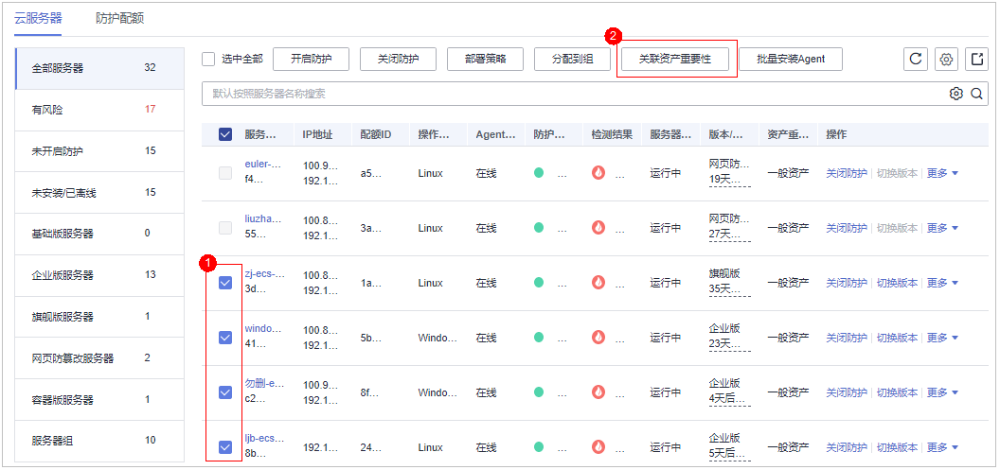

# 关联资产重要性管理

HSS默认所有服务器为一般资产，您可以为服务器关联匹配的资产重要等级，关联后，您可通过资产重要等级对服务器进行分类管理。

资产重要等级分类如下：

-   重要资产：一般绑定运行业务或数据均为企业核心资产的服务器。
-   一般资产：一般绑定无重要业务运行、无核心资产的服务器。
-   测试资产：用于绑定用来测试业务或数据的服务器。

## 查看资产重要等级

1.  [登录管理控制台](https://console.huaweicloud.com/?locale=zh-cn)。
2.  在页面左上角选择“区域“，单击，选择“安全与合规 \> 主机安全服务”，进入主机安全平台界面。

    **图 1**  进入主机安全  
    

1.  在左侧导航栏，选择“资产管理  \>  主机管理“，进入“主机管理“界面，选择“云服务器“页签，进入云服务器页面。

    > **说明：** 
    >如果您的服务器已通过企业项目的模式进行管理，您可选择目标“企业项目“后查看或操作目标企业项目内的资产和检测信息。

2.  在页签页面内下方查看“资产重要性“，单击“重要资产“、“一般资产“、“测试资产“，可按照类别查看服务器。

## 关联资产重要等级

1.  登录管理控制台，进入主机安全服务页面。

1.  在左侧导航栏，选择“资产管理  \>  主机管理“，进入“主机管理“界面，选择“云服务器“页签，进入云服务器页面。

    > **说明：** 
    >如果您的服务器已通过企业项目的模式进行管理，您可选择目标“企业项目“后查看或操作目标企业项目内的资产和检测信息。

2.  关联资产重要性。
    -   单服务器关联
        -   方式一：通过勾选服务器关联
            1.  勾选目标服务器前的选框，单击上方的“关联资产重要性“。

                **图 2**  勾选单服务器  
                

            2.  在弹窗中“资产重要性“项选择对应的资产重要等级。
            3.  确认无误，单击“确认“，完成关联。

        -   方式二：通过“操作“列选项关联
            1.  在目标服务器的“操作”列选择“更多  \>  关联资产重要性“。

                **图 3**  选择单服务器  
                

            2.  在弹窗中“资产重要性“项选择对应的资产重要等级。
            3.  确认无误，单击“确认“，完成关联。

    -   批量关联
        1.  勾选多个目标服务器前的选框，单击上方的“关联资产重要性“。

            **图 4**  批量勾选服务器  
            

        2.  在弹窗中“资产重要性“项选择对应的资产重要等级。
        3.  确认无误，单击“确认“，完成批量关联。

