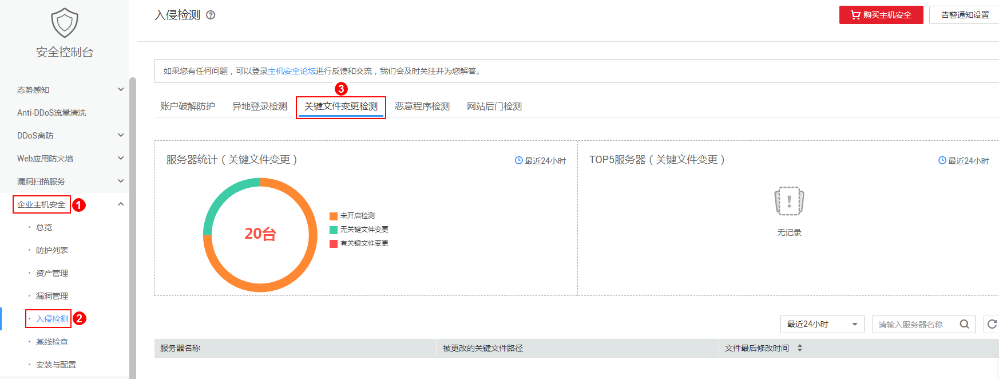

# 关键文件变更检测

该检测结果显示服务器上被篡改的文件，对于发现黑客入侵非常重要。

对于关键文件变更，HSS只检测目录或文件是否被修改，不关注是人为或者某个进程修改的。

## 告警策略

HSS将**实时检测**您服务器上的系统文件，若发现系统文件被修改，HSS将会触发告警信息。

## 查看关键文件变更检测结果

1.  [登录管理控制台](https://console.huaweicloud.com)。
2.  在页面上方选择区域后，单击，选择“安全  \>  企业主机安全“。

    **图 1**  企业主机安全  
    

3.  选择“关键文件变更检测“页签，如[图2](#fig157265882310)所示。

    **图 2**  关键文件变更检测  
    

## 处理关键文件变更检测结果

关键文件变更检测结果在7天后会自动清除，请及时查看。

-   若您确认检测结果中的文件变更是正常操作，则无需关注。
-   若关键文件被修改并且确认非用户主动行为，建议立即将该文件替换为操作系统的标准版本。

