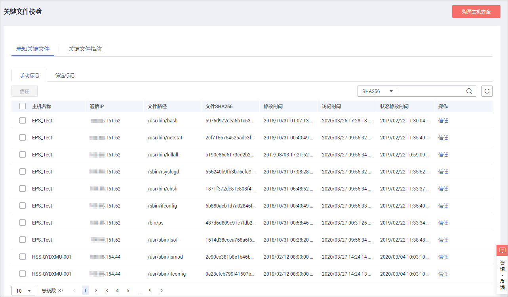
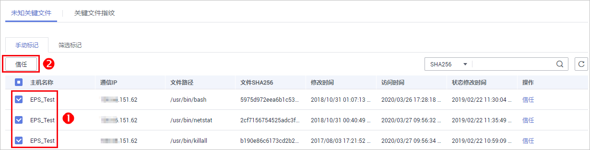
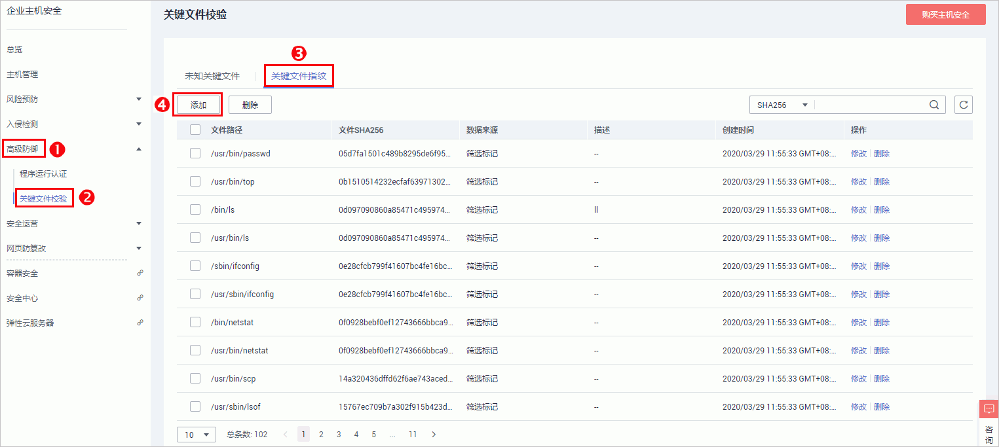
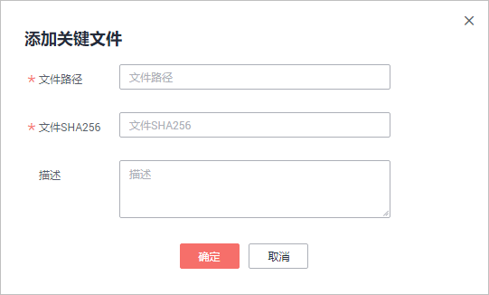

# 关键文件校验

关键文件校验是HSS为用户检测云主机中一些关键文件的Hash值，用于检测文件是否合规、是否被篡改。

关键文件指纹：收集关键文件信息，便于清点合法文件信息，检测异常文件。

将未知关键文件标记为信任后，相应的关键文件将会从“未知关键文件“列表移除，添加到“关键文件指纹“列表中。

> **说明：**   
>仅旗舰版支持关键文件校验。  

## 应用场景

-   建立可信的关键文件指纹：您可以将华为云ECS固有的关键文件或者经常使用的关键文件设置为“信任“，添加到关键文件指纹。
-   关注增量的关键文件：创建关键文件指纹后，您只需要关注增量的关键文件，并判断是否可信，来丰富自己的关键文件指纹。

    例如：后门、木马、挖矿软件、蠕虫和病毒等恶意程序通常首次寄宿在一台主机上，您可以通过“覆盖主机数< 2“筛选只有一台主机上才有的关键文件，关注这些关键文件是否可信，清除首个感染主机的威胁。

## 查看未知关键文件

1.  [登录管理控制台](https://console.huaweicloud.com)。
2.  在页面上方选择区域后，单击，选择“安全  \>  企业主机安全“。

    **图 1**  企业主机安全  
    

1.  进入“关键文件校验“页面，单击“未知关键文件“，默认显示未知关键文件列表，如[图2](#fig350162443614)所示。

    **图 2**  未知关键文件列表  
    

    > **说明：**   
    >-   用户可以通过输入“服务器名称“、“文件SHA256“、“IP地址“和“文件路径“，单击“搜索“，筛选符合条件的文件。单击“重置“可以清除查询条件。  
    >-   选中文件，然后单击“标记为信任“，可以将该文件标记为“信任“。  
    >-   可以通过“手动标记“和“筛选标记“两种方式对未知关键文件进行标记。  

    **表 1**  未知关键文件列表字段说明

    
    <table><thead align="left"><tr id="row65142418361"><th class="cellrowborder" valign="top" width="26.25%" id="mcps1.2.3.1.1">
字段

    </th>
    <th class="cellrowborder" valign="top" width="73.75%" id="mcps1.2.3.1.2">
说明

    </th>
    </tr>
    </thead>
    <tbody><tr id="row8518244362"><td class="cellrowborder" valign="top" width="26.25%" headers="mcps1.2.3.1.1 ">
主机名称

    </td>
    <td class="cellrowborder" valign="top" width="73.75%" headers="mcps1.2.3.1.2 ">
文件所在云主机的名称。

    </td>
    </tr>
    <tr id="row1451132463610"><td class="cellrowborder" valign="top" width="26.25%" headers="mcps1.2.3.1.1 ">
通信IP

    </td>
    <td class="cellrowborder" valign="top" width="73.75%" headers="mcps1.2.3.1.2 ">
文件所在云主机的IP地址。

    </td>
    </tr>
    <tr id="row1951524123610"><td class="cellrowborder" valign="top" width="26.25%" headers="mcps1.2.3.1.1 ">
文件路径

    </td>
    <td class="cellrowborder" valign="top" width="73.75%" headers="mcps1.2.3.1.2 ">
文件的路径。

    </td>
    </tr>
    <tr id="row551192403617"><td class="cellrowborder" valign="top" width="26.25%" headers="mcps1.2.3.1.1 ">
文件SHA256

    </td>
    <td class="cellrowborder" valign="top" width="73.75%" headers="mcps1.2.3.1.2 ">
文件的SHA256值。

    </td>
    </tr>
    <tr id="row1951324183618"><td class="cellrowborder" valign="top" width="26.25%" headers="mcps1.2.3.1.1 ">
修改时间

    </td>
    <td class="cellrowborder" valign="top" width="73.75%" headers="mcps1.2.3.1.2 ">
最近一次修改文件的时间。

    </td>
    </tr>
    <tr id="row151624193612"><td class="cellrowborder" valign="top" width="26.25%" headers="mcps1.2.3.1.1 ">
访问时间

    </td>
    <td class="cellrowborder" valign="top" width="73.75%" headers="mcps1.2.3.1.2 ">
最近一次访问文件的时间。

    </td>
    </tr>
    <tr id="row25214244361"><td class="cellrowborder" valign="top" width="26.25%" headers="mcps1.2.3.1.1 ">
状态修改时间

    </td>
    <td class="cellrowborder" valign="top" width="73.75%" headers="mcps1.2.3.1.2 ">
最近一次更改文件状态的时间。

    </td>
    </tr>
    </tbody>
    </table>

## 添加关键文件指纹

-   标记“未知关键文件“到为“信任“

    将未知关键文件标记为“信任“后，相应的关键文件将会从“未知关键文件“列表移除，添加到“关键文件指纹“列表中。

1.  [登录管理控制台](https://console.huaweicloud.com)。
2.  在页面上方选择区域后，单击，选择“安全  \>  企业主机安全“。

    **图 3**  企业主机安全  
    

1.  进入“关键文件校验“页面，单击“未知关键文件“，默认显示未知关键文件列表，如[图4](#fig961410572311)所示。

    **图 4**  选择“未知关键文件”页签  
    

2.  在未知关键文件列表中，可以通过“手动标记“和“筛选标记“两种方式对未知关键文件进行标记，将未知关键文件添加到“关键文件指纹“列表中。
    -   手动标记
        1.  选择“手动标记“，选中一个或多个未知关键文件，单击“信任“，如[图5](#fig279457458505)所示。

            **图 5**  手动标记未知关键文件  
            

            > **说明：**   
            >用户也可以在需要进行处理的未知关键文件所在行的“操作“列，单击“信任“，对单个未知关键文件标记为“信任“。  

        2.  在弹出的对话框中，确认操作信息无误后，单击“确定“，将所选文件标记为“信任“。

    -   筛选标记
        1.  选择“筛选标记“，通过设置列表上方的筛选条件，单击“查询“，查询符合条件的未知关键文件，如[图6](#fig653593248596)所示。

            **图 6**  筛选标记未知关键文件  
            

        2.  单击“信任“，对筛选结果进行批量标记。
        3.  在弹出的对话框中，确认操作信息无误后，单击“确定“，将所选文件标记为“信任“。

            > **说明：**   
            >用户也可以在需要进行处理的未知关键文件所在行的“操作“列，单击“信任“，对单个未知关键文件标记为“信任“。  

-   添加关键文件

1.  [登录管理控制台](https://console.huaweicloud.com)。
2.  在页面上方选择区域后，单击，选择“安全  \>  企业主机安全“。

    **图 7**  企业主机安全  
    

1.  进入“关键文件指纹“列表页面，单击“添加“，添加关键文件，如[图8](#fig4921238182814)所示。

    **图 8**  进入“关键文件指纹”列表  
    

2.  在弹出的“添加关键文件“对话框中，填写“文件路径“、“SHA256“和“描述“后，单击“确定“，完成添加关键文件操作。

    **图 9**  添加关键文件  
    

## 相关操作

**搜索关键文件**

您可以输入“文件SHA256“、“文件路径“或者“描述“，查询关键文件。

**编辑关键文件**

在需要修改描述的关键文件所在行的操作列，单击“修改“，在弹出的对话框中，填写“描述“信息后，单击“确定“，完成修改关键文件操作。

> **说明：**   
>“文件路径“和“SHA256“不能被修改。  

**删除关键文件**

-   您可以在关键文件指纹列表中，选中需要删除的关键文件，单击“删除“。在弹出的对话框中，单击“确定“，完成删除关键文件操作。
-   您也可以在关键文件指纹列表中，在需要删除的关键文件所在行的操作列，单击“删除“，删除单个关键文件。

> **说明：**   
>在关键文件指纹列表中，删除关键文件后，关键文件指纹将重新回到“未知关键文件“列表中。  

