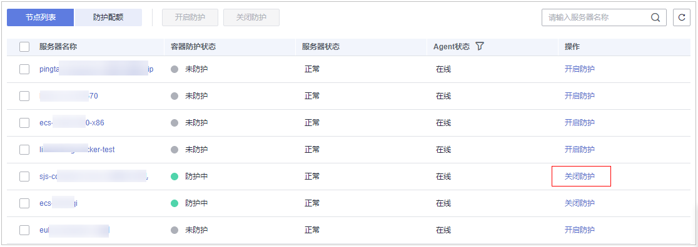
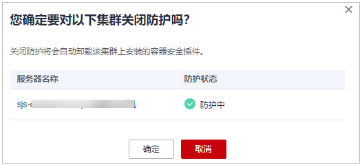
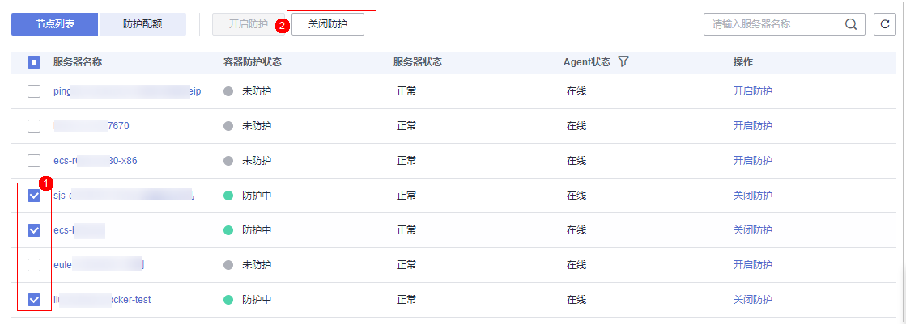
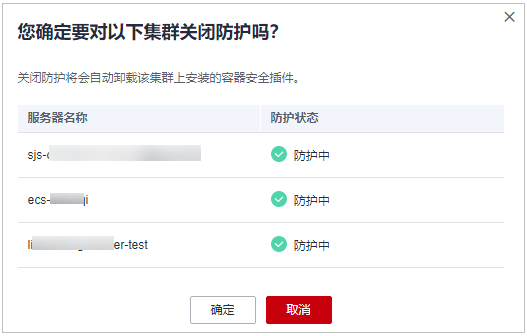

# 关闭容器安全防护

您可以为已开启容器版防护的服务器关闭安全防护，关闭后可释放配额，可供其他服务器防护使用。

## 操作须知

-   关闭防护对业务不会产生影响，但关闭后服务器被入侵的风险会急剧上升，建议保持开启防护的状态。
-   按需计费的容器安全版防护配额在关闭防护同时即停止计费，如果您要退订按需计费的容器安全版防护配额，关闭防护即可，无需再操作退订。

## 操作步骤

1.  [登录管理控制台](https://console.huaweicloud.com/?locale=zh-cn)。
2.  在页面左上角选择“区域“，单击，选择“安全与合规 \> 主机安全服务”，进入主机安全平台界面。

    **图 1**  进入主机安全  
    

3.  在左侧导航树中，选择“资产管理  \>  容器管理“，进入“容器节点管理“页面。

    > **说明：** 
    >如果您的服务器已通过企业项目的模式进行管理，您可选择目标“企业项目“后查看或操作目标企业项目内的资产和检测信息。

    **图 2**  进入容器节点管理  
    

4.  根据需求可选择批量关闭防护和单服务器关闭防护。
    -   **单服务器关闭防护**
        1.  在“节点列表“中目标服务器的“操作”列单击“关闭防护“。

            **图 3**  关闭容器防护  
            

        2.  在弹窗中确认关闭服务器的信息，确认无误，单击“确认“，防护关闭。

            **图 4**  确认关闭容器版防护信息  
            

        3.  关闭后在“资产管理  \>  容器管理  \>  节点列表“页面查看目标服务器的“容器防护状态“为“未防护“，关闭成功。

            > **注意：** 
            >关闭防护对业务不会产生影响，但关闭后服务器被入侵的风险会急剧上升，建议保持开启防护的状态。

    -   **批量关闭防护**
        1.  在“节点列表“中勾选多个目标服务器前的选框，单击上方“关闭防护“。

            **图 5**  批量勾选服务器  
            

        2.  在弹窗中确认关闭服务器的信息，确认无误，单击“确认“，防护关闭。

            **图 6**  确认批量关闭容器版防护信息  
            

        3.  关闭后在“资产管理  \>  容器管理  \>  节点列表“页面查看目标服务器的“容器防护状态“为“未防护“，关闭成功。

            > **注意：** 
            >关闭防护对业务不会产生影响，但关闭后服务器被入侵的风险会急剧上升，建议保持开启防护的状态。

