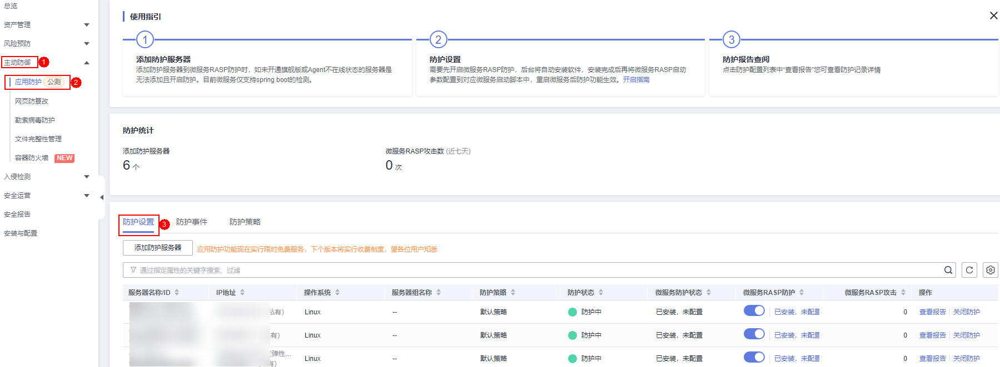
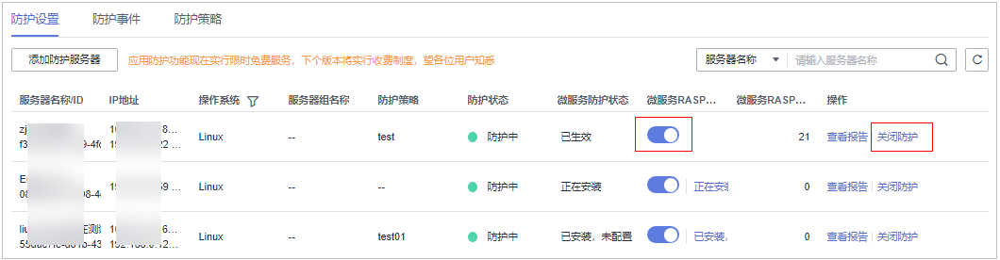

# 关闭应用防护

## 前提条件

已开启主机安全服务版本为旗舰版、网页防篡改版或容器版。

## 约束限制

-   当前只支持操作系统为Linux的服务器。
-   目前仅支持Java应用接入。
-   旗舰版及以上支持应用防护相关操作。

## 操作步骤

1.  [登录管理控制台](https://console.huaweicloud.com/?locale=zh-cn)。
2.  在页面左上角选择“区域“，单击，选择“安全与合规 \> 主机安全服务”，进入主机安全平台界面。

    **图 1**  进入主机安全  
    

3.  选择“主动防御  \>  应用防护  \>  防护设置“，进入“防护配置“页面。

    > **说明：** 
    >如果您的服务器已通过企业项目的模式进行管理，您可选择目标“企业项目“后查看或操作目标企业项目内的资产和检测信息。

    **图 2**  查看防护配置  
    

4.  单击目标服务器“微服务RASP防护“的图标或单击“操作“列的“关闭防护“。

    **图 3**  定位关闭防护按钮  
    

5.  在弹窗中确认正在关闭微服务RASP防护的服务器信息，确认无误，单击“确认“，完成防护关闭。

    > **说明：** 
    >RASP防护关闭后，目标服务器会在“防护设置“页面进行自动删除，若需为其他服务器开启防护，可按照[开启应用防护](开启应用防护.md)操作步骤为其他服务器开启防护。

