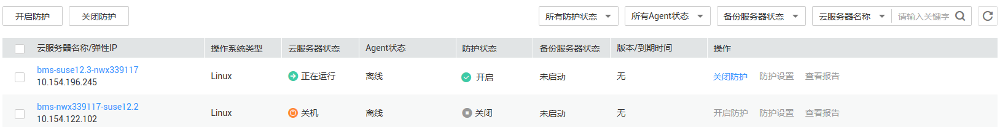

# 关闭网页防篡改防护

该章节指导用户关闭网页防篡改防护。

## 前提条件

-   已获取管理控制台的登录账号与密码。
-   弹性云服务器的“Agent状态“为“在线“且“防护状态“为“关闭“。

## 操作步骤

1.  登录管理控制台。
2.  在页面上方，单击“服务列表“，选择“安全  \>  企业主机安全“。
3.  在左侧导航树中，选择“网页防篡改“，进入网页防篡改界面。
4.  在“网页防篡改“界面，选择“主机列表“页签，进入云服务列表页面。
5.  选择需要关闭网页防篡改功能的弹性云服务器，单击“关闭防护“批量关闭防护。

    **图 1**  关闭防护  
    

    > **说明：**   
    >也可以在需要关闭网页防篡改功能的弹性云服务器所在行的操作列，单击“关闭防护“。  

6.  在弹出的窗口中，单击“确定“，完成关闭防护操作。

