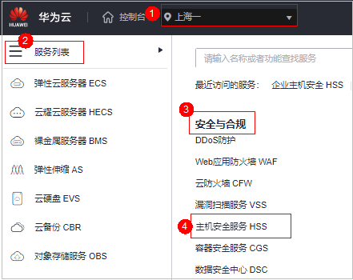
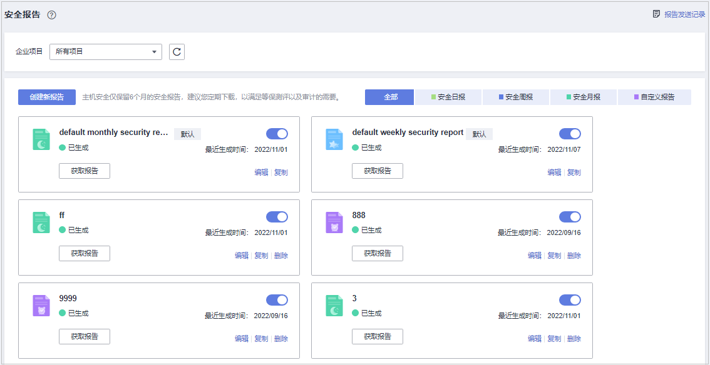

# 创建安全报告

若已有模板的报告类型和报告内容无法满足您对安全报告的订阅需求，您可通过该章节创建需要生成报告的周期和内容。

## 约束限制

企业版及以上版本支持安全报告相关操作。

## 操作步骤

1.  [登录管理控制台](https://console.huaweicloud.com/?locale=zh-cn)。
2.  在页面左上角选择“区域“，单击，选择“安全与合规 \> 主机安全服务”，进入主机安全平台界面。

    **图 1**  进入主机安全  
    

3.  左侧选择“安全报告“进入安全报告概览页面。

    服务预设了按月（default monthly security report）和按周（default weekly security report）统计的两个安全报告模板，可直接使用。

    > **说明：** 
    >如果您的服务器已通过企业项目的模式进行管理，您可选择目标“企业项目“后查看或操作目标企业项目内的资产和检测信息。

    **图 2**  查看安全报告  
    

4.  创建新报告
    -   按模板创建按月或按周的安全报告
        -   单击按月或按周模板报告中的“复制“（按需选择即可），进入报告基本信息配置页面。

            **图 3**  按模板创建  
            

    -   自定义创建其他周期的安全报告
        -   单击页面中的“创建新报告“，进入报告基本信息配置页面。

            **图 4**  自定义创建报告  
            

5.  对报告基本信息进行配置，参数说明如[表1](#hss_01_0556_table164462775520)所示。

    **图 5**  编辑报告基本信息  
    

    **表 1**  报告基本信息参数说明

    
    <table><thead align="left"><tr id="hss_01_0556_row17441927125515"><th class="cellrowborder" valign="top" width="15.46154615461546%" id="mcps1.2.4.1.1">
参数名称

    </th>
    <th class="cellrowborder" valign="top" width="55.975597559755975%" id="mcps1.2.4.1.2">
参数说明

    </th>
    <th class="cellrowborder" valign="top" width="28.562856285628563%" id="mcps1.2.4.1.3">
取值样例

    </th>
    </tr>
    </thead>
    <tbody><tr id="hss_01_0556_row1245152745510"><td class="cellrowborder" valign="top" width="15.46154615461546%" headers="mcps1.2.4.1.1 ">
报告名称

    </td>
    <td class="cellrowborder" valign="top" width="55.975597559755975%" headers="mcps1.2.4.1.2 ">
默认的报告名称。

    </td>
    <td class="cellrowborder" valign="top" width="28.562856285628563%" headers="mcps1.2.4.1.3 ">
ecs security report

    </td>
    </tr>
    <tr id="hss_01_0556_row1145112705510"><td class="cellrowborder" valign="top" width="15.46154615461546%" headers="mcps1.2.4.1.1 ">
报告类型

    </td>
    <td class="cellrowborder" valign="top" width="55.975597559755975%" headers="mcps1.2.4.1.2 ">
报告的统计周期类型名称。

    <ul id="hss_01_0556_ul143101424134211"><li>安全日报（统计周期为每天00:00-24:00）</li><li>安全周报（统计周期为周一00:00-周日24:00）</li><li>安全月报（统计周期为每月1号00:00-月度最后一天24:00）</li><li>自定义报告（自定义统计周期，周期范围应介于1天（包含）至3个月（包含）之间。</li><li>所有类型报告将在生成后的次日自动发送至您设置的报告接收人。</li></ul>
    </td>
    <td class="cellrowborder" valign="top" width="28.562856285628563%" headers="mcps1.2.4.1.3 ">
安全月报

    </td>
    </tr>
    <tr id="hss_01_0556_row184532720552"><td class="cellrowborder" valign="top" width="15.46154615461546%" headers="mcps1.2.4.1.1 ">
报告发送时间

    </td>
    <td class="cellrowborder" valign="top" width="55.975597559755975%" headers="mcps1.2.4.1.2 ">
报告自动发送时间。

    </td>
    <td class="cellrowborder" valign="top" width="28.562856285628563%" headers="mcps1.2.4.1.3 ">
-

    </td>
    </tr>
    <tr id="hss_01_0556_row845627165517"><td class="cellrowborder" valign="top" width="15.46154615461546%" headers="mcps1.2.4.1.1 ">
报告接收方式

    </td>
    <td class="cellrowborder" valign="top" width="55.975597559755975%" headers="mcps1.2.4.1.2 ">
生成的安全报告接收方式。

    <ul id="hss_01_0556_ul945275455714"><li>消息中心：使用消息中心和其它安全服务共同使用“安全事件通知”的信息接收人。需登录控制台，在右上角信箱查看。</li><li>消息主题：为HSS单独创建的主题，设置告警通知接收人。可选择短信或邮件接收通知。</li><li>无需发送到邮箱：不发送报告至邮箱。</li></ul>
    </td>
    <td class="cellrowborder" valign="top" width="28.562856285628563%" headers="mcps1.2.4.1.3 ">
消息主题

    </td>
    </tr>
    </tbody>
    </table>

6.  确认信息无误，单击页面右下角“下一步“，配置报告内容。

    **图 6**  配置报告内容  
    

7.  在左侧勾选需要生成的报告项，右侧可预览，确认无误，单击右下角“保存“，开启安全报告的订阅。

