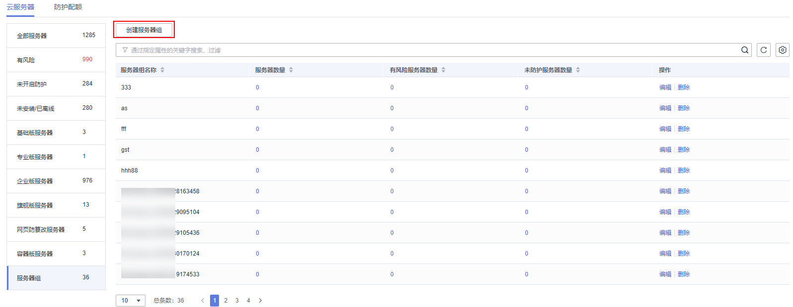
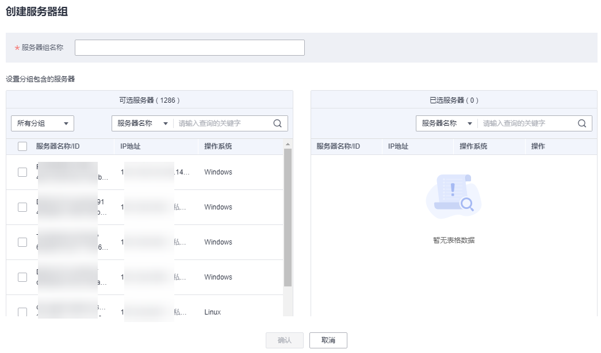
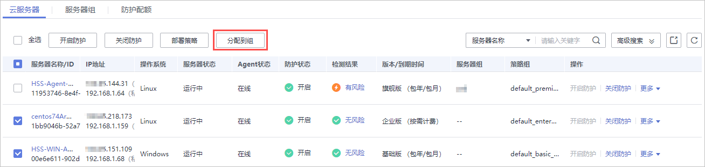

# 创建服务器组

用户可以创建服务器组，并将主机分配到服务器组，将主机进行分类管理。用户可以根据创建的服务器组，查看该服务器组内的服务器数量、有风险服务器的数量、以及未防护的服务器数量。

1.  [登录管理控制台](https://console.huaweicloud.com)。

1.  在页面左上角选择“区域“，单击，选择“安全  \>  企业主机安全“，进入企业主机安全页面。

    **图 1**  企业主机安全  
    

2.  在左侧导航树中，选择“主机管理“，在“服务器组“界面，单击“创建服务器组“，如[图2](#fig10693430191517)所示。

    **图 2**  进入服务器组页面  
    

3.  在弹出的“创建服务器组“对话框中，输入“服务器组名称“，并设置服务器组中包含的云服务器，如[图3](#f35b7207dd85e4e38b7714eb2429cf236)所示。

    > **说明：** 
    >-   服务器组名称不能重复，如果尝试填写的服务器组名称重复，操作将会失败。
    >-   “服务器组名称“不能包含空格，只能包含字母、数字、下划线、中划线、点、星号（\*）、加号（+）；且内容长度不能超过64个字符。

    **图 3**  创建服务器组  
    

4.  设置完成后，单击“确定“，完成服务器组的创建。

## 分配服务器到组

若服务器没有被分配到服务器组，您可以将服务器分配到已创建的服务器组。

1.  单击“云服务器“，进入云服务器列表界面。
2.  选中需要分配到服务器组的一台或多台云服务器，单击“分配到组“ ，将云服务器分配到服务器组，如[图4](#fdd10d71656e54ca5bc36ddd1fed11e46)所示。

    **图 4**  分配到服务器组  
    

    > **说明：** 
    >您也可以在云服务器所在行的操作列，单击“更多“，然后单击“分配到组“，分配云服务器到服务器组。

3.  在弹出的对话框中，选择服务器组后，单击“确定“，完成分配云服务器到服务器组的操作。

    > **说明：** 
    >一个云服务器只能分配到一个服务器组。

## 相关操作

**编辑服务器组**

1.  在待修改的服务器组所在行的操作列，单击“编辑“，修改服务器组。
2.  在弹出的对话框中，重新设置分组包含的云服务器。
3.  完成修改后，单击“确定“，完成服务器组的修改。

**查看服务器组**

在服务器组列表中，单击服务组的名称，可以查看服务器组中主机的状态、Agent状态、防护状态、检测结果等信息。

**删除服务器组**

在需要删除的服务器组所在行的“操作“列，单击“删除“，删除单个服务器组。

服务器组被删除后，隶属于该服务器组的所有云服务器将被划分到“未分组“中。

