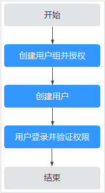

# 创建用户并授权使用HSS

如果您需要对您所拥有的HSS进行精细的权限管理，您可以使用[统一身份认证服务](https://support.huaweicloud.com/usermanual-iam/iam_01_0001.html)（Identity and Access Management，简称IAM），通过IAM，您可以：

-   根据企业的业务组织，在您的华为云账号中，给企业中不同职能部门的员工创建IAM用户，让员工拥有唯一安全凭证，并使用HSS资源。
-   根据企业用户的职能，设置不同的访问权限，以达到用户之间的权限隔离。
-   将HSS资源委托给更专业、高效的其他华为云账号或者云服务，这些账号或者云服务可以根据权限进行代运维。

如果华为云账号已经能满足您的要求，不需要创建独立的IAM用户，您可以跳过本章节，不影响您使用HSS服务的其它功能。

本章节为您介绍对用户授权的方法，操作流程如[图1](#fig392404973213)所示。

## 前提条件

给用户组授权之前，请您了解用户组可以添加的HSS权限，并结合实际需求进行选择，HSS系统策略如[表1](#table1990914124510)所示。若您需要对除HSS之外的其它服务授权，IAM支持服务的所有权限请参见[系统权限](https://support.huaweicloud.com/permissions/policy_list.html?product=hss)。

**表 1**  HSS系统权限

<table><thead align="left"><tr id="zh-cn_topic_0187145412_row2767163082017"><th class="cellrowborder" valign="top" width="18.871887188718873%" id="mcps1.2.5.1.1">
系统角色/策略名称

</th>
<th class="cellrowborder" valign="top" width="21.752175217521753%" id="mcps1.2.5.1.2">
描述

</th>
<th class="cellrowborder" valign="top" width="9.990999099909992%" id="mcps1.2.5.1.3">
类别

</th>
<th class="cellrowborder" valign="top" width="49.38493849384938%" id="mcps1.2.5.1.4">
依赖关系

</th>
</tr>
</thead>
<tbody><tr id="zh-cn_topic_0187145412_row1276712300207"><td class="cellrowborder" valign="top" width="18.871887188718873%" headers="mcps1.2.5.1.1 ">
HSS Administrator

</td>
<td class="cellrowborder" valign="top" width="21.752175217521753%" headers="mcps1.2.5.1.2 ">
企业主机安全服务（HSS）管理员，拥有该服务下的所有权限。

</td>
<td class="cellrowborder" valign="top" width="9.990999099909992%" headers="mcps1.2.5.1.3 ">
系统角色

</td>
<td class="cellrowborder" valign="top" width="49.38493849384938%" headers="mcps1.2.5.1.4 "><ul id="zh-cn_topic_0187145412_ul1546516411202"><li>依赖Tenant Guest角色。
Tenant Guest：全局级角色，在全局项目中勾选。

</li><li>购买HSS防护配额需要同时具有ECS ReadOnlyAccess和BSS Administrator角色。<ul id="zh-cn_topic_0187145412_ul060520367114"><li>ECS ReadOnlyAccess：系统策略，弹性云服务器的只读访问权限。</li><li>BSS Administrator：系统角色，费用中心（BSS）管理员，拥有该服务下的所有权限。</li></ul>
</li></ul>
</td>
</tr>
<tr id="zh-cn_topic_0187145412_row4708123532810"><td class="cellrowborder" valign="top" width="18.871887188718873%" headers="mcps1.2.5.1.1 ">
HSS FullAccess

</td>
<td class="cellrowborder" valign="top" width="21.752175217521753%" headers="mcps1.2.5.1.2 ">
企业主机安全服务所有权限。

</td>
<td class="cellrowborder" valign="top" width="9.990999099909992%" headers="mcps1.2.5.1.3 ">
系统策略

</td>
<td class="cellrowborder" valign="top" width="49.38493849384938%" headers="mcps1.2.5.1.4 ">
购买HSS防护配额需要具有BSS Administrator角色。

BSS Administrator：系统角色，费用中心（BSS）管理员，拥有该服务下的所有权限。

</td>
</tr>
<tr id="zh-cn_topic_0187145412_row13720637112819"><td class="cellrowborder" valign="top" width="18.871887188718873%" headers="mcps1.2.5.1.1 ">
HSS ReadOnlyAccess

</td>
<td class="cellrowborder" valign="top" width="21.752175217521753%" headers="mcps1.2.5.1.2 ">
企业主机安全服务的只读访问权限。

</td>
<td class="cellrowborder" valign="top" width="9.990999099909992%" headers="mcps1.2.5.1.3 ">
系统策略

</td>
<td class="cellrowborder" valign="top" width="49.38493849384938%" headers="mcps1.2.5.1.4 ">
无

</td>
</tr>
</tbody>
</table>

## 示例流程

**图 1**  给用户授权服务权限流程  

1.  [创建用户组并授权](https://support.huaweicloud.com/usermanual-iam/iam_03_0001.html)。

    在IAM控制台创建用户组，并授予HSS服务的管理员权限“HSS Administrator“。

2.  [创建用户并加入用户组](https://support.huaweicloud.com/usermanual-iam/iam_02_0001.html)。

    在IAM控制台创建用户，并将其加入[1](#li1761173372710)中创建的用户组。

3.  [用户登录](https://support.huaweicloud.com/usermanual-iam/iam_01_0552.html)并验证权限。

    新创建的用户登录控制台，切换至授权区域，验证权限：

    在“服务列表“中选择除企业主机安全外（假设当前策略仅包含“HSS Administrator“）的任一服务，若提示权限不足，表示“HSS Administrator“已生效。

