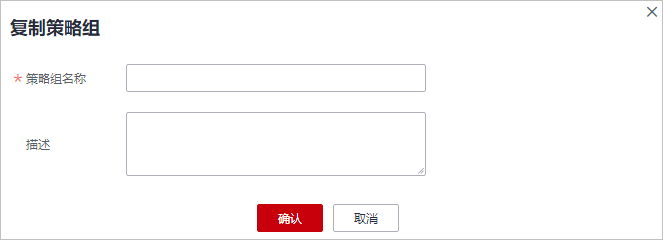

# 创建策略组

您可根据自己服务器不同使用情况创建对应的策略组，创建后可对目标服务器进行更有力的扫描检测。

## 前提条件

已开启旗舰版。

> **说明：** 
>目前仅支持对旗舰版的策略组进行自定义创建，若没有开启旗舰版防护的主机，创建后不会生效。

## 创建策略组

以下以旗舰版的Linux策略为例。

1.  [登录管理控制台](https://console.huaweicloud.com/?locale=zh-cn)。
2.  在页面左上角选择“区域“，单击，选择“安全与合规 \> 主机安全服务”，进入主机安全平台界面。

    **图 1**  进入主机安全  
    

3.  在左侧导航栏，选择“安全运营  \>  策略管理“，进入“策略管理“界面，查看显示的策略组，字段说明如[表1](#hss_01_0045_t801bc5e996a743dd8e2bfeb480ff1ca8)所示。

    > **说明：** 
    >-   tenant\_linux\_advanced\_default\_policy\_group：专业版linux系统预置策略，仅可被查看，不可复制和删除。
    >-   tenant\_windows\_advanced\_default\_policy\_group：专业版windows系统预置策略，仅可被查看，不可被复制和删除。
    >-   tenant\_linux\_container\_default\_policy\_group：容器版linux系统预置策略，仅可被查看，不可复制和删除。
    >-   tenant\_linux\_enterprise\_default\_policy\_group：企业版linux系统预置策略，仅可被查看，不可被复制和删除。
    >-   tenant\_windows\_enterprise\_default\_policy\_group：企业版windows系统预置策略，仅可被查看，不可被复制和删除。
    >-   tenant\_linux\_premium\_default\_policy\_group：旗舰版linux系统预置策略，可通过复制该策略组来创建新的策略组。
    >-   tenant\_windows\_premium\_default\_policy\_group：旗舰版windows系统预置策略，可通过复制该策略组来创建新的策略组。
    >-   wtp\_主机名称：网页防篡改版策略，每台主机开启网页防篡改防护时都会默认生成对应的网页防篡改策略组。
    >-   可在列表右上角单击，手动刷新当前列表。
    >-   可单击关联服务器数的数量，查看策略组关联的服务器。

    **表 1**  策略组列表字段说明

    
    <table><thead align="left"><tr id="hss_01_0045_r31c93826ed3e4bd59b563dbc8df14166"><th class="cellrowborder" valign="top" width="25.55%" id="mcps1.2.3.1.1">
字段

    </th>
    <th class="cellrowborder" valign="top" width="74.45%" id="mcps1.2.3.1.2">
说明

    </th>
    </tr>
    </thead>
    <tbody><tr id="hss_01_0045_r488e363dd1d646998c450b4980a148a8"><td class="cellrowborder" valign="top" width="25.55%" headers="mcps1.2.3.1.1 ">
策略组名称

    </td>
    <td class="cellrowborder" valign="top" width="74.45%" headers="mcps1.2.3.1.2 ">
策略组的名称。

    </td>
    </tr>
    <tr id="hss_01_0045_row190113370416"><td class="cellrowborder" valign="top" width="25.55%" headers="mcps1.2.3.1.1 ">
ID

    </td>
    <td class="cellrowborder" valign="top" width="74.45%" headers="mcps1.2.3.1.2 ">
策略组的ID号，对策略组的唯一标识。

    </td>
    </tr>
    <tr id="hss_01_0045_r43f1c22e0b5a4a22b201b6ab5806378b"><td class="cellrowborder" valign="top" width="25.55%" headers="mcps1.2.3.1.1 ">
描述

    </td>
    <td class="cellrowborder" valign="top" width="74.45%" headers="mcps1.2.3.1.2 ">
对策略组的描述。

    </td>
    </tr>
    <tr id="hss_01_0045_row55761411057"><td class="cellrowborder" valign="top" width="25.55%" headers="mcps1.2.3.1.1 ">
支持的版本

    </td>
    <td class="cellrowborder" valign="top" width="74.45%" headers="mcps1.2.3.1.2 ">
策略组支持的主机安全服务的版本。

    </td>
    </tr>
    <tr id="hss_01_0045_row1149714341192"><td class="cellrowborder" valign="top" width="25.55%" headers="mcps1.2.3.1.1 ">
支持的操作系统

    </td>
    <td class="cellrowborder" valign="top" width="74.45%" headers="mcps1.2.3.1.2 ">
策略支持的操作系统类型。

    </td>
    </tr>
    <tr id="hss_01_0045_row1880233816911"><td class="cellrowborder" valign="top" width="25.55%" headers="mcps1.2.3.1.1 ">
关联服务器数

    </td>
    <td class="cellrowborder" valign="top" width="74.45%" headers="mcps1.2.3.1.2 ">
策略关联的服务器数。

    </td>
    </tr>
    </tbody>
    </table>

4.  选择tenant\_linux\_premium\_default\_policy\_group或tenant\_windows\_premium\_default\_policy\_group策略组，单击该策略组“操作“列的“复制“。

    以下以Linux策略组为例。

    **图 2**  复制策略组  
    

5.  在弹出的对话框中，输入“策略组名称“和“描述“。

    > **说明：** 
    >-   策略组的名称不能重复，如果尝试通过复制来创建一个同名的策略组，将会失败。
    >-   “策略组名称“和“描述“只能包含中文、字母、数字、下划线、中划线、空格，并且首尾不能为空格。

    **图 3**  创建策略组  
    

6.  单击“确认“，将会创建一个新的策略组。
7.  单击已创建的策略组名称，进入策略组的策略页面。
8.  单击策略名称，修改具体的策略内容，详细信息请参见[编辑策略内容](编辑策略内容.md)。
9.  策略内容修改完成后，单击策略所在行的“开启“或者“关闭“，开启或者关闭对应的策略。

## 相关操作

**删除策略组**

若被删除的策略组已经部署给了主机，在策略组被删除后，这些主机的策略组信息将被设置为“无“。

1.  进入“策略管理“列表界面，可对策略进行单项删除或批量删除。

    **图 4**  删除策略组列表  
    

    > **说明：** 
    >单项删除策略：在需要删除的策略组所在行的“操作”列中，单击“删除“，删除单个策略组。
    >批量删除策略：勾选多个策略名称前的选框，单击上方的“删除“，删除多个策略组。

2.  在弹出对话框中，单击“确定“，完成策略组的删除。

