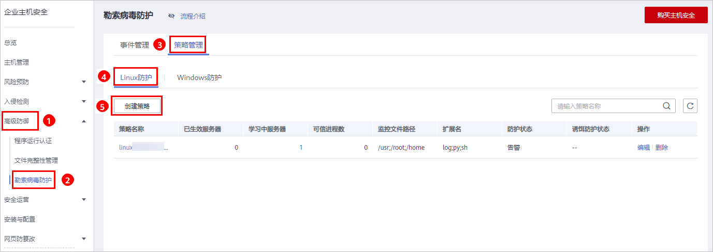
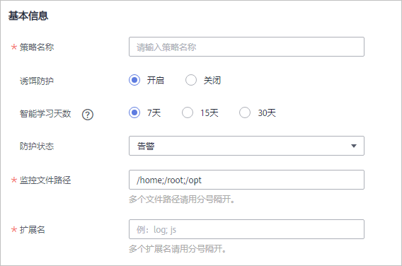
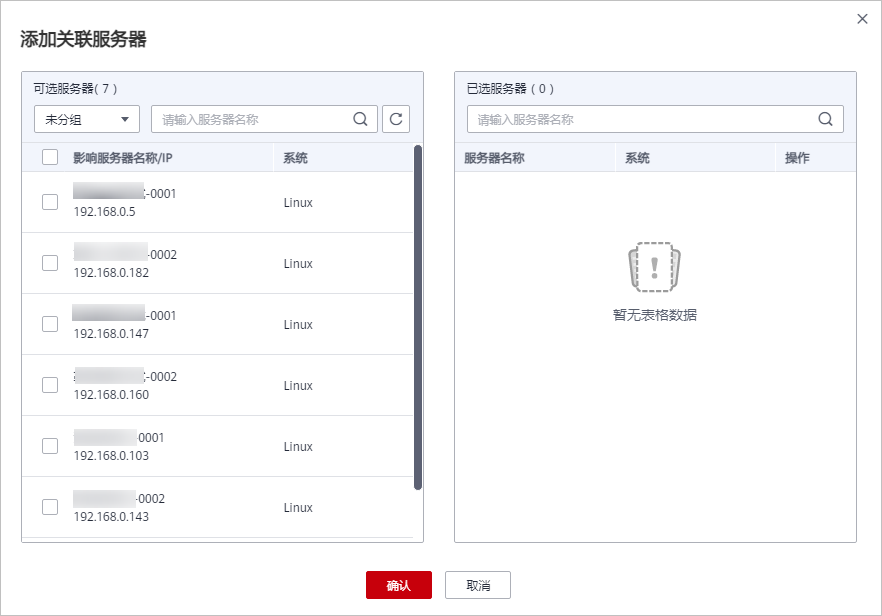
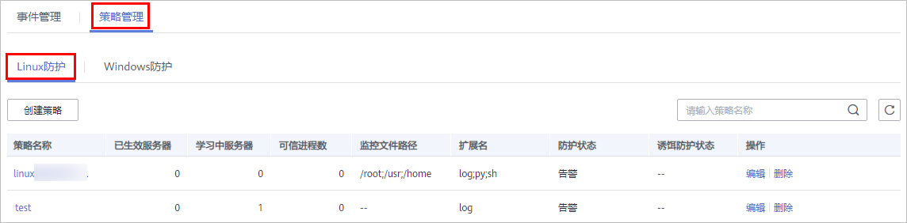
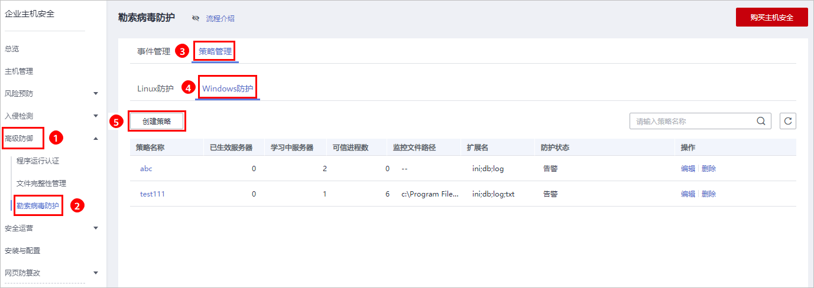
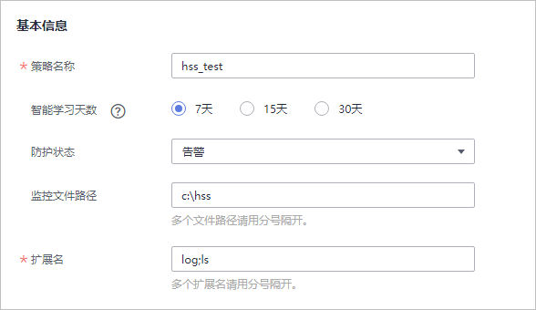
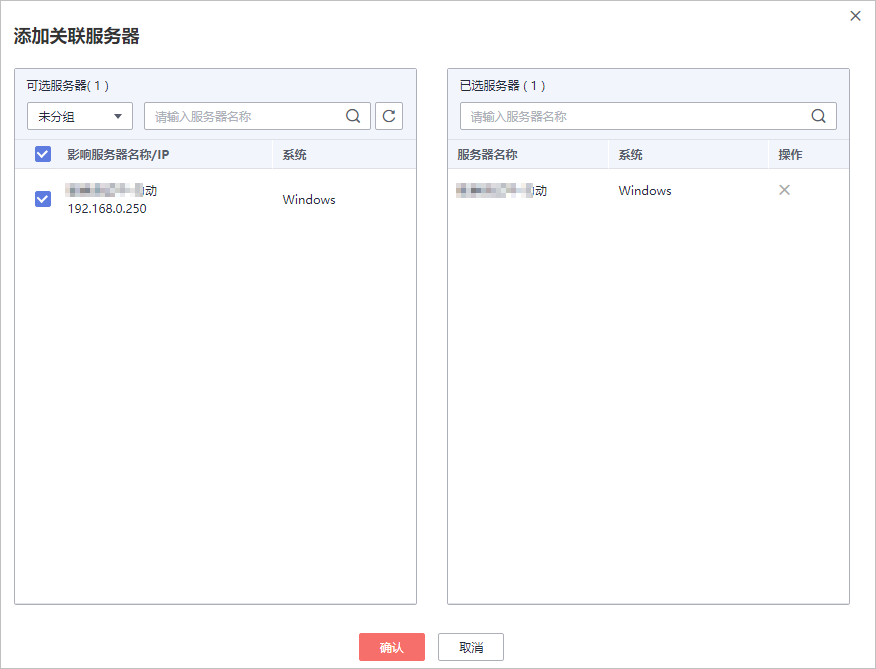
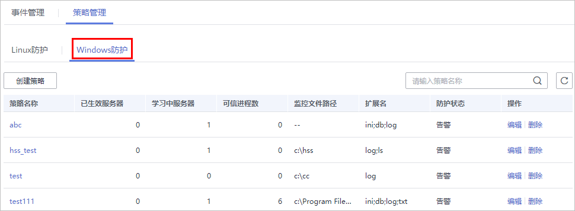

# 创建防护策略

为了防止您的主机被勒索病毒侵害，请创建防护策略，将重点防御的文件添加到防护策略的监控路径中，并启动机器学习。

机器学习会自动聚类并收集该策略下的所有服务器的正常进程行为数据。该策略下的不可信进程行为和非该策略下的进程行为对监控文件路径下的文件执行文件操作，HSS会根据策略设置的防护状态，触发告警。

## 前提条件

-   已开启“旗舰版“或“网页防篡改版“主机安全防护。
-   Linux主机的“Agent状态“为“在线“。

## 创建Linux防护策略

1.  [登录管理控制台](https://console.huaweicloud.com)。
2.  在页面左上角选择“区域“，单击，选择“安全与合规  \>  企业主机安全“，进入企业主机安全页面。

    **图 1**  企业主机安全  
    

3.  进入“勒索病毒防护“页面，单击“创建策略“，创建Linux防护策略，如[图2](#fig32112468429)所示。

    **图 2**  Linux防护策略管理页面  
    

4.  配置Linux防护策略基本信息，如[图3](#fig18211154624217)所示。

    **图 3**  配置Linux防护策略  
    

    **表 1**  策略基本信息说明

    
    <table><thead align="left"><tr id="row8211124613422"><th class="cellrowborder" valign="top" width="16.81%" id="mcps1.2.3.1.1">
参数

    </th>
    <th class="cellrowborder" valign="top" width="83.19%" id="mcps1.2.3.1.2">
参数说明

    </th>
    </tr>
    </thead>
    <tbody><tr id="row1921118463427"><td class="cellrowborder" valign="top" width="16.81%" headers="mcps1.2.3.1.1 ">
策略名称

    </td>
    <td class="cellrowborder" valign="top" width="83.19%" headers="mcps1.2.3.1.2 ">
创建的勒索病毒防护策略的策略名称。

    </td>
    </tr>
    <tr id="row2238185710474"><td class="cellrowborder" valign="top" width="16.81%" headers="mcps1.2.3.1.1 ">
诱饵防护

    </td>
    <td class="cellrowborder" valign="top" width="83.19%" headers="mcps1.2.3.1.2 ">
开启诱饵防护后，HSS将会在关联服务器中预置诱饵文件，帮助您实时诱捕新型未知的勒索病毒。

    </td>
    </tr>
    <tr id="row5211194694215"><td class="cellrowborder" valign="top" width="16.81%" headers="mcps1.2.3.1.1 ">
智能学习天数

    </td>
    <td class="cellrowborder" valign="top" width="83.19%" headers="mcps1.2.3.1.2 ">
请根据您业务的场景选择智能学习的天数，您可以选择“7天”、“15天”或者“30天”。

    
智能学习功能是通过机器学习引擎学习服务器上的进程修改文件的行为。

    </td>
    </tr>
    <tr id="row72127462420"><td class="cellrowborder" valign="top" width="16.81%" headers="mcps1.2.3.1.1 ">
防护状态

    </td>
    <td class="cellrowborder" valign="top" width="83.19%" headers="mcps1.2.3.1.2 ">
告警：当检测到对设置的监控路径文件的不可信操作时，触发告警。

    </td>
    </tr>
    <tr id="row12212046104211"><td class="cellrowborder" valign="top" width="16.81%" headers="mcps1.2.3.1.1 ">
监控文件路径

    </td>
    <td class="cellrowborder" valign="top" width="83.19%" headers="mcps1.2.3.1.2 ">
监控的文件的路径，多个文件以分号分隔。监控填写的路径下的文件操作。

    
例 ：/opt;/opt/sap

    
 说明： 

若是防护所有路径，可设置为“--”，但建议配置关键文件的具体路径即可。

    

    </td>
    </tr>
    <tr id="row18212154624216"><td class="cellrowborder" valign="top" width="16.81%" headers="mcps1.2.3.1.1 ">
扩展名

    </td>
    <td class="cellrowborder" valign="top" width="83.19%" headers="mcps1.2.3.1.2 ">
检测监控路径下包含文件扩展名的所有文件，多个扩展名以分号分隔。

    
例：sql;txt;sh

    </td>
    </tr>
    </tbody>
    </table>

5.  单击“添加服务器“，在弹出的“添加关联服务器“的窗口中，选择关联服务器，如[图4](#fig14212144610421)所示。

    **图 4**  添加Linux关联服务器  
    

6.  添加完成关联服务器后，单击“确认“，完成关联服务器的添加。

    > **说明：** 
    >-   您可以查看添加的关联服务器的“服务器名称“、“IP地址“和“系统“。
    >-   您也可以根据需要在关联服务器的“操作“列，单击“删除“，删除不需要的关联服务器。

7.  完成关联服务器添加后，单击“创建并学习“，完成Linux防护策略的创建。

    Linux防护策略创建完成后，该策略的详情将会自动展示在策略管理列表中，如[图5](#fig621314466427)所示。

    **图 5**  Linux防护策略列表  
    

    **表 2**  策略管理列表说明

    
    <table><thead align="left"><tr id="row321374614427"><th class="cellrowborder" valign="top" width="16.79%" id="mcps1.2.3.1.1">
参数

    </th>
    <th class="cellrowborder" valign="top" width="83.21%" id="mcps1.2.3.1.2">
参数说明

    </th>
    </tr>
    </thead>
    <tbody><tr id="row12213114624216"><td class="cellrowborder" valign="top" width="16.79%" headers="mcps1.2.3.1.1 ">
策略名称

    </td>
    <td class="cellrowborder" valign="top" width="83.21%" headers="mcps1.2.3.1.2 ">
创建的智能学习策略的策略名称。

    </td>
    </tr>
    <tr id="row2213164610422"><td class="cellrowborder" valign="top" width="16.79%" headers="mcps1.2.3.1.1 ">
已生效服务器

    </td>
    <td class="cellrowborder" valign="top" width="83.21%" headers="mcps1.2.3.1.2 ">
应用该智能学习策略的服务器数量。

    </td>
    </tr>
    <tr id="row8213246114214"><td class="cellrowborder" valign="top" width="16.79%" headers="mcps1.2.3.1.1 ">
学习中服务器

    </td>
    <td class="cellrowborder" valign="top" width="83.21%" headers="mcps1.2.3.1.2 ">
学习该策略的服务器数量。

    </td>
    </tr>
    <tr id="row19213164664213"><td class="cellrowborder" valign="top" width="16.79%" headers="mcps1.2.3.1.1 ">
可信进程数

    </td>
    <td class="cellrowborder" valign="top" width="83.21%" headers="mcps1.2.3.1.2 ">
智能学习策略生效后，HSS会自动识别您服务器中进程的可信进程，并统计可信进程的数量。

    </td>
    </tr>
    <tr id="row162135469429"><td class="cellrowborder" valign="top" width="16.79%" headers="mcps1.2.3.1.1 ">
监控文件路径

    </td>
    <td class="cellrowborder" valign="top" width="83.21%" headers="mcps1.2.3.1.2 ">
监控的文件的路径。

    </td>
    </tr>
    <tr id="row22141446174216"><td class="cellrowborder" valign="top" width="16.79%" headers="mcps1.2.3.1.1 ">
扩展名

    </td>
    <td class="cellrowborder" valign="top" width="83.21%" headers="mcps1.2.3.1.2 ">
检测监控路径下包含文件扩展名的所有文件。

    </td>
    </tr>
    <tr id="row72141546134217"><td class="cellrowborder" valign="top" width="16.79%" headers="mcps1.2.3.1.1 ">
防护状态

    

    </td>
    <td class="cellrowborder" valign="top" width="83.21%" headers="mcps1.2.3.1.2 ">
使用该策略的服务器的防护状态。

    
告警：当检测到对设置的监控路径文件的不可信操作时，触发告警。

    </td>
    </tr>
    <tr id="row63681732194716"><td class="cellrowborder" valign="top" width="16.79%" headers="mcps1.2.3.1.1 ">
诱饵防护状态

    </td>
    <td class="cellrowborder" valign="top" width="83.21%" headers="mcps1.2.3.1.2 "><ul id="ul6322115418490"><li>开启：诱饵防护为开启状态，HSS在关联服务器中预置诱饵文件，发现未知勒索病毒加密诱饵文件的行为，立即告警。</li><li>关闭：诱饵防护为关闭状态。</li></ul>
    </td>
    </tr>
    </tbody>
    </table>

## 创建Windows防护策略

1.  [登录管理控制台](https://console.huaweicloud.com)。
2.  在页面左上角选择“区域“，单击，选择“安全与合规  \>  企业主机安全“，进入企业主机安全页面。

    **图 6**  企业主机安全  
    

3.  进入“勒索病毒防护“页面，单击“创建策略“，创建Windows防护策略，如[图7](#fig1323712545317)所示。

    **图 7**  Windows防护策略管理页面  
    

4.  配置勒索病毒防护策略基本信息，如[图8](#fig6211359171819)所示。

    **图 8**  配置Windows防护策略  
    

    **表 3**  策略基本信息说明

    
    <table><thead align="left"><tr id="row112518833114"><th class="cellrowborder" valign="top" width="24.03%" id="mcps1.2.3.1.1">
参数

    </th>
    <th class="cellrowborder" valign="top" width="75.97%" id="mcps1.2.3.1.2">
参数说明

    </th>
    </tr>
    </thead>
    <tbody><tr id="row6125188193114"><td class="cellrowborder" valign="top" width="24.03%" headers="mcps1.2.3.1.1 ">
策略名称

    </td>
    <td class="cellrowborder" valign="top" width="75.97%" headers="mcps1.2.3.1.2 ">
创建的勒索病毒防护策略的策略名称。

    </td>
    </tr>
    <tr id="row1112513813312"><td class="cellrowborder" valign="top" width="24.03%" headers="mcps1.2.3.1.1 ">
智能学习天数

    </td>
    <td class="cellrowborder" valign="top" width="75.97%" headers="mcps1.2.3.1.2 ">
请根据您业务的场景选择智能学习的天数，您可以选择“7天”、“15天”或者“30天”。

    
智能学习功能是通过机器学习引擎学习服务器上的进程修改文件的行为。

    </td>
    </tr>
    <tr id="row5125385312"><td class="cellrowborder" valign="top" width="24.03%" headers="mcps1.2.3.1.1 ">
防护状态

    </td>
    <td class="cellrowborder" valign="top" width="75.97%" headers="mcps1.2.3.1.2 ">
告警：当检测到对设置的监控路径文件的不可信操作时，触发告警。

    </td>
    </tr>
    <tr id="row1112520883118"><td class="cellrowborder" valign="top" width="24.03%" headers="mcps1.2.3.1.1 ">
监控文件路径

    </td>
    <td class="cellrowborder" valign="top" width="75.97%" headers="mcps1.2.3.1.2 ">
监控的文件的路径，多个文件以分号分隔。监控填写的路径下的文件操作。

    
如果不填写监控文件路径，HSS会监控主机上所有的文件路径。

    </td>
    </tr>
    <tr id="row1125148153114"><td class="cellrowborder" valign="top" width="24.03%" headers="mcps1.2.3.1.1 ">
扩展名

    </td>
    <td class="cellrowborder" valign="top" width="75.97%" headers="mcps1.2.3.1.2 ">
检测监控路径下包含文件扩展名的所有文件，多个扩展名以分号分隔。

    </td>
    </tr>
    </tbody>
    </table>

5.  单击“添加服务器“，在弹出的“添加关联服务器“的窗口中，选择关联服务器，如[图9](#fig109856314)所示。

    **图 9**  添加Windows关联服务器  
    

6.  添加完成关联服务器后，单击“确认“，完成关联服务器的添加。

    > **说明：** 
    >-   您可以查看添加的关联服务器的“服务器名称“、“IP地址“和“系统“。
    >-   您也可以根据需要在关联服务器的“操作“列，单击“删除“，删除不需要的关联服务器。

7.  完成关联服务器添加后，单击“创建并学习“，完成Windows防护策略的创建。

    Windows防护策略创建完成后，该策略的详情将会自动展示在策略管理列表中，如[图10](#fig1148371314329)所示。

    **图 10**  Windows防护策略管理列表  
    

    **表 4**  策略管理列表说明

    
    <table><thead align="left"><tr id="row48878349325"><th class="cellrowborder" valign="top" width="16.79%" id="mcps1.2.3.1.1">
参数

    </th>
    <th class="cellrowborder" valign="top" width="83.21%" id="mcps1.2.3.1.2">
参数说明

    </th>
    </tr>
    </thead>
    <tbody><tr id="row1388703403213"><td class="cellrowborder" valign="top" width="16.79%" headers="mcps1.2.3.1.1 ">
策略名称

    </td>
    <td class="cellrowborder" valign="top" width="83.21%" headers="mcps1.2.3.1.2 ">
创建的智能学习策略的策略名称。

    </td>
    </tr>
    <tr id="row08871634103216"><td class="cellrowborder" valign="top" width="16.79%" headers="mcps1.2.3.1.1 ">
已生效服务器

    </td>
    <td class="cellrowborder" valign="top" width="83.21%" headers="mcps1.2.3.1.2 ">
应用该智能学习策略的服务器数量。

    </td>
    </tr>
    <tr id="row15473233122"><td class="cellrowborder" valign="top" width="16.79%" headers="mcps1.2.3.1.1 ">
学习中服务器

    </td>
    <td class="cellrowborder" valign="top" width="83.21%" headers="mcps1.2.3.1.2 ">
学习该策略的服务器数量。

    </td>
    </tr>
    <tr id="row1785515551036"><td class="cellrowborder" valign="top" width="16.79%" headers="mcps1.2.3.1.1 ">
可信进程数

    </td>
    <td class="cellrowborder" valign="top" width="83.21%" headers="mcps1.2.3.1.2 ">
智能学习策略生效后，HSS会自动识别您服务器中进程的可信进程，并统计可信进程的数量。

    </td>
    </tr>
    <tr id="row7720131541216"><td class="cellrowborder" valign="top" width="16.79%" headers="mcps1.2.3.1.1 ">
监控文件路径

    </td>
    <td class="cellrowborder" valign="top" width="83.21%" headers="mcps1.2.3.1.2 ">
监控的文件的路径，多个文件以分号分隔。监控该路径下的文件操作。

    
如果监控文件路径为“--”，表示HSS会监控主机上所有的文件路径。

    </td>
    </tr>
    <tr id="row162711141132"><td class="cellrowborder" valign="top" width="16.79%" headers="mcps1.2.3.1.1 ">
扩展名

    </td>
    <td class="cellrowborder" valign="top" width="83.21%" headers="mcps1.2.3.1.2 ">
检测监控路径下包含文件扩展名的所有文件，多个扩展名以分号分隔。

    </td>
    </tr>
    <tr id="row6870111041319"><td class="cellrowborder" valign="top" width="16.79%" headers="mcps1.2.3.1.1 ">
防护状态

    

    </td>
    <td class="cellrowborder" valign="top" width="83.21%" headers="mcps1.2.3.1.2 ">
使用该策略的服务器的防护状态。

    
告警：当检测到对设置的监控路径文件的不可信操作时，触发告警。

    </td>
    </tr>
    </tbody>
    </table>

