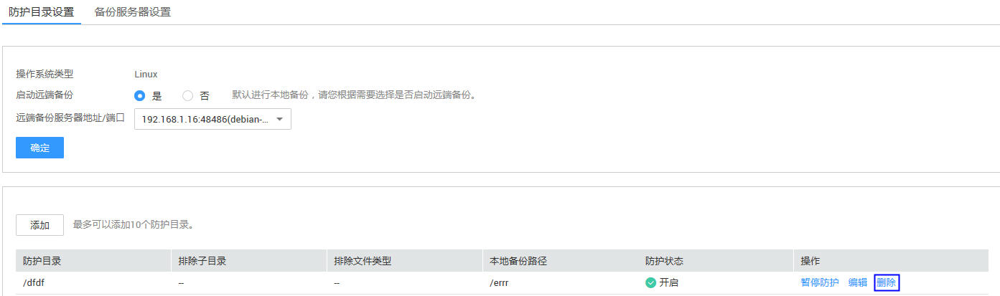

# 删除防护目录

该章节指导用户删除防护记录。

## 前提条件

-   已获取管理控制台的登录账号与密码。
-   弹性云服务器的“Agent状态“为“在线“且“防护状态“为“关闭“。

## 操作步骤

1.  登录管理控制台。
2.  在页面上方，单击“服务列表“，选择“安全  \>  企业主机安全“。
3.  在左侧导航树中，选择“网页防篡改“，进入网页防篡改界面。
4.  在“网页防篡改“界面，选择“主机列表“页签，进入云服务列表页面。
5.  在待删除防护目录的弹性云服务器所在行的操作列中，单击“防护设置“，进入“防护设置“界面。

    **图 1**  删除防护目录  
    

6.  在待删除防护目录所在行的操作列，单击“删除“。

    > **说明：**   
    >-   如果需要编辑防护目录，在待编辑防护目录所在行的操作列，单击“编辑“。  
    >-   在防护目录的操作列，单击“暂停防护“或者“恢复防护“，可以根据需要切换防护模式。  

7.  在弹出的“删除防护目录“对话框中，单击“确定“，完成删除防护目录操作。

