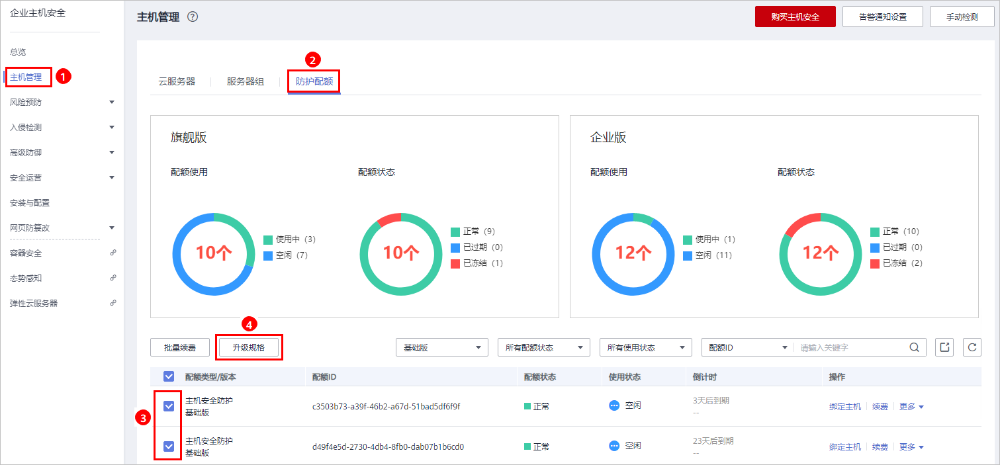

# 升级配额版本

若您当前的防护配额的版本无法满足您的业务需求，您可以根据需要将企业主机安全服务的版本升级为“企业版“、“旗舰版“或者“网页防篡改版“。

## 前提条件

-   已获取管理控制台的登录账号（拥有HSS Administrator与BSS Administrator权限）与密码。
-   已购买“基础版“或者“企业版“防护配额。
-   待升级的防护配额的“配额状态“为“正常“，“使用状态“为“空闲“。
-   多个防护配额同时升级时，请确保待升级的防护配额为相同的版本。

## 升级版本

1.  [登录管理控制台](https://console.huaweicloud.com)。
2.  在页面左上角选择“区域“，单击，选择“安全与合规  \>  企业主机安全“，进入企业主机安全页面。

    **图 1**  企业主机安全  
    

3.  在左侧导航栏中，选择“主机管理  \>  防护配额“，勾选待升级的配额，单击“升级规格“，如[图2](#fig556182413233)所示。

    **图 2**  升级规格  
    

4.  在“主机安全配额升级规格“页面，设置升级后的规格。
    1.  选择升级后的规格

        支持升级为“企业版“、“旗舰版“和“网页防篡改版“。版本之间的差异请参见[服务版本差异](https://support.huaweicloud.com/productdesc-hss/hss_01_0136.html)。

        请根据您已购买的版本，选择升级后的规格。

        -   “基础版“

            可以升级为“企业版“、“旗舰版“或者“网页防篡改版“。

        -   “企业版“

            可以升级为“旗舰版“或者“网页防篡改版“。

    2.  需要升级规格的主机安全配额
        -   请确认需要升级规格的防护配额的“当前区域“、“当前计费模式“、“当前规格“和“升级后规格“无误。
        -   处理无法进行升级操作的防护配额后，才能提交升级规格任务。
            -   若主机安全配额处于“已过期“或者“已冻结“状态，无法进行升级操作。

                请先进行移除或者续订。

            -   若主机安全配额处于“使用中“状态，无法进行升级操作。

                在不影响业务场景的情况下，您可以选择“允许升级时了关闭防护“，或者移除。

                > **说明：** 
                >升级规格时关闭防护可能会造成当前云服务器业务中断，请谨慎操作。

5.  在页面右下角，单击“立即购买“，进入“详情“界面。

    费率标准请参见[产品价格详情](https://www.huaweicloud.com/price_detail.html#/hss_detail)。

6.  确认订单无误后，请阅读并勾选“我已阅读并同意《企业主机安全免责声明》“。
7.  单击“去支付“，进入“付款“页面，付款后，完成主机安全配额的升级规格操作。

