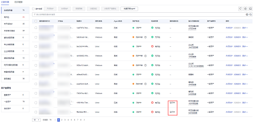

# 单服务器一键安装Agent<a name="hss_01_0521"></a>

如果您需要开启安全防护的Linux服务器所属VPC内已有一台Agent在线的服务器时，可参考本文为Linux服务器一键安装Agent。

## 前提条件<a name="section279416111447"></a>

-   待安装Agent的Linux服务器所属VPC内已有一台Agent在线的服务器。
-   待安装Agent的Linux服务器支持ssh登录。
-   已获取待安装Agent的Linux服务器正确的登录账号、端口、密码。
-   待安装Agent的Linux服务器“状态“为“运行中“。

## 约束限制<a name="section25844312920"></a>

-   主机安全服务Agent支持的操作系统请参见[支持的操作系统](https://support.huaweicloud.com/productdesc-hss2.0/hss_01_0137.html#section2)。
-   目前仅支持为Linux服务器进行一键安装Agent，如果您需要为Windows服务器安装Agent请参考[安装Windows版本Agent](安装Windows版本Agent.md)。

## 操作步骤<a name="section5540837121319"></a>

1.  [登录管理控制台](https://console.huaweicloud.com/?locale=zh-cn)。
2.  在页面左上角选择“区域“，单击，选择“安全与合规 \> 主机安全服务”，进入主机安全平台界面。

    **图 1**  进入主机安全<a name="hss_01_0234_fig1855613765114"></a>  
    

1.  在左侧导航栏，选择“资产管理  \>  主机管理“，进入“主机管理“界面，选择“云服务器“页签，进入云服务器页面。

    > **说明：** 
    >如果您的服务器已通过企业项目的模式进行管理，您可选择目标“企业项目“后查看或操作目标企业项目内的资产和检测信息。

    **图 2**  进入云服务器<a name="fig8558122914125"></a>  
    

2.  在待安装Agent的Linux服务器所在行的“Agent状态“列，单击“安装Agent“。

    > **须知：** 
    >-   待安装Agent的Linux服务器状态必须为“运行中“。
    >-   待安装Agent的Linux服务器所属VPC内至少有一台服务器已安装Agent，否则将安装失败。

3.  输入“服务器root密码“和“服务器登录端口“。

    > **说明：** 
    >系统默认系统端口为22，若需查询Linux SSH端口，远程登录目标服务器后，在Linux服务器中执行以下命令即可查询。
    >```
    >cat /etc/ssh/sshd_config | grep Port
    >```

4.  单击“确认“，服务器将自动执行Agent安装。

    当“Agent状态“显示为“在线“，表示Agent安装成功。

