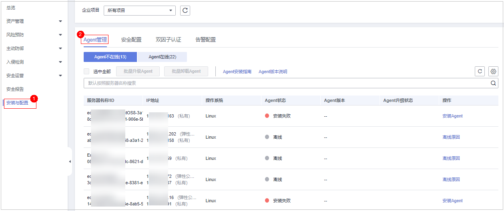
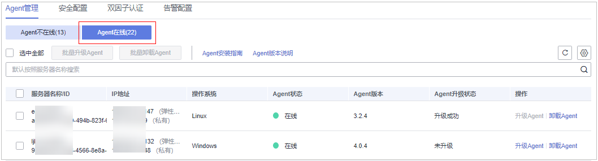

# 卸载Agent

如果不再需要HSS为您的服务器提供防护，您可以参照本文卸载Agent，Agent卸载后HSS将停止对服务器的检测和防护。

## 卸载方式说明

Agent支持控制台一键卸载和手动卸载两种方式，您可以根据实际情况选择合适的方式卸载Agent：

-   控制台一键卸载Agent：Agent状态为“在线“时，您可以通过控制台一键卸载Agent。
    -   [单服务器一键卸载Agent](#section15330601515)
    -   [批量服务器一键卸载Agent](#section20800551175514)

-   手动卸载Agent：Agent状态为“离线“时，您可以手动卸载Agent。
    -   [Linux服务器手动卸载Agent](#section06321616153418)
    -   [Windows服务器手动卸载Agent](#section63925445341)

## 单服务器一键卸载Agent

1.  [登录管理控制台](https://console.huaweicloud.com/?locale=zh-cn)。
2.  在页面左上角选择“区域“，单击，选择“安全与合规 \> 主机安全服务”，进入主机安全平台界面。

    **图 1**  进入主机安全  
    

3.  在左侧导航树选择“安装与配置  \>  Agent 管理“，进入Agent管理页面。

    > **说明：** 
    >如果您的服务器已通过企业项目的模式进行管理，您可选择目标“企业项目“后查看或操作目标企业项目内的资产和检测信息。

    **图 2**  进入Agent管理  
    

4.  选择“Agent在线（X）“，查看Agent已安装的服务器列表，详情请参见[表1](#table1926618704616)。

    **图 3**  查看Agent在线列表  
    

    **表 1**  Agent在线服务器列表参数说明

    
    <table><thead align="left"><tr id="row16266127154611"><th class="cellrowborder" valign="top" width="14.66%" id="mcps1.2.3.1.1">
参数名称

    </th>
    <th class="cellrowborder" valign="top" width="85.34%" id="mcps1.2.3.1.2">
参数说明

    </th>
    </tr>
    </thead>
    <tbody><tr id="row1226617104612"><td class="cellrowborder" valign="top" width="14.66%" headers="mcps1.2.3.1.1 ">
服务器名称/ID

    </td>
    <td class="cellrowborder" valign="top" width="85.34%" headers="mcps1.2.3.1.2 ">
服务器的名称和ID。

    </td>
    </tr>
    <tr id="row12661472469"><td class="cellrowborder" valign="top" width="14.66%" headers="mcps1.2.3.1.1 ">
IP地址

    </td>
    <td class="cellrowborder" valign="top" width="85.34%" headers="mcps1.2.3.1.2 ">
目标服务器所属的公网IP或私网IP。

    </td>
    </tr>
    <tr id="row112663754616"><td class="cellrowborder" valign="top" width="14.66%" headers="mcps1.2.3.1.1 ">
操作系统

    </td>
    <td class="cellrowborder" valign="top" width="85.34%" headers="mcps1.2.3.1.2 ">
目标服务器的操作系统。

    <ul id="ul7230182265511"><li>linux</li><li>windows</li></ul>
    </td>
    </tr>
    <tr id="row5266673467"><td class="cellrowborder" valign="top" width="14.66%" headers="mcps1.2.3.1.1 ">
Agent状态

    </td>
    <td class="cellrowborder" valign="top" width="85.34%" headers="mcps1.2.3.1.2 ">
目标服务器的Agent状态。

    <ul id="ul6395135214554"><li>在线</li></ul>
    </td>
    </tr>
    <tr id="row629412355911"><td class="cellrowborder" valign="top" width="14.66%" headers="mcps1.2.3.1.1 ">
Agent版本

    </td>
    <td class="cellrowborder" valign="top" width="85.34%" headers="mcps1.2.3.1.2 ">
目标服务器当前安装的Agent版本。

    </td>
    </tr>
    <tr id="row3784152535912"><td class="cellrowborder" valign="top" width="14.66%" headers="mcps1.2.3.1.1 ">
Agent升级状态

    </td>
    <td class="cellrowborder" valign="top" width="85.34%" headers="mcps1.2.3.1.2 ">
目标服务器在Agent升级过程中的状态。

    </td>
    </tr>
    </tbody>
    </table>

5.  单击目标服务器“操作“列的“卸载Agent“，在弹窗中确认卸载信息无误，单击“确认“，完成卸载。

## 批量服务器一键卸载Agent

1.  [登录管理控制台](https://console.huaweicloud.com/?locale=zh-cn)。
2.  在页面左上角选择“区域“，单击，选择“安全与合规 \> 主机安全服务”，进入主机安全平台界面。

    **图 4**  进入主机安全  
    

3.  在左侧导航树选择“安装与配置  \>  Agent 管理“，进入Agent管理页面。

    > **说明：** 
    >如果您的服务器已通过企业项目的模式进行管理，您可选择目标“企业项目“后查看或操作目标企业项目内的资产和检测信息。

    **图 5**  进入Agent管理  
    

4.  选择“Agent在线（X）“，查看Agent已安装的服务器列表，详情请参见[表2](#hss_01_0376_table1926618704616)。

    **图 6**  查看Agent在线列表  
    

    **表 2**  Agent在线服务器列表参数说明

    
    <table><thead align="left"><tr id="hss_01_0376_row16266127154611"><th class="cellrowborder" valign="top" width="14.66%" id="mcps1.2.3.1.1">
参数名称

    </th>
    <th class="cellrowborder" valign="top" width="85.34%" id="mcps1.2.3.1.2">
参数说明

    </th>
    </tr>
    </thead>
    <tbody><tr id="hss_01_0376_row1226617104612"><td class="cellrowborder" valign="top" width="14.66%" headers="mcps1.2.3.1.1 ">
服务器名称/ID

    </td>
    <td class="cellrowborder" valign="top" width="85.34%" headers="mcps1.2.3.1.2 ">
服务器的名称和ID。

    </td>
    </tr>
    <tr id="hss_01_0376_row12661472469"><td class="cellrowborder" valign="top" width="14.66%" headers="mcps1.2.3.1.1 ">
IP地址

    </td>
    <td class="cellrowborder" valign="top" width="85.34%" headers="mcps1.2.3.1.2 ">
目标服务器所属的公网IP或私网IP。

    </td>
    </tr>
    <tr id="hss_01_0376_row112663754616"><td class="cellrowborder" valign="top" width="14.66%" headers="mcps1.2.3.1.1 ">
操作系统

    </td>
    <td class="cellrowborder" valign="top" width="85.34%" headers="mcps1.2.3.1.2 ">
目标服务器的操作系统。

    <ul id="hss_01_0376_ul7230182265511"><li>linux</li><li>windows</li></ul>
    </td>
    </tr>
    <tr id="hss_01_0376_row5266673467"><td class="cellrowborder" valign="top" width="14.66%" headers="mcps1.2.3.1.1 ">
Agent状态

    </td>
    <td class="cellrowborder" valign="top" width="85.34%" headers="mcps1.2.3.1.2 ">
目标服务器的Agent状态。

    <ul id="hss_01_0376_ul6395135214554"><li>在线</li></ul>
    </td>
    </tr>
    <tr id="hss_01_0376_row629412355911"><td class="cellrowborder" valign="top" width="14.66%" headers="mcps1.2.3.1.1 ">
Agent版本

    </td>
    <td class="cellrowborder" valign="top" width="85.34%" headers="mcps1.2.3.1.2 ">
目标服务器当前安装的Agent版本。

    </td>
    </tr>
    <tr id="hss_01_0376_row3784152535912"><td class="cellrowborder" valign="top" width="14.66%" headers="mcps1.2.3.1.1 ">
Agent升级状态

    </td>
    <td class="cellrowborder" valign="top" width="85.34%" headers="mcps1.2.3.1.2 ">
目标服务器在Agent升级过程中的状态。

    </td>
    </tr>
    </tbody>
    </table>

5.  勾选需卸载Agent的目标服务器。

    > **说明：** 
    >勾选“服务器名称/ID“前的选框，则选中当前页全部服务器。

6.  单击上方“批量卸载Agent“，在弹窗中确认即将卸载Agent的服务器，确认无误，单击“确认“，完成卸载。

## Linux服务器手动卸载Agent

1.  远程登录待卸载Agent的Linux服务器。
    -   **华为云主机**
        -   您可以登录弹性云服务器控制台，在“弹性云服务器“列表中，单击“远程登录“登录主机，详细操作请参见[在云服务器控制台上登录主机](https://support.huaweicloud.com/usermanual-ecs/ecs_03_0136.html)。
        -   若您的主机已经绑定了弹性IP，您也可以使用远程管理工具（例如：PuTTY、Xshell等）登录主机，并使用root账号在主机中安装Agent。

    -   **非华为云主机**

        请使用远程管理工具（例如：PuTTY、Xshell等）连接您服务器的弹性IP，远程登录到您的服务器。

2.  执行以下命令，卸载Agent。

    > **说明：** 
    >不可以在/usr/local/hostguard/目录下执行卸载命令，可以在其他任意目录下执行卸载命令。

    -   EulerOS、CentOS、RedHat等支持rpm安装方式的OS的卸载命令：**rpm -e hostguard;**
    -   Ubuntu、Debian等支持deb安装方式的OS的卸载命令：**dpkg -P hostguard;**

3.  查看Linux服务器的/usr/local/hostguard/目录不存在，表示Agent卸载完成。

## Windows服务器手动卸载Agent

1.  远程登录待卸载Agent的Windows服务器。
    -   华为云服务器
        -   您可以登录弹性云服务器控制台，在“弹性云服务器“列表中，单击“远程登录“登录主机，详细操作请参见[在云服务器控制台上登录主机](https://support.huaweicloud.com/usermanual-ecs/ecs_03_0127.html)。
        -   若您的主机已经绑定了弹性IP，您也可以使用Windows系统的“远程桌面连接“工具，或第三方远程管理工具（例如：mstsc、rdp等）登录主机，并使用管理员账号在主机中安装Agent。

    -   非华为云服务器

        使用远程管理工具（例如：mstsc、rdp等）连接您服务器的弹性IP，远程登录到您的服务器。

2.  进入Windows服务器的C:\\Program File\\HostGuard目录下。

1.  双击“unins000.exe“文件，卸载Agent。
2.  在“HostGuard卸载向导“弹窗中，单击“是“，完全删除HostGuard及其所有组件。
3.  （可选）重启主机。
    -   如果您开启了网页防篡改，卸载Agent需要重启主机。在“HostGuard卸载向导“弹窗中，单击“是“，重启主机。
    -   如果您未开启网页防篡改，无需重启主机。在“HostGuard卸载向导“弹窗中，单击“否“，不重启主机。

4.  查看Windows服务器的C:\\Program Files\\HostGuard目录不存在，表示卸载Agent完成。

