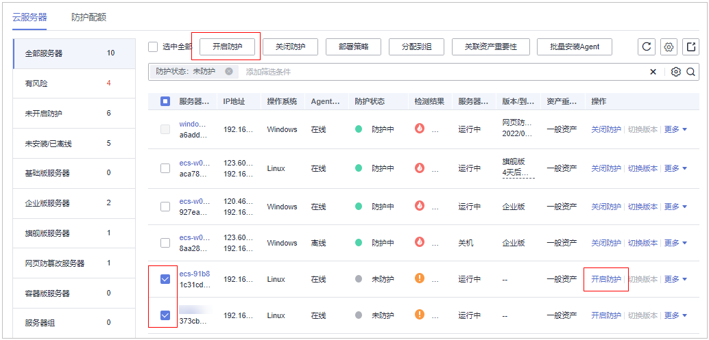

# 基础版/专业版/企业版/旗舰版

您可以为已购买的服务器开启基础版/专业版/企业版/旗舰版安全防护，开启后按照已购买版本所提供的能力对服务器进行安全防护。

## 操作须知

开启防护需要足够的防护配额，若提示配额不足，企业版可选择按需模式，其他版本需购买配额后再进行开启操作，防护配额购买详情请参见[购买主机安全防护配额](购买主机安全防护配额.md)。

## 检测周期

主机防护每日凌晨会进行全量检测。

若您在检测周期前开启防护，您需要等到次日凌晨检测后才能查看检测结果，或者立即执行手动检测。

## 前提条件

已购买的服务器已正常安装Agent且“Agent状态“为“在线“、“防护状态“为“未防护“。

## 约束条件

-   Linux操作系统

    使用鲲鹏计算EulerOS（EulerOS with ARM）的主机，在遭受SSH帐户破解攻击时，HSS不会对攻击IP进行拦截，仅支持对攻击行为进行告警。

-   Windows操作系统
    -   开启主机防护时，需要授权开启Windows防火墙，且使用主机安全服务期间请勿关闭Windows防火墙。若关闭Windows防火墙，HSS无法拦截帐户暴力破解的攻击源IP。
    -   通过手动开启Windows防火墙，也可能导致HSS不能拦截帐户暴力破解的攻击源IP。

## 操作步骤

1.  [登录管理控制台](https://console.huaweicloud.com/?locale=zh-cn)。
2.  在页面左上角选择“区域“，单击，选择“安全与合规 \> 主机安全服务”，进入主机安全平台界面。

    **图 1**  进入主机安全  
    

3.  在左侧导航栏，选择“资产管理  \>  主机管理“，进入“主机管理“界面，选择“云服务器“页签，进入云服务器页面。

    > **说明：** 
    >如果您的服务器已通过企业项目的模式进行管理，您可选择目标“企业项目“后查看或操作目标企业项目内的资产和检测信息。

4.  根据实际情况操作开启单服务器防护或通过勾选批量开启防护。

    **图 2**  开启防护  
    

    -   **单服务器开启防护**

        在目标服务器“操作“列单击“开启防护“，在弹窗中确认服务器信息，依次选择计费模式、版本及配额。

        **表 1**  开启防护参数配置说明

        
        <table><thead align="left"><tr id="row1552725153617"><th class="cellrowborder" valign="top" width="9.49094909490949%" id="mcps1.2.4.1.1">
参数名称

        </th>
        <th class="cellrowborder" valign="top" width="74.45744574457446%" id="mcps1.2.4.1.2">
参数说明

        </th>
        <th class="cellrowborder" valign="top" width="16.051605160516054%" id="mcps1.2.4.1.3">
取值样例

        </th>
        </tr>
        </thead>
        <tbody><tr id="row953710510367"><td class="cellrowborder" valign="top" width="9.49094909490949%" headers="mcps1.2.4.1.1 ">
计费模式

        </td>
        <td class="cellrowborder" valign="top" width="74.45744574457446%" headers="mcps1.2.4.1.2 "><ul id="ul135366511365"><li>包年/包月<ul id="ul4536105183619"><li>支持基础版、专业版、企业版、旗舰版选择。</li><li>无试用期，按照订单的购买周期来进行结算。</li><li>相对于按需付费，包年/包月购买方式能够提供更大的折扣，对于长期使用者，推荐该方式。</li></ul>
        </li><li>按需计费<ul id="ul115361057366"><li>支持企业版、专业版。</li><li>按实际使用的时长收费，以小时为单位，每小时整点结算，不设最低消费标准。</li></ul>
        </li></ul>
        </td>
        <td class="cellrowborder" valign="top" width="16.051605160516054%" headers="mcps1.2.4.1.3 ">
包年/包月

        </td>
        </tr>
        <tr id="row185380519366"><td class="cellrowborder" valign="top" width="9.49094909490949%" headers="mcps1.2.4.1.1 ">
版本选择

        </td>
        <td class="cellrowborder" valign="top" width="74.45744574457446%" headers="mcps1.2.4.1.2 ">
提供基础版、专业版、企业版、旗舰版选择。

        <ul id="ul11537157360"><li>基础版：用于测试、个人用户防护主机帐户安全，<strong id="b125378573618">无数量限制，只支持部分功能的检测能力，不支持防护能力，不支持等保认证</strong>，首次开启可免费体验30天。</li><li>专业版：介于基础版和企业版之间，支持对文件目录变更、异常Shell的检测，策略管理等功能，支持能力详情请参见<a href="https://support.huaweicloud.com/productdesc-hss2.0/hss_01_0136.html" target="_blank" rel="noopener noreferrer">版本功能特性</a>。</li><li>企业版：满足<strong id="b153719523620">等保认证</strong>的需求，支持资产指纹管理、漏洞管理、恶意程序检测、Webshell检测、进程异常行为检测等能力，支持能力详情请参见<a href="https://support.huaweicloud.com/productdesc-hss2.0/hss_01_0136.html" target="_blank" rel="noopener noreferrer">版本功能特性</a>。</li><li>旗舰版：满足<strong id="b65371856364">等保认证</strong>的需求，支持应用防护、勒索防护、高危命令检测、提权检测、异常shell检测等能力，支持能力详情请参见<a href="https://support.huaweicloud.com/productdesc-hss2.0/hss_01_0136.html" target="_blank" rel="noopener noreferrer">版本功能特性</a>。</li></ul>
        </td>
        <td class="cellrowborder" valign="top" width="16.051605160516054%" headers="mcps1.2.4.1.3 ">
企业版

        </td>
        </tr>
        <tr id="row15381519368"><td class="cellrowborder" valign="top" width="9.49094909490949%" headers="mcps1.2.4.1.1 ">
选择配额

        </td>
        <td class="cellrowborder" valign="top" width="74.45744574457446%" headers="mcps1.2.4.1.2 ">
选择需要绑定的防护配额。

        <ul id="ul45383503613"><li>默认随机：随机分配防护配额至服务器。</li><li>固定ID配额：选择一个配额，批量开启时选择的配额只能绑定一台服务器，其余未绑定的服务器将随机绑定目标版本配额。</li></ul>
        
 说明： 

若提示可用配额为0时，表示配额不足，需要进行购买才可开启防护。

        

        </td>
        <td class="cellrowborder" valign="top" width="16.051605160516054%" headers="mcps1.2.4.1.3 ">
随机选择配额

        </td>
        </tr>
        </tbody>
        </table>

    -   **批量开启防护**

        勾选多台目标服务器前的选框，单击上方“开启防护“，在弹窗中确认服务器信息，依次选择计费模式、版本及配额。

        > **说明：** 
        >按需仅支持企业版。

        **表 2**  开启防护参数配置说明

        
        <table><thead align="left"><tr id="hss_01_0396_row1552725153617"><th class="cellrowborder" valign="top" width="9.49094909490949%" id="mcps1.2.4.1.1">
参数名称

        </th>
        <th class="cellrowborder" valign="top" width="74.45744574457446%" id="mcps1.2.4.1.2">
参数说明

        </th>
        <th class="cellrowborder" valign="top" width="16.051605160516054%" id="mcps1.2.4.1.3">
取值样例

        </th>
        </tr>
        </thead>
        <tbody><tr id="hss_01_0396_row953710510367"><td class="cellrowborder" valign="top" width="9.49094909490949%" headers="mcps1.2.4.1.1 ">
计费模式

        </td>
        <td class="cellrowborder" valign="top" width="74.45744574457446%" headers="mcps1.2.4.1.2 "><ul id="hss_01_0396_ul135366511365"><li>包年/包月<ul id="hss_01_0396_ul4536105183619"><li>支持基础版、专业版、企业版、旗舰版选择。</li><li>无试用期，按照订单的购买周期来进行结算。</li><li>相对于按需付费，包年/包月购买方式能够提供更大的折扣，对于长期使用者，推荐该方式。</li></ul>
        </li><li>按需计费<ul id="hss_01_0396_ul115361057366"><li>支持企业版、专业版。</li><li>按实际使用的时长收费，以小时为单位，每小时整点结算，不设最低消费标准。</li></ul>
        </li></ul>
        </td>
        <td class="cellrowborder" valign="top" width="16.051605160516054%" headers="mcps1.2.4.1.3 ">
包年/包月

        </td>
        </tr>
        <tr id="hss_01_0396_row185380519366"><td class="cellrowborder" valign="top" width="9.49094909490949%" headers="mcps1.2.4.1.1 ">
版本选择

        </td>
        <td class="cellrowborder" valign="top" width="74.45744574457446%" headers="mcps1.2.4.1.2 ">
提供基础版、专业版、企业版、旗舰版选择。

        <ul id="hss_01_0396_ul11537157360"><li>基础版：用于测试、个人用户防护主机帐户安全，<strong id="hss_01_0396_b125378573618">无数量限制，只支持部分功能的检测能力，不支持防护能力，不支持等保认证</strong>，首次开启可免费体验30天。</li><li>专业版：介于基础版和企业版之间，支持对文件目录变更、异常Shell的检测，策略管理等功能，支持能力详情请参见<a href="https://support.huaweicloud.com/productdesc-hss2.0/hss_01_0136.html" target="_blank" rel="noopener noreferrer">版本功能特性</a>。</li><li>企业版：满足<strong id="hss_01_0396_b153719523620">等保认证</strong>的需求，支持资产指纹管理、漏洞管理、恶意程序检测、Webshell检测、进程异常行为检测等能力，支持能力详情请参见<a href="https://support.huaweicloud.com/productdesc-hss2.0/hss_01_0136.html" target="_blank" rel="noopener noreferrer">版本功能特性</a>。</li><li>旗舰版：满足<strong id="hss_01_0396_b65371856364">等保认证</strong>的需求，支持应用防护、勒索防护、高危命令检测、提权检测、异常shell检测等能力，支持能力详情请参见<a href="https://support.huaweicloud.com/productdesc-hss2.0/hss_01_0136.html" target="_blank" rel="noopener noreferrer">版本功能特性</a>。</li></ul>
        </td>
        <td class="cellrowborder" valign="top" width="16.051605160516054%" headers="mcps1.2.4.1.3 ">
企业版

        </td>
        </tr>
        <tr id="hss_01_0396_row15381519368"><td class="cellrowborder" valign="top" width="9.49094909490949%" headers="mcps1.2.4.1.1 ">
选择配额

        </td>
        <td class="cellrowborder" valign="top" width="74.45744574457446%" headers="mcps1.2.4.1.2 ">
选择需要绑定的防护配额。

        <ul id="hss_01_0396_ul45383503613"><li>默认随机：随机分配防护配额至服务器。</li><li>固定ID配额：选择一个配额，批量开启时选择的配额只能绑定一台服务器，其余未绑定的服务器将随机绑定目标版本配额。</li></ul>
        
 说明： 

若提示可用配额为0时，表示配额不足，需要进行购买才可开启防护。

        

        </td>
        <td class="cellrowborder" valign="top" width="16.051605160516054%" headers="mcps1.2.4.1.3 ">
随机选择配额

        </td>
        </tr>
        </tbody>
        </table>

5.  确认信息无误，单击确认，开启防护，查看目标服务器的“防护状态“为“防护中“表示防护已开启。

    > **说明：** 
    >开启旗舰版防护会自动为您开启勒索病毒防护，勒索病毒防护开启后，您需要根据自身业务情况配置诱饵防护目录、开启动态诱饵防护，进一步提升勒索病毒防护能力；另外，建议您同时开启勒索备份，提升勒索防护的事后恢复能力，最小化降低业务受损程度。详细操作请参见[修改防护策略](管理勒索病毒防护策略.md#section1453183620529)、[开启勒索备份](开启勒索备份.md)。

## 后续操作

旗舰版支持勒索病毒防护，开启旗舰版防护后，如果您需要为服务器开启勒索病毒防护，请参考[开启勒索病毒防护](开启勒索病毒防护.md)。

