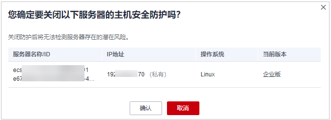

# 基础版/专业版/企业版/旗舰版

您可以根据需求来关闭服务器的防护，关闭后可释放配额，可供其他服务器防护使用。

## 操作须知

关闭防护对业务不会产生影响，但关闭后服务器被入侵的风险会急剧上升，建议保持开启防护的状态。

按需计费的企业版防护配额在关闭防护同时即停止计费，如果您要退订按需计费的企业版防护配额，关闭防护即可，无需再操作退订。

## 关闭防护

1.  [登录管理控制台](https://console.huaweicloud.com/?locale=zh-cn)。
2.  在页面左上角选择“区域“，单击，选择“安全与合规 \> 主机安全服务”，进入主机安全平台界面。

    **图 1**  进入主机安全  
    

1.  在左侧导航栏，选择“资产管理  \>  主机管理“，进入“主机管理“界面，选择“云服务器“页签，进入云服务器页面。

    > **说明：** 
    >如果您的服务器已通过企业项目的模式进行管理，您可选择目标“企业项目“后查看或操作目标企业项目内的资产和检测信息。

2.  根据实际情况操作关闭单服务器防护或通过勾选批量关闭防护。
    -   **单服务器关闭防护**
        1.  在目标服务器“操作“列单击“关闭防护“。

            **图 2**  单服务器关闭防护  
            

        2.  在弹窗中确认关闭服务器的信息，确认无误，单击“确认“，防护关闭。

            **图 3**  确认单服务器关闭信息  
            

        3.  关闭后在“云服务器“页面查看目标服务器的“防护状态“为“未防护“，关闭成功。

            > **注意：** 
            >关闭防护对业务不会产生影响，但关闭后服务器被入侵的风险会急剧上升，建议保持开启防护的状态。

    -   **批量关闭防护**
        1.  勾选多台目标服务器前的选框，单击上方“关闭防护“。

            **图 4**  批量关闭防护  
            

        2.  在弹窗中确认关闭服务器的信息，确认无误，单击“确认“，所有目标服务器防护关闭。

            **图 5**  确认批量关闭信息  
            

        3.  关闭后在“云服务器“页面查看目标服务器的“防护状态“为“未防护“，关闭成功。

            > **注意：** 
            >关闭防护对业务不会产生影响，但关闭后服务器被入侵的风险会急剧上升，建议保持开启防护的状态。

