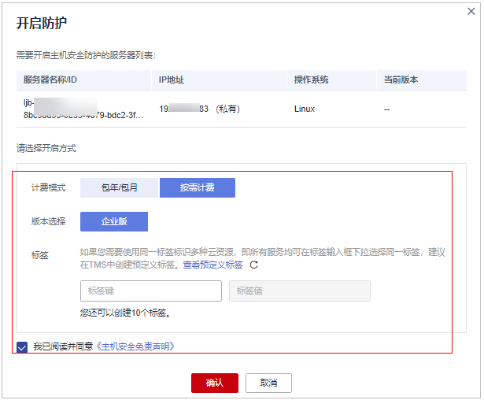
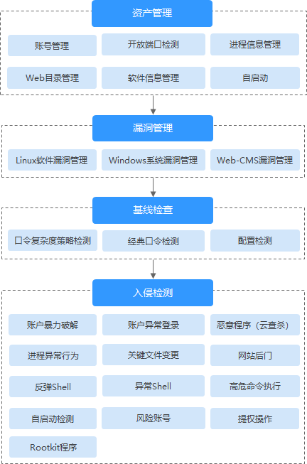
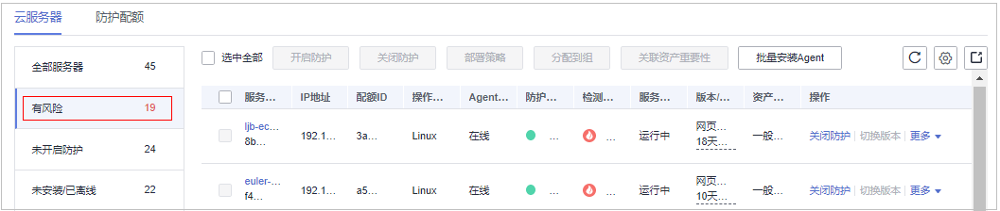

# 基础版/专业版/企业版/旗舰版

开启主机安全防护时，您需为指定的主机分配一个配额，关闭主机安全防护或删除主机后，该配额可分配给其他的主机使用。

若您购买的是网页防篡改版，请在“主动防御  \>  网页防篡改  \>  防护配置“页面开启防护，具体请参见[网页防篡改版](网页防篡改版.md)。

> **说明：** 
>购买“网页防篡改版“后，您也可以使用“旗舰版“中的所有功能，但是您需要通过“主动防御  \>  网页防篡改  \>  防护配置“页面开启防护，当开启网页防篡改防护时会自动开启旗舰版防护。

## 检测周期

主机防护每日凌晨会进行全量检测。

若您在检测周期前开启防护，您需要等到次日凌晨检测后才能查看检测结果，或者立即执行[手动检测](https://support.huaweicloud.com/usermanual-hss2.0/hss_01_0412.html)。

## 前提条件

-   “ 主机安全服务 \> 资产管理 \> 主机管理”页面“云服务器“中“Agent状态“为“在线“。
-   若开启包周期防护，请确认已在所选区域购买了充足可用的配额，[查看配额详情](查看配额.md)。
-   为达到更好的防护效果，建议在开启防护前进行安全配置。

## 约束条件

-   Linux操作系统

    使用鲲鹏计算EulerOS（EulerOS with ARM）的主机，在遭受SSH帐户破解攻击时，HSS不会对攻击IP进行拦截，仅支持对攻击行为进行告警。

-   Windows操作系统
    -   开启主机防护时，需要授权开启Windows防火墙，且使用主机安全服务期间请勿关闭Windows防火墙。若关闭Windows防火墙，HSS无法拦截帐户暴力破解的攻击源IP。
    -   通过手动开启Windows防火墙，也可能导致HSS不能拦截帐户暴力破解的攻击源IP。

## 开启防护

1.  [登录管理控制台](https://console.huaweicloud.com/?locale=zh-cn)。
2.  在页面左上角选择“区域“，单击，选择“安全合规 \> 主机安全服务”，进入主机安全服务界面。

    **图 1**  进入主机安全服务  
    

3.  在左侧导航栏中，选择“资产管理  \>  主机管理  \>  云服务器“，进入“云服务器“界面。

    > **说明：** 
    >云服务器列表仅显示以下主机的防护状态：
    >-   在所选区域购买的华为云主机
    >-   已接入所选区域的非华为云主机

4.  选择所需开启安全防护的主机，单击“操作“列“开启防护“。

    您可以根据自己的实际场景选择“包年/包月“或者“按需计费“，开启主机防护。

    > **说明：** 
    >-   按需计费：仅支持选择企业版。
    >-   包年/包月模式出现配额不足时需购买主机安全配额；
    >-   开启旗舰版防护会自动为您开启勒索病毒防护，勒索病毒防护开启后，您需要根据自身业务情况配置诱饵防护目录、开启动态诱饵防护，进一步提升勒索病毒防护能力；另外，建议您同时开启勒索备份，提升勒索防护的事后恢复能力，最小化降低业务受损程度。详细操作请参见[修改防护策略](管理勒索病毒防护策略.md#section1453183620529)、[开启勒索备份](开启勒索备份.md)。

    -   **包年/包月**

        在“开启方式“对话框中，“计费模式“选择“包年/包月“，选择目标版本、分配防护配额，阅读并确认“《主机安全免责声明》“。

        “选择配额“分配方式：

        -   随机分配：下拉框选择“随机选择配额“，系统优先为主机分发服务剩余时间较长的配额。
        -   指定分配：下拉框选择具体配额ID，您可以为主机分配指定的配额。

    -   **按需计费**

        在“开启方式“对话框中，“计费模式“选择“按需计费“，选择目标版本，阅读并勾选“《主机安全免责声明》“。

        **图 2**  开启按需计费主机防护  
        

        > **说明：** 
        >基础版在首次开启时可免费体验30天，体验结束后需购买基础版的包年/包月模式才能使用；

5.  单击“确认“，开启防护。开启主机安全防护后，请在控制台上查看主机安全服务的开启状态。

    若目标主机的“防护状态“为“开启“，则表示基础版/专业版/企业版/旗舰版防护已开启。

    > **说明：** 
    >-   您也可以通过在“主机管理  \>  防护配额“页面的“操作”列中，单击“绑定主机“，为主机绑定防护配额，HSS自动为主机开启防护。
    >-   一个配额只能绑定一个主机，且只能绑定Agent在线的主机。

    开启主机防护后，HSS将根据您开启的服务版本，自动对您的主机执行服务版本对应的安全检测。

    版本之间的差异请参见[服务版本差异](https://support.huaweicloud.com/productdesc-hss2.0/hss_01_0136.html)。

    **图 3**  自动执行的安全检测  
    

## 查看检测详情

开启防护后，主机安全服务将立即对主机执行全面的检测，检测时间可能较长，请您耐心等待。

在防护列表的左侧，单击“有风险“，您可以选择查看有风险的服务器，查看服务器的详细检测结果。

**图 4**  查看有风险项  

单击服务器名称，进入详情界面，能快速查看主机中已被检测出的各项信息和风险。

**图 5**  查看检测结果  

## 后续操作

如果您需要检测更多的项目，请根据服务各版本支持的功能手动配置检测项。

版本之间的功能差异请参见[服务版本差异](https://support.huaweicloud.com/productdesc-hss2.0/hss_01_0136.html)。

**图 6**  手动配置的检测项  

**表 1**  手动配置检测项

<table><thead align="left"><tr id="row1273315524434"><th class="cellrowborder" valign="top" width="20.6020602060206%" id="mcps1.2.4.1.1">
功能

</th>
<th class="cellrowborder" valign="top" width="46.06460646064606%" id="mcps1.2.4.1.2">
检测项

</th>
<th class="cellrowborder" valign="top" width="33.33333333333333%" id="mcps1.2.4.1.3">
相关链接

</th>
</tr>
</thead>
<tbody><tr id="row273311528431"><td class="cellrowborder" valign="top" width="20.6020602060206%" headers="mcps1.2.4.1.1 ">
安装与配置

</td>
<td class="cellrowborder" valign="top" width="46.06460646064606%" headers="mcps1.2.4.1.2 "><ul id="ul238519481451"><li>常用登录地/IP</li><li>SSH登录IP白名单</li><li>开启恶意程序隔离查杀</li></ul>
</td>
<td class="cellrowborder" valign="top" width="33.33333333333333%" headers="mcps1.2.4.1.3 ">
<a href="安装与配置.md">安装与配置</a>

</td>
</tr>
<tr id="row773345274312"><td class="cellrowborder" valign="top" width="20.6020602060206%" headers="mcps1.2.4.1.1 ">
入侵检测

</td>
<td class="cellrowborder" valign="top" width="46.06460646064606%" headers="mcps1.2.4.1.2 "><ul id="ul137171794715"><li>配置告警白名单</li><li>配置登录白名单</li></ul>
</td>
<td class="cellrowborder" valign="top" width="33.33333333333333%" headers="mcps1.2.4.1.3 ">
<a href="入侵检测.md">入侵检测</a>

</td>
</tr>
<tr id="row17733115211433"><td class="cellrowborder" valign="top" width="20.6020602060206%" headers="mcps1.2.4.1.1 ">
主动防御

</td>
<td class="cellrowborder" valign="top" width="46.06460646064606%" headers="mcps1.2.4.1.2 "><ul id="ul1486399194711"><li>应用防护</li><li>勒索病毒防护</li><li>文件完整性管理</li></ul>
</td>
<td class="cellrowborder" valign="top" width="33.33333333333333%" headers="mcps1.2.4.1.3 ">
<a href="主动防御.md">主动防御</a>

</td>
</tr>
<tr id="row1739315273442"><td class="cellrowborder" valign="top" width="20.6020602060206%" headers="mcps1.2.4.1.1 ">
安全运营

</td>
<td class="cellrowborder" valign="top" width="46.06460646064606%" headers="mcps1.2.4.1.2 "><ul id="ul1748994214718"><li>策略管理</li></ul>
</td>
<td class="cellrowborder" valign="top" width="33.33333333333333%" headers="mcps1.2.4.1.3 ">
<a href="安全运营.md">安全运营</a>

</td>
</tr>
<tr id="row146718431479"><td class="cellrowborder" valign="top" width="20.6020602060206%" headers="mcps1.2.4.1.1 ">
安全报告

</td>
<td class="cellrowborder" valign="top" width="46.06460646064606%" headers="mcps1.2.4.1.2 "><ul id="ul1070789992"><li>订阅安全报告</li></ul>
</td>
<td class="cellrowborder" valign="top" width="33.33333333333333%" headers="mcps1.2.4.1.3 ">
<a href="订阅安全报告.md">订阅安全报告</a>

</td>
</tr>
</tbody>
</table>

## 相关操作

**关闭主机防护**

您可以在“主机管理  \>  云服务器“列表的“操作”列中单击“关闭防护“，关闭对指定主机的安全防护。

关闭主机防护后，HSS会自动释放防护配额。您可将空闲的配额分配给其他主机继续使用或退订无需使用的配额，避免造成配额资源的浪费。

> **须知：** 
>-   关闭主机防护前，请对主机执行全面的检测，处理已知风险并记录操作信息，避免运维失误，使您的主机遭受攻击。
>-   关闭主机防护后，请及时清理主机中的重要数据、关停主机中的重要业务并断开主机与外部网络的连接，避免因主机遭受攻击而承担不必要的损失。

**解绑配额**

您可以在“资产管理  \>  主机管理  \>  防护配额“页面的“操作”列中，单击“解除绑定”，解除绑定后，该配额的使用状态将从“使用中“变更为“空闲“。HSS将自动关闭关联主机的防护。

您可将“空闲“的配额分配给其他主机继续使用或退订无需使用的配额，避免造成配额资源的浪费。

