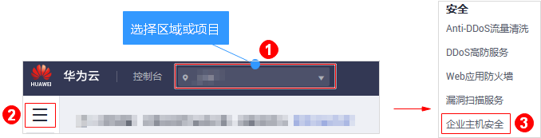
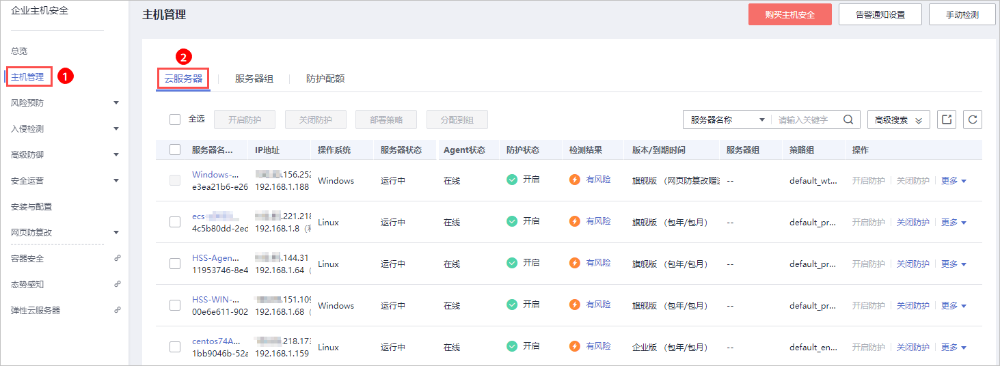
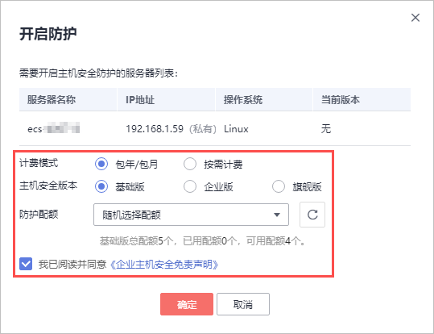
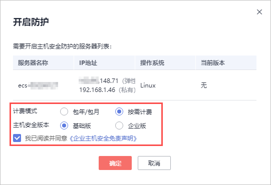
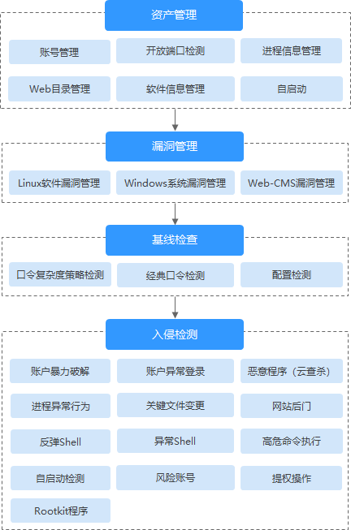
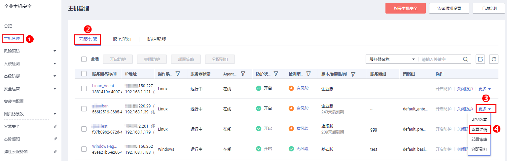
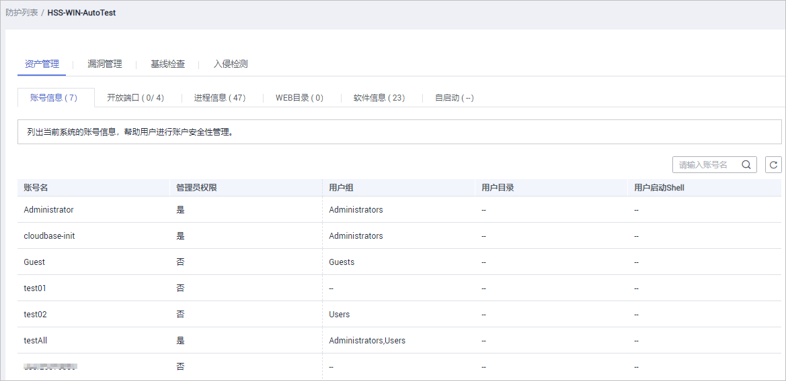
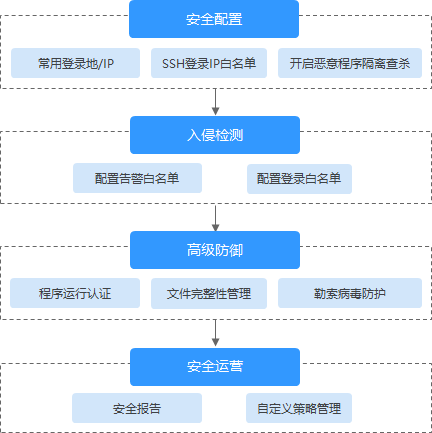

# 基础版/企业版/旗舰版

开启企业主机安全服务时，您需为指定的主机分配一个配额，关闭企业主机安全服务或删除主机后，该配额可分配给其他的主机使用。

若您购买的是网页防篡改版，请在“网页防篡改  \>  防护列表“页面开启防护，具体请参见[网页防篡改版](网页防篡改版-1.md)。

> **说明：** 
>购买“网页防篡改版“后，您也可以使用“旗舰版“中的所有功能，但是您需要通过“网页防篡改  \>  防护列表“页面开启防护，当开启网页防篡改防护时会自动开启旗舰版防护。

## 检测周期

主机防护每日凌晨会进行全量检测。

若您在检测周期前开启防护，您需要等到次日凌晨检测后才能查看检测结果，或者立即执行手动检测。

## 前提条件

-   “企业主机安全  \>  主机管理“页面“云服务器“中“Agent状态“为“在线“。
-   已开启告警通知。
-   已在所选区域购买了充足可用的配额，[查看配额详情](https://support.huaweicloud.com/hss_faq/hss_01_0156.html#section0)。
-   为达到更好的防护效果，建议在开启防护前进行[安全配置](安全配置.md)。
-   操作系统类型为Windows的主机在开启防护时，需要授权开启Windows防火墙，使用企业主机安全服务期间请勿关闭Windows防火墙。

    通过手动开启Windows防火墙，可能导致HSS不能检测账户暴力破解。

## 开启防护

1.  [登录管理控制台](https://console.huaweicloud.com)。
2.  在页面左上角选择“区域“，单击，选择“安全  \>  企业主机安全“，进入企业主机安全页面。

    **图 1**  企业主机安全  
    

3.  在左侧导航栏中，选择“主机管理“，进入“云服务器“界面，如[图2](#fig4214155420111)所示。

    **图 2**  进入“云服务器”界面  
    

    > **说明：** 
    >云服务器列表仅显示以下主机的防护状态：
    >-   在所选区域购买的华为云主机
    >-   已接入所选区域的非华为云主机

4.  选择所需开启安全防护的主机，单击“开启防护“。

    您可以根据自己的实际场景选择“包年/包月“或者“按需计费“，开启主机防护。

    > **说明：** 
    >-   按需变更为包周期。
    >    按需变更为包周期，需要用户购买包周期配额，生成新的订单，用户支付订单后，包周期配额立即生效。包周期配额生效后，用户需要关闭主机的按需防护，重新选择包周期防护配额，开启包周期配额防护。
    >-   包周期变更为按需。
    >    包周期转按需，需要用户关闭包周期配额防护后，选择按需防护，按需的资费模式才会生效。

    -   包年/包月

        在“开启防护“对话框中，“计费模式“选择“包年/包月“，选择“主机安全版本“、分配“防护配额“，阅读并确认“《企业主机安全免责声明》“如[图3](#fig1866892295111)所示。

        **图 3**  开启包周期主机防护  
        

        “防护配额“分配方式：

        -   随机分配：下拉框选择“随机选择配额“，系统优先为主机分发服务剩余时间较长的配额。
        -   指定分配：下拉框选择具体配额ID，您可以为主机分配指定的配额。
        -   批量分配：批量开启防护时，系统会随机为批量选择的主机分配配额。

    -   按需计费

        在“开启防护“对话框中，“计费模式“选择“按需计费“，选择“主机安全版本“，阅读并确认“《企业主机安全免责声明》“，如[图4](#fig34971348227)所示。

        **图 4**  开启按需计费主机防护  
        

5.  单击“确定“，开启防护。开启企业主机安全防护后，请在控制台上查看企业主机安全服务的开启状态。

    若目标主机的“防护状态“为“开启“，则表示基础版/企业版/旗舰版防护已开启。

    > **说明：** 
    >-   您也可以通过在“主机管理  \>  防护配额“页面的“操作“列中，单击“绑定主机“，为主机绑定防护配额，HSS自动为主机开启防护。
    >-   一个配额只能绑定一个主机，且只能绑定Agent在线的主机。

    开启主机防护后，HSS将根据您购买的服务版本，自动对您的主机执行服务版本对应的安全检测，如[图5](#fig1674713318538)所示。

    版本之间的差异请参见[服务版本差异](https://support.huaweicloud.com/productdesc-hss/hss_01_0136.html)。

    **图 5**  自动执行的安全检测  
    

## 查看检测详情

开启防护后，企业主机安全服务将立即对主机执行全面的检测，检测时间可能较长，请您耐心等待。

在防护列表的“操作“列中单击“查看详情“，统一查看指定主机的检测结果。

**图 6**  查看详情  

在详情界面，能快速查看主机中已被检测出的各项信息和风险。

**图 7**  查看检测结果  

## 切换版本

您可根据需要将企业主机安全服务的版本从切换为“基础版“、“企业版“或者“旗舰版“。

> **须知：** 
>-   若企业主机安全服务的版本由高版本版切换为低版本后，主机遭受攻击的可能性将升高。
>-   仅支持将主机安全防护的版本切换为“基础版“、“企业版“或者“旗舰版“，如需使用“网页防篡改版“，请先购买“网页防篡改版“的配额，再开启网页防篡改防护。

-   变更前准备
    -   版本变更时需重新为主机指定相应的配额，变更版本前请先购买数量充足的配额。
    -   切换为低版本前，请对主机执行相应的检测，处理已知风险并记录操作信息，避免运维失误，使您的主机遭受攻击。

-   切换后操作
    -   切换为低版本后，请及时清理主机中的重要数据、关停主机中的重要业务并断开主机与外部网络的连接，避免因主机遭受攻击而承担不必要的损失。
    -   切换为高版本后，请及时对主机执行安全检测、处理主机中的安全隐患并配置必要的功能。
    -   切换版本后，您可将空余的配额分配给其他主机继续使用或退订无需使用的配额，避免造成配额资源的浪费。

## 后续操作

如果您需要检测更多的项目，请根据服务各版本支持的功能手动配置检测项，如[图8](#fig104989914551)所示。

版本之间的功能差异请参见[服务版本差异](https://support.huaweicloud.com/productdesc-hss/hss_01_0136.html)。

**图 8**  手动配置的检测项  

**表 1**  手动配置检测项

<table><thead align="left"><tr id="row1273315524434"><th class="cellrowborder" valign="top" width="20.6020602060206%" id="mcps1.2.4.1.1">
功能

</th>
<th class="cellrowborder" valign="top" width="46.06460646064606%" id="mcps1.2.4.1.2">
检测项

</th>
<th class="cellrowborder" valign="top" width="33.33333333333333%" id="mcps1.2.4.1.3">
相关链接

</th>
</tr>
</thead>
<tbody><tr id="row273311528431"><td class="cellrowborder" valign="top" width="20.6020602060206%" headers="mcps1.2.4.1.1 ">
安全配置

</td>
<td class="cellrowborder" valign="top" width="46.06460646064606%" headers="mcps1.2.4.1.2 "><ul id="ul238519481451"><li>常用登录地/IP</li><li>SSH登录IP白名单</li><li>开启恶意程序隔离查杀</li></ul>
</td>
<td class="cellrowborder" valign="top" width="33.33333333333333%" headers="mcps1.2.4.1.3 ">
<a href="安全配置.md">安全配置</a>

</td>
</tr>
<tr id="row773345274312"><td class="cellrowborder" valign="top" width="20.6020602060206%" headers="mcps1.2.4.1.1 ">
入侵检测

</td>
<td class="cellrowborder" valign="top" width="46.06460646064606%" headers="mcps1.2.4.1.2 "><ul id="ul137171794715"><li>配置告警白名单</li><li>配置登录白名单</li></ul>
</td>
<td class="cellrowborder" valign="top" width="33.33333333333333%" headers="mcps1.2.4.1.3 ">
<a href="入侵检测.md">入侵检测</a>

</td>
</tr>
<tr id="row17733115211433"><td class="cellrowborder" valign="top" width="20.6020602060206%" headers="mcps1.2.4.1.1 ">
高级防御

</td>
<td class="cellrowborder" valign="top" width="46.06460646064606%" headers="mcps1.2.4.1.2 "><ul id="ul1486399194711"><li>程序运行认证</li><li>文件完整性管理</li><li>勒索病毒防护</li></ul>
</td>
<td class="cellrowborder" valign="top" width="33.33333333333333%" headers="mcps1.2.4.1.3 ">
<a href="高级防御.md">高级防御</a>

</td>
</tr>
<tr id="row1739315273442"><td class="cellrowborder" valign="top" width="20.6020602060206%" headers="mcps1.2.4.1.1 ">
安全运营

</td>
<td class="cellrowborder" valign="top" width="46.06460646064606%" headers="mcps1.2.4.1.2 "><ul id="ul1748994214718"><li>安全报告</li><li>自定义策略管理</li></ul>
</td>
<td class="cellrowborder" valign="top" width="33.33333333333333%" headers="mcps1.2.4.1.3 ">
<a href="安全运营.md">安全运营</a>

</td>
</tr>
</tbody>
</table>

## 相关操作

**关闭主机防护**

您可以在“主机管理  \>  云服务器“列表的“操作“列中单击“关闭防护“，关闭对指定主机的安全防护。

关闭主机防护后，HSS会自动释放防护配额。您可将空闲的配额分配给其他主机继续使用或退订无需使用的配额，避免造成配额资源的浪费。

> **须知：** 
>-   关闭主机防护前，请对主机执行全面的检测，处理已知风险并记录操作信息，避免运维失误，使您的主机遭受攻击。
>-   关闭主机防护后，请及时清理主机中的重要数据、关停主机中的重要业务并断开主机与外部网络的连接，避免因主机遭受攻击而承担不必要的损失。

**解绑配额**

您可以在“主机管理  \>  防护配额“页面的“操作“列中，选择“更多 \> 解绑配额”，解绑配额。解绑配额后，该配额的使用状态将从“使用中“变更为“空闲“，HSS将自动关闭关联主机的防护。

您可将“空闲“的配额分配给其他主机继续使用或退订无需使用的配额，避免造成配额资源的浪费。

> **说明：** 
>当开启了主机防护的云主机被退订，该云主机绑定的配额不会自动释放。您可以通过解绑配额的方式，解除绑定的配额。

