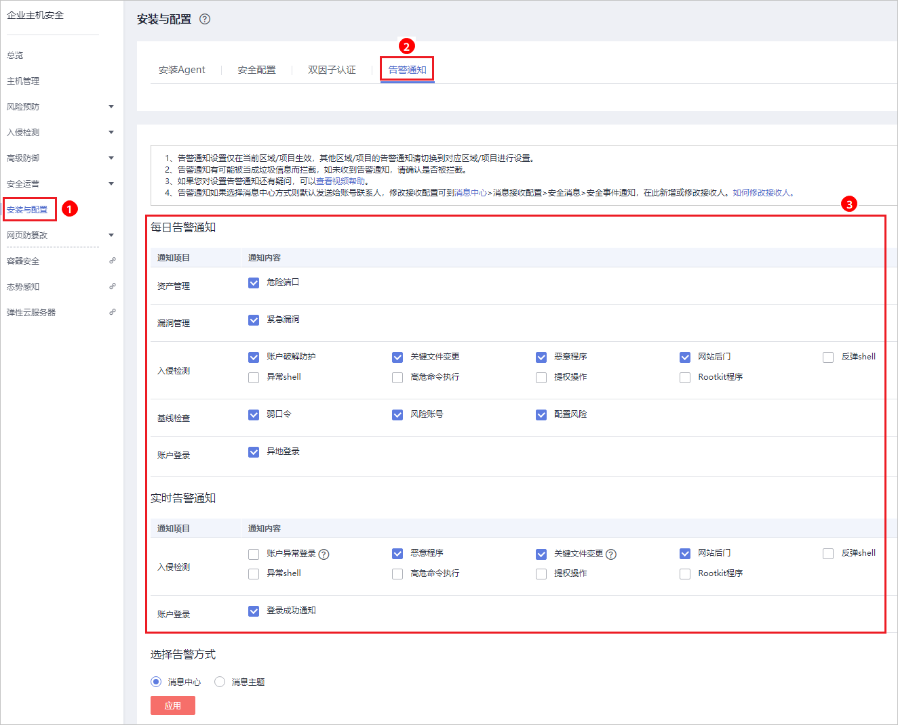
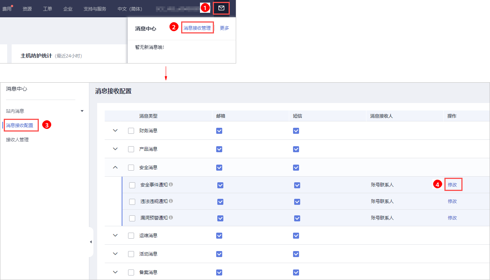

# 基础版/企业版/旗舰版

开启告警通知功能后，您能接收到企业主机安全服务发送的告警通知，及时了解主机/网页内的安全风险。否则，无论是否有风险，您都只能登录管理控制台自行查看，无法收到报警信息。

若您不设置告警通知，进入主机管理页面，HSS会自动弹出您未设置告警的提示框。

若您想屏蔽该提示框，您可以单击“快速设置“，设置告警通知，或者勾选“不再提醒“，并单击“暂不设置“，即可屏蔽该提示框。

-   告警通知设置仅在当前区域生效，若需要接收其他区域的告警通知，请切换到对应区域后进行设置。
-   告警通知信息可能会被误拦截，若您未收到相关告警信息，请在信息拦截中查看。
-   消息通知服务为付费服务，价格详情请参见[SMN价格详情](https://www.huaweicloud.com/pricing.html?tab=detail#/smn)。

## 前提条件

在设置告警通知前。

-   如果选择“消息中心“，建议您在“消息中心  \>  消息接收配置  \>  安全消息  \>  安全事件通知“，新增或修改消息接收人，具体操作请参见[修改指定消息接收人](https://support.huaweicloud.com/usermanual-mc/zh-cn_topic_0065943707.html)。
-   如果选择“消息主题“，建议您先以管理员身份在“消息通知服务“中创建“消息主题“，详细操作请参见[如何发布主题消息](https://support.huaweicloud.com/qs-smn/smn_ug_0004.html)。

## 开启基础版/企业版/旗舰版的告警通知

1.  [登录管理控制台](https://console.huaweicloud.com)。
2.  在页面左上角选择“区域“，单击，选择“安全  \>  企业主机安全“，进入企业主机安全页面。

    **图 1**  企业主机安全  
    

3.  选择“告警通知“页签，进入“告警通知“页面，如[图2](#fig119271425163613)所示。

    **图 2**  基础版/企业版/旗舰版  
    

4.  根据需要勾选“每日告警通知“和“实时告警通知“中的通知项。关于告警通知项详细说明，请参见[告警通知项说明](#section8982419163410)。

    **表 1**  选择通知项

    
    <table><thead align="left"><tr id="row84362568442"><th class="cellrowborder" valign="top" width="11.790000000000001%" id="mcps1.2.4.1.1">
通知项

    </th>
    <th class="cellrowborder" valign="top" width="37.29%" id="mcps1.2.4.1.2">
说明

    </th>
    <th class="cellrowborder" valign="top" width="50.92%" id="mcps1.2.4.1.3">
选择建议

    </th>
    </tr>
    </thead>
    <tbody><tr id="row1343605617448"><td class="cellrowborder" valign="top" width="11.790000000000001%" headers="mcps1.2.4.1.1 ">
每日告警通知

    </td>
    <td class="cellrowborder" valign="top" width="37.29%" headers="mcps1.2.4.1.2 ">
每日凌晨，企业主机安全服务将主动检测主机系统中的账号、Web目录、漏洞、恶意程序及关键配置等，汇总各项检测结果后，将检测结果发送给您在“消息中心”中添加的消息接收人，或者在“消息通知服务主题”中添加的订阅终端。

    </td>
    <td class="cellrowborder" valign="top" width="50.92%" headers="mcps1.2.4.1.3 "><ul id="ul1221311120454"><li>接收并定期查看每日告警通知中所有的内容，能有效降低主机中未及时处理的风险成为主机安全隐患的概率。</li><li>由于每日告警中通知项的内容较多，如果您使用的“消息通知服务”，接收告警通知，建议您选择“订阅终端”配置为“邮箱”的“消息通知服务主题”。</li></ul>
    </td>
    </tr>
    <tr id="row243625616448"><td class="cellrowborder" valign="top" width="11.790000000000001%" headers="mcps1.2.4.1.1 ">
实时告警通知

    </td>
    <td class="cellrowborder" valign="top" width="37.29%" headers="mcps1.2.4.1.2 ">
当攻击者入侵主机时，企业主机安全服务将按照选定的“消息中心”或者“消息通知服务主题”为您告警。

    </td>
    <td class="cellrowborder" valign="top" width="50.92%" headers="mcps1.2.4.1.3 "><ul id="ul14344175017487"><li>建议您接收实时告警通知中所有的内容并及时查看。企业安全服务实时监测主机中的安全情况，能监测到攻击者入侵主机的行为，接收实时告警通知能快速处理攻击者入侵主机的行为。</li><li>由于实时告警中通知项的内容紧急度较高，如果您使用的“消息通知服务”，接收告警通知，建议您选择“订阅终端”配置为“短信”的“消息通知服务主题”。</li></ul>
    </td>
    </tr>
    </tbody>
    </table>

5.  选择“消息中心“或者“消息主题“告警通知方式，接收告警通知。
    -   选择“消息中心“。

        告警通知默认发送给账号联系人，修改接收配置可到“消息中心  \>  消息接收配置  \>  安全消息  \>  安全事件通知“，新增或修改接收人，具体操作请参见[修改指定消息接收人](https://support.huaweicloud.com/usermanual-mc/zh-cn_topic_0065943707.html)。

        **图 3**  新增或修改接收人  
        

    -   选择“消息主题“。

        单击下拉列表选择已创建的主题，或者单击“查看消息通知服务主题“创建新的主题。

        创建新的主题，即配置接收告警通知的手机号码或邮箱地址，具体操作如下：

        1.  参见[创建主题](https://support.huaweicloud.com/usermanual-smn/zh-cn_topic_0043961401.html)创建一个主题。
        2.  配置接收告警通知的手机号码或邮箱地址，即为创建的主题添加一个或多个订阅，具体操作请参见[添加订阅](https://support.huaweicloud.com/usermanual-smn/smn_ug_0008.html)。
        3.  确认订阅。添加订阅后，按接收到的短信或邮件提示，完成订阅确认。

            主题订阅确认的信息可能被当成垃圾短信拦截，如未收到，请查看是否设置了垃圾短信拦截。

        您可以根据运维计划和告警通知类型，创建多个“消息通知主题“，以接收不同类型的告警通知。更多关于主题和订阅的信息，请参见《消息通知服务用户指南》。

6.  单击“应用“，完成配置主机安全告警通知的操作。界面弹出“告警通知设置成功“提示信息，则说明告警通知设置成功。

## 告警通知项说明

<table><thead align="left"><tr id="row139514391503"><th class="cellrowborder" valign="top" width="16.71%" id="mcps1.1.4.1.1">
通知项

</th>
<th class="cellrowborder" valign="top" width="19.64%" id="mcps1.1.4.1.2">
通知内容

</th>
<th class="cellrowborder" valign="top" width="63.65%" id="mcps1.1.4.1.3">
通知内容说明

</th>
</tr>
</thead>
<tbody><tr id="row93081812121515"><td class="cellrowborder" colspan="3" valign="top" headers="mcps1.1.4.1.1 mcps1.1.4.1.2 mcps1.1.4.1.3 ">
<strong id="b18104192851510">每日告警通知</strong>

每日凌晨检测主机中的风险，汇总并统计检测结果后，将检测结果于每日上午10：00发送给你添加的手机号或者邮箱。

</td>
</tr>
<tr id="row839515391309"><td class="cellrowborder" valign="top" width="16.71%" headers="mcps1.1.4.1.1 ">
资产管理

</td>
<td class="cellrowborder" valign="top" width="19.64%" headers="mcps1.1.4.1.2 ">
危险端口

</td>
<td class="cellrowborder" valign="top" width="63.65%" headers="mcps1.1.4.1.3 ">
检测开放了的危险端口或者不必要的端口，通知用户及时排查这些端口是否用于正常业务。

</td>
</tr>
<tr id="row33961739001"><td class="cellrowborder" valign="top" width="16.71%" headers="mcps1.1.4.1.1 ">
漏洞管理

</td>
<td class="cellrowborder" valign="top" width="19.64%" headers="mcps1.1.4.1.2 ">
紧急漏洞

</td>
<td class="cellrowborder" valign="top" width="63.65%" headers="mcps1.1.4.1.3 ">
检测系统中的紧急漏洞，通知用户尽快修复，防止攻击者利用该漏洞会对主机造成较大的破坏。

</td>
</tr>
<tr id="row1981384012146"><td class="cellrowborder" rowspan="9" valign="top" width="16.71%" headers="mcps1.1.4.1.1 ">
入侵检测

</td>
<td class="cellrowborder" valign="top" width="19.64%" headers="mcps1.1.4.1.2 ">
账户破解防护

</td>
<td class="cellrowborder" valign="top" width="63.65%" headers="mcps1.1.4.1.3 ">
检测SSH、RDP、FTP、SQL Server、MySQL等账户遭受的口令破解攻击。<ul id="hss_01_0277_ul151611591802"><li>如果30秒内，账户暴力破解次数达到5次及以上，HSS就会拦截该源IP，禁止其再次登录，防止主机因账户破解被入侵。
SSH类型攻击默认拦截12小时，其他类型攻击默认拦截24小时。

</li><li>根据账户暴力破解告警详情，如“攻击源IP”、“攻击类型”和“拦截次数”，您能够快速识别出该源IP是否为可信IP，如果为可信IP，您可以通过手动解除拦截的方式，解除拦截的可信IP。</li></ul>

</td>
</tr>
<tr id="row420232481811"><td class="cellrowborder" valign="top" headers="mcps1.1.4.1.1 ">
关键文件变更

</td>
<td class="cellrowborder" valign="top" headers="mcps1.1.4.1.2 ">
对于关键文件变更，HSS只检测目录或文件是否被修改，不关注是人为或者某个进程修改的。

</td>
</tr>
<tr id="row617643471810"><td class="cellrowborder" valign="top" headers="mcps1.1.4.1.1 ">
恶意程序

</td>
<td class="cellrowborder" valign="top" headers="mcps1.1.4.1.2 ">
通过程序特征、行为检测，结合AI图像指纹算法以及云查杀，有效识后门、木马、挖矿软件、蠕虫和病毒等恶意程序，也可检测出主机中未知的恶意程序和病毒变种，并提供一键隔离查杀能力。

</td>
</tr>
<tr id="row113691958151814"><td class="cellrowborder" valign="top" headers="mcps1.1.4.1.1 ">
网站后门

</td>
<td class="cellrowborder" valign="top" headers="mcps1.1.4.1.2 ">
检测云服务器上Web目录中的文件，判断是否为WebShell木马文件，支持检测常见的PHP、JSP等后门文件类型。

</td>
</tr>
<tr id="row192525591912"><td class="cellrowborder" valign="top" headers="mcps1.1.4.1.1 ">
反弹Shell

</td>
<td class="cellrowborder" valign="top" headers="mcps1.1.4.1.2 ">
实时监控用户的进程行为，及时发现进程的非法Shell连接操作产生的反弹Shell行为。

</td>
</tr>
<tr id="row175241213181917"><td class="cellrowborder" valign="top" headers="mcps1.1.4.1.1 ">
异常Shell

</td>
<td class="cellrowborder" valign="top" headers="mcps1.1.4.1.2 ">
检测系统中异常Shell的获取行为，包括对Shell文件的修改、删除、移动、拷贝、硬链接、访问权限变化。

</td>
</tr>
<tr id="row14778122311194"><td class="cellrowborder" valign="top" headers="mcps1.1.4.1.1 ">
高危命令执行

</td>
<td class="cellrowborder" valign="top" headers="mcps1.1.4.1.2 ">
HSS实时检测当前系统中执行的高危命令，当发生高危命令执行时，及时触发告警。

</td>
</tr>
<tr id="row18691203418191"><td class="cellrowborder" valign="top" headers="mcps1.1.4.1.1 ">
提权操作

</td>
<td class="cellrowborder" valign="top" headers="mcps1.1.4.1.2 ">
HSS检测当前系统的“进程提权”和“文件提权”操作。

</td>
</tr>
<tr id="row164051941131917"><td class="cellrowborder" valign="top" headers="mcps1.1.4.1.1 ">
Rootkit程序

</td>
<td class="cellrowborder" valign="top" headers="mcps1.1.4.1.2 ">
HSS检测Rootkit安装的文件和目录，帮助用户及时发现可疑的Rootkit安装。

</td>
</tr>
<tr id="row19431246171419"><td class="cellrowborder" rowspan="3" valign="top" width="16.71%" headers="mcps1.1.4.1.1 ">
基线检查

</td>
<td class="cellrowborder" valign="top" width="19.64%" headers="mcps1.1.4.1.2 ">
弱口令

</td>
<td class="cellrowborder" valign="top" width="63.65%" headers="mcps1.1.4.1.3 ">
检测MySQL、FTP及系统账号的弱口令。

</td>
</tr>
<tr id="row817961511207"><td class="cellrowborder" valign="top" headers="mcps1.1.4.1.1 ">
风险账号

</td>
<td class="cellrowborder" valign="top" headers="mcps1.1.4.1.2 ">
检测系统中的可疑账号、主机中无用的账号，防止未授权的访问权限和使用操作。

</td>
</tr>
<tr id="row658410239205"><td class="cellrowborder" valign="top" headers="mcps1.1.4.1.1 ">
配置风险

</td>
<td class="cellrowborder" valign="top" headers="mcps1.1.4.1.2 ">
检测系统中的关键应用，如果采用不安全配置，有可能被黑客利用作为入侵主机系统的手段。

</td>
</tr>
<tr id="row2413243171416"><td class="cellrowborder" valign="top" width="16.71%" headers="mcps1.1.4.1.1 ">
账户登录

</td>
<td class="cellrowborder" valign="top" width="19.64%" headers="mcps1.1.4.1.2 ">
异地登录

</td>
<td class="cellrowborder" valign="top" width="63.65%" headers="mcps1.1.4.1.3 ">
检测主机异地登录行为并进行告警，用户可根据实际情况采取相应措施。

若在非常用登录地登录，则触发安全事件告警。

</td>
</tr>
<tr id="row149888525158"><td class="cellrowborder" colspan="3" valign="top" headers="mcps1.1.4.1.1 mcps1.1.4.1.2 mcps1.1.4.1.3 ">
<strong id="b359456141615">实时告警通知</strong>

事件发生时，及时发送告警通知。

</td>
</tr>
<tr id="row5706455111519"><td class="cellrowborder" rowspan="9" valign="top" width="16.71%" headers="mcps1.1.4.1.1 ">
入侵检测

</td>
<td class="cellrowborder" valign="top" width="19.64%" headers="mcps1.1.4.1.2 ">
账户异常登录

</td>
<td class="cellrowborder" valign="top" width="63.65%" headers="mcps1.1.4.1.3 ">
检测“异地登录”和“账户暴力破解成功”等异常登录。若发生异常登录，则说明您的主机可能被黑客入侵成功。

</td>
</tr>
<tr id="row9998479213"><td class="cellrowborder" valign="top" headers="mcps1.1.4.1.1 ">
恶意程序

</td>
<td class="cellrowborder" valign="top" headers="mcps1.1.4.1.2 ">
通过程序特征、行为检测，结合AI图像指纹算法以及云查杀，有效识后门、木马、挖矿软件、蠕虫和病毒等恶意程序，也可检测出主机中未知的恶意程序和病毒变种，并提供一键隔离查杀能力。

</td>
</tr>
<tr id="row17736151214"><td class="cellrowborder" valign="top" headers="mcps1.1.4.1.1 ">
关键文件变更

</td>
<td class="cellrowborder" valign="top" headers="mcps1.1.4.1.2 ">
对于关键文件变更，HSS只检测目录或文件是否被修改，不关注是人为或者某个进程修改的。

</td>
</tr>
<tr id="row14210112415213"><td class="cellrowborder" valign="top" headers="mcps1.1.4.1.1 ">
网站后门

</td>
<td class="cellrowborder" valign="top" headers="mcps1.1.4.1.2 ">
检测云服务器上Web目录中的文件，判断是否为WebShell木马文件，支持检测常见的PHP、JSP等后门文件类型。

</td>
</tr>
<tr id="row1156283042114"><td class="cellrowborder" valign="top" headers="mcps1.1.4.1.1 ">
反弹Shell

</td>
<td class="cellrowborder" valign="top" headers="mcps1.1.4.1.2 ">
实时监控用户的进程行为，及时发现进程的非法Shell连接操作产生的反弹Shell行为。

</td>
</tr>
<tr id="row137071638132112"><td class="cellrowborder" valign="top" headers="mcps1.1.4.1.1 ">
异常Shell

</td>
<td class="cellrowborder" valign="top" headers="mcps1.1.4.1.2 ">
检测系统中异常Shell的获取行为，包括对Shell文件的修改、删除、移动、拷贝、硬链接、访问权限变化。

</td>
</tr>
<tr id="row842114722111"><td class="cellrowborder" valign="top" headers="mcps1.1.4.1.1 ">
高危命令执行

</td>
<td class="cellrowborder" valign="top" headers="mcps1.1.4.1.2 ">
HSS实时检测当前系统中执行的高危命令，当发生高危命令执行时，及时触发告警。

</td>
</tr>
<tr id="row12251255122117"><td class="cellrowborder" valign="top" headers="mcps1.1.4.1.1 ">
提权操作

</td>
<td class="cellrowborder" valign="top" headers="mcps1.1.4.1.2 ">
HSS检测当前系统的“进程提权”和“文件提权”操作。

</td>
</tr>
<tr id="row19415184162211"><td class="cellrowborder" valign="top" headers="mcps1.1.4.1.1 ">
Rootkit程序

</td>
<td class="cellrowborder" valign="top" headers="mcps1.1.4.1.2 ">
HSS检测Rootkit安装的文件和目录，帮助用户及时发现可疑的Rootkit安装。

</td>
</tr>
<tr id="row242215831512"><td class="cellrowborder" valign="top" width="16.71%" headers="mcps1.1.4.1.1 ">
账户登录

</td>
<td class="cellrowborder" valign="top" width="19.64%" headers="mcps1.1.4.1.2 ">
登录成功通知

</td>
<td class="cellrowborder" valign="top" width="63.65%" headers="mcps1.1.4.1.3 ">
如果在“实时告警通知”项目中勾选了“登录成功通知”选项，则任何账户登录成功的事件都会向您实时发送告警信息。

如果您所有主机上的账户都由个别管理员负责管理，通过该功能可以对系统账户进行严格的监控。

如果系统账户由多人管理，或者不同主机由不同管理员负责管理，那么运维人员可能会因为频繁收到不相关的告警而对运维工作造成困扰，此时建议您登录企业主机安全服务控制台关闭该告警项。

 说明： 

登录成功并不代表发生了攻击，需要您确认登录IP是否是已知的合法IP。

</td>
</tr>
</tbody>
</table>

## 相关操作

-   [配置告警通知时选不到消息主题？](https://support.huaweicloud.com/hss_faq/hss_01_0254.html)
-   若您收到告警通知，请参见[告警事件处理](https://support.huaweicloud.com/bestpractice-hss/hss_06_0007.html)对告警事件进行处理。

