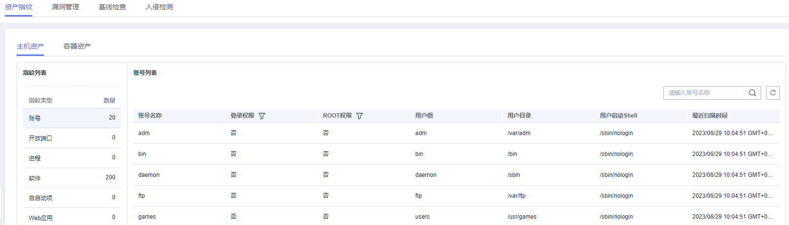

# 基础版/企业版/旗舰版

开启企业主机安全服务时，您需为指定的主机分配一个配额，关闭企业主机安全服务或删除主机后，该配额可分配给其他的主机使用。

若您购买的是网页防篡改版，请在“网页防篡改  \>  防护列表“页面开启防护，具体请参见[网页防篡改版](网页防篡改版.md)。

> **说明：**   
>购买“网页防篡改版“后，您也可以使用“企业版“中的所有功能，但是您需要通过“网页防篡改  \>  防护列表“页面开启防护，当开启网页防篡改防护时会自动开启企业版防护。  

## 检测周期

主机防护每日凌晨会进行全量检测。

若您在检测周期前开启防护，您需要等到次日凌晨检测后才能查看检测结果，或者立即执行手动检测。

## 前提条件

-   “企业主机安全  \>  主机管理“页面“云服务器“中“Agent状态“为“在线“。
-   已开启告警通知。
-   已在所选区域购买了充足可用的配额，[查看配额详情](https://support.huaweicloud.com/hss_faq/hss_01_0156.html#section0)。
-   为达到更好的防护效果，建议在开启防护前进行[安全配置](https://support.huaweicloud.com/usermanual-hss/hss_01_0051.html)。
-   操作系统类型为Windows的主机在开启防护时，需开启Windows防火墙，使用企业主机安全服务期间请勿关闭Windows防火墙。

## 开启防护

1.  [登录管理控制台](https://console.huaweicloud.com)。
2.  在页面上方选择区域后，单击，选择“安全  \>  企业主机安全“。

    **图 1**  企业主机安全  
    

3.  在左侧导航栏中，选择“主机管理“，进入“云服务器“界面，如[图2](#fig4214155420111)所示。

    **图 2**  进入“云服务器”界面  
    

    > **说明：**   
    >云服务器列表仅显示以下主机的防护状态：  
    >-   在所选区域购买的华为云主机  
    >-   已接入所选区域的非华为云主机  

4.  选择所需开启安全防护的主机，单击“开启防护“。
5.  在“开启防护“对话框中，选择“主机安全版本“、分配“防护配额“，阅读并确认“《企业主机安全免责声明》“如[图3](#fig1866892295111)所示。

    **图 3**  开启主机防护  
    

    “防护配额“分配方式：

    -   随机分配：下拉框选择“随机选择配额“，系统优先为主机分发服务剩余时间较长的配额。
    -   指定分配：下拉框选择具体配额ID，您可以为主机分配指定的配额。
    -   批量分配：批量开启防护时，系统会随机为批量选择的主机分配配额。

6.  开启企业主机安全防护服务后，请在控制台上查看企业主机安全服务的开启状态。

    若目标主机的“防护状态“为“开启“，则表示基础版/企业版防护已开启。

## 查看检测详情

开启防护后，企业主机安全服务将立即对主机执行全面的检测，检测时间可能较长，请您耐心等待。

在防护列表的“操作“列中单击“查看详情“，统一查看指定主机的检测结果。

**图 4**  查看详情  

在详情界面，能快速查看主机中已被检测出的各项信息和风险。

**图 5**  查看检测结果  

## 切换版本

您可根据需要将企业主机安全服务的版本从切换为“基础版“、“企业版“或者“旗舰版“。

> **须知：**   
>-   若企业主机安全服务的版本由高版本版切换为低版本后，主机遭受攻击的可能性将升高。  
>-   仅支持将主机安全防护的版本切换为“基础版“、“企业版“或者“旗舰版“，如需使用“网页防篡改版“，请先购买“网页防篡改版“的配额，再开启网页防篡改防护。  

-   变更前准备
    -   版本变更时需重新为主机指定相应的配额，变更版本前请先购买数量充足的配额。
    -   切换为低版本前，请对主机执行相应的检测，处理已知风险并记录操作信息，避免运维失误，使您的主机遭受攻击。

-   切换后操作
    -   切换为低版本后，请及时清理主机中的重要数据、关停主机中的重要业务并断开主机与外部网络的连接，避免因主机遭受攻击而承担不必要的损失。
    -   切换为高版本后，请及时对主机执行安全检测、处理主机中的安全隐患并配置必要的功能。
    -   从基础版、企业版或者旗舰版切换为网页防篡改版后，基础版、企业版或者旗舰版的配额为未使用状态。
    -   切换版本后，您可将空余的配额分配给其他主机继续使用或退订无需使用的配额，避免造成配额资源的浪费。

## 相关操作

**关闭主机防护**

您可以在防护列表的“操作“列中单击“关闭防护“，关闭对指定主机的安全防护。

> **说明：**   
>关闭安全防护服务后，主机遭受攻击的可能性将升高。  

-   关闭安全防护服务前，请对主机执行全面的检测，处理已知风险并记录操作信息，避免运维失误，使您的主机遭受攻击。
-   关闭安全服务后，请及时清理主机中的重要数据、关停主机中的重要业务并断开主机与外部网络的连接，避免因主机遭受攻击而承担不必要的损失。
-   关闭安全服务后，您可将空余的配额分配给其他主机继续使用或退订无需使用的配额，避免造成配额资源的浪费。

