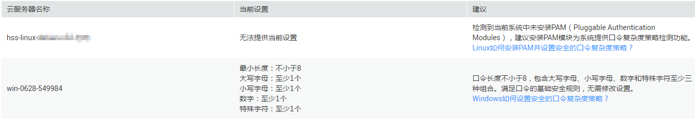
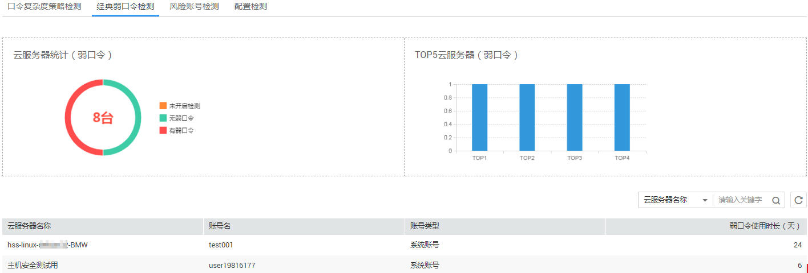
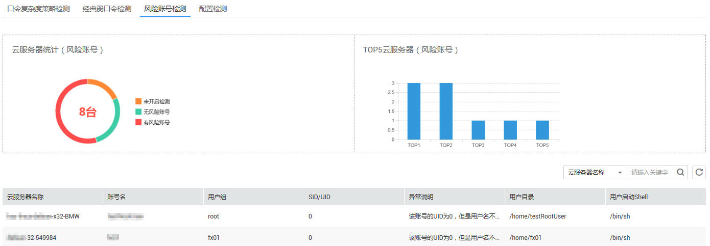
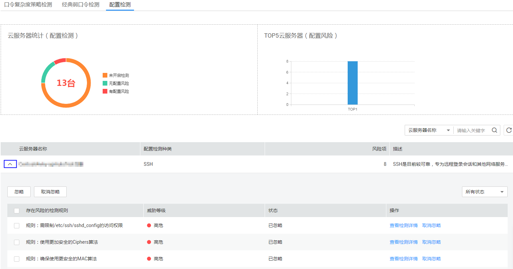
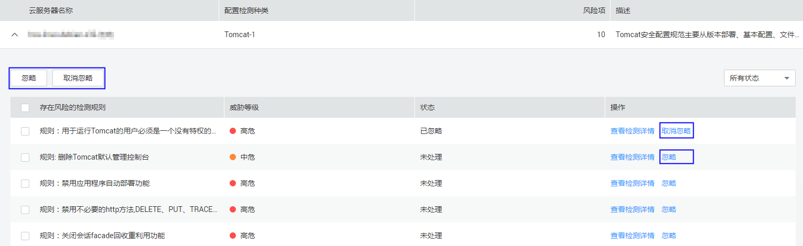

# 基线检查

本章节指导用户通过企业主机安全查看基线检查的各项检测结果。

## 前提条件

已获取管理控制台的登录帐号与密码。

## 查看口令复杂度策略检测结果

1.  登录管理控制台。
2.  在页面上方，单击“服务列表“，选择“安全  \>  企业主机安全“。
3.  在左侧导航树中，选择“基线检查“，进入基线检查界面。
4.  默认显示“口令复杂度策略检测“页签，如[图1](#fig66580983202244)所示。

    **图 1**  口令复杂度策略  
    

## 查看经典弱口令检测结果

1.  登录管理控制台。
2.  在页面上方，单击“服务列表“，选择“安全  \>  企业主机安全“。
3.  在左侧导航树中，选择“基线检查“，进入基线检查界面。
4.  选择“经典弱口令检测“页签，如[图2](#fig4864925517049)所示，各参数说明如[表1](#table187436641759)所示。

    **图 2**  弱口令  
    

    > **说明：**   
    >账号类型目前支持MySQL、FTP及系统账号。  

    **表 1**  经典弱口令检测参数说明

    
    <table><thead align="left"><tr id="row488638151759"><th class="cellrowborder" valign="top" width="19.64%" id="mcps1.2.4.1.1">
参数名称

    </th>
    <th class="cellrowborder" valign="top" width="45.37%" id="mcps1.2.4.1.2">
说明

    </th>
    <th class="cellrowborder" valign="top" width="34.99%" id="mcps1.2.4.1.3">
界面说明

    </th>
    </tr>
    </thead>
    <tbody><tr id="row574709231759"><td class="cellrowborder" valign="top" width="19.64%" headers="mcps1.2.4.1.1 ">
云服务器统计（弱口令）

    </td>
    <td class="cellrowborder" valign="top" width="45.37%" headers="mcps1.2.4.1.2 ">
显示是否有弱口令风险的弹性云服务器数量及占比，用圆环图呈现。

    </td>
    <td class="cellrowborder" valign="top" width="34.99%" headers="mcps1.2.4.1.3 ">
鼠标停放在圆环不同颜色上时，能显示详细数量。

    </td>
    </tr>
    <tr id="row395188111759"><td class="cellrowborder" valign="top" width="19.64%" headers="mcps1.2.4.1.1 ">
TOP5云服务器（弱口令）

    </td>
    <td class="cellrowborder" valign="top" width="45.37%" headers="mcps1.2.4.1.2 ">
企业主机安全服务检测出的有弱口令风险的TOP5弹性云服务器。

    </td>
    <td class="cellrowborder" valign="top" width="34.99%" headers="mcps1.2.4.1.3 ">
鼠标停放在柱状图上时，会显示弹性云服务器名称。

    </td>
    </tr>
    <tr id="row92473131759"><td class="cellrowborder" valign="top" width="19.64%" headers="mcps1.2.4.1.1 ">
云服务器列表

    </td>
    <td class="cellrowborder" valign="top" width="45.37%" headers="mcps1.2.4.1.2 ">
企业主机安全服务检测出的有弱口令风险的弹性云服务器列表。

    </td>
    <td class="cellrowborder" valign="top" width="34.99%" headers="mcps1.2.4.1.3 "><ul id="ul3994526022620"><li>用户可在列表右上角单击，手动刷新当前列表。</li><li>用户可在列表右上角的搜索框中输入“云服务器名称”的关键字，单击，查询指定弹性云服务器。</li></ul>
    </td>
    </tr>
    </tbody>
    </table>

## 查看风险账号检测结果

1.  登录管理控制台。
2.  在页面上方，单击“服务列表“，选择“安全  \>  企业主机安全“。
3.  在左侧导航树中，选择“基线检查“，进入基线检查界面。
4.  选择“风险账号检测“面签，如[图3](#fig72243306465)所示，各参数说明如[表2](#table81111859164711)所示。

    **图 3**  风险账号检测  
    

    **表 2**  风险账号检测参数说明

    
    <table><thead align="left"><tr id="row636145115572"><th class="cellrowborder" valign="top" width="19.64%" id="mcps1.2.4.1.1">
参数名称

    </th>
    <th class="cellrowborder" valign="top" width="45.37%" id="mcps1.2.4.1.2">
说明

    </th>
    <th class="cellrowborder" valign="top" width="34.99%" id="mcps1.2.4.1.3">
界面说明

    </th>
    </tr>
    </thead>
    <tbody><tr id="row163611513573"><td class="cellrowborder" valign="top" width="19.64%" headers="mcps1.2.4.1.1 ">
云服务器统计（风险账号）

    </td>
    <td class="cellrowborder" valign="top" width="45.37%" headers="mcps1.2.4.1.2 ">
显示是否有风险账号的弹性云服务器数量及占比，用圆环图呈现。

    </td>
    <td class="cellrowborder" valign="top" width="34.99%" headers="mcps1.2.4.1.3 ">
鼠标停放在圆环不同颜色上时，能显示详细数量。

    </td>
    </tr>
    <tr id="row25175125716"><td class="cellrowborder" valign="top" width="19.64%" headers="mcps1.2.4.1.1 ">
TOP5云服务器（风险账号）

    </td>
    <td class="cellrowborder" valign="top" width="45.37%" headers="mcps1.2.4.1.2 ">
企业主机安全服务检测出的有风险账号的TOP弹性云服务器。

    </td>
    <td class="cellrowborder" valign="top" width="34.99%" headers="mcps1.2.4.1.3 ">
鼠标停放在柱状图上时，会显示弹性云服务器名称。

    </td>
    </tr>
    <tr id="row145145175710"><td class="cellrowborder" valign="top" width="19.64%" headers="mcps1.2.4.1.1 ">
云服务器列表

    </td>
    <td class="cellrowborder" valign="top" width="45.37%" headers="mcps1.2.4.1.2 ">
企业主机安全服务检测出的有风险账号的弹性云服务器列表。

    </td>
    <td class="cellrowborder" valign="top" width="34.99%" headers="mcps1.2.4.1.3 "><ul id="ul466195185714"><li>用户可在列表右上角单击，手动刷新当前列表。</li><li>用户可在列表右上角的搜索框中输入“云服务器名称”的关键字，单击，查询指定弹性云服务器。</li></ul>
    </td>
    </tr>
    </tbody>
    </table>

## 查看配置检测结果

1.  登录管理控制台。
2.  在页面上方，单击“服务列表“，选择“安全  \>  企业主机安全“。
3.  在左侧导航树中，选择“基线检查“，进入基线检查界面。
4.  选择“配置检测“页签，如[图4](#fig536851135713)所示，各参数说明如[表3](#table9362517575)所示。

    **图 4**  配置信息  
    

    **表 3**  配置检测参数说明

    
    <table><thead align="left"><tr id="row636145115572_1"><th class="cellrowborder" valign="top" width="19.64%" id="mcps1.2.4.1.1">
参数名称

    </th>
    <th class="cellrowborder" valign="top" width="45.37%" id="mcps1.2.4.1.2">
说明

    </th>
    <th class="cellrowborder" valign="top" width="34.99%" id="mcps1.2.4.1.3">
界面说明

    </th>
    </tr>
    </thead>
    <tbody><tr id="row163611513573_1"><td class="cellrowborder" valign="top" width="19.64%" headers="mcps1.2.4.1.1 ">
配置检测云服务器统计

    </td>
    <td class="cellrowborder" valign="top" width="45.37%" headers="mcps1.2.4.1.2 ">
显示是否有配置风险的弹性云服务器数量及占比，用圆环图呈现。

    </td>
    <td class="cellrowborder" valign="top" width="34.99%" headers="mcps1.2.4.1.3 ">
鼠标停放在圆环不同颜色上时，能显示详细数量。

    </td>
    </tr>
    <tr id="row25175125716_1"><td class="cellrowborder" valign="top" width="19.64%" headers="mcps1.2.4.1.1 ">
TOP5配置风险云服务器

    </td>
    <td class="cellrowborder" valign="top" width="45.37%" headers="mcps1.2.4.1.2 ">
企业主机安全服务检测出的有配置风险的TOP弹性云服务器。

    </td>
    <td class="cellrowborder" valign="top" width="34.99%" headers="mcps1.2.4.1.3 ">
鼠标停放在柱状图上时，会显示弹性云服务器名称。

    </td>
    </tr>
    <tr id="row145145175710_1"><td class="cellrowborder" valign="top" width="19.64%" headers="mcps1.2.4.1.1 ">
云服务器列表

    </td>
    <td class="cellrowborder" valign="top" width="45.37%" headers="mcps1.2.4.1.2 ">
企业主机安全服务检测出的有配置风险的弹性云服务器列表。

    </td>
    <td class="cellrowborder" valign="top" width="34.99%" headers="mcps1.2.4.1.3 "><ul id="ul8322183345414"><li>用户可在列表右上角单击，手动刷新当前列表。</li><li>用户可在列表右上角的搜索框中输入“云服务器名称”的关键字，单击，查询指定弹性云服务器。</li></ul>
    </td>
    </tr>
    </tbody>
    </table>

5.  单击云服务器名称前面的查看服务器的详细信息。
6.  选中单个“存在风险的检测规则“，单击操作列的“忽略“或者列表左上角的“忽略“进行单个忽略。也可以选中多个检测规则单击界面左上角的“忽略“批量进行忽略，如[图5](#fig19461354174519)所示。

    对于已经忽略的检测规则，可以单击操作列的“取消忽略“，单个进行取消忽略，也可以批量选中想要取消忽略的规则撤销忽略。

    **图 5**  批量忽略  
    

