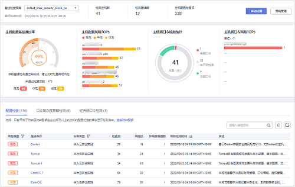
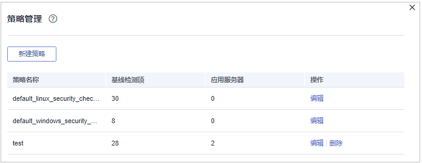
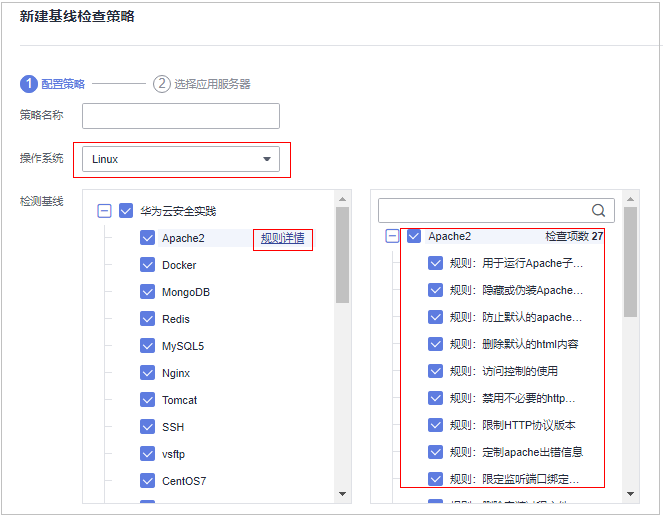
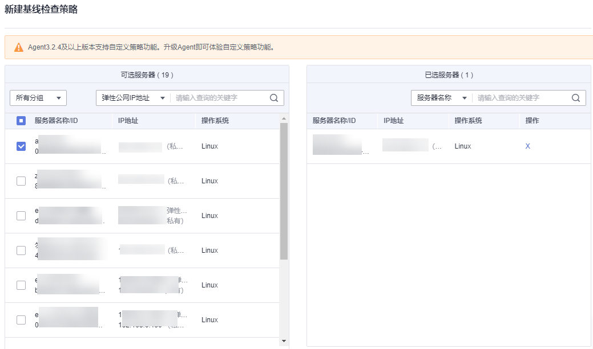
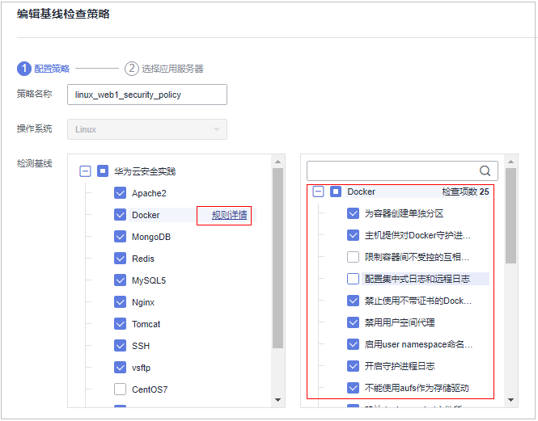
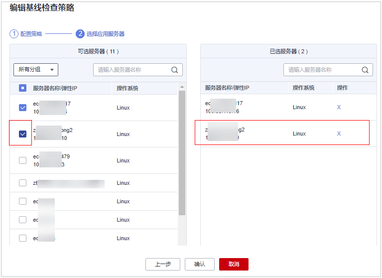

# 基线检查策略管理

您可通过新建、编辑、删除来管理手动检测时的基线检查策略，同时可对基线策略的检查项进行自定义编辑，根据需要创建不同的基线检查策略。

## 约束限制

-   在“风险预防  \>  基线检查  \>  策略管理“中的策略仅限于基线检查的“手动检测“时使用。若需对基线检查的基础策略进行编辑，操作详情请参见[编辑策略内容](编辑策略内容.md)章节中的“配置检测“和“弱口令检测“。
-   未开启防护的服务器不支持基线相关操作。

## 新建基线检查策略

1.  [登录管理控制台](https://console.huaweicloud.com/?locale=zh-cn)。
2.  在页面左上角选择“区域“，单击，选择“安全与合规 \> 主机安全服务”，进入主机安全平台界面。

    **图 1**  进入主机安全  
    

3.  在左侧导航树中，选择“风险预防  \>  基线检查“，进入基线检查页面。

    > **说明：** 
    >如果您的服务器已通过企业项目的模式进行管理，您可选择目标“企业项目“后查看或操作目标企业项目内的资产和检测信息。

    **图 2**  基线检查概览  
    

4.  单击页面右上角“策略管理“，进入策略列表页面。

    **图 3**  策略列表  
    

5.  单击“新建策略“，填写配置策略信息，参数说明如[表1](#table17682134017516)所示。

    鼠标滑动至基线名称右侧，单击“规则详情“，可以查看每个检查基线的详细信息。

    > **说明：** 
    >“操作系统“选择“Linux系统“时，所有“检测基线“项下的子基线支持自定义勾选检测规则检查项，Windows暂不支持。

    **图 4**  新建基线策略  
    

    **表 1**  新建基线策略信息

    
    <table><thead align="left"><tr id="row46809404512"><th class="cellrowborder" valign="top" width="12.1012101210121%" id="mcps1.2.4.1.1">
参数名称

    </th>
    <th class="cellrowborder" valign="top" width="56.89568956895689%" id="mcps1.2.4.1.2">
参数说明

    </th>
    <th class="cellrowborder" valign="top" width="31.003100310031%" id="mcps1.2.4.1.3">
取值样例

    </th>
    </tr>
    </thead>
    <tbody><tr id="row4681154095114"><td class="cellrowborder" valign="top" width="12.1012101210121%" headers="mcps1.2.4.1.1 ">
策略名称

    </td>
    <td class="cellrowborder" valign="top" width="56.89568956895689%" headers="mcps1.2.4.1.2 ">
自定义策略名称。

    </td>
    <td class="cellrowborder" valign="top" width="31.003100310031%" headers="mcps1.2.4.1.3 ">
linux_web1_security_policy

    </td>
    </tr>
    <tr id="row196815409511"><td class="cellrowborder" valign="top" width="12.1012101210121%" headers="mcps1.2.4.1.1 ">
操作系统

    </td>
    <td class="cellrowborder" valign="top" width="56.89568956895689%" headers="mcps1.2.4.1.2 ">
选择基线检测的目标系统。

    <ul id="ul1068184010515"><li>Linux</li><li>Windows</li></ul>
    </td>
    <td class="cellrowborder" valign="top" width="31.003100310031%" headers="mcps1.2.4.1.3 ">
Linux

    </td>
    </tr>
    <tr id="row768219402512"><td class="cellrowborder" valign="top" width="12.1012101210121%" headers="mcps1.2.4.1.1 ">
检测基线

    </td>
    <td class="cellrowborder" valign="top" width="56.89568956895689%" headers="mcps1.2.4.1.2 ">
自定义勾选支持的检测标准及类型，详情如下：

    <ul id="ul968210404514"><li>Linux系统：<ul id="hss_01_0146_ul2019810211077"><li>云安全实践：Apache2、Docker、MongoDB、Redis、MySQL5、Nginx、Tomcat、SSH、vsftp、CentOS7、EulerOS、EulerOS_ext、Kubernetes-Node、Kubernetes-Master。</li><li>等保合规：Apache2、MongoDB、MySQL5、Nginx、Tomcat、CentOS6、CentOS7、CentOS8、Debian9、Debian10、Debian11、Redhat6、Redhat7、Redhat8、Ubuntu12、Ubuntu14、Ubuntu16、Ubuntu18、Alma。</li></ul>
    </li><li>Windows系统：<ul id="hss_01_0146_ul10325481376"><li>云安全实践：MongoDB、Apache2、MySQL、Nginx、Redis、Tomcat、Windows_2008、Windows_2012、Windows_2016、Windows_2019。</li></ul>
    </li></ul>
    </td>
    <td class="cellrowborder" valign="top" width="31.003100310031%" headers="mcps1.2.4.1.3 ">
云安全实践：全选

    
等保合规：全选

    </td>
    </tr>
    </tbody>
    </table>

6.  确认填写信息无误，单击“下一步“，根据服务器名称、服务器ID、弹性公网IP地址或私有IP地址选择需要应用关联的服务器。

    **图 5**  选择应用的服务器  
    

7.  确认无误，单击“确认“，在策略管理页面新增1条基线策略，新建完成。

## 编辑基线检查策略

1.  登录管理控制台，进入主机安全服务页面。
2.  在左侧导航树中，选择“风险预防  \>  基线检查“，进入基线检查页面。

    > **说明：** 
    >如果您的服务器已通过企业项目的模式进行管理，您可选择目标“企业项目“后查看或操作目标企业项目内的资产和检测信息。

    **图 6**  基线检查概览  
    

3.  单击页面右上角“策略管理“，进入策略列表页面。

    **图 7**  策略列表  
    

4.  单击目标策略“操作“列的“编辑“，进入策略详情页面，可对策略名称、检测基线项进行修改。

    > **说明：** 
    >“操作系统“选择“Linux系统“时，所有“检测基线“项下的子基线支持自定义勾选检测规则检查项，Windows暂不支持。

    **图 8**  编辑基线检查策略  
    

5.  确认修改无误，单击“下一步“，编辑需要应用的服务器。

    **图 9**  编辑应用服务器  
    

6.  确认无误，单击“确认“，编辑完成，可在“策略管理“页面查看目标策略编辑后的信息。

## 删除基线检查策略

1.  登录管理控制台，进入主机安全服务页面。
2.  在左侧导航树中，选择“风险预防  \>  基线检查“，进入基线检查页面。

    > **说明：** 
    >如果您的服务器已通过企业项目的模式进行管理，您可选择目标“企业项目“后查看或操作目标企业项目内的资产和检测信息。

    **图 10**  基线检查概览  
    

3.  单击页面右上角“策略管理“，进入策略列表页面。

    **图 11**  策略列表  
    

4.  单击目标策略“操作“列的“删除“，在弹窗确认删除的信息无误，单击“确认“，完成删除。

