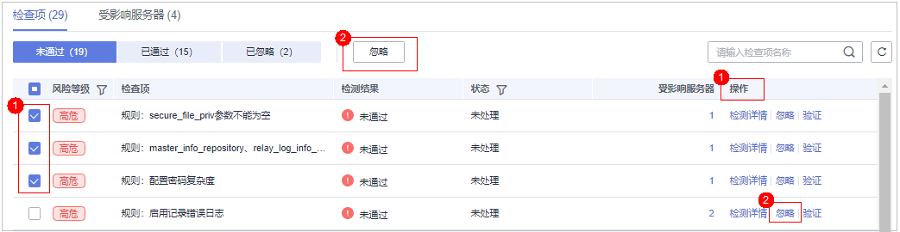

# 基线检查风险项修复及验证

当基线检查功能检测到并提示您服务器上存在的风险项时，请参考如下风险项修复建议为您的服务器进行安全加固。

## 约束限制

未开启防护的服务器不支持基线相关操作。

## 口令复杂度策略修改

-   如需监测Linux主机中的口令复杂度策略，请先在主机中安装PAM（Pluggable Authentication Modules），详细操作请参见[如何为Linux主机安装PAM？](https://support.huaweicloud.com/hss2.0_faq/hss_01_0043.html)
-   修改Linux主机中口令复杂度策略的详细操作请参见[如何在Linux主机上设置口令复杂度策略？](https://support.huaweicloud.com/hss2.0_faq/hss_01_0043.html#section1)
-   修改Windows主机中口令复杂度策略的详细操作请参见[如何在Windows主机上设置口令复杂度策略？](https://support.huaweicloud.com/hss2.0_faq/hss_01_0095.html)

**验证**：完成口令复杂度策略修改后，建议您单击基线检查页面上方的“手动检测“，查看修复结果。如果您未进行手动验证，HSS会在次日凌晨执行自动验证。

## 弱口令修复

-   为保障您的主机安全，请您及时修改登录主机系统时使用弱口令的账号，如SSH账号。
-   为保障您主机内部数据信息的安全，请您及时修改使用弱口令的软件账号，如MySQL账号和FTP账号等。

**验证**：完成弱口令修复后，建议您立即执行手动检测，查看弱口令修复结果。如果您未进行手动验证，HSS会在次日凌晨执行自动验证。

## 单服务器风险修复及验证

系统中的关键应用如果采用不安全配置，有可能被黑客利用作为入侵主机系统的手段。例如：SSH采用了不安全的加密算法；Tomcat服务采用root权限启动。

HSS可以检测系统中关键软件的配置风险并给出详细的加固方法。

1.  在HSS控制台选择“资产管理  \>  主机管理  \>  云服务器“，进入服务器页面。

    > **说明：** 
    >如果您的服务器已通过企业项目的模式进行管理，您可选择目标“企业项目“后查看或操作目标企业项目内的资产和检测信息。

2.  搜索目标服务器，单击目标服务器名称进入服务器详情页面。

    **图 1**  定位目标服务器  
    

3.  选择“基线检查  \>  配置检查“页签，单击风险项前的展开按钮，查看所有检查项。

    **图 2**  查看单主机检查项详情  
    

4.  处理风险项。
    -   忽略风险

        在目标检查项“操作“列单击“忽略“，忽略单条风险检查项。

        勾选多个目标检查项前的选框，单击上方出现的“忽略“按钮，进行批量忽略处理。

        **图 3**  单服务器忽略风险  
        

    -   修复风险
        1.  单击目标风险项“操作“列的“检查详情“，查看检查项详情。
        2.  查看“审计描述“、“修改建议“等信息，根据“修改建议“修复主机中的异常信息。

            > **说明：** 
            >-   目前部分EulerOS基线和CentOS 8已支持一键修复，单击目标EulerOS或CentOS的“检查项““操作“列的“修复“，可直接修复检查项，部分检查项修复时需填写参数值，保持默认值即可。
            >-   建议您及时优先修复“威胁等级“为“高危“的关键配置，根据业务实际情况修复威胁等级为“中危“或“低危“的关键配置。

            **图 4**  单服务器查看修复建议  
            

    -   验证风险

        若目标检查项已做修复处理，您可通过验证来更新目标检查项状态。

        若状态为修复失败，可单击“查看原因“查看修复失败的原因，排除问题后可再次进行修复。

        > **说明：** 
        >-   Windows暂不支持基线验证。
        >-   Linux支持验证的基线：Apache2、Docker、MongoDB、Redis、MySQL5、Nginx、Tomcat、SSH、vsftp、CentOS6、CentOS7、CentOS8、EulerOS、Debian9、Debian10、Debian11、Redhat6、Redhat7、Redhat8、Ubuntu12、Ubuntu14、Ubuntu16、Ubuntu18。

        1.  单击目标风险项“操作“列的“验证“。
        2.  在弹窗单击“确认“，“状态“变更为“验证中“，系统开始自动验证，验证结束后查看“状态“的变化。

## 全量服务器风险修复及验证

系统中的关键应用如果采用不安全配置，有可能被黑客利用作为入侵主机系统的手段。例如：SSH采用了不安全的加密算法；Tomcat服务采用root权限启动。

HSS可以检测系统中关键软件的配置风险并给出详细的加固方法。

1.  [登录管理控制台](https://console.huaweicloud.com/?locale=zh-cn)。
2.  在页面左上角选择“区域“，单击，选择“安全与合规 \> 主机安全服务”，进入主机安全平台界面。

    **图 5**  进入主机安全  
    

3.  在左侧导航树中，选择“风险预防  \>  基线检查“，进入基线检查页面。

    > **说明：** 
    >如果您的服务器已通过企业项目的模式进行管理，您可选择目标“企业项目“后查看或操作目标企业项目内的资产和检测信息。

4.  选择“配置检查“页签，查看所有服务器的配置检查风险项，参数说明如[表1](#hss_01_0146_table134691656201019)所示。

    如果您需要查看指定基线检查策略下服务器的配置检查结果统计，您可以在基线检查策略栏选择目标基线检查策略后查看。

    **图 6**  查看配置检查统计  
    

    **表 1**  配置检查参数说明

    
    <table><thead align="left"><tr id="hss_01_0146_row11469556171012"><th class="cellrowborder" valign="top" width="15.43%" id="mcps1.2.3.1.1">
参数名称

    </th>
    <th class="cellrowborder" valign="top" width="84.57000000000001%" id="mcps1.2.3.1.2">
参数说明

    </th>
    </tr>
    </thead>
    <tbody><tr id="hss_01_0146_row24691456171015"><td class="cellrowborder" valign="top" width="15.43%" headers="mcps1.2.3.1.1 ">
风险等级

    </td>
    <td class="cellrowborder" valign="top" width="84.57000000000001%" headers="mcps1.2.3.1.2 ">
按照基线标准匹配检测结果划分的等级。

    <ul id="hss_01_0146_ul1234183411410"><li>高危</li><li>低危</li><li>中危</li><li>无风险</li></ul>
    </td>
    </tr>
    <tr id="hss_01_0146_row947085611100"><td class="cellrowborder" valign="top" width="15.43%" headers="mcps1.2.3.1.1 ">
基线名称

    </td>
    <td class="cellrowborder" valign="top" width="84.57000000000001%" headers="mcps1.2.3.1.2 ">
检测执行的基线的名称。

    </td>
    </tr>
    <tr id="hss_01_0146_row14701056131012"><td class="cellrowborder" valign="top" width="15.43%" headers="mcps1.2.3.1.1 ">
标准类型

    </td>
    <td class="cellrowborder" valign="top" width="84.57000000000001%" headers="mcps1.2.3.1.2 ">
检测执行的基线所属策略的标准类型。

    <ul id="hss_01_0146_ul1980215891513"><li>云安全实践</li><li>等保合规</li></ul>
    </td>
    </tr>
    <tr id="hss_01_0146_row14470156191016"><td class="cellrowborder" valign="top" width="15.43%" headers="mcps1.2.3.1.1 ">
检查项

    </td>
    <td class="cellrowborder" valign="top" width="84.57000000000001%" headers="mcps1.2.3.1.2 ">
累计检查的配置项总数。

    </td>
    </tr>
    <tr id="hss_01_0146_row94709567102"><td class="cellrowborder" valign="top" width="15.43%" headers="mcps1.2.3.1.1 ">
风险项

    </td>
    <td class="cellrowborder" valign="top" width="84.57000000000001%" headers="mcps1.2.3.1.2 ">
检查项中存在风险的配置项总数。

    </td>
    </tr>
    <tr id="hss_01_0146_row847117569107"><td class="cellrowborder" valign="top" width="15.43%" headers="mcps1.2.3.1.1 ">
影响服务器数

    </td>
    <td class="cellrowborder" valign="top" width="84.57000000000001%" headers="mcps1.2.3.1.2 ">
目标风险基线所影响的服务器总数。

    </td>
    </tr>
    <tr id="hss_01_0146_row114919295115"><td class="cellrowborder" valign="top" width="15.43%" headers="mcps1.2.3.1.1 ">
最新检测时间

    </td>
    <td class="cellrowborder" valign="top" width="84.57000000000001%" headers="mcps1.2.3.1.2 ">
最近一次检测的时间。

    </td>
    </tr>
    <tr id="hss_01_0146_row104711956101020"><td class="cellrowborder" valign="top" width="15.43%" headers="mcps1.2.3.1.1 ">
描述

    </td>
    <td class="cellrowborder" valign="top" width="84.57000000000001%" headers="mcps1.2.3.1.2 ">
目标风险基线的描述说明。

    </td>
    </tr>
    </tbody>
    </table>

5.  单击列表中目标基线名称，查看目标基线描述、受影响服务器以及所有检查项详情。

    **图 7**  查看基线检查详情  
    

6.  处理风险项。
    -   忽略风险

        在目标检查项“操作“列单击“忽略“，忽略单条风险检查项。

        勾选多个目标检查项前的选框，单击上方出现的“忽略“按钮，进行批量忽略处理。

        **图 8**  忽略风险  
        

    -   修复风险
        1.  单击目标风险项“操作“列的“检查详情“，查看检查项详情。
        2.  查看“审计描述“、“修改建议“等信息，根据“修改建议“或“检测用例信息“的“期望结果“修复主机中的异常信息。

            > **说明：** 
            >-   目前部分EulerOS基线和CentOS 8已支持一键修复，单击目标EulerOS或CentOS的“检查项““操作“列的“修复“，可直接修复检查项，部分检查项修复时需填写参数值，保持默认值即可。
            >-   建议您及时优先修复“威胁等级“为“高危“的关键配置，根据业务实际情况修复威胁等级为“中危“或“低危“的关键配置。

            **图 9**  查看修复建议  
            

        3.  单击“受影响服务器“，查看该检查项影响的服务器。

            单击“验证“，可更新受影响的服务器列表。

            **图 10**  查看受影响服务器  
            

    -   验证风险

        若目标检查项已做修复处理，您可通过验证来更新目标检查项状态。

        若状态为修复失败，可单击“查看原因“查看修复失败的原因，排除问题后可再次进行修复。

        > **说明：** 
        >-   Windows暂不支持基线验证。
        >-   Linux支持验证的基线：Apache2、Docker、MongoDB、Redis、MySQL5、Nginx、Tomcat、SSH、vsftp、CentOS6、CentOS7、CentOS8、EulerOS、Debian9、Debian10、Debian11、Redhat6、Redhat7、Redhat8、Ubuntu12、Ubuntu14、Ubuntu16、Ubuntu18。

        1.  单击目标风险项“操作“列的“验证“。
        2.  在弹窗单击“确认“，“状态“变更为“验证中“，系统开始自动验证，验证结束后查看“状态“的变化。

