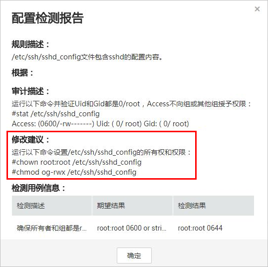

# 基线检查风险项修复建议

当基线检查功能检测到并提示您服务器上存在的风险项时，请参考如下风险项修复建议为您的服务器进行安全加固。

## 增强口令复杂度策略

-   如需监测Linux主机中的口令复杂度策略，请先在主机中安装PAM（Pluggable Authentication Modules），详细操作请参见[如何为Linux主机安装PAM？](https://support.huaweicloud.com/hss_faq/hss_01_0043.html)。

-   修改Linux主机中口令复杂度策略的详细操作请参见[如何在Linux主机上设置口令复杂度策略](https://support.huaweicloud.com/hss_faq/hss_01_0043.html#section1)。
-   修改Windows主机中口令复杂度策略的详细操作请参见[如何在Windows主机上设置口令复杂度策略](https://support.huaweicloud.com/hss_faq/hss_01_0095.html)。

**验证**：完成口令复杂度策略修改后，建议您立即执行手动检测，查看修复结果。如果您未进行手动验证，HSS会在次日凌晨执行自动验证。

## 存在弱口令

-   为保障您的主机安全，请您及时修改登录主机系统时使用弱口令的账号，如SSH账号。
-   为保障您主机内部数据信息的安全，请您及时修改使用弱口令的软件账号，如MySQL账号和FTP账号等。

**验证**：完成弱口令修复后，建议您立即执行手动检测，查看弱口令修复结果。如果您未进行手动验证，HSS会在次日凌晨执行自动验证。

## 存在风险账号

您可以根据风险账号检测结果中的信息删除主机中无用的账号，按照权限最小化原则限制主机中可疑账号的权限。

-   删除可疑账号
    -   删除主机中无用的系统登录账号，如SSH账号。
    -   删除主机中MySQL、FTP使用的无用的账号。

-   限制账号权限

    通过限制关键配置项，限制非管理员的文件访问权限和文件修改权限，防止未授权的访问权限和使用操作。

## 存在配置风险

系统中的关键应用如果采用不安全配置，有可能被黑客利用作为入侵主机系统的手段。例如：SSH采用了不安全的加密算法；Tomcat服务采用root权限启动。

HSS可以检测系统中关键软件的配置风险并给出详细的加固方法。查看风险项的具体内容和建议的操作步骤如下：

-   修改有风险的配置项

    [查看配置检测报告](https://support.huaweicloud.com/hss_faq/hss_01_0149.html)，您可以根据“审计描述“验证检测结果，根据“修改建议“处理主机中的异常信息。

    建议您及时优先修复“威胁等级“为“高危“的关键配置，根据业务实际情况修复威胁等级为“中危“或“低危“的关键配置。

    **图 1**  配置检测报告  
    

-   忽略可信任的配置项

    选中单个存在风险的检测规则，单击操作列的“忽略“进行单个忽略。也可以选中多个检测规则，单击列表左上角的“忽略“批量进行忽略。

    对于已经忽略的检测规则，可以单击操作列的“取消忽略“，单个进行取消忽略，也可以批量选中想要取消忽略的规则撤销忽略。

验证：完成配置项的修复后，建议您立即执行手动检测，查看配置项修复结果。如果您未进行手动验证，HSS会在次日凌晨执行自动验证。

