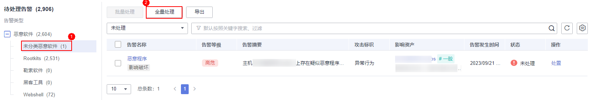

# 处理主机告警事件

主机安全服务可对您已开启的告警防御能力提供总览数据，帮助您快速了解安全告警概况包括需紧急处理告警、告警总数、存在告警的服务器、已拦截IP和已隔离文件等。

事件列表仅保留近30天内发生的告警事件，您可以根据自己的业务需求，自行判断并处理告警，快速清除资产中的安全威胁。

告警事件处理完成后，告警事件将从“未处理“状态转化为“已处理“。

> **说明：** 
>AV检测和HIPS检测的告警分类会按照具体的告警情况在不同的告警类型中呈现。
>-   AV检测告警结果只在恶意软件下的不同类别呈现。
>-   HIPS检测的告警结果会根据实际种类在所有类型的子类别中呈现。

## 约束与限制

-   若不需要检测高危命令执行、提权操作、反弹Shell、异常Shell或者Webshell，您可以通过“策略管理“页面手动关闭指定策略的检测。关闭检测后，HSS不对策略组关联的服务器进行检测，详细信息请参见[查看和创建策略组](https://support.huaweicloud.com/usermanual-hss2.0/hss_01_0045.html)。
-   其他检测项不允许手动关闭检测。
-   未开启防护的服务器不支持告警事件相关操作。

## 操作步骤

当发生安全告警事件后，为了保障您的云服务器安全，可以根据以下方式处理安全告警事件。

> **说明：** 
>由于网络攻击手段、病毒样本在不断演变，实际的业务环境也有不同差异，因此，无法保证能实时检测防御所有的未知威胁，建议您基于安全告警处理、漏洞、基线检查等安全能力，提升整体安全防线，预防黑客入侵、盗取或破坏业务数据。

1.  [登录管理控制台](https://console.huaweicloud.com/?locale=zh-cn)。
2.  在页面左上角选择“区域“，单击，选择“安全与合规 \> 主机安全服务”，进入主机安全平台界面。

    **图 1**  进入主机安全  
    

3.  在左侧导航栏中，单击“入侵检测  \>  安全告警事件  \>  主机安全告警“，进入“主机安全告警“页面。

    > **说明：** 
    >如果您的服务器已通过企业项目的模式进行管理，您可选择目标“企业项目“后查看或操作目标企业项目内的资产和检测信息。

    **表 1**  安全告警统计说明

    
    <table><thead align="left"><tr id="hss_01_0026_row75072811434"><th class="cellrowborder" valign="top" width="17.150000000000002%" id="mcps1.2.3.1.1">
参数名称

    </th>
    <th class="cellrowborder" valign="top" width="82.85%" id="mcps1.2.3.1.2">
告警事件状态说明

    </th>
    </tr>
    </thead>
    <tbody><tr id="hss_01_0026_row2050528194316"><td class="cellrowborder" valign="top" width="17.150000000000002%" headers="mcps1.2.3.1.1 ">
企业项目

    </td>
    <td class="cellrowborder" valign="top" width="82.85%" headers="mcps1.2.3.1.2 ">
自定义选择企业项目，按照企业项目的维度查看告警详情。

    </td>
    </tr>
    <tr id="hss_01_0026_row1650152810431"><td class="cellrowborder" valign="top" width="17.150000000000002%" headers="mcps1.2.3.1.1 ">
时间范围

    </td>
    <td class="cellrowborder" valign="top" width="82.85%" headers="mcps1.2.3.1.2 ">
支持选择固定周期，支持自定义查询告警的时间范围，自定义只能选择30天范围内的查询。

    
固定周期可选择如下：

    <ul id="hss_01_0026_ul950328154311"><li>最近24小时</li><li>最近3天</li><li>最近7天</li><li>最近30天</li></ul>
    </td>
    </tr>
    <tr id="hss_01_0026_row1394317172210"><td class="cellrowborder" valign="top" width="17.150000000000002%" headers="mcps1.2.3.1.1 ">
需紧急处理告警

    </td>
    <td class="cellrowborder" valign="top" width="82.85%" headers="mcps1.2.3.1.2 ">
展示需紧急处理告警的数量。

    </td>
    </tr>
    <tr id="hss_01_0026_row820367202319"><td class="cellrowborder" valign="top" width="17.150000000000002%" headers="mcps1.2.3.1.1 ">
告警总数

    </td>
    <td class="cellrowborder" valign="top" width="82.85%" headers="mcps1.2.3.1.2 ">
展示资产中存在的所有告警数量。

    </td>
    </tr>
    <tr id="hss_01_0026_row1051112810434"><td class="cellrowborder" valign="top" width="17.150000000000002%" headers="mcps1.2.3.1.1 ">
存在告警的服务器

    </td>
    <td class="cellrowborder" valign="top" width="82.85%" headers="mcps1.2.3.1.2 ">
展示存在告警的服务器数量。

    
当查看“最近24小时”存在告警情况时，您可以单击存在告警的服务器数值，跳转到“主机管理”界面查看相应的服务器列表。

    </td>
    </tr>
    <tr id="hss_01_0026_row0518283434"><td class="cellrowborder" valign="top" width="17.150000000000002%" headers="mcps1.2.3.1.1 ">
已处理告警事件

    </td>
    <td class="cellrowborder" valign="top" width="82.85%" headers="mcps1.2.3.1.2 ">
展示您资产中所有已处理的告警事件数量。

    </td>
    </tr>
    <tr id="hss_01_0026_row251628114310"><td class="cellrowborder" valign="top" width="17.150000000000002%" headers="mcps1.2.3.1.1 ">
已拦截IP

    </td>
    <td class="cellrowborder" valign="top" width="82.85%" headers="mcps1.2.3.1.2 ">
展示已拦截的IP。单击“已拦截IP”，可查看已拦截的IP地址列表。

    
已拦截IP列表展示“服务器名称”、“攻击源IP”、“登录类型”、“拦截状态”、“拦截次数”、“开始拦截时间”、“最近拦截时间”。

    
如果您发现有合法IP被误封禁（比如运维人员因为记错密码，多次输错密码导致被封禁），可以手工解除拦截。如果发现某个主机被频繁攻击，需要引起重视，建议及时修补漏洞，处理风险项。

    
 须知： 
<ul id="hss_01_0026_ul1052152816435"><li>解除被拦截的IP后，主机将不会再拦截该IP地址对主机执行的操作。</li><li>每种软件最多拦截10000个ip。
如果您的linux主机不支持ipset，mysql和vsftp最多拦截50个ip。

    
如果您的linux主机既不支持ipset不支持hosts.deny，ssh最多拦截50个ip。

    </li></ul>
    

    </td>
    </tr>
    <tr id="hss_01_0026_row75272894316"><td class="cellrowborder" valign="top" width="17.150000000000002%" headers="mcps1.2.3.1.1 ">
已隔离文件

    </td>
    <td class="cellrowborder" valign="top" width="82.85%" headers="mcps1.2.3.1.2 ">
主机安全可对检测到的威胁文件进行隔离处理，被成功隔离的文件会添加到“主机安全告警”的“文件隔离箱”中。

    
被成功隔离的文件一直保留在文件隔离箱中，您可以根据自己的需要进行一键恢复处理，关于文件隔离箱的详细信息，请参见<a href="管理文件隔离箱.md">管理文件隔离箱</a>。

    </td>
    </tr>
    </tbody>
    </table>

4.  单击告警名称，查看告警信息和处理建议。
5.  处理告警事件。

    > **说明：** 
    >告警事件展示在“主机安全告警“页面中，事件列表仅展示最近30天的告警事件。
    >您需要根据自己的业务需求，自行判断并处理告警。告警事件处理完成后，告警事件将从“未处理“状态变更为“已处理“。HSS将不再对已处理的事件进行统计，并且不在“总览“页展示。

    -   处理单个告警事件

        在目标告警事件所在行的操作列，单击“处置“。

    -   批量处理告警事件

        勾选所有目标告警事件，并在告警事件列表上方单击“批量处理“。

    -   全量处理告警事件

        在告警列表左侧的“待处理告警“栏，选择一类告警类型，并在告警事件列表上方单击“全量处理“。

        **图 2**  全量处理告警事件  
        

6.  在“处理告警事件“弹窗中，选择处理方式。处理方式说明请参见[表 告警事件处理方式说明](#table023915918117)。

    处理单个告警事件或批量处理告警事件时，可在“处理告警事件“弹窗中勾选“同时处理重复告警“，将重复告警一并处理。

    **表 2**  告警事件处理方式说明

    
    <table><thead align="left"><tr id="row1824018971112"><th class="cellrowborder" valign="top" width="14.46%" id="mcps1.2.3.1.1">
处理方式

    </th>
    <th class="cellrowborder" valign="top" width="85.54%" id="mcps1.2.3.1.2">
处理方式说明

    </th>
    </tr>
    </thead>
    <tbody><tr id="row1824049171115"><td class="cellrowborder" valign="top" width="14.46%" headers="mcps1.2.3.1.1 ">
忽略

    </td>
    <td class="cellrowborder" valign="top" width="85.54%" headers="mcps1.2.3.1.2 ">
仅忽略本次告警。若再次出现相同的告警信息，HSS会再次告警。

    </td>
    </tr>
    <tr id="row4240159141116"><td class="cellrowborder" valign="top" width="14.46%" headers="mcps1.2.3.1.1 ">
隔离查杀

    </td>
    <td class="cellrowborder" valign="top" width="85.54%" headers="mcps1.2.3.1.2 ">
选择隔离查杀后，该程序无法执行“读/写”操作，同时该程序的进程将被立即终止。HSS将程序或者进程的源文件加入文件隔离箱，被隔离的文件不会对主机造成威胁。

    
您可以单击“文件隔离箱”，查看已隔离的文件，详细信息请参见<a href="管理文件隔离箱.md">管理文件隔离箱</a>。

    
对应告警事件支持隔离查杀的情况详情请参见<a href="主机安全告警事件概述.md">主机安全告警事件概述</a>。

    
 说明： 

程序被隔离查杀时，该程序的进程将被立即终止，为避免影响业务，请及时确认检测结果，若隔离查杀有误报，您可以执行取消隔离/忽略操作。

    

    </td>
    </tr>
    <tr id="row62415919119"><td class="cellrowborder" valign="top" width="14.46%" headers="mcps1.2.3.1.1 ">
手动处理

    </td>
    <td class="cellrowborder" valign="top" width="85.54%" headers="mcps1.2.3.1.2 ">
选择手动处理。您可以根据自己的需要为该事件添加“备注”信息，方便您记录手动处理该告警事件的详细信息。

    </td>
    </tr>
    <tr id="row821142242614"><td class="cellrowborder" valign="top" width="14.46%" headers="mcps1.2.3.1.1 ">
加入进程白名单

    </td>
    <td class="cellrowborder" valign="top" width="85.54%" headers="mcps1.2.3.1.2 ">
如果确认是可信进程的运行触发告警事件，您不希望HSS再上报该告警，您可以将应用进程告警事件加入进程白名单。

    </td>
    </tr>
    <tr id="row1624113911110"><td class="cellrowborder" valign="top" width="14.46%" headers="mcps1.2.3.1.1 ">
加入登录白名单

    </td>
    <td class="cellrowborder" valign="top" width="85.54%" headers="mcps1.2.3.1.2 ">
如果确认“暴力破解”和“异常登录”类型的告警事件是误报，且不希望HSS再上报该告警，您可以将本次登录告警事件加入登录白名单。

    
HSS不会对登录白名单内的登录事件上报告警。加入登录白名单后，若再次出现该登录事件，则HSS不会告警。

    
有以下告警事件支持加入登录白名单。

    <ul id="ul4242795113"><li>暴力破解</li><li>异常登录</li></ul>
    </td>
    </tr>
    <tr id="row224259111116"><td class="cellrowborder" valign="top" width="14.46%" headers="mcps1.2.3.1.1 ">
加入告警白名单

    </td>
    <td class="cellrowborder" valign="top" width="85.54%" headers="mcps1.2.3.1.2 ">
如果确认以下类型的告警事件是误报，且不希望HSS再上报该告警，您可以将本次告警事件加入告警白名单。

    
HSS不会对告警白名单内的告警事件上报告警。加入告警白名单后，若再次出现该告警事件，则HSS不会告警。

    
选中“加入告警白名单”后，可单击“新增规则”，自定义设置需要屏蔽的文件路径、进程路径或进程命令行，当HSS检测到的告警事件相等或包含您填写的规则信息时，HSS不会告警。

    
对应告警事件支持隔离查杀的情况详情请参见<a href="主机安全告警事件概述.md">主机安全告警事件概述</a>。

    </td>
    </tr>
    </tbody>
    </table>

7.  单击“确认“，完成处理。

    告警事件处理完成后，您可以查看已处理的告警，详细操作请参见[历史处置记录](历史处置记录.md)

