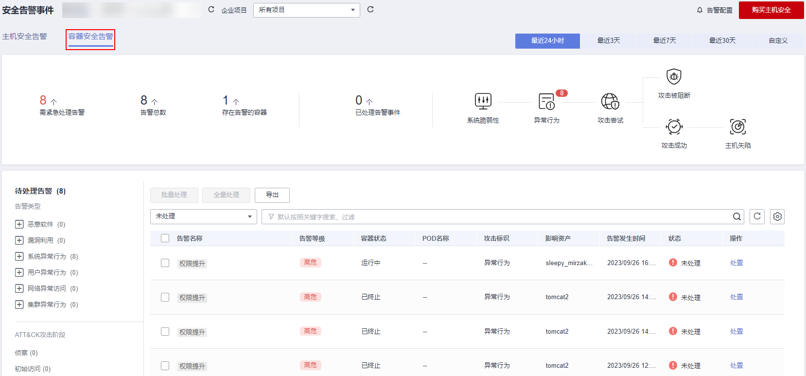
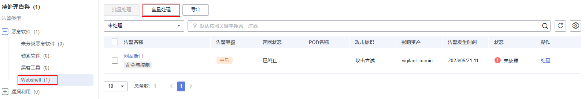

# 处理容器告警事件

主机安全服务可对您已开启的告警防御能力提供总览数据，帮助您快速了解安全告警概况包括需紧急处理告警、告警总数、存在告警的容器、已处理告警事件

事件列表仅保留近30天内发生的告警事件，您可以根据自己的业务需求，自行判断并处理告警，快速清除资产中的安全威胁。

告警事件处理完成后，告警事件将从“未处理“状态转化为“已处理“。

## 约束限制

未开启防护的服务器不支持告警事件相关操作。

## 操作步骤

当发生安全告警事件后，为了保障您的云服务器安全，可以根据以下方式处理安全告警事件。

> **说明：** 
>由于网络攻击手段、病毒样本在不断演变，实际的业务环境也有不同差异，因此，无法保证能实时检测防御所有的未知威胁，建议您基于安全告警处理、漏洞、基线检查等安全能力，提升整体安全防线，预防黑客入侵、盗取或破坏业务数据。

1.  [登录管理控制台](https://console.huaweicloud.com/?locale=zh-cn)。
2.  在页面左上角选择“区域“，单击，选择“安全与合规 \> 主机安全服务”，进入主机安全平台界面。

    **图 1**  进入主机安全  
    

3.  在左侧导航栏中，单击“入侵检测  \>  安全告警事件  \>  容器安全告警“，进入“容器安全告警“页面。

    **图 2**  容器安全告警  
    

    **表 1**  安全告警统计说明

    
    <table><thead align="left"><tr id="zh-cn_topic_0000001150709164_row1258817180217"><th class="cellrowborder" valign="top" width="19.08%" id="mcps1.2.3.1.1">
告警事件状态

    </th>
    <th class="cellrowborder" valign="top" width="80.92%" id="mcps1.2.3.1.2">
告警事件状态说明

    </th>
    </tr>
    </thead>
    <tbody><tr id="row220173610310"><td class="cellrowborder" valign="top" width="19.08%" headers="mcps1.2.3.1.1 ">
需紧急处理告警

    </td>
    <td class="cellrowborder" valign="top" width="80.92%" headers="mcps1.2.3.1.2 ">
展示需紧急处理告警的数量。

    </td>
    </tr>
    <tr id="row1752953912316"><td class="cellrowborder" valign="top" width="19.08%" headers="mcps1.2.3.1.1 ">
告警总数

    </td>
    <td class="cellrowborder" valign="top" width="80.92%" headers="mcps1.2.3.1.2 ">
展示资产中存在的所有告警数量。

    </td>
    </tr>
    <tr id="row91664437311"><td class="cellrowborder" valign="top" width="19.08%" headers="mcps1.2.3.1.1 ">
存在告警的容器

    </td>
    <td class="cellrowborder" valign="top" width="80.92%" headers="mcps1.2.3.1.2 ">
展示存在告警的容器数量。

    </td>
    </tr>
    <tr id="zh-cn_topic_0000001150709164_row125883181627"><td class="cellrowborder" valign="top" width="19.08%" headers="mcps1.2.3.1.1 ">
已处理告警事件

    </td>
    <td class="cellrowborder" valign="top" width="80.92%" headers="mcps1.2.3.1.2 ">
展示您资产中所有已处理的告警事件数量。

    </td>
    </tr>
    </tbody>
    </table>

4.  单击告警名称，查看告警信息和处理建议。
5.  处理告警事件。

    > **说明：** 
    >告警事件展示在“容器安全告警“页面中，事件列表仅展示最近30天的告警事件。
    >您需要根据自己的业务需求，自行判断并处理告警。告警事件处理完成后，告警事件将从“未处理“状态变更为“已处理“。HSS将不再对已处理的事件进行统计。

    -   处理单个告警事件

        在目标告警事件所在行的操作列，单击“处置“。

    -   批量处理告警事件

        勾选所有目标告警事件，并在告警事件列表上方单击“批量处理“。

    -   全量处理告警事件

        在告警列表左侧的“待处理告警“栏，选择一类告警类型，并在告警事件列表上方单击“全量处理“。

        **图 3**  全量处理告警事件  
        

6.  在“处理告警事件“弹窗中，选择处理方式。处理方式说明请参见[表 告警事件处理方式说明](#table023915918117)。

    处理单个告警事件或批量处理告警事件时，可在“处理告警事件“弹窗中勾选“同时处理重复告警“，将重复告警一并处理。

    **表 2**  告警事件处理方式说明

    
    <table><thead align="left"><tr id="row1824018971112"><th class="cellrowborder" valign="top" width="14.46%" id="mcps1.2.3.1.1">
处理方式

    </th>
    <th class="cellrowborder" valign="top" width="85.54%" id="mcps1.2.3.1.2">
处理方式说明

    </th>
    </tr>
    </thead>
    <tbody><tr id="row1824049171115"><td class="cellrowborder" valign="top" width="14.46%" headers="mcps1.2.3.1.1 ">
忽略

    </td>
    <td class="cellrowborder" valign="top" width="85.54%" headers="mcps1.2.3.1.2 ">
仅忽略本次告警。若再次出现相同的告警信息，HSS会再次告警。

    </td>
    </tr>
    <tr id="row62415919119"><td class="cellrowborder" valign="top" width="14.46%" headers="mcps1.2.3.1.1 ">
手动处理

    </td>
    <td class="cellrowborder" valign="top" width="85.54%" headers="mcps1.2.3.1.2 ">
选择手动处理。您可以根据自己的需要为该事件添加“备注”信息，方便您记录手动处理该告警事件的详细信息。

    </td>
    </tr>
    <tr id="row1624113911110"><td class="cellrowborder" valign="top" width="14.46%" headers="mcps1.2.3.1.1 ">
加入登录白名单

    </td>
    <td class="cellrowborder" valign="top" width="85.54%" headers="mcps1.2.3.1.2 ">
如果确认“暴力破解”和“异常登录”类型的告警事件是误报，且不希望HSS再上报该告警，您可以将本次登录告警事件加入登录白名单。

    
HSS不会对登录白名单内的登录事件上报告警。加入登录白名单后，若再次出现该登录事件，则HSS不会告警。

    
有以下告警事件支持加入登录白名单。

    <ul id="ul4242795113"><li>暴力破解</li><li>异常登录</li></ul>
    </td>
    </tr>
    <tr id="row04458178216"><td class="cellrowborder" valign="top" width="14.46%" headers="mcps1.2.3.1.1 ">
加入进程白名单

    </td>
    <td class="cellrowborder" valign="top" width="85.54%" headers="mcps1.2.3.1.2 ">
如果确认是可信进程的运行触发告警事件，您不希望HSS再上报该告警，您可以将应用进程告警事件加入进程白名单。

    </td>
    </tr>
    <tr id="row224259111116"><td class="cellrowborder" valign="top" width="14.46%" headers="mcps1.2.3.1.1 ">
加入告警白名单

    </td>
    <td class="cellrowborder" valign="top" width="85.54%" headers="mcps1.2.3.1.2 ">
如果确认告警事件是误报，且不希望HSS再上报该告警，您可以将本次告警事件加入告警白名单。

    
HSS不会对告警白名单内的告警事件上报告警。加入告警白名单后，若再次出现该告警事件，则HSS不会告警。

    
选中“加入告警白名单”后，可单击“新增规则”，自定义设置需要屏蔽的文件路径、进程路径或进程命令行，当HSS检测到的告警事件相等或包含您填写的规则信息时，HSS不会告警。

    
对应告警事件支持隔离查杀的情况详情请参见<a href="容器安全告警事件概述.md">容器安全告警事件概述</a>。

    </td>
    </tr>
    </tbody>
    </table>

7.  单击“确认“，完成处理。

    告警事件处理完成后，您可以查看已处理的告警，详细操作请参见[历史处置记录](历史处置记录.md)

