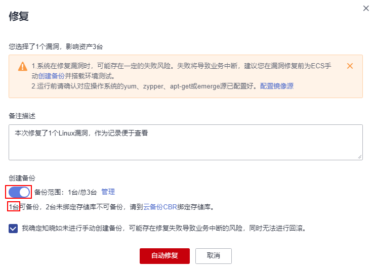
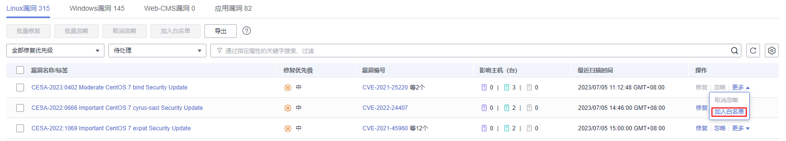
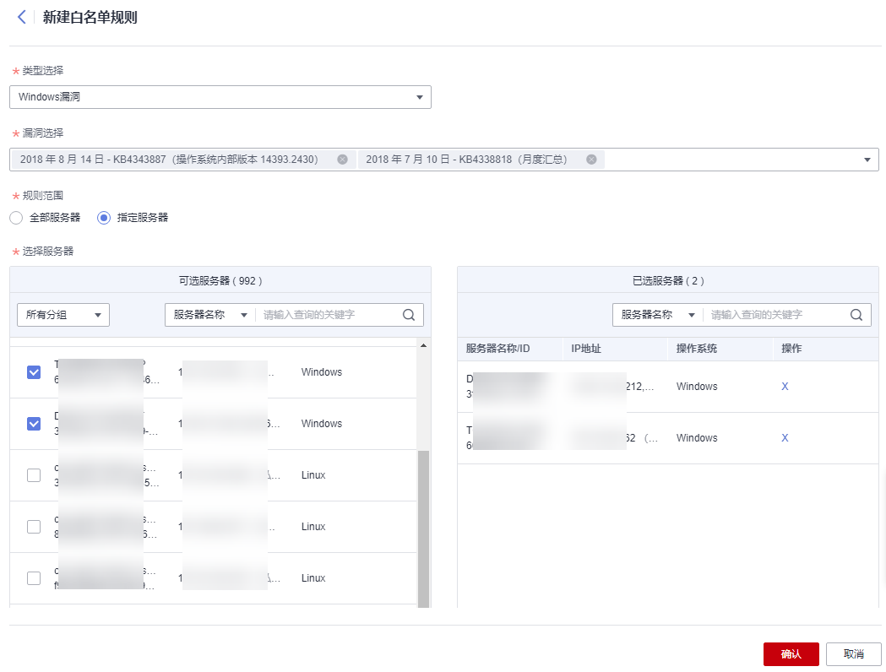

# 处理漏洞

当HSS扫描到服务器存在漏洞时，您需要及时根据漏洞的危害程度结合实际业务情况处理漏洞，避免漏洞被入侵者利用入侵您的服务器。

漏洞支持以下三种处理方式：

-   **修复漏洞**

    如果漏洞对您的业务可能产生危害，建议您尽快修复漏洞。对于Linux漏洞、Windows漏洞，您可以在主机安全服务控制台一键自动修复漏洞，对于Web-CMS漏洞、应用漏洞，暂不支持自动修复，您可以参考漏洞详情界面提供的修复建议手动修复漏洞。

-   **忽略漏洞**

    某些漏洞只在特定条件下存在风险，比如某漏洞必须通过开放端口进行入侵，如果主机系统并未开放该端口，则该漏洞不存在危害。如果评估后确认某漏洞暂时无害，可以忽略该漏洞。下一次漏洞扫描任务执行后，HSS仍然会向您告警该漏洞。

-   **添加漏洞白名单**

    如果确认漏洞不会对您的业务造成任何影响，无需修复，您可以将漏洞添加至白名单。漏洞加入白名单后，针对漏洞列表已经展示的漏洞信息会系统处理为“忽略“，不再为您上报告警，在下一次漏洞扫描任务执行时系统不会再扫描和呈现该漏洞信息。

## 约束限制

-   HSS企业版及以上版本支持处理漏洞相关操作，购买和升级HSS的操作，请参见[购买主机安全防护配额](购买主机安全防护配额.md)和[配额版本升级](配额版本升级.md)
-   CentOS 6和CentOS 8官方已停止维护，HSS使用Redhat的补丁公告替代扫描，因此这两个操作系统的漏洞无法修复，建议您切换其他操作系统。
-   Ubuntu 18.04及以下版本目前已不支持免费补丁更新，需要购买配置Ubuntu Pro后才能安装升级包，未配置Ubuntu Pro会导致漏洞修复失败。
-   CCE 、MRS、BMS的主机不能修复内核漏洞，贸然修复可能导致功能不可用。
-   处理漏洞时需保证目标服务器的“服务器状态“为“运行中“、“Agent状态“为“在线“、“防护状态“为“防护中“。

## 操作风险

-   执行主机漏洞修复可能存在漏洞修复失败导致业务中断，或者中间件及上层应用出现不兼容等风险，并且无法进行回滚。为了防止出现不可预料的严重后果，建议您通过云备份（CBR）为ECS创建备份，详细操作请参见[创建云服务器备份](https://support.huaweicloud.com/qs-cbr/cbr_02_0003.html)。然后，使用空闲主机搭建环境充分测试，确认不影响业务正常运行后，再对主机执行漏洞修复。
-   在线修复主机漏洞时，需要连接Internet，通过外部镜像源提供漏洞修复服务。如果主机无法访问Internet，或者外部镜像源提供的服务不稳定时，可以使用华为云提供的镜像源进行漏洞修复。为了保证漏洞修复成功，请在执行在线升级漏洞前，确认主机中已配置华为云提供的对应操作系统的镜像源，详细的配置操作请参见[配置镜像源](https://support.huaweicloud.com/ecs_faq/zh-cn_topic_0106199430.html)。

## 漏洞修复优先级

HSS的漏洞扫描系统将漏洞修复优先级分为紧急、高、中、低四个等级，您可以参考修复优先级优先修复对您的服务器影响较大的漏洞。

-   紧急：您必须立即修复的漏洞，攻击者利用该漏洞会对主机造成较大的破坏。
-   高：您需要尽快修复的漏洞，攻击者利用该漏洞会对主机造成损害。
-   中：您需要修复的漏洞，为提高您主机的安全能力，建议您修复该类型的漏洞。
-   低：该类型的漏洞对主机安全的威胁较小，您可以选择修复或忽略。

## 漏洞显示时长

扫描到的漏洞，无论您是否处理过，都将在漏洞列表展示7天。

## 自动修复漏洞（漏洞视图）

仅Linux系统漏洞和Windows系统漏洞支持控制台一键自动修复漏洞。

> **说明：** 
>单次最多可修复1000个服务器漏洞，如果您有超过1000的漏洞需要修复，请分批修复。

1.  [登录管理控制台](https://console.huaweicloud.com/?locale=zh-cn)。
2.  在页面左上角选择“区域“，单击，选择“安全与合规 \> 主机安全服务”，进入主机安全平台界面。

    **图 1**  进入主机安全  
    

3.  在左侧导航树中，选择“风险预防  \>  漏洞管理“，进入漏洞管理界面。
4.  修复Linux漏洞和Windows漏洞
    -   修复单个漏洞。

        在目标漏洞所在行的“操作”列，单击“修复“。

    -   修复多个漏洞。

        勾选当前页面所有目标漏洞，单击漏洞列表左上角的“批量修复“，批量修复漏洞。

        如果需要修复所有Linux或Windows漏洞，您可以勾选批量修复对话框中的“选中全部Linux/Windows漏洞“。

        > **说明：** 
        >拥有至少一个旗舰版防护配额的主机时，支持选中全部Linux或Windows漏洞操作。

    -   修复受漏洞影响的单台或多台服务器。
        1.  单击漏洞名称，进入漏洞详情页面。
        2.  选择“受影响服务器“页签，在目标服务器所在行的“操作”列，单击“修复“。

            您也可以勾选所有目标服务器，单击服务器列表上方的“批量修复“，批量为服务器修复漏洞。

1.  （可选）为服务器创建备份。

    漏洞修复存在影响业务数据的风险，您可以使用HSS提供的自动创建备份功能在漏洞修复前为服务器创建备份。如果您无需备份可跳过此步骤。

    1.  在修复对话框中，单击，开启备份。

        > **说明：** 
        >-   开启创建备份后，按钮下方会显示可备份的服务器数量，如果服务器没有绑定备份存储库将无法创建备份，绑定存储库的操作请参见[绑定存储库](https://support.huaweicloud.com/qs-cbr/cbr_02_0009.html)。
        >-   开启创建备份后，当次修复漏洞操作仅支持为可创建备份的服务器修复漏洞，对于未成功创建备份的服务器，请重新执行漏洞修复操作。

        **图 2**  创建备份  
        

    2.  单击“管理“，系统弹出创建备份弹窗。
    3.  在创建备份弹窗中，选择备份存储库、编辑服务器本次备份文件的名称并单击“确认“。

        **图 3**  编辑备份信息  
        

2.  在修复对话框中勾选知晓风险后，单击“自动修复“。
3.  单击漏洞名称，进入漏洞详情页面。
4.  选择“历史处置记录“页签，您可以查看目标漏洞“状态“列的修复状态。漏洞修复状态含义请参见[表 漏洞修复状态说明](#table1309111182315)。

    **表 1**  漏洞修复状态说明

    
    <table><thead align="left"><tr id="row93095111234"><th class="cellrowborder" valign="top" width="28.470000000000002%" id="mcps1.2.3.1.1">
状态

    </th>
    <th class="cellrowborder" valign="top" width="71.53%" id="mcps1.2.3.1.2">
说明

    </th>
    </tr>
    </thead>
    <tbody><tr id="row163097122313"><td class="cellrowborder" valign="top" width="28.470000000000002%" headers="mcps1.2.3.1.1 ">
未处理

    </td>
    <td class="cellrowborder" valign="top" width="71.53%" headers="mcps1.2.3.1.2 ">
表示漏洞未进行修复。

    </td>
    </tr>
    <tr id="row730917182313"><td class="cellrowborder" valign="top" width="28.470000000000002%" headers="mcps1.2.3.1.1 ">
已忽略

    </td>
    <td class="cellrowborder" valign="top" width="71.53%" headers="mcps1.2.3.1.2 ">
漏洞对您的业务不会产生影响，您已经对漏洞进行了忽略处理。

    </td>
    </tr>
    <tr id="row3309617237"><td class="cellrowborder" valign="top" width="28.470000000000002%" headers="mcps1.2.3.1.1 ">
验证中

    </td>
    <td class="cellrowborder" valign="top" width="71.53%" headers="mcps1.2.3.1.2 ">
表示HSS正在验证已修复的漏洞是否修复成功。

    </td>
    </tr>
    <tr id="row4310101142312"><td class="cellrowborder" valign="top" width="28.470000000000002%" headers="mcps1.2.3.1.1 ">
修复中

    </td>
    <td class="cellrowborder" valign="top" width="71.53%" headers="mcps1.2.3.1.2 ">
表示HSS正在为您修复漏洞。

    </td>
    </tr>
    <tr id="row7310181102313"><td class="cellrowborder" valign="top" width="28.470000000000002%" headers="mcps1.2.3.1.1 ">
修复成功

    </td>
    <td class="cellrowborder" valign="top" width="71.53%" headers="mcps1.2.3.1.2 ">
表示漏洞已经被成功修复。

    </td>
    </tr>
    <tr id="row198316169283"><td class="cellrowborder" valign="top" width="28.470000000000002%" headers="mcps1.2.3.1.1 ">
修复成功待重启

    </td>
    <td class="cellrowborder" valign="top" width="71.53%" headers="mcps1.2.3.1.2 ">
表示漏洞已经修复成功，需要您尽快重启服务器。

    </td>
    </tr>
    <tr id="row1738104512298"><td class="cellrowborder" valign="top" width="28.470000000000002%" headers="mcps1.2.3.1.1 ">
修复失败

    </td>
    <td class="cellrowborder" valign="top" width="71.53%" headers="mcps1.2.3.1.2 ">
表示漏洞修复失败，可能因为漏洞已不存在或漏洞已经被更改。

    </td>
    </tr>
    <tr id="row1166216933119"><td class="cellrowborder" valign="top" width="28.470000000000002%" headers="mcps1.2.3.1.1 ">
请重启主机再次修复

    </td>
    <td class="cellrowborder" valign="top" width="71.53%" headers="mcps1.2.3.1.2 ">
仅Windows主机存在的漏洞会显示此状态。

    
表示Windows主机长时间未修复漏洞，导致最新的补丁无法成功安装，需要先安装之前的旧补丁后重启主机，再安装最新的补丁。

    </td>
    </tr>
    </tbody>
    </table>

## 自动修复漏洞（主机视图）

仅Linux系统漏洞和Windows系统漏洞支持控制台一键自动修复漏洞。

1.  [登录管理控制台](https://console.huaweicloud.com/?locale=zh-cn)。
2.  在页面左上角选择“区域“，单击，选择“安全与合规 \> 主机安全服务”，进入主机安全平台界面。

    **图 4**  进入主机安全  
    

3.  在左侧导航树中，选择“风险预防  \>  漏洞管理“，进入漏洞管理界面。
4.  修复Linux漏洞和Windows漏洞。

    -   修复服务器存在的所有Linux或Windows漏洞
        1.  在目标漏洞服务器所在行的“操作”列，单击“修复“。

            您也可以选中多台服务器，并在列表上方单击“批量修复“；如果需要修复所有主机漏洞，您可以勾选批量修复对话框中的“选中全部主机“。

            > **说明：** 
            >拥有至少一个旗舰版防护配额的主机时，支持选中全部主机操作。

        2.  （可选）为服务器创建备份。

            漏洞修复存在影响业务数据的风险，您可以使用HSS提供的自动创建备份功能在漏洞修复前为服务器创建备份。如果您无需备份可跳过此步骤。

            1.  在修复对话框中，单击，开启备份。

                > **说明：** 
                >-   开启创建备份后，按钮下方会显示可备份的服务器数量，如果服务器没有绑定备份存储库将无法创建备份，绑定存储库的操作请参见[绑定存储库](https://support.huaweicloud.com/qs-cbr/cbr_02_0009.html)。
                >-   开启创建备份后，当次修复漏洞操作仅支持为可创建备份的服务器修复漏洞，对于未成功创建备份的服务器，请重新执行漏洞修复操作。

                **图 5**  创建备份  
                

            2.  单击“管理“，系统弹出创建备份弹窗。
            3.  在创建备份弹窗中，选择备份存储库、编辑服务器本次备份文件的名称并单击“确认“。

                **图 6**  编辑备份信息  
                

        3.  在修复对话框中，勾选需要修复漏洞的类型并勾选知晓风险后，单击“确认“。

            仅Linux系统漏洞、Windows系统漏洞支持一键自动修复，Web-CMS漏洞、应用漏洞需要您登录服务器手动修复。

        4.  单击服务器名称，进入服务器详情页面，查看所有漏洞修复状态。漏洞修复状态含义请参见[表 漏洞修复状态说明](#table1148064981617)。

    -   修复单台服务器存在的一个或多个漏洞
        1.  单击目标漏洞服务器名称，进入服务器详情页面。
        2.  在目标漏洞所在行的“操作”列，单击“修复“。

            您也可以勾选所有目标漏洞，单击漏洞列表上方的批量修复，批量修复漏洞。

        3.  （可选）为服务器创建备份。

            漏洞修复存在影响业务数据的风险，您可以使用HSS提供的自动创建备份功能在漏洞修复前为服务器创建备份。如果您无需备份可跳过此步骤。

            1.  在修复对话框中，单击，开启备份。

                > **说明：** 
                >-   开启创建备份后，按钮下方会显示可备份的服务器数量，如果服务器没有绑定备份存储库将无法创建备份，绑定存储库的操作请参见[绑定存储库](https://support.huaweicloud.com/qs-cbr/cbr_02_0009.html)。
                >-   开启创建备份后，当次修复漏洞操作仅支持为可创建备份的服务器修复漏洞，对于未成功创建备份的服务器，请重新执行漏洞修复操作。

                **图 7**  创建备份  
                

            2.  单击“管理“，系统弹出创建备份弹窗。
            3.  在创建备份弹窗中，选择备份存储库、编辑服务器本次备份文件的名称并单击“确认“。

                **图 8**  编辑备份信息  
                

        4.  勾选知晓风险后，单击“自动修复“。
        5.  在目标漏洞行的状态列，查看漏洞的修复状态。漏洞修复状态含义请参见[表 漏洞修复状态说明](#table1148064981617)。

    **表 2**  漏洞修复状态说明

    
    <table><thead align="left"><tr id="hss_01_0141_row93095111234"><th class="cellrowborder" valign="top" width="28.470000000000002%" id="mcps1.2.3.1.1">
状态

    </th>
    <th class="cellrowborder" valign="top" width="71.53%" id="mcps1.2.3.1.2">
说明

    </th>
    </tr>
    </thead>
    <tbody><tr id="hss_01_0141_row163097122313"><td class="cellrowborder" valign="top" width="28.470000000000002%" headers="mcps1.2.3.1.1 ">
未处理

    </td>
    <td class="cellrowborder" valign="top" width="71.53%" headers="mcps1.2.3.1.2 ">
表示漏洞未进行修复。

    </td>
    </tr>
    <tr id="hss_01_0141_row730917182313"><td class="cellrowborder" valign="top" width="28.470000000000002%" headers="mcps1.2.3.1.1 ">
已忽略

    </td>
    <td class="cellrowborder" valign="top" width="71.53%" headers="mcps1.2.3.1.2 ">
漏洞对您的业务不会产生影响，您已经对漏洞进行了忽略处理。

    </td>
    </tr>
    <tr id="hss_01_0141_row3309617237"><td class="cellrowborder" valign="top" width="28.470000000000002%" headers="mcps1.2.3.1.1 ">
验证中

    </td>
    <td class="cellrowborder" valign="top" width="71.53%" headers="mcps1.2.3.1.2 ">
表示HSS正在验证已修复的漏洞是否修复成功。

    </td>
    </tr>
    <tr id="hss_01_0141_row4310101142312"><td class="cellrowborder" valign="top" width="28.470000000000002%" headers="mcps1.2.3.1.1 ">
修复中

    </td>
    <td class="cellrowborder" valign="top" width="71.53%" headers="mcps1.2.3.1.2 ">
表示HSS正在为您修复漏洞。

    </td>
    </tr>
    <tr id="hss_01_0141_row7310181102313"><td class="cellrowborder" valign="top" width="28.470000000000002%" headers="mcps1.2.3.1.1 ">
修复成功

    </td>
    <td class="cellrowborder" valign="top" width="71.53%" headers="mcps1.2.3.1.2 ">
表示漏洞已经被成功修复。

    </td>
    </tr>
    <tr id="hss_01_0141_row198316169283"><td class="cellrowborder" valign="top" width="28.470000000000002%" headers="mcps1.2.3.1.1 ">
修复成功待重启

    </td>
    <td class="cellrowborder" valign="top" width="71.53%" headers="mcps1.2.3.1.2 ">
表示漏洞已经修复成功，需要您尽快重启服务器。

    </td>
    </tr>
    <tr id="hss_01_0141_row1738104512298"><td class="cellrowborder" valign="top" width="28.470000000000002%" headers="mcps1.2.3.1.1 ">
修复失败

    </td>
    <td class="cellrowborder" valign="top" width="71.53%" headers="mcps1.2.3.1.2 ">
表示漏洞修复失败，可能因为漏洞已不存在或漏洞已经被更改。

    </td>
    </tr>
    <tr id="hss_01_0141_row1166216933119"><td class="cellrowborder" valign="top" width="28.470000000000002%" headers="mcps1.2.3.1.1 ">
请重启主机再次修复

    </td>
    <td class="cellrowborder" valign="top" width="71.53%" headers="mcps1.2.3.1.2 ">
仅Windows主机存在的漏洞会显示此状态。

    
表示Windows主机长时间未修复漏洞，导致最新的补丁无法成功安装，需要先安装之前的旧补丁后重启主机，再安装最新的补丁。

    </td>
    </tr>
    </tbody>
    </table>

## 手动修复漏洞

对于Web-CMS漏洞和应用漏洞，HSS不支持一键自动修复，您可以参考漏洞详情页面的修复建议，登录服务器手动修复。

> **说明：** 
>-   “Windows系统漏洞“和“Linux系统Kernel类的漏洞“修复完成后需要手动重启服务器，否则HSS仍可能为您推送漏洞消息。
>-   不同的漏洞请根据修复建议依次进行修复。
>-   若同一主机上的多个软件包存在同一漏洞，您只需修复一次即可。

**查看漏洞修复建议**

1.  [登录管理控制台](https://console.huaweicloud.com/?locale=zh-cn)。
2.  在页面左上角选择“区域“，单击，选择“安全与合规 \> 主机安全服务”，进入主机安全平台界面。

    **图 9**  进入主机安全  
    

3.  在左侧导航树中，选择“风险预防  \>  漏洞管理“，进入漏洞管理界面。
4.  单击目标漏洞名称，进入漏洞详情页面，查看修复建议。

**参考漏洞修复方案进行漏洞修复**

漏洞修复有可能影响业务的稳定性，为了防止在修复漏洞过程影响当前业务，建议参考以下两种方案，选择其中一种执行漏洞修复：

-   方案一：创建新的虚拟机执行漏洞修复
    1.  为需要修复漏洞的ECS主机创建镜像，详细操作请参见[通过云服务器创建整机镜像](https://support.huaweicloud.com/zh-cn/usermanual-ims/ims_01_0216.html)。
    2.  使用该镜像创建新的ECS主机，详细操作请参见[通过镜像创建云服务器](https://support.huaweicloud.com/zh-cn/usermanual-ims/ims_01_0302.html)。
    3.  在新启动的主机上执行漏洞修复并验证修复结果。
    4.  确认修复完成之后将业务切换到新主机。
    5.  确定切换完成并且业务运行稳定无故障后，可以释放旧的主机。如果业务切换后出现问题且无法修复，可以将业务立即切换回原来的主机以恢复功能。

-   方案二：在当前主机执行修复

    1.  为需要修复漏洞的ECS主机创建备份，详细操作请参见[创建云服务器备份](https://support.huaweicloud.com/qs-csbs/zh-cn_topic_0072046354.html)。
    2.  在当前主机上直接进行漏洞修复。
    3.  如果漏洞修复后出现业务功能问题且无法及时修复，立即使用备份恢复功能将主机恢复到修复前的状态，详细操作请参见[使用备份恢复服务器](https://support.huaweicloud.com/usermanual-csbs/zh-cn_topic_0056584619.html)。

    > **说明：** 
    >-   方案一适用于第一次对主机漏洞执行修复，且不确定漏洞修复的影响。新创建的ECS主机建议采用按需计费的方式创建，待业务切换完成后可以根据需要转换为包周期计费模式。如果漏洞修复不成功可以随时释放以节省开销。
    >-   方案二适用于已经有同类主机执行过修复，漏洞修复方案已经比较成熟可靠的场景。

## 漏洞忽略

某些漏洞只在特定条件下存在风险，比如某漏洞必须通过开放端口进行入侵，如果主机系统并未开放该端口，则该漏洞不存在危害。如果评估后确认某些漏洞无害，可以忽略该漏洞，无需修复。

忽略后，主机安全服务将不会对该漏洞告警。

1.  [登录管理控制台](https://console.huaweicloud.com/?locale=zh-cn)。
2.  在页面左上角选择“区域“，单击，选择“安全与合规 \> 主机安全服务”，进入主机安全平台界面。

    **图 10**  进入主机安全  
    

3.  在左侧导航树中，选择“风险预防  \>  漏洞管理“，进入漏洞管理界面。
4.  在目标漏洞所在行的“操作”列，单击“忽略“。
5.  在弹出的对话框中，单击“确认“。

## 漏洞添加白名单

如果您评估某些漏洞对您的业务不会产生影响，并且不想在漏洞列表中看到该漏洞，您可以将该漏洞加入白名单，加入白名单后，针对漏洞列表已经展示的漏洞信息会处理为忽略，不再为您上报告警，在下一次漏洞扫描任务执行时不再扫描该漏洞和呈现该漏洞信息。

1.  [登录管理控制台](https://console.huaweicloud.com/?locale=zh-cn)。
2.  在页面左上角选择“区域“，单击，选择“安全与合规 \> 主机安全服务”，进入主机安全平台界面。

    **图 11**  进入主机安全  
    

3.  在左侧导航树中，选择“风险预防  \>  漏洞管理“，进入漏洞管理界面。
    -   将漏洞影响的所有服务器加入白名单

        HSS扫描所有服务器存在的漏洞时，不再关注该漏洞。

        1.  在目标漏洞所在行的“操作”列，选择“更多  \>   加入白名单“。

            您也可以都选多个目标漏洞，单击漏洞列表上方的“加入白名单“。

            **图 12**  将漏洞影响的所有服务器加入白名单  
            

        2.  在弹出的对话框中，单击“确认“。

    -   将漏洞影响的单个或多个服务器加入白名单。

        HSS为这些服务器扫描漏洞时，不再关注漏洞。

        1.  单击目标漏洞的名称，进入漏洞详情页面。
        2.  选择“受影响服务器“页签。
        3.  在目标服务器所在行的“操作“列，选择“更多  \>   加入白名单“。

            您也可以勾选多个服务器，单击服务器列表上方的“加入白名单“。

            **图 13**  将漏洞影响的单个服务器加入白名单  
            

        4.  在弹出的对话框中，单击“确认“。

    -   通过白名单规则将漏洞加入白名单。
        1.  在漏洞管理界面右上角，单击“漏洞策略配置“，进入漏洞策略配置页面。
        2.  在漏洞白名单配置区域，单击“新增规则“。
        3.  根据界面提示配置白名单规则，相关参数说明请参见[表 漏洞白名单规则参数说明](#table15714142382020)。

            **图 14**  配置白名单规则  
            

            **表 3**  漏洞白名单规则参数说明

            
            <table><thead align="left"><tr id="row11715172362011"><th class="cellrowborder" valign="top" width="22.3%" id="mcps1.2.3.1.1">
参数

            </th>
            <th class="cellrowborder" valign="top" width="77.7%" id="mcps1.2.3.1.2">
说明

            </th>
            </tr>
            </thead>
            <tbody><tr id="row107152234209"><td class="cellrowborder" valign="top" width="22.3%" headers="mcps1.2.3.1.1 ">
类型选择

            </td>
            <td class="cellrowborder" valign="top" width="77.7%" headers="mcps1.2.3.1.2 ">
选择添加白名单的漏洞类型：

            <ul id="ul589517137343"><li>Linux系统漏洞</li><li>Windows系统漏洞</li><li>Web-CMS软件漏洞</li><li>应用漏洞</li></ul>
            </td>
            </tr>
            <tr id="row197151923102015"><td class="cellrowborder" valign="top" width="22.3%" headers="mcps1.2.3.1.1 ">
漏洞选择

            </td>
            <td class="cellrowborder" valign="top" width="77.7%" headers="mcps1.2.3.1.2 ">
选择为哪个漏洞添加白名单。支持选择单个或多个漏洞。

            </td>
            </tr>
            <tr id="row57158232208"><td class="cellrowborder" valign="top" width="22.3%" headers="mcps1.2.3.1.1 ">
规则范围

            </td>
            <td class="cellrowborder" valign="top" width="77.7%" headers="mcps1.2.3.1.2 ">
选择将漏洞影响的哪些服务器添加到白名单。

            <ul id="ul01021640142919"><li>全部服务器
HSS扫描所有服务器存在的漏洞时，不再关注该漏洞。

            </li><li>指定服务器
选择单个或多个目标服务器，HSS为这些服务器扫描漏洞时，不再关注漏洞。

            
您可以通过服务器名称、ID、公网IP、私网IP搜索目标服务器。

            </li></ul>
            </td>
            </tr>
            <tr id="row145219292369"><td class="cellrowborder" valign="top" width="22.3%" headers="mcps1.2.3.1.1 ">
备注（可选）

            </td>
            <td class="cellrowborder" valign="top" width="77.7%" headers="mcps1.2.3.1.2 ">
填写您需要备注的信息。

            </td>
            </tr>
            </tbody>
            </table>

        4.  单击“确认“。

## 修复验证

漏洞修复后，建议您立即进行验证。

**手动验证**

-   通过漏洞详情页面的“验证“，进行一键验证。
-   执行以下命令查看软件升级结果，确保软件已升级为最新版本。

    **表 4**  验证修复命令

    
    <table><thead align="left"><tr id="row1636719515482"><th class="cellrowborder" valign="top" width="37.330000000000005%" id="mcps1.2.3.1.1">
操作系统

    </th>
    <th class="cellrowborder" valign="top" width="62.67%" id="mcps1.2.3.1.2">
修复命令

    </th>
    </tr>
    </thead>
    <tbody><tr id="row0367115134812"><td class="cellrowborder" valign="top" width="37.330000000000005%" headers="mcps1.2.3.1.1 ">
CentOS/Fedora /Euler/Redhat/Oracle

    </td>
    <td class="cellrowborder" valign="top" width="62.67%" headers="mcps1.2.3.1.2 ">
rpm -qa | grep <b>软件名称</b>

    </td>
    </tr>
    <tr id="row63679513489"><td class="cellrowborder" valign="top" width="37.330000000000005%" headers="mcps1.2.3.1.1 ">
Debian/Ubuntu

    </td>
    <td class="cellrowborder" valign="top" width="62.67%" headers="mcps1.2.3.1.2 ">
dpkg -l  | grep <b>软件名称</b>

    </td>
    </tr>
    <tr id="row1336710517489"><td class="cellrowborder" valign="top" width="37.330000000000005%" headers="mcps1.2.3.1.1 ">
Gentoo

    </td>
    <td class="cellrowborder" valign="top" width="62.67%" headers="mcps1.2.3.1.2 ">
emerge --search <b>软件名称</b>

    </td>
    </tr>
    </tbody>
    </table>

-   [手动执行漏洞检测](扫描漏洞.md)查看漏洞修复结果。

**自动验证**

若您未进行手动验证，主机防护每日凌晨进行全量检测，您修复后需要等到次日凌晨检测后才能查看修复效果。

