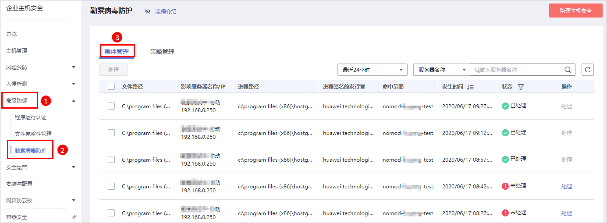
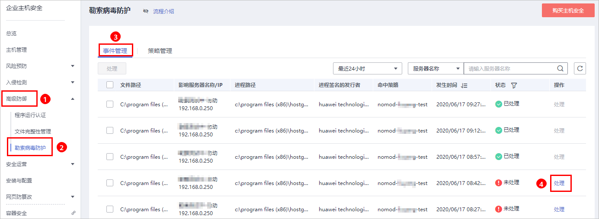
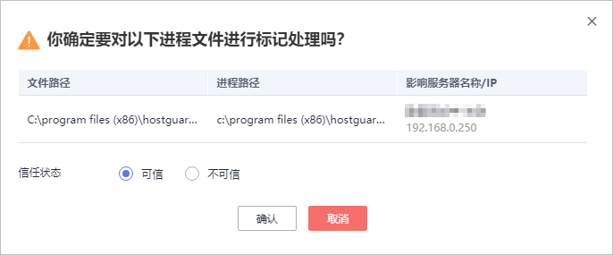

# 处理防护告警事件

服务器应用勒索病毒防护策略后，HSS将检测该服务器中进程文件对监控路径下文件的操作风险，包括“可信“和“不可信“，帮助您有效识别服务器中的风险操作，并对不在策略中的进程文件对监控路径下的文件操作进行告警提示。

事件管理列表展示关联服务器命中策略的“不可信“和不在勒索病毒防护策略中的进程对监控文件路径下文件的操作。

在事件管理列表中，处理防护告警事件时，若标记为“不可信“，您需要对不可信进程进行手动排查和处理，避免不可信进程对您的主机造成危害。

> **说明：** 
>建议您对“不可信“和不在策略中的进程对监控路径下文件的操作进行重点排查和处理。

## 查看防护告警事件列表

1.  [登录管理控制台](https://console.huaweicloud.com)。
2.  在页面左上角选择“区域“，单击，选择“安全与合规  \>  企业主机安全“，进入企业主机安全页面。

    **图 1**  企业主机安全  
    

3.  进入“勒索病毒防护“页面，选择“事件管理“页签，查看勒索病毒防护事件列表，如[图2](#fig1984912498116)所示。

    **图 2**  勒索病毒防护列表  
    

    **表 1**  勒索病毒防护列表说明

    
    <table><thead align="left"><tr id="row10477550113815"><th class="cellrowborder" valign="top" width="40.64%" id="mcps1.2.3.1.1">
参数

    </th>
    <th class="cellrowborder" valign="top" width="59.36%" id="mcps1.2.3.1.2">
参数说明

    </th>
    </tr>
    </thead>
    <tbody><tr id="row1647719508380"><td class="cellrowborder" valign="top" width="40.64%" headers="mcps1.2.3.1.1 ">
文件路径

    </td>
    <td class="cellrowborder" valign="top" width="59.36%" headers="mcps1.2.3.1.2 ">
进程操作的文件的路径。

    </td>
    </tr>
    <tr id="row134778503386"><td class="cellrowborder" valign="top" width="40.64%" headers="mcps1.2.3.1.1 ">
影响服务器名称/IP

    </td>
    <td class="cellrowborder" valign="top" width="59.36%" headers="mcps1.2.3.1.2 ">
文件操作的服务器的名称/IP。

    </td>
    </tr>
    <tr id="row14477185093812"><td class="cellrowborder" valign="top" width="40.64%" headers="mcps1.2.3.1.1 ">
进程路径

    </td>
    <td class="cellrowborder" valign="top" width="59.36%" headers="mcps1.2.3.1.2 ">
操作监控路径下文件的进程。

    </td>
    </tr>
    <tr id="row6477105053819"><td class="cellrowborder" valign="top" width="40.64%" headers="mcps1.2.3.1.1 ">
进程签名的发行者

    </td>
    <td class="cellrowborder" valign="top" width="59.36%" headers="mcps1.2.3.1.2 ">
进程签名的发行者。

    </td>
    </tr>
    <tr id="row2477195073816"><td class="cellrowborder" valign="top" width="40.64%" headers="mcps1.2.3.1.1 ">
命中策略

    </td>
    <td class="cellrowborder" valign="top" width="59.36%" headers="mcps1.2.3.1.2 ">
告警命中的勒索病毒防御策略。

    </td>
    </tr>
    <tr id="row947745023810"><td class="cellrowborder" valign="top" width="40.64%" headers="mcps1.2.3.1.1 ">
发生时间

    </td>
    <td class="cellrowborder" valign="top" width="59.36%" headers="mcps1.2.3.1.2 ">
触发告警的时间。

    </td>
    </tr>
    <tr id="row114772504382"><td class="cellrowborder" valign="top" width="40.64%" headers="mcps1.2.3.1.1 ">
状态

    </td>
    <td class="cellrowborder" valign="top" width="59.36%" headers="mcps1.2.3.1.2 ">
该操作事件的处理状态，包含“已处理”和“未处理”。

    </td>
    </tr>
    </tbody>
    </table>

## 处理防护告警事件

1.  在“事件管理“列表的“操作“列中，单击“处理“，处理勒索病毒防护告警事件，如[图3](#fig166134391595)所示。

    **图 3**  处理勒索病毒防护告警事件  
    

2.  在弹出的处理事件窗口中，选择信任状态“可信“或者“不可信“，处理进程文件操作告警事件，如[图4](#fig1076611917129)所示。

    **图 4**  处理勒索病毒防护事件  
    

    **表 2**  处理告警事件

    
    <table><thead align="left"><tr id="row13941676119"><th class="cellrowborder" valign="top" width="11.600000000000001%" id="mcps1.2.3.1.1">
处理方式

    </th>
    <th class="cellrowborder" valign="top" width="88.4%" id="mcps1.2.3.1.2">
处理方式说明

    </th>
    </tr>
    </thead>
    <tbody><tr id="row09414718116"><td class="cellrowborder" valign="top" width="11.600000000000001%" headers="mcps1.2.3.1.1 ">
可信

    </td>
    <td class="cellrowborder" valign="top" width="88.4%" headers="mcps1.2.3.1.2 ">
标记进程文件为“可信”状态，标记为“可信”的进程文件操作，该进程文件再次对监控路径下的文件进行操作时，将不会触发告警。

    </td>
    </tr>
    <tr id="row4942711115"><td class="cellrowborder" valign="top" width="11.600000000000001%" headers="mcps1.2.3.1.1 ">
不可信

    </td>
    <td class="cellrowborder" valign="top" width="88.4%" headers="mcps1.2.3.1.2 ">
标记进程文件为“不可信”状态，标记为“不可信”的进程文件操作，该进程文件再次对监控路径下的文件进行操作时，将会触发告警。

    </td>
    </tr>
    </tbody>
    </table>

3.  单击“确定“，完成勒索病毒防护告警事件标记处理。

