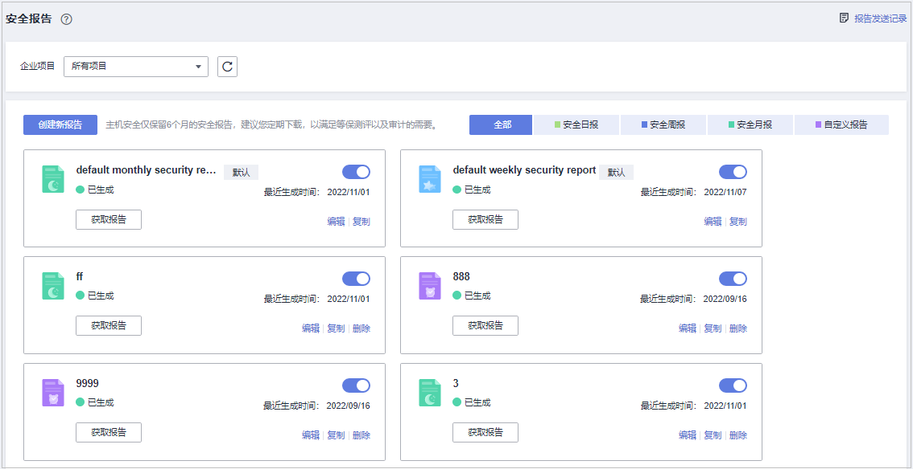
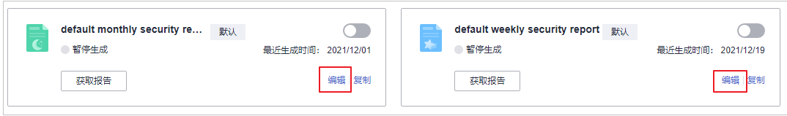
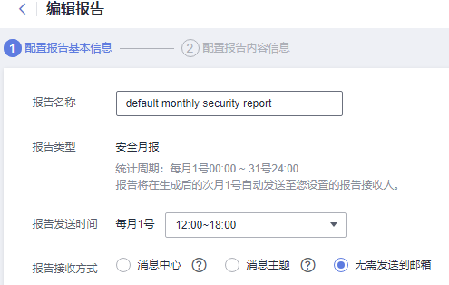
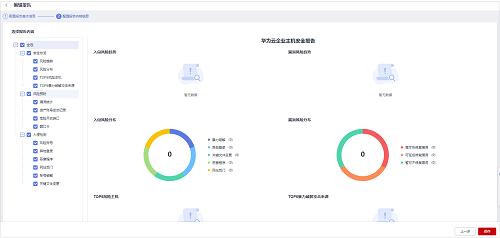

# 安全报告管理

若需对已订阅的报告内容进行修改、取消或关闭订阅，该章节将指导您完成相关操作。

## 约束限制

企业版及以上版本支持安全报告相关操作。

## 编辑安全报告

1.  [登录管理控制台](https://console.huaweicloud.com/?locale=zh-cn)。
2.  在页面左上角选择“区域“，单击，选择“安全与合规 \> 主机安全服务”，进入主机安全平台界面。

    **图 1**  进入主机安全  
    

3.  左侧选择“安全报告“进入安全报告概览页面。

    服务预设了按月（default monthly security report）和按周（default weekly security report）统计的两个安全报告模板，可直接使用。

    > **说明：** 
    >如果您的服务器已通过企业项目的模式进行管理，您可选择目标“企业项目“后查看或操作目标企业项目内的资产和检测信息。

    **图 2**  查看安全报告  
    

4.  单击目标报告的“编辑“按钮，对报告进行编辑。

    **图 3**  编辑报告  
    

5.  对报告基本信息进行编辑，参数说明如[表1](#hss_01_0557_table164462775520)所示。

    **图 4**  编辑报告基本信息  
    

    **表 1**  报告基本信息参数说明

    
    <table><thead align="left"><tr id="hss_01_0557_row17441927125515"><th class="cellrowborder" valign="top" width="15.46154615461546%" id="mcps1.2.4.1.1">
参数名称

    </th>
    <th class="cellrowborder" valign="top" width="55.975597559755975%" id="mcps1.2.4.1.2">
参数说明

    </th>
    <th class="cellrowborder" valign="top" width="28.562856285628563%" id="mcps1.2.4.1.3">
取值样例

    </th>
    </tr>
    </thead>
    <tbody><tr id="hss_01_0557_row1245152745510"><td class="cellrowborder" valign="top" width="15.46154615461546%" headers="mcps1.2.4.1.1 ">
报告名称

    </td>
    <td class="cellrowborder" valign="top" width="55.975597559755975%" headers="mcps1.2.4.1.2 ">
默认的报告名称。

    </td>
    <td class="cellrowborder" valign="top" width="28.562856285628563%" headers="mcps1.2.4.1.3 ">
default monthly security report

    </td>
    </tr>
    <tr id="hss_01_0557_row1145112705510"><td class="cellrowborder" valign="top" width="15.46154615461546%" headers="mcps1.2.4.1.1 ">
报告类型

    </td>
    <td class="cellrowborder" valign="top" width="55.975597559755975%" headers="mcps1.2.4.1.2 ">
报告的统计周期类型名称，不可编辑。

    </td>
    <td class="cellrowborder" valign="top" width="28.562856285628563%" headers="mcps1.2.4.1.3 ">
安全月报

    </td>
    </tr>
    <tr id="hss_01_0557_row184532720552"><td class="cellrowborder" valign="top" width="15.46154615461546%" headers="mcps1.2.4.1.1 ">
报告发送时间

    </td>
    <td class="cellrowborder" valign="top" width="55.975597559755975%" headers="mcps1.2.4.1.2 ">
报告自动发送时间。

    </td>
    <td class="cellrowborder" valign="top" width="28.562856285628563%" headers="mcps1.2.4.1.3 ">
-

    </td>
    </tr>
    <tr id="hss_01_0557_row845627165517"><td class="cellrowborder" valign="top" width="15.46154615461546%" headers="mcps1.2.4.1.1 ">
报告接收方式

    </td>
    <td class="cellrowborder" valign="top" width="55.975597559755975%" headers="mcps1.2.4.1.2 ">
生成的安全报告接收方式。

    <ul id="hss_01_0557_ul945275455714"><li>消息中心：使用消息中心和其它安全服务共同使用“安全事件通知”的信息接收人。需登录控制台，在右上角信箱查看。</li><li>消息主题：为HSS单独创建的主题，设置告警通知接收人。可选择短信或邮件接收通知。</li><li>无需发送到邮箱：不发送报告至邮箱。</li></ul>
    </td>
    <td class="cellrowborder" valign="top" width="28.562856285628563%" headers="mcps1.2.4.1.3 ">
消息主题

    </td>
    </tr>
    </tbody>
    </table>

6.  确认信息无误，单击页面右下角“下一步“，编辑报告内容。

    **图 5**  配置报告内容  
    

7.  在左侧勾选或取消报告项，右侧可预览，确认无误，单击“保存“，报告修改成功。

## 关闭订阅

1.  登录管理控制台，进主机安全服务页面。
2.  左侧选择“安全报告“进入安全报告概览页面。

    服务预设了按月（default monthly security report）和按周（default weekly security report）统计的两个安全报告模板，可直接使用。

    > **说明：** 
    >如果您的服务器已通过企业项目的模式进行管理，您可选择目标“企业项目“后查看或操作目标企业项目内的资产和检测信息。

    **图 6**  查看安全报告  
    

3.  单击目标报告的开关，使其状态为，表示目标报告订阅已关闭。

## 删除报告

> **说明：** 
>默认的按月（default monthly security report）和按周（default weekly security report）统计的两个安全报告模板不可删除。

1.  登录管理控制台，进主机安全服务页面。
2.  左侧选择“安全报告“进入安全报告概览页面。

    服务预设了按月（default monthly security report）和按周（default weekly security report）统计的两个安全报告模板，可直接使用。

    > **说明：** 
    >如果您的服务器已通过企业项目的模式进行管理，您可选择目标“企业项目“后查看或操作目标企业项目内的资产和检测信息。

    **图 7**  查看安全报告  
    

3.  单击目标报告的“删除“，对目标报告进行删除。

