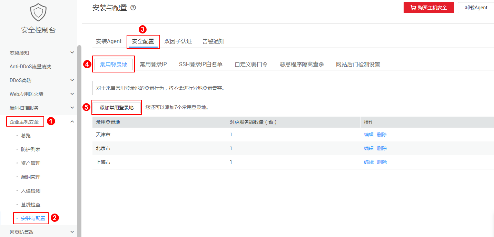
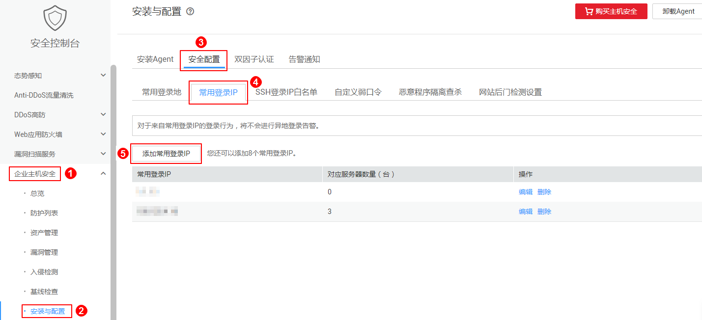
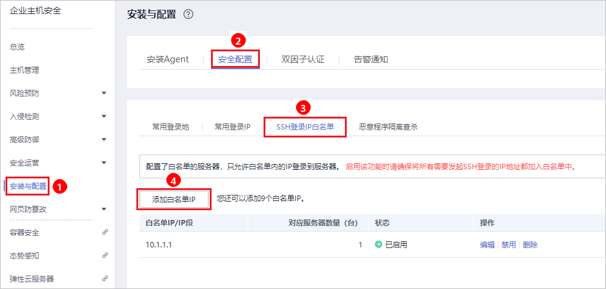
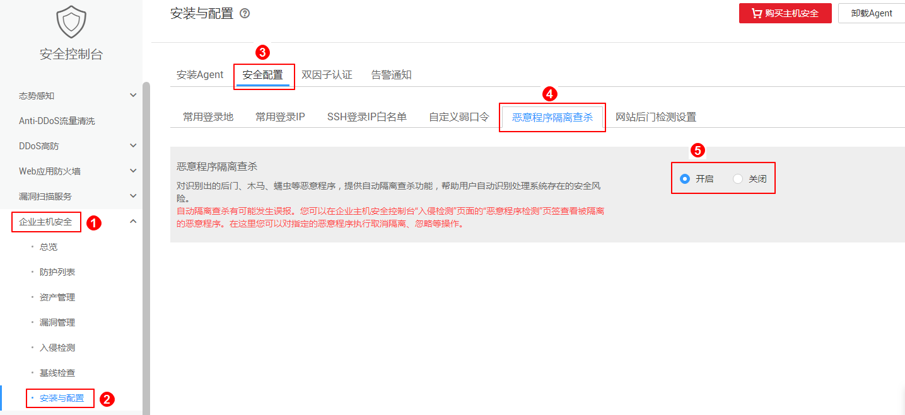
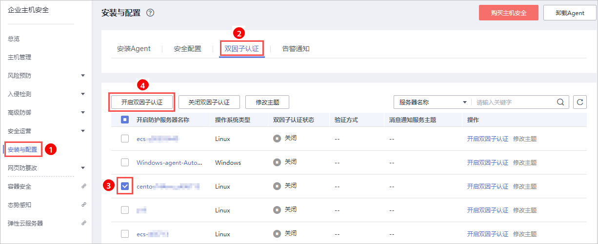
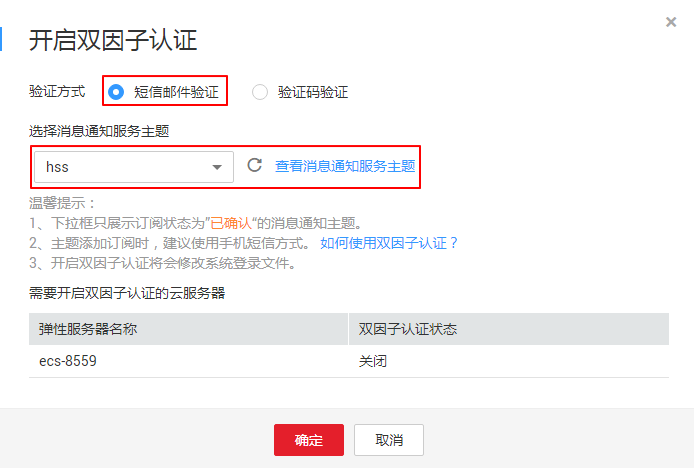
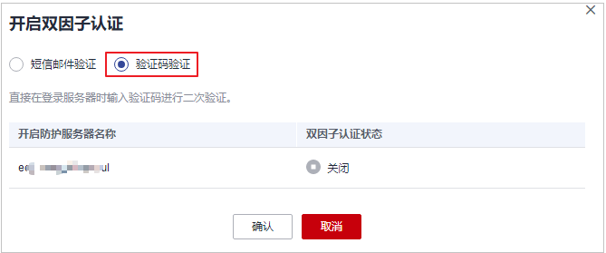

# 安全配置

开启防护后，您可以根据需要进行安全配置。包括配置常用登录地、常用登录IP、SSH登录IP白名单，开启恶意程序自动隔离查杀功能。

1.  [登录管理控制台](https://console.huaweicloud.com)。
2.  在页面上方选择区域后，单击，选择“安全  \>  企业主机安全“。

    **图 1**  企业主机安全  
    

## 配置常用登录地

配置常用登录地后，企业主机安全服务将对非常用地登录主机的行为进行告警。每个主机可被添加在多个登录地中。

1.  在“常用登录地“页面，单击“添加常用地登录“。

    **图 2**  添加常用登录地  
    

2.  在弹出的对话框中选择“常用登录地“和“可选云服务器“即可完成配置。

## 配置常用登录IP

配置常用登录IP，企业主机安全服务将对非常用IP登录主机的行为进行告警。

1.  在“常用登录IP“页面，单击“添加常用登录IP“。

    **图 3**  常用登录IP  
    

1.  在弹出的对话框中输入“常用登录IP“，在“可选云服务器“列表中选择云服务器。

    > **说明：**   
    >“常用登录IP“必须填写公网IP或者IP段。如果设置的非公网IP地址，您将无法SSH远程登录您的服务器。  

## 配置SSH登录IP白名单

SSH登录IP白名单功能是防护账户爆破的一个重要方式，主要是限制需要通过SSH登录的服务器。

配置了白名单的服务器，只允许白名单内的IP通过SSH登录到服务器，拒绝白名单以外的IP：

-   启用该功能时请确保将所有需要发起SSH登录的IP地址都加入白名单中，否则您将无法SSH远程登录您的服务器。

    若您的业务需要访问主机，但不需要SSH登录，则可以不用添加到白名单。

-   IP加入白名单后，账户破解防护功能将不再对来自白名单中的IP登录行为进行拦截，该IP对您加入白名单的服务器登录访问将不受任何限制，请谨慎操作。

> **说明：**   
>使用鲲鹏计算EulerOS（EulerOS with ARM）的主机，SSH登录IP白名单功能对其不生效。  

1.  在“SSH登录IP白名单“页面，单击“添加白名单IP“。

    **图 4**  SSH登录IP白名单  
    

2.  在“添加SSH登录IP白名单“对话框中输入“白名单IP“，在“可选云服务器“列表中选择云服务器。

    > **说明：**   
    >“白名单IP“必须填写公网IP或者IP段（支持IPv6、IPv4地址）。如果设置的非公网IP地址，您将无法SSH远程登录您的服务器。  

## 开启恶意程序隔离查杀

开启恶意程序隔离查杀后，HSS对识别出的后门、木马、蠕虫等恶意程序，提供自动隔离查杀功能，帮助用户自动识别处理系统存在的安全风险。

在“恶意程序隔离查杀“界面，选择“开启“，开启恶意程序隔离查杀功能，HSS将自动隔离查杀恶意程序。

**图 5**  恶意程序隔离查杀  

自动隔离查杀有可能发生误报。您可以在企业主机安全控制台“入侵检测“页面中，选择“事件管理“页签，查看被隔离的恶意程序。在此您可以对指定的恶意程序执行取消隔离、忽略等操作，详情请参见[查看和处理入侵告警事件](查看和处理入侵告警事件.md)。

> **须知：**   
>-   程序被隔离查杀时，该程序的进程将被立即终止，为避免影响业务，请及时确认检测结果，若隔离查杀有误报，请在24小时内执行取消隔离/忽略操作。  
>-   在“恶意程序隔离查杀“界面，如果不开启“恶意程序隔离查杀“功能，当HSS检测到恶意程序时，将会触发告警。  
>    您可以在“入侵检测“的“事件管理“中，查看“恶意程序（云查杀）“中的告警信息，并对恶意程序进行隔离查杀。  

## 开启双因子认证

-   双因子认证功能是一种双因素身份验证机制，结合短信/邮箱验证码，对云服务器登录行为进行二次认证，极大地增强云服务器账户安全性。
-   开启双因子认证功能后，登录弹性云服务器时，主机安全服务将根据绑定的“消息通知服务主题“验证登录者的身份信息。

**前提条件**

-   用户已创建“协议“为“短信“或“邮箱“的消息主题。
-   主机已开启防护。
-   Linux主机使用“密码“登录方式。
-   开启双因子认证需要关闭Selinux防火墙。
-   在Windows主机上，双因子认证功能可能会和“网防G01”软件、服务器版360安全卫士存在冲突，建议停止“网防G01”软件和服务器版360安全卫士。
-   在Linux主机上，开启双因子认证后，不能通过云堡垒机登录主机。

**操作步骤**

1.  在“双因子认证“页面，单击“开启双因子认证”。

    **图 6**  双因子认证  
    

2.  在弹出的“开启双因子认证“的对话框中，选择“验证方式“。
    -   **短信邮件验证**

        短信邮件验证需要选择消息通知服务主题。

        -   下拉框只展示状态已确认的消息通知服务主题。
        -   如果没有主题，请单击“查看消息通知服务主题“进行创建。具体操作请参见[创建主题](https://support.huaweicloud.com/usermanual-smn/zh-cn_topic_0043961401.html)。
        -   若您的主题里包含多个手机号码/邮箱，在认证过程中，该主题内的手机号码/邮箱都会收到系统发出的验证码短信或邮件。若您只希望有一个手机号码/邮箱收到验证码，请修改对应主题，仅在主题中保留您希望收到验证码的手机号码/邮箱。

        **图 7**  短信邮件验证  
        

    -   **验证码验证**

        **图 8**  验证码验证  
        

3.  单击“确定“，完成开启双因子认证的操作。开启双因子认证功能后，需要等大约5分钟才生效。

    > **须知：**   
    >在开启双因子认证功能的Windows主机上远程登录其他Windows主机时，需要在开启双因子主机上手动添加凭证，否则会导致远程登录其他Windows主机失败。  
    >添加凭证：打开路径“开始菜单  \>  控制面板  \>  用户账户  \>  凭据管理器  \>  添加Windows凭据“，添加您需要访问的远程主机的用户名和密码。  

