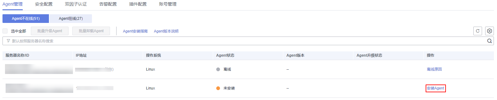

# 安装Linux版本Agent<a name="hss_01_0234"></a>

安装Agent后，您才能正常开启云服务器的负载保护。

本节指导您如何在Linux操作系统的主机中安装Agent。Windows操作系统的Agent安装请参见[安装Windows版本Agent](安装Windows版本Agent.md)。

> **说明：** 
>CentOS 6.x版本由于Linux官网已停止更新维护，主机安全服务也不再支持CentOS 6.x及以下的系统版本，谢谢您的理解！

## 约束与限制<a name="section77993824711"></a>

主机安全服务支持防护华为云主机和非华为云主机。

-   **华为云主机**：
    -   确保云服务器的购买渠道为华为云官网控制台。
    -   仅适用于64位云服务器，不再支持32位云服务器。
    -   确保您的主机与HSS配额在同一区域，并使用配额所在区域的安装命令或安装包为主机安装Agent。

-   **非华为云主机**：
    -   确保云服务器的购买渠道为非华为云官网控制台，或者在华为云官网控制台购买的云服务器，但期望跨Region进行统一管理。
    -   仅适用于64位云服务器，不再支持32位云服务器。
    -   在非华为云主机中安装Agent后，在防护列表中，您可以根据主机的IP地址（公网IP）查找该主机。

        > **须知：** 
        >-   由于主机的性能差异，非华为云的主机与主机安全服务的兼容性可能较差，为使您获得良好的服务体验，建议您使用华为云主机。
        >-   安装Agent时，请暂时清理主机中可能干扰主机安装的应用进程和配置信息，防止Agent安装失败。
        >-   目前北京一、北京四、上海一、上海二、广州、新加坡、香港区域支持**非华为云主机**的安装方式，其他区域敬请期待。

## 默认安装路径<a name="section7764112663213"></a>

在Linux操作系统的主机中安装Agent时，安装过程中不提供安装路径的选择，默认安装在以下路径中：

“/usr/local/hostguard/“

## 安装场景<a name="section7319455164315"></a>

主机安全服务支持**华为云主机**和**非华为云主机**两种安装方式，请按[表1](#table114917164498)进行选择。

**表 1**  安装场景

<a name="table114917164498"></a>
<table><thead align="left"><tr id="row4150816114916"><th class="cellrowborder" valign="top" width="29.69%" id="mcps1.2.3.1.1"><p id="p215031615493"><a name="p215031615493"></a><a name="p215031615493"></a>服务器类型</p>
</th>
<th class="cellrowborder" valign="top" width="70.30999999999999%" id="mcps1.2.3.1.2"><p id="p5150216184918"><a name="p5150216184918"></a><a name="p5150216184918"></a>如何安装Agent</p>
</th>
</tr>
</thead>
<tbody><tr id="row19150151664911"><td class="cellrowborder" rowspan="2" valign="top" width="29.69%" headers="mcps1.2.3.1.1 "><p id="p966513359117"><a name="p966513359117"></a><a name="p966513359117"></a>华为云弹性云服务器ECS</p>
<p id="p135453716115"><a name="p135453716115"></a><a name="p135453716115"></a>华为云裸金属服务器BMS</p>
<p id="p420911712507"><a name="p420911712507"></a><a name="p420911712507"></a>华为云云耀云服务器HECS</p>
</td>
<td class="cellrowborder" valign="top" width="70.30999999999999%" headers="mcps1.2.3.1.2 "><p id="p4150181614499"><a name="p4150181614499"></a><a name="p4150181614499"></a>主机与HSS配额在同一区域，请使用<strong id="b16617201129"><a name="b16617201129"></a><a name="b16617201129"></a>华为云主机</strong>的安装方式。</p>
</td>
</tr>
<tr id="row1715013165495"><td class="cellrowborder" valign="top" headers="mcps1.2.3.1.1 "><p id="p1716714918537"><a name="p1716714918537"></a><a name="p1716714918537"></a>主机与HSS配额不在同一区域，请退订配额后，重新购买主机所在区域的配额。</p>
</td>
</tr>
<tr id="row084131581510"><td class="cellrowborder" valign="top" width="29.69%" headers="mcps1.2.3.1.1 "><p id="p17465932172413"><a name="p17465932172413"></a><a name="p17465932172413"></a>华为云云桌面Workspace</p>
</td>
<td class="cellrowborder" valign="top" width="70.30999999999999%" headers="mcps1.2.3.1.2 "><p id="p41514119442"><a name="p41514119442"></a><a name="p41514119442"></a>云桌面镜像中已预置HSS Agent，购买云桌面23.6.0及以后版本将会自动安装Agent，无需您手动安装。如果您购买的云桌面是23.6.0以前的版本，可以参照本文手动为云桌面安装Agent。</p>
</td>
</tr>
<tr id="row1715010162495"><td class="cellrowborder" valign="top" width="29.69%" headers="mcps1.2.3.1.1 "><p id="p4150716174914"><a name="p4150716174914"></a><a name="p4150716174914"></a>第三方云主机</p>
</td>
<td class="cellrowborder" rowspan="2" valign="top" width="70.30999999999999%" headers="mcps1.2.3.1.2 "><p id="p0150616134918"><a name="p0150616134918"></a><a name="p0150616134918"></a><strong id="b17626227101210"><a name="b17626227101210"></a><a name="b17626227101210"></a>非华为云主机</strong>的安装方式。</p>
<a name="ul16777205017109"></a><a name="ul16777205017109"></a><ul id="ul16777205017109"><li>目前北京一、北京四、上海一、上海二、广州、新加坡、香港区域支持<strong id="b12714557108"><a name="b12714557108"></a><a name="b12714557108"></a>非华为云主机</strong>的安装方式，其他区域敬请期待。</li></ul>
<a name="ul196058314920"></a><a name="ul196058314920"></a><ul id="ul196058314920"><li>在非华为云主机中安装Agent后，在防护列表中，您可以根据主机的IP地址查找该主机。</li></ul>
</td>
</tr>
<tr id="row3151181614491"><td class="cellrowborder" valign="top" headers="mcps1.2.3.1.1 "><p id="p115112161495"><a name="p115112161495"></a><a name="p115112161495"></a>线下主机</p>
</td>
</tr>
</tbody>
</table>

## 前提条件<a name="section145381446145316"></a>

-   安装其他云主机时，待安装Agent的主机操作系统为Linux，且网络环境能正常访问公网。
-   请关闭Selinux防火墙，防止Agent安装失败，安装成功后再打开。

## 安装须知<a name="section6318334193816"></a>

-   Agent支持的操作系统请参见[支持的操作系统](https://support.huaweicloud.com/productdesc-hss2.0/hss_01_0137.html#section2)。

-   您的云服务器安全组出方向的设置允许访问100.125.0.0/16网段的10180端口（默认允许访问，如做了改动请修正）。
-   由于主机的性能差异，非华为云的主机与主机安全服务的兼容性可能较差，为使您获得良好的服务体验，建议您使用华为云主机。
-   如果您的服务器已安装第三方安全软件，可能会导致主机安全服务Agent无法正常安装，请您关闭或卸载第三方安全软件后再安装Agent。
-   安装Agent的磁盘剩余可用容量须大于300M，否则可能导致Agent安装失败。
-   安装成功后，需要等待5\~10分钟左右才会刷新Agent状态。请前往“资产管理\>主机管理\>云服务器”界面查看。
-   如果您的主机安全服务未设置过告警通知，初次安装Agent后还需进行告警通知设置才能及时接收告警信息。

## 使用安装命令安装<a name="section1831315205214"></a>

登录待安装Agent的云主机，使用安装命令在线安装Agent。安装成功后，Agent不会立即生效，需要等待3\~5分钟左右控制台才会刷新。

1.  [登录管理控制台](https://console.huaweicloud.com/?locale=zh-cn)。
2.  在页面左上角选择“区域“，单击，选择“安全与合规 \> 主机安全服务”，进入主机安全平台界面。

    **图 1**  进入主机安全<a name="fig1855613765114"></a>  
    

3.  在左侧导航栏中，选择“安装与配置“，进入“安装与配置“界面。
4.  选择“Agent管理  \>  Agent不在线\(X\)“页签，在目标服务器的“操作”列，单击“安装Agent“。

    **图 2**  选择Linux服务器<a name="fig1451316231168"></a>  
    

5.  在弹窗中，根据该服务器的系统架构和操作系统，单击“复制“安装Agent的命令。

    **图 3**  复制安装Agent的命令<a name="fig633215419312"></a>  
    

6.  远程登录待安装Agent的主机。
    -   **华为云主机**
        -   您可以登录弹性云服务器控制台，在“弹性云服务器“列表中，单击“远程登录“登录主机，详细操作请参见[在云服务器控制台上登录主机](https://support.huaweicloud.com/usermanual-ecs/ecs_03_0136.html)。
        -   若您的主机已经绑定了弹性IP，您也可以使用远程管理工具（例如：PuTTY、Xshell等）登录主机，并使用root账号在主机中安装Agent。

    -   **非华为云主机**

        请使用远程管理工具（例如：PuTTY、Xshell等）连接您服务器的弹性IP，远程登录到您的服务器。

7.  粘贴复制的安装命令，以root权限执行，在主机中安装Agent。

    > **说明：** 
    >-   若无法下载安装包，请确认DNS是否可以正常解析安装命令中的域名。
    >-   非华为云上安装时，请确保命令行中的Org ID存在，否则可能导致Agent安装后但页面仍然显示未安装Agent；

    若界面回显信息与如下信息类似，则表示Agent安装成功。

    ```
    Preparing...                  ########################## [100%]
    1:hostguard                   ########################## [100%]
    Hostguard is running.
    Hostguard installed.
    ```

8.  使用**service hostguard** **status**命令，查看Agent的运行状态。

    若界面回显如下信息，则表示Agent服务运行正常。

    ```
    Hostguard is running
    ```

## 常见问题<a name="section982995012508"></a>

-   Agent状态及异常处理的详细操作请参见[Agent状态异常应如何处理？](https://support.huaweicloud.com/hss_faq/hss_01_0036.html)
-   Agent安装失败，请参见[Agent安装失败应如何处理？](https://support.huaweicloud.com/hss_faq/hss_01_0069.html)
-   卸载Agent的详细操作请参见[如何卸载Agent？](https://support.huaweicloud.com/hss_faq/hss_01_0119.html)

