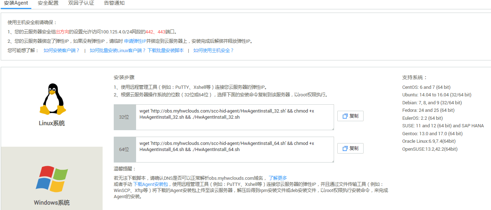

# 安装Linux版本客户端（华为云主机）<a name="ZH-CN_TOPIC_0150525170"></a>

用户使用企业主机安全服务前，需先在云服务器上安装客户端。该任务指导用户在华为云Linux主机上安装客户端。

## 前提条件<a name="section43992855103311"></a>

-   已获取管理控制台的登录账号与密码。
-   云服务器的“Agent状态“为“未注册“。
-   待安装客户端的云服务器已绑定弹性IP。

    > **说明：**   
    >在客户端安装完成后，可以解绑弹性IP。  


## 操作步骤<a name="section1831315205214"></a>

1.  登录管理控制台。
2.  在页面上方，单击“服务列表“，选择“安全  \>  企业主机安全“。
3.  在左侧导航树中选择“安装与配置“，进入“安装与配置“界面，选择“安装Agent“页签。
4.  在“安装Agent“页面，选择“华为云主机“页签后，选择“Linux系统“，如[图1](#fig98256510550)所示。

    **图 1**  Linux客户端安装<a name="fig98256510550"></a>  
    

5.  安装客户端。
    -   方式一
        1.  根据弹性云服务器的操作系统位数，单击“复制“，复制安装命令。
        2.  使用远程管理工具（例如：“Xshell“、“SecureCRT“、“PuTTY“），以**root**帐号，通过弹性IP地址登录到待安装客户端的弹性云服务器。
        3.  执行复制的命令进行安装。

            若界面回显类似如下信息，表示客户端安装完成。

            ```
            Preparing...                  ########################## [100%]
            1:hostguard                   ########################## [100%]
            Hostguard is running.
            Hostguard installed.
            ```

            > **说明：**   
            >-   客户端的安装路径为“/usr/local/hostguard“。  
            >-   客户端安装完成后，自动启动Agent服务。  

        4.  执行以下命令，查看Agent服务运行状态。

            **service hostguard** **status**

            若界面回显以下信息，则表示Agent服务运行正常。

            ```
            Hostguard is running
            ```


    -   方式二
        1.  在界面下方，单击“下载Agent安装包“。
        2.  在弹出的对话框中，根据弹性云服务器的操作系统类型，选择需要下载的版本，单击“确定“，如[图2](#fig14316193555316)所示。

            **图 2**  下载Linux客户端<a name="fig14316193555316"></a>  
            

        3.  使用文件传输工具（例如：“Xftp“、“SecureFX“、“WinSCP“），将下载的客户端安装包上传到弹性云服务器。
        4.  使用远程管理工具（例如：“Xshell“、“SecureCRT“、“PuTTY“），以**root**帐号，通过弹性IP地址登录到待安装客户端的弹性云服务器。
        5.  执行以下命令，进入安装包所在目录。

            **cd** _安装包所在目录_

        6.  执行以下命令，运行安装脚本。

            -   针对“.rpm“格式的安装包，执行命令：**rpm** **-ivh** _安装包名称_
            -   针对“.deb“格式的安装包，执行命令：**dpkg** **-i** _安装包名称_

            举例：假设安装包名称为“HostGuardAgent\_Linux64\_V1.9.30.rpm“，则执行以下命令：

            **rpm** **-ivh** **HostGuardAgent\_Linux64\_V1.9.30.rpm**

            若界面回显类似如下信息，表示客户端安装完成。

            ```
            Preparing...                  ########################## [100%]
            1:hostguard                   ########################## [100%]
            Hostguard is running.
            Hostguard installed.
            ```

            > **说明：**   
            >-   客户端的安装路径为“/usr/local/hostguard“。  
            >-   客户端安装完成后，自动启动Agent服务。  

        7.  执行以下命令，查看Agent服务运行状态。

            **service hostguard** **status**

            若界面回显以下信息，则表示Agent服务运行正常。

            ```
            Hostguard is running
            ```


