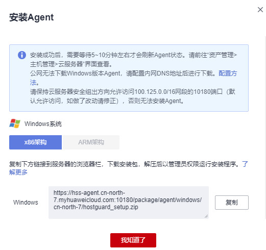
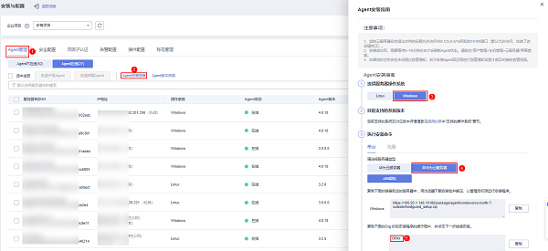

# 安装Windows版本Agent

安装Agent后，您才能正常开启云服务器的负载保护。

本节指导您如何在Windows操作系统的主机中安装Agent。Linux操作系统的Agent安装请参见[安装Linux版本Agent](安装Linux版本Agent.md)。

> **说明：** 
>CentOS 6.x版本由于Linux官网已停止更新维护，主机安全服务也不再支持CentOS 6.x及以下的系统版本，谢谢您的理解！

## 约束与限制

主机安全服务支持防护华为云主机和非华为云主机。

-   **华为云主机**：
    -   确保云服务器的购买渠道为华为云官网控制台。
    -   仅适用于64位云服务器，不再支持32位云服务器。
    -   确保您的主机与HSS配额在同一区域，并使用配额所在区域的安装命令或安装包为主机安装Agent。

-   **非华为云主机**：
    -   确保云服务器的购买渠道为非华为云官网控制台，或者在华为云官网控制台购买的云服务器，但期望跨Region进行统一管理。
    -   仅适用于64位云服务器，不再支持32位云服务器。
    -   在非华为云主机中安装Agent后，在防护列表中，您可以根据主机的IP地址（公网IP）查找该主机。

        > **须知：** 
        >-   由于主机的性能差异，非华为云的主机与主机安全服务的兼容性可能较差，为使您获得良好的服务体验，建议您使用华为云主机。
        >-   安装Agent时，请暂时清理主机中可能干扰主机安装的应用进程和配置信息，防止Agent安装失败。
        >-   目前北京一、北京四、上海一、上海二、广州、新加坡、香港区域支持**非华为云主机**的安装方式，其他区域敬请期待。

## 默认安装路径

在Windows操作系统的主机中安装Agent时，安装过程中不提供安装路径的选择，默认安装在以下路径中：

“C:\\Program Files\\HostGuard“

## 安装场景

主机安全服务支持**华为云主机**和**非华为云主机**两种安装方式，请按[表1](#zh-cn_topic_0000001150709168_table114917164498)进行选择。

**表 1**  安装场景

<table><thead align="left"><tr id="zh-cn_topic_0000001150709168_row4150816114916"><th class="cellrowborder" valign="top" width="29.69%" id="mcps1.2.3.1.1">
服务器类型

</th>
<th class="cellrowborder" valign="top" width="70.30999999999999%" id="mcps1.2.3.1.2">
如何安装Agent

</th>
</tr>
</thead>
<tbody><tr id="zh-cn_topic_0000001150709168_row19150151664911"><td class="cellrowborder" rowspan="2" valign="top" width="29.69%" headers="mcps1.2.3.1.1 ">
华为云弹性云服务器ECS

华为云裸金属服务器BMS

华为云云耀云服务器HECS

</td>
<td class="cellrowborder" valign="top" width="70.30999999999999%" headers="mcps1.2.3.1.2 ">
主机与HSS配额在同一区域，请使用<strong id="zh-cn_topic_0000001150709168_b16617201129">华为云主机</strong>的安装方式。

</td>
</tr>
<tr id="zh-cn_topic_0000001150709168_row1715013165495"><td class="cellrowborder" valign="top" headers="mcps1.2.3.1.1 ">
主机与HSS配额不在同一区域，请退订配额后，重新购买主机所在区域的配额。

</td>
</tr>
<tr id="row882630121718"><td class="cellrowborder" valign="top" width="29.69%" headers="mcps1.2.3.1.1 ">
华为云云桌面Workspace

</td>
<td class="cellrowborder" valign="top" width="70.30999999999999%" headers="mcps1.2.3.1.2 ">
云桌面镜像中已预置HSS Agent，购买云桌面23.6.0及以后版本将会自动安装Agent，无需您手动安装。如果您购买的云桌面是23.6.0以前的版本，可以参照本文手动为云桌面安装Agent。

</td>
</tr>
<tr id="zh-cn_topic_0000001150709168_row1715010162495"><td class="cellrowborder" valign="top" width="29.69%" headers="mcps1.2.3.1.1 ">
第三方云主机

</td>
<td class="cellrowborder" rowspan="2" valign="top" width="70.30999999999999%" headers="mcps1.2.3.1.2 ">
<strong id="zh-cn_topic_0000001150709168_b17626227101210">非华为云主机</strong>的安装方式。

<ul id="zh-cn_topic_0000001150709168_ul16777205017109"><li>目前北京一、北京四、上海一、上海二、广州、新加坡、香港区域支持<strong id="zh-cn_topic_0000001150709168_b12714557108">非华为云主机</strong>的安装方式，其他区域敬请期待。</li></ul>
<ul id="zh-cn_topic_0000001150709168_ul196058314920"><li>在非华为云主机中安装Agent后，在防护列表中，您可以根据主机的IP地址查找该主机。</li></ul>
</td>
</tr>
<tr id="zh-cn_topic_0000001150709168_row3151181614491"><td class="cellrowborder" valign="top" headers="mcps1.2.3.1.1 ">
线下主机

</td>
</tr>
</tbody>
</table>

## 前提条件

-   安装非华为云主机时，待安装Agent的主机操作系统为Windows，且网络环境能正常访问公网。
-   已在本地安装远程管理工具（如：mstsc、rdp等）。

## 安装须知

-   Agent支持的操作系统请参见[支持的操作系统](https://support.huaweicloud.com/productdesc-hss2.0/hss_01_0137.html#section2)。

-   由于主机的性能差异，非华为云的主机与主机安全服务的兼容性可能较差，为使您获得良好的服务体验，建议您使用华为云主机。
-   Windows主机需要配置华为云内网DNS地址后才能下载Agent，DNS详情请参见[华为云的内网DNS](https://support.huaweicloud.com/zh-cn/dns_faq/dns_faq_002.html)。
-   如果您的服务器已安装第三方安全软件，可能会导致主机安全服务Agent无法正常安装，请您关闭或卸载第三方安全软件后再安装Agent。
-   安装Agent的磁盘剩余可用容量须大于300M，否则可能导致Agent安装失败。
-   安装成功后，需要等待5\~10分钟左右才会刷新Agent状态。请前往“资产管理\>主机管理\>云服务器”界面查看。

## 操作步骤

有两种安装方式，以下步骤演示方式一。

-   方式一：下载主机安全服务的Agent至服务器，上传至待安装Agent的云主机后，在云主机中安装Agent。
-   方式二：登录待安装Agent的云主机，在云主机中登录华为云管理控制台，下载并安装Agent。

1.  [登录管理控制台](https://console.huaweicloud.com/?locale=zh-cn)。
2.  在页面左上角选择“区域“，单击，选择“安全合规 \> 主机安全服务”，进入主机安全服务界面。

    **图 1**  进入主机安全服务  
    

3.  在左侧导航栏中，选择“安装与配置“，进入“安装与配置“界面。
4.  选择“Agent管理  \>  Agent不在线\(X\)“页签，在目标服务器的“操作”列，单击“安装Agent“。

    **图 2**  选择Windows服务器  
    

5.  在弹窗中，根据该服务器的“系统架构“和“操作系统“，复制下载Agent的链接。

    **图 3**  复制安装Windows的Agent命令  
    

6.  远程登录待安装Agent的主机。

    -   华为云主机
        -   您可以登录弹性云服务器控制台，在“弹性云服务器“列表中，单击“远程登录“登录主机，详细操作请参见[在云服务器控制台上登录主机](https://support.huaweicloud.com/usermanual-ecs/ecs_03_0127.html)。
        -   若您的主机已经绑定了弹性IP，您也可以使用Windows系统的“远程桌面连接“工具，或第三方远程管理工具（例如：mstsc、rdp等）登录主机，并使用管理员账号在主机中安装Agent。

    -   非华为云主机
        -   使用远程管理工具（例如：mstsc、rdp等）连接您服务器的弹性IP，远程登录到您的服务器。

7.  在待安装Agent的主机中，通过IE浏览器访问复制的Agent下载地址，下载Agent安装包并解压。

    > **说明：** 
    >-   非华为云安装时，请确保命令行中的Org ID正确，否则可能导致Agent安装后但页面仍然显示未安装Agent；

8.  使用管理员权限运行Agent安装程序。

    安装Agent时，在主机类型界面，选择主机类型。

    -   华为云主机：请选择“华为云主机”。
    -   非华为云主机：请选择“其他云主机”。

        请从安装Agent界面复制Org ID，如[图4](#zh-cn_topic_0199816002_fig191838428527)所示，在界面输入Org ID，然后按界面提示完成Agent安装。

        > **须知：** 
        >安装界面中务必保证Org ID正确，否则可能导致Agent安装后页面仍然显示未安装Agent。

        **图 4**  获取Org ID（非华为云主机）  
        

9.  安装完成后，在“Windows任务管理器“中查看进程“HostGuard.exe“和“HostWatch.exe“。

    若进程不存在，则表示Agent安装失败，请尝试重新安装Agent。

    安装成功后，Agent不会立即生效，需要等待3\~5分钟左右控制台才会刷新。

## 常见问题

-   Agent状态及异常处理的详细操作请参见[Agent状态异常应如何处理？](https://support.huaweicloud.com/hss2.0_faq/hss_01_0036.html)
-   Agent安装失败，请参见[Agent安装失败应如何处理？](https://support.huaweicloud.com/hss2.0_faq/hss_01_0069.html)
-   卸载Agent的详细操作请参见[如何卸载Agent？](https://support.huaweicloud.com/hss2.0_faq/hss_01_0119.html)

