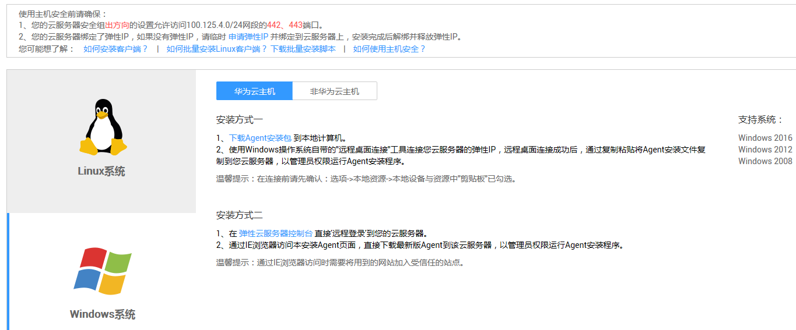
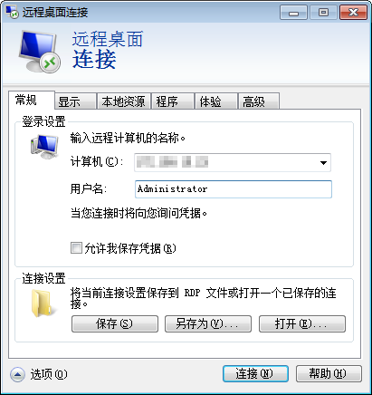
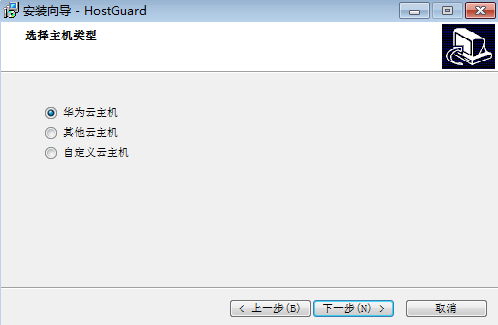

# 安装Windows版本客户端（华为云主机）

用户使用企业主机安全服务前，需先在云服务器上安装客户端。该任务指导用户在华为云Windows主机上安装客户端。

## 前提条件

-   已获取管理控制台的登录账号与密码。
-   云服务器的“Agent状态“为“未注册“。
-   待安装客户端的云服务器已绑定弹性IP。

    > **说明：**   
    >在客户端安装完成后，可以解绑弹性IP。  

## 下载客户端

1.  登录管理控制台。
2.  在页面上方，单击“服务列表“，选择“安全  \>  企业主机安全“。
3.  在左侧导航树中选择“安装与配置“，进入“安装与配置“界面，选择“安装Agent“页签。
4.  在“安装Agent“页面，选择“华为云主机“页签后，选择“Windows系统“，如[图1](#fig43031414184311)所示。

    **图 1**  Windows客户端安装  
    

5.  单击“下载Agent安装包“，下载客户端。

## 登录弹性云服务器

-   方式一
    1.  选择“开始  \>  运行“，输入命令**mstsc**，打开Windows操作系统自带的远程桌面连接工具。
    2.  展开“选项“，选择“本地资源“页签，确保“本地设备和资源“区域框的“剪贴板“已勾选，如[图2](#fig199681398470)所示。

        **图 2**  远程桌面连接  
        

    3.  选择“常规“页签，在“计算机“中输入弹性云服务器的弹性IP，在“用户名“中输入“Administrator“，单击“连接“，如[图3](#fig13828134114487)所示。

        **图 3**  设置常规信息  
        

    4.  在弹出的对话框中，输入**Administrator**用户的密码后，单击“确定“，连接到待安装客户端的弹性云服务器。
    5.  将[下载客户端](#section7880151925511)中[5](#li1757094018107)下载的客户端安装包从本地复制到需要安装客户端的弹性云服务器。

-   方式二
    1.  登录管理控制台。
    2.  在页面上方，单击“服务列表“，选择“安全  \>  企业主机安全“。
    3.  在左侧导航树中，选择“防护列表“，进入“防护列表“界面。
    4.  单击待安装客户端的弹性云服务器名称，跳转至弹性云服务器管理控制台。
    5.  在界面右上角，单击“远程登录“，远程登录到需要安装客户端的弹性云服务器。
    6.  在弹性云服务器上，用户可以通过Internet Explorer访问管理控制台，然后进入“安装客户端“界面下载客户端。

        > **说明：**   
        >通过Internet Explorer访问时需要将网站加入受信任的站点。  

## 安装客户端

1.  在弹性云服务器上，进入客户端安装包目录，双击“xxxx.exe“安装文件。

    > **说明：**   
    >若弹出“安全警告“对话框，请单击“运行“。  

2.  在弹出的“安装向导“对话框中，单击“下一步“。

    **图 4**  安装向导  
    

3.  在弹出的对话框中，选择“华为云主机“后，单击“下一步“，如[图5](#fig453611285317)所示。

    **图 5**  选择主机类型  
    

4.  在弹出的对话框中，单击“安装“，如[图6](#fig3570154051011)所示。

    **图 6**  准备安装  
    

5.  安装完成后，单击“结束“。

    **图 7**  安装完成  
    

    用户可在“Windows任务管理器“中查看到客户端进程“HostGuard.exe“和“HostWatch.exe“，则表明客户端安装成功。

