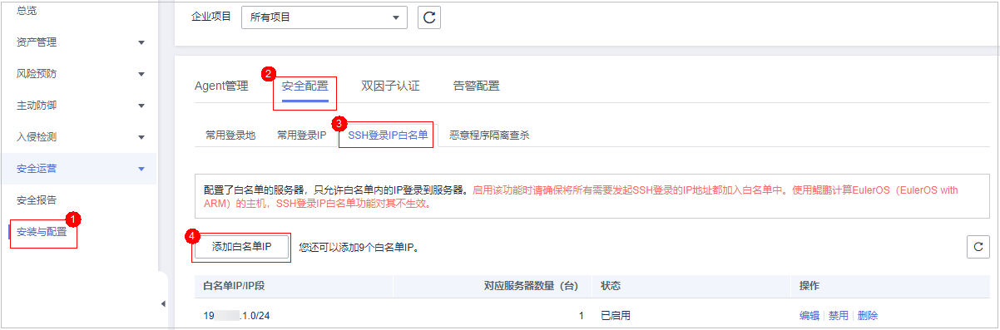
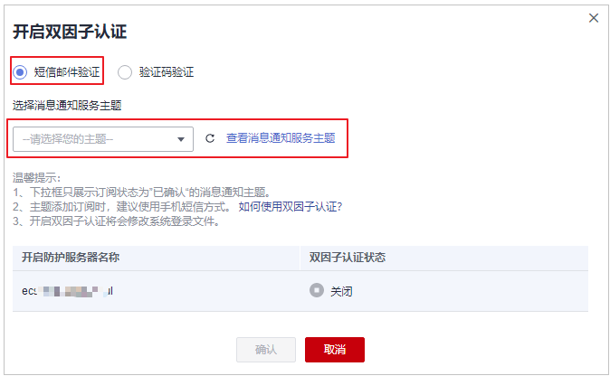
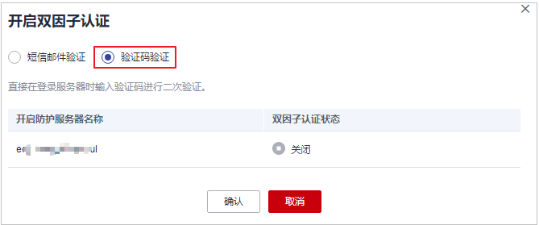

# 安装与配置

开启防护后，您可配置常用登录地、常用登录IP、SSH登录IP白名单，以及开启恶意程序自动隔离查杀，进一步提升云服务器的安全。

1.  [登录管理控制台](https://console.huaweicloud.com/?locale=zh-cn)。
2.  在页面左上角选择“区域“，单击，选择“安全与合规 \> 主机安全服务”，进入主机安全平台界面。

    **图 1**  进入主机安全  
    

## 配置常用登录地

配置常用登录地后，主机安全服务将对非常用地登录主机的行为进行告警。每个主机可被添加在多个登录地中。

1.  选择“安装与配置  \>  安全配置  \>  常用登录地“，单击“添加常用地登录“。

    **图 2**  添加常用登录地  
    

2.  在弹出的对话框中依次选择地理位置、国家名称、城市名称，选择后勾选需要生效登录地信息的云服务器，可勾选多个服务器，确认无误单击“确认“，添加操作完成。

    **图 3**  填写常用登录地信息  
    

3.  返回“安装与配置  \>  安全配置  \>  常用登录地“页面查看是否已新增，出现新增表示添加成功。

## 配置常用登录IP

配置常用登录IP，主机安全服务将对非常用IP登录主机的行为进行告警。

1.  选择“安装与配置  \>  安全配置  \>  常用登录IP“，单击“添加常用登录IP“。

    **图 4**  添加常用登录IP  
    

1.  在弹出的对话框中输入“常用登录IP“，勾选需要生效的云服务器，可勾选多个服务器，确认无误单击“确认“，添加操作完成。

    > **说明：** 
    >-   “常用登录IP“必须填写公网IP或者IP段。如果设置的非公网IP地址，您将无法SSH远程登录您的服务器。
    >-   单次只能添加一个IP，若需添加多个IP，需重复操作添加动作，直至全部IP添加完成，且最多可添加20个登录IP。

    **图 5**  填写常用登录IP  
    

2.  返回“安装与配置  \>  安全配置  \>  常用登录IP“页面查看是否已新增，出现新增表示添加成功。

## 配置SSH登录IP白名单

SSH登录IP白名单功能是防护帐户爆破的一个重要方式，主要是限制需要通过SSH登录的服务器。

> **说明：** 
>-   单一账号最多可添加10个SSH登录IP白名单。
>-   配置了白名单的服务器，只允许白名单内的IP通过SSH登录到服务器，拒绝白名单以外的IP：
>    -   启用该功能时请确保将所有需要发起SSH登录的IP地址都加入白名单中，否则您将无法SSH远程登录您的服务器。
>        若您的业务需要访问主机，但不需要SSH登录，则可以不用添加到白名单。
>    -   IP加入白名单后，帐户破解防护功能将不再对来自白名单中的IP登录行为进行拦截，该IP对您加入白名单的服务器登录访问将不受任何限制，请谨慎操作。

1.  选择“安装与配置  \>  安全配置  \>  SSH登录IP白名单“，单击“添加白名单IP“。

    **图 6**  添加IP白名单  
    

1.  在弹出的对话框中输入“白名单IP“，勾选需要生效的云服务器，可勾选多个服务器，确认无误单击“确认“，添加操作完成。

    > **说明：** 
    >-   “常用登录IP“必须填写公网IP或者IP段。如果设置的非公网IP地址，您将无法SSH远程登录您的服务器。
    >-   单次只能添加一个IP，若需添加多个IP，需重复操作添加动作，直至全部IP添加完成。

    **图 7**  填写白名单IP信息  
    

2.  返回“安装与配置  \>  安全配置  \>  常用登录IP“页面查看是否已新增，出现新增表示添加成功。

## 开启恶意程序隔离查杀

开启恶意程序隔离查杀后，HSS对识别出的后门、木马、蠕虫等恶意程序，提供自动隔离查杀功能，帮助您自动识别处理系统存在的安全风险。

自动隔离查杀功能根据可疑程序的置信度得分进行隔离查杀，置信度得分越高，被检测程序是恶意程序的可能性越高，因此为避免误隔离查杀可信程序导致服务器的功能不可用，自动隔离查杀功能只查杀置信度95分及以上的可疑程序，95分以下的可疑程序您如果判断为恶意程序可参考[处理主机告警事件](处理主机告警事件.md)手动隔离查杀。

> **说明：** 
>您可以在HSS控制台选择“入侵检测  \>   安全告警事件“，进入安全告警事件页面，单击恶意程序告警名称，进入“恶意程序“告警详情页查看恶意程序置信度得分。

1.  选择“安装与配置  \>  安全配置  \>  恶意程序隔离查杀“，分别单击“恶意程序隔离查杀“和“恶意软件云查杀“的开关，开启“恶意程序隔离查杀“和“恶意软件云查杀“。

    > **说明：** 
    >开启后将应用至主机安全服务全局服务器，但部分检测能力受主机安全配额版本的限制无法运行，若需正常使用，建议您开启企业版及以上版本更好的体验隔离查杀功能。

    **图 8**  开启隔离查杀  
    

1.  在弹出的对话框中单击“确认“，开启“恶意程序隔离查杀“和“恶意软件云查杀“。

    自动隔离查杀有可能发生误报。您可以在主机安全服务控制台“入侵检测“页面中，选择“事件管理“页签，查看被隔离的恶意程序。在此您可以对指定的恶意程序执行取消隔离、忽略等操作，详情请参见[查看入侵告警事件](查看入侵告警事件.md)。

    > **须知：** 
    >-   程序被隔离查杀时，该程序的进程将被立即终止，为避免影响业务，请及时确认检测结果，若隔离查杀有误报，您可以执行取消隔离/忽略操作。
    >-   在“恶意程序隔离查杀“界面，如果不开启“恶意程序隔离查杀“功能，当HSS检测到恶意程序时，将会触发告警。
    >    您可以在“入侵检测“的“安全告警事件“中，查看“恶意程序“中的告警信息，并对恶意程序进行隔离查杀。

## 开启双因子认证

-   双因子认证功能是一种双因素身份验证机制，结合短信/邮箱验证码，对云服务器登录行为进行二次认证，极大地增强云服务器帐户安全性。
-   开启双因子认证功能后，登录云服务器时，主机安全服务将根据绑定的“消息通知服务主题“验证登录者的身份信息。

**前提条件**

-   用户已创建“协议“为“短信“或“邮箱“的消息主题。
-   主机已开启防护。
-   开启双因子认证需要关闭Selinux防火墙。
-   在Windows主机上，双因子认证功能可能会和“网防G01”软件、服务器版360安全卫士存在冲突，建议停止“网防G01”软件和服务器版360安全卫士。

**约束与限制**

开启双因子认证后，仅以下登录方式支持双因子认证：

-   Linux：使用SSH密码方式登录云服务器，且OpenSSH版本小于8。
-   Windows：使用RDP文件登录Windows云服务器。

**操作步骤**

1.  在“双因子认证“页面，可勾选多个目标服务器后单击上方“开启双因子认证“，也可单击目标服务器操作列“开启双因子认证“。

    **图 9**  开启双因子认证  
    

2.  在弹出的“开启双因子认证“的对话框中，选择“验证方式“。
    -   **短信邮件验证**

        短信邮件验证需要选择消息通知服务主题。

        -   下拉框只展示状态已确认的消息通知服务主题。
        -   如果没有主题，请单击“查看消息通知服务主题“进行创建。具体操作请参见[创建主题](https://support.huaweicloud.com/usermanual-smn/zh-cn_topic_0043961401.html)。
        -   若您的主题里包含多个手机号码/邮箱，在认证过程中，该主题内的手机号码/邮箱都会收到系统发出的验证码短信或邮件。若您只希望有一个手机号码/邮箱收到验证码，请修改对应主题，仅在主题中保留您希望收到验证码的手机号码/邮箱。

        **图 10**  短信邮件验证  
        

    -   **验证码验证**

        选择验证码验证，仅通过实时收到的验证进行验证。

        **图 11**  验证码验证  
        

3.  单击“确定“，完成开启双因子认证的操作。开启双因子认证功能后，需要等大约5分钟才生效。

    > **须知：** 
    >在开启双因子认证功能的Windows主机上远程登录其他Windows主机时，需要在开启双因子主机上手动添加凭证，否则会导致远程登录其他Windows主机失败。
    >添加凭证：打开路径“开始菜单  \>  控制面板  \>  用户帐户  \>  凭据管理器  \>  添加Windows凭据“，添加您需要访问的远程主机的用户名和密码。

