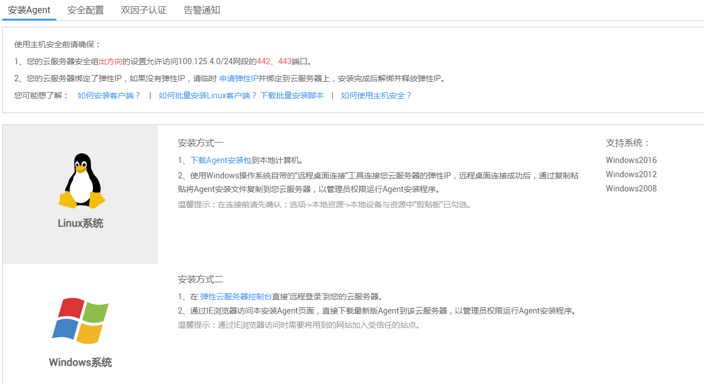
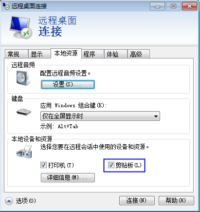
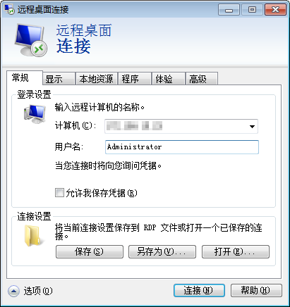
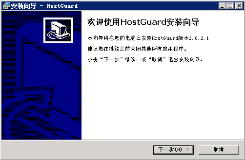
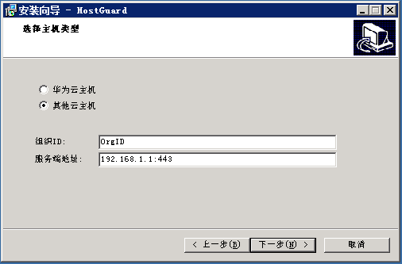
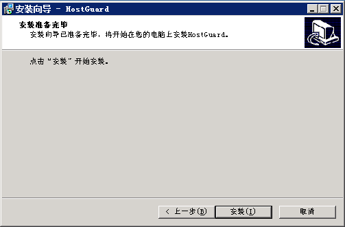
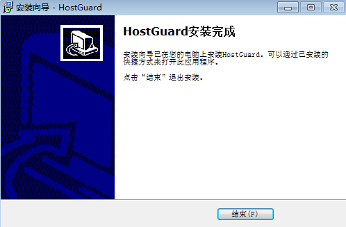

# 安装客户端<a name="ZH-CN_TOPIC_0113390572"></a>

用户使用企业主机安全服务前，需先在弹性云服务器上安装客户端。该任务指导用户下载并安装客户端。

## 前提条件<a name="section43992855103311"></a>

-   已获取管理控制台的登录帐号与密码。
-   弹性云服务器的“Agent状态“为“未注册“。
-   待安装客户端的弹性云服务器已绑定弹性IP。

    > **说明：**   
    >在客户端安装完成后，可以解绑弹性IP。  


## 安装Linux版本客户端<a name="section5366442595938"></a>

1.  登录管理控制台。
2.  在页面上方，单击“服务列表“，选择“安全  \>  企业主机安全“。
3.  在左侧导航树中选择“安装与配置“，进入“安装与配置“界面，如[图1](#fig43031414184311)所示。

    **图 1**  Linux客户端安装<a name="fig43031414184311"></a>  
    

    -   方式一：
        1.  根据弹性云服务器的操作系统位数，复制安装命令。
        2.  使用远程管理工具（例如：“Xshell“、“SecureCRT“、“PuTTY“），以**root**帐号，通过弹性IP地址登录到待安装客户端的弹性云服务器。
        3.  执行复制的命令进行安装。

    -   方式二：
        1.  在界面下方，单击“下载Agent安装包“。
        2.  在弹出的对话框中，根据弹性云服务器的操作系统类型，选择需要下载的版本，单击“确定“。

            **图 2**  下载Linux客户端<a name="fig43889775171341"></a>  
            

        3.  使用文件传输工具（例如：“Xftp“、“SecureFX“、“WinSCP“），将下载的客户端安装包上传到弹性云服务器。
        4.  使用远程管理工具（例如：“Xshell“、“SecureCRT“、“PuTTY“），以**root**帐号，通过弹性IP地址登录到待安装客户端的弹性云服务器。
        5.  执行以下命令，进入安装包所在目录。

            **cd** _安装包所在目录_

        6.  执行以下命令，运行安装脚本。

            -   针对“.rpm“格式的安装包，执行命令：**rpm** **-ivh** _安装包名称_
            -   针对“.deb“格式的安装包，执行命令：**dpkg** **-i** _安装包名称_

            举例：假设安装包名称为“HostGuardAgent\_Linux64\_V1.9.30.rpm“，则执行以下命令：

            **rpm** **-ivh** **HostGuardAgent\_Linux64\_V1.9.30.rpm**

            若界面回显类似如下信息，表示客户端安装完成。

            ```
            Preparing...                  ########################## [100%]
            1:hostguard                   ########################## [100%]
            Hostguard is running.
            Hostguard installed.
            ```

            > **说明：**   
            >-   客户端的安装路径为“/usr/local/hostguard“。  
            >-   客户端安装完成后，自动启动Agent服务。  

        7.  执行以下命令，查看Agent服务运行状态。

            **service hostguard** **status**

            若界面回显以下信息，则表示Agent服务运行正常。

            ```
            Hostguard is running
            ```


## 安装Windows版本客户端<a name="section85701640131018"></a>

-   下载客户端

1.  登录管理控制台。
2.  在页面上方，单击“服务列表“，选择“安全  \>  企业主机安全“。
3.  在左侧导航树中选择“安装与配置“，进入“安装与配置“界面，选择“Windows系统“，如[图3](#fig148348591102)所示。

    **图 3**  Windows版本客户端安装<a name="fig148348591102"></a>  
    

4.  <a name="li1757094018107"></a>单击“下载Agent安装包“，下载客户端。

-   登录弹性云服务器

方式一：

1.  选择“开始  \>  运行“，输入命令**mstsc**，打开Windows操作系统自带的远程桌面连接工具。
2.  展开“选项“，选择“本地资源“页签，确保“本地设备和资源“区域框的“剪贴板“已勾选。

    **图 4**  远程桌面连接<a name="fig199681398470"></a>  
    

3.  选择“常规“页签，在“计算机“中输入弹性云服务器的弹性IP，在“用户名“中输入“Administrator“，单击“连接“。

    **图 5**  常规<a name="fig13828134114487"></a>  
    

4.  在弹出的对话框中，输入**Administrator**用户的密码后，单击“确定“，连接到待安装客户端的弹性云服务器
5.  将“下载Windows版本客户端“中[4](#li1757094018107)下载的客户端安装包从本地复制到需要安装客户端的弹性云服务器。

方式二：

1.  登录管理控制台。
2.  单击管理控制台左上角的，选择区域和项目。
3.  选择“安全  \>  企业主机安全  \>  网页防篡改“，进入“网页防篡改“界面。
4.  单击待安装客户端的弹性云服务器名称，跳转至弹性云服务器管理控制台。
5.  在界面右上角，单击“远程登录“，远程登录到需要安装客户端的弹性云服务器。
6.  在弹性云服务器上，用户可以通过Internet Explorer访问管理控制台，然后进入“安装客户端“界面下载客户端。

    > **说明：**   
    >通过Internet Explorer访问时需要将网站加入受信任的站点。  


-   安装客户端

1.  在弹性云服务器上，进入客户端安装包目录，双击“.exe“安装文件。

    > **说明：**   
    >若弹出“安全警告“对话框，请单击“运行“。  

2.  在弹出的“安装向导“对话框中，单击“下一步“。

    **图 6**  安装向导<a name="fig13570184041016"></a>  
    

3.  如果是在华为云主机上安装，请选择“华为云主机“，如果是在其他云主机上安装，请选择“其他云主机“，并按照局点要求输入正确的组织ID和服务端地址，如[图7](#fig453611285317)所示。

    **图 7**  其他云主机配置<a name="fig453611285317"></a>  
    

4.  主机类型确定选择无误后，单击“下一步“，在弹出的对话框中单击“安装“，如[图8](#fig3570154051011)所示。

    **图 8**  准备安装<a name="fig3570154051011"></a>  
    

5.  安装完成后，单击“完成“。

    **图 9**  安装完成<a name="fig957094014102"></a>  
    

    用户可在“Windows任务管理器“中查看到客户端进程“HostGuard.exe“和“HostWatch.exe“，则表明客户端安装成功。


