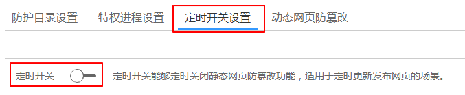
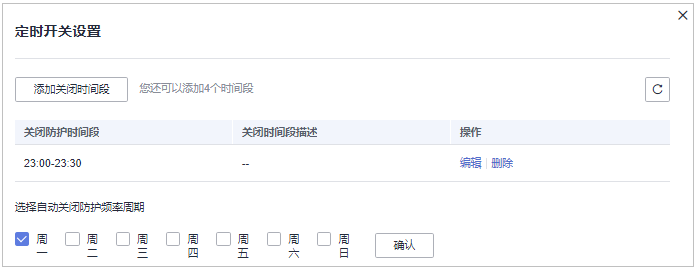

# 定时开启网页防篡改

网页防篡改提供的定时开关功能，能够定时开启/关闭静态网页防篡改功能，您可以使用此功能定时更新需要发布的网页。

> **说明：** 
>定时关闭防护期间，文件存在被篡改的风险，请合理制定定时关闭的时间。

## 操作步骤

1.  [登录管理控制台](https://console.huaweicloud.com)。
2.  在页面左上角选择“区域“，单击，选择“安全与合规  \>  企业主机安全“，进入企业主机安全页面。

    **图 1**  企业主机安全  
    

3.  在“网页防篡改  \>  防护列表“页面，单击“防护设置“，进入“防护设置“页面。

    **图 2**  在“网页防篡改“界面  
    

4.  在“定时开关设置“页面，开启定时开关。

    **图 3**  定时开关  
    

5.  在弹出的对话框中，单击“确定“。
6.  设置“关闭防护时间段”和“定时关闭防护频率”。

    **图 4**  设置定时防护参数  
    

## 关闭防护时段设置规则

-   每个时间段最小关闭时间 \>= 5分钟
-   每个时间段最长关闭时间 < 24小时
-   时间段之间不允许重叠且两段时间间隔必须 \>= 5分钟（时间00:00和23:59特例除外）
-   不允许单个时间段跨天配置
-   时间段以主机时间为准

