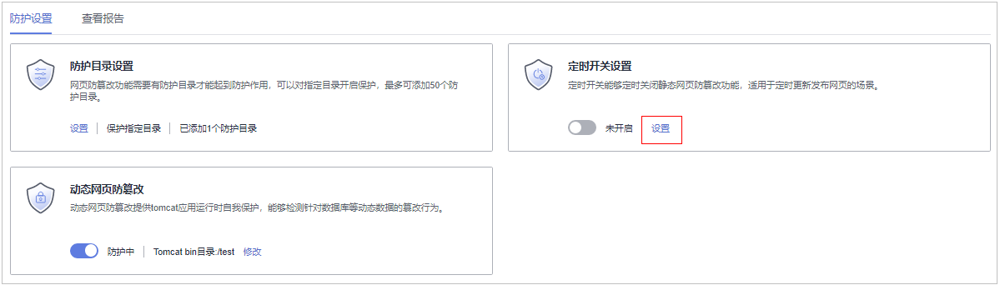
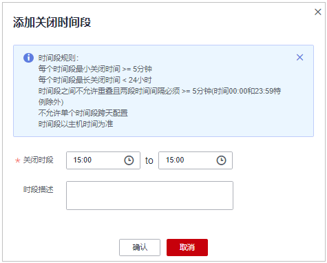
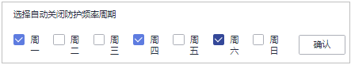
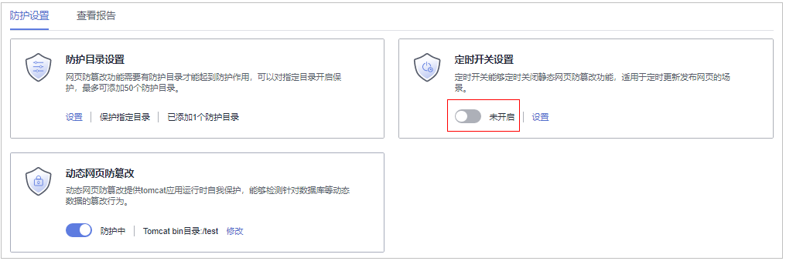

# 定时开启网页防篡改

网页防篡改提供的定时开关功能，能够定时开启/关闭静态网页防篡改功能，您可以使用此功能定时更新需要发布的网页。

> **说明：** 
>定时关闭防护期间，文件存在被篡改的风险，请合理制定定时关闭的时间。

## 约束限制

仅开启网页防篡改版防护后才支持防篡改相关操作。

## 关闭防护时段设置规则

-   每个时间段最小关闭时间 \>= 5分钟
-   每个时间段最长关闭时间 < 24小时
-   时间段之间不允许重叠且两段时间间隔必须 \>= 5分钟（时间00:00和23:59特例除外）
-   不允许单个时间段跨天配置
-   时间段以主机时间为准

## 操作步骤

1.  [登录管理控制台](https://console.huaweicloud.com/?locale=zh-cn)。
2.  在页面左上角选择“区域“，单击，选择“安全与合规 \> 主机安全服务”，进入主机安全平台界面。

    **图 1**  进入主机安全  
    

3.  在“主动防御  \>  网页防篡改  \>  防护配置“页面，单击目标服务器“操作“列的“防护设置“，进入“防护设置“页面。

    > **说明：** 
    >如果您的服务器已通过企业项目的模式进行管理，您可选择目标“企业项目“后查看或操作目标企业项目内的资产和检测信息。

    **图 2**  进入防护配置  
    

4.  在“防护设置“页面，单击“定时开关设置“下的“设置“。

    **图 3**  定时设置  
    

5.  进入定时开关设置页面，设置关闭防护时间段和自动关闭防护频率周期。

    **图 4**  设置定时防护参数  
    

    1.  单击“添加关闭时间段“，在弹窗中填写新增的关闭时间段信息。

        **图 5**  添加关闭时间段信息  
        

        > **说明：** 
        >时间段规则：
        >-   每个时间段最小关闭时间 \>= 5分钟。
        >-   每个时间段最长关闭时间 < 24小时。
        >-   时间段之间不允许重叠且两段时间间隔必须 \>= 5分钟\(时间00:00和23:59特例除外\)。
        >-   不允许单个时间段跨天配置。
        >-   时间段以主机时间为准。

    2.  确认无误单击“确认“，添加关闭时间段成功。
    3.  勾选自动关闭防护的频率周期，勾选后在目标勾选的当日执行关闭防护。

        示例：勾选值为周一、周四、周六，则服务器在这些时间的关闭防护时间段自动关闭防篡改功能，关闭时间结束服务器自动启动静态网页防篡改。

        **图 6**  勾选关闭防护周期  
        

    4.  确认无误，单击“确认“，完成关闭防护频率周期设置。

6.  返回“防护设置“页面，在“定时开关设置“栏，单击开启定时开关，开启静态网页防篡改的定时开启和关闭策略。

    **图 7**  开启定时开关  
    

